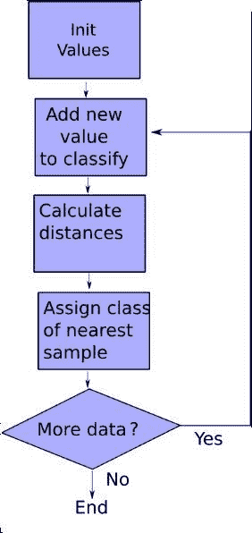
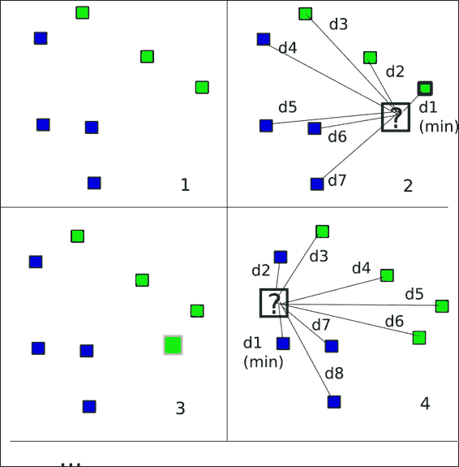

# k 最近邻

k 最近邻（k-nn）是一种简单的经典聚类方法，它将很好地介绍此类技术，着眼于每个样本的附近，并假设每个新样本都应属于的类别。 已经知道的数据点。



## k 最近邻的力学

k-nn 可以在我们的多种配置中实现，但是在本章中，我们将使用“半监督”方法。 我们将从一定数量的已分配样本开始，稍后我们将根据训练集的特征猜测集群成员。


最近邻算法

在上图中，我们可以看到该算法的细分。 可以通过以下步骤进行总结：

1.  我们将先前已知的样本放在数据结构上。
2.  然后，我们读取要分类的下一个样本，并计算从新样本到训练集的每个样本的欧几里得距离。
3.  我们通过根据欧几里得距离选择最近的样本的类别来确定新元素的类别。 k-nn 方法需要对 k 个最接近的样本进行投票。
4.  我们重复该过程，直到没有剩余的样本为止。

### k-nn 的优缺点

这种方法的优点是：

*   简单; 无需调整参数
*   没有正规训练； 我们只需要更多的训练实例来改进模型

缺点：

*   计算昂贵（必须计算点与每个新样本之间的所有距离）

## 有用库的实用示例

在以下各节中，我们将讨论一些有用的库。

### matplotlib 绘图库

数据绘图是数据科学学科不可或缺的一部分。 因此，我们需要一个非常强大的框架来绘制结果。 对于此任务，我们没有在 TensorFlow 中实现的通用解决方案，我们将使用 matplotlib 库。

在 matplotlib 站点（`http://matplotlib.org/`）中，定义为：

> “ matplotlib 是一个 Python 2D 绘图库，它以各种硬拷贝格式和跨平台的交互式环境生成出版物质量的图形。”

#### 合成样本的数据绘图

在此示例中，我们将生成一个包含 100 个随机数的列表，生成样本图，并将结果保存在图形文件中：

```py
    import tensorflow as tf
    import numpy as np
    import matplotlib.pyplot as plt
    with tf.Session() as sess:
        fig, ax = plt.subplots()
        ax.plot(tf.random_normal([100]).eval(), tf.random_normal([100] ).eval(),'o')
        ax.set_title('Sample random plot for TensorFlow')
        plt.savefig("result.png")

```

这是结果图像：



使用 TensorFlow 和 matplotlib 生成的示例图

### 提示

为了查看 scikit 数据集模块的更一般的解释，请参考 [matplotlib.org](http://matplotlib.org/)。

### scikit-learn 数据集模块

TensorFlow 当前未实现用于轻松生成合成数据集的方法。 因此，我们将使用`sklearn`库作为帮助程序。

#### 关于 scikit-learn 库

[从其网站](http://scikit-learn.org/stable/)：

> “ scikit-learn（以前为 scikits.learn）是针对 Python 编程语言的开源机器学习库。它具有各种分类，回归和聚类模型，旨在与 Python 数字和科学库 NumPy 和 SciPy 互操作。”

在此示例中，我们将使用数据集模块，该模块处理许多众所周知的合成和现场提取的数据集的生成和加载。

### 提示

为了查看 scikit 数据集模块的更一般的解释，请参考[此链接](http://scikit-learn.org/stable/datasets/)。

### 合成数据集类型

我们将使用一些生成的数据集类型：


Blob，圆和月亮数据集类型

### Blob 数据集

该数据集是测试简单聚类算法的理想选择。 不会出现问题，因为数据是一致地分组的，并且类别的分离很明确。

#### 采用的方法

以下方法用于所采用的方法：

```py
sklearn.datasets.make_blobs(n_samples=100, n_features=2,  centers=3, cluster_std=1.0, center_box=(-10.0, 10.0),  shuffle=True, random_state=None) 

```

在这里，`n_samples`是数据总数，`n_features`是数据的列数或特征数，`centers`是中心列表或许多随机中心，`cluster_std`是标准偏差，`center_box`是随机生成中心时每个聚类中心的边界框，`shuffle`指示是否必须对样本进行混洗，`random_state`是随机种子。

### 圆圈数据集

这是在其他圆圈中具有圆圈的数据集。 这是一个非线性的，可分离的问题，因此需要通过非线性模型来解决。 这排除了诸如 k 均值的简单算法。 在本章中，我们将尝试使用它来阐明观点。

#### 采用的方法

以下方法用于所采用的方法：

```py
sklearn.datasets.make_circles(n_samples=100,shuffle=True,noise=None, random_state=None,factor=0.8) 

```

在这里，`n_samples`是数据总数，`shuffle`表示是否必须对样本进行混洗，`noise`是要应用于循环数据的随机量的数量，`random_state`是随机种子，并且`factor`是圆之间的比例因子。

### 月亮数据集

这是另一个非线性问题，但是具有另一种类型的类分离，因为没有诸如圆环之类的闭合。