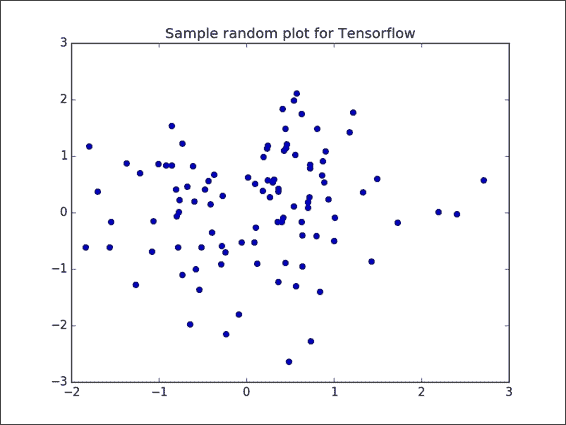

# 项目 1 -- 在合成数据集上进行 k 均值聚类

## 数据集说明和加载

在本章中，我们将使用生成的数据集，这些数据集经过特殊设计以具有特殊的属性。 目标属性中的两个是类别线性分离的可能性以及是否存在明显分离的群集。

### 生成数据集

通过这些行，我们创建了数据结构，其中将包含用于解决方案的所有元素，即：

```py
centers = [(-2, -2), (-2, 1.5), (1.5, -2), (2, 1.5)] 
data, features = make_blobs (n_samples=200, centers=centers, n_features = 2, cluster_std=0.8, shuffle=False, random_state=42) 

```

通过 matplotlib 绘制数据集图：

```py
    ax.scatter(np.asarray(centers).transpose()[0], np.asarray(centers).transpose()[1], marker = 'o', s = 250)
    plt.plot()

```

## 模型架构

points 变量包含数据集点的 2D 坐标，质心变量将包含组中心点的坐标，`cluster_assignments`变量包含每个数据元素的质心索引。

例如，`cluster_assignments[2] = 1`表示`data[2]`数据点属于具有中心重心`1`的群集。 重心`1`的位置位于`centroids[1]`中。

```py
points=tf.Variable(data) 
cluster_assignments = tf.Variable(tf.zeros([N], dtype=tf.int64)) 
centroids = tf.Variable(tf.slice(points.initialized_value(), [0,0], [K,2])) 

```

然后，我们可以使用 matplotlib 绘制这些质心的位置：

```py
fig, ax = plt.subplots() 
ax.scatter(np.asarray(centers).transpose()[0], np.asarray(centers).transpose()[1], marker = 'o', s = 250) 
plt.show() 

```



初始中心播种

## 损失函数描述和优化器循环

然后，我们将对所有质心进行 N 份复制，对每个点进行 K 份复制，对每个点进行 N x K 份复制，因此我们可以针对每个维度计算出每个点与每个质心之间的距离：

```py
rep_centroids = tf.reshape(tf.tile(centroids, [N, 1]), [N, K, 2]) 
rep_points = tf.reshape(tf.tile(points, [1, K]), [N, K, 2]) 
sum_squares = tf.reduce_sum(tf.square(rep_points - rep_centroids),  
reduction_indices=2) 

```

然后，我们对所有维度执行总和，并获得最低总和的索引（这将是分配给每个点的质心或聚类的索引）：

```py
best_centroids = tf.argmin(sum_squares, 1) 

```

质心也将使用完整源代码中定义的`bucket:mean`函数进行更新。

## 停止条件

这是新质心和分配不变的停止条件：

```py
did_assignments_change = tf.reduce_any(tf.not_equal(best_centroids, cluster_assignments)) 

```

在这里，我们使用`control_dependencies`来计算是否需要更新质心：

```py
with tf.control_dependencies([did_assignments_change]): 
    do_updates = tf.group( 
    centroids.assign(means), 
    cluster_assignments.assign(best_centroids)) 

```

## 结果描述

程序执行后，我们得到以下输出：


这是一轮迭代后质心变化的汇总图，其中绘制了从算法生成的原始聚类。

在下图中，我们针对这种明显分离的情况表示了 k 均值算法在应用中的不同阶段：


每次迭代的质心变化

## 完整源代码

以下是完整的源代码：

```py
import tensorflow as tf 
import numpy as np 
import time 

import matplotlib 
import matplotlib.pyplot as plt 

from sklearn.datasets.samples_generator import make_blobs 
from sklearn.datasets.samples_generator import make_circles 

DATA_TYPE = 'blobs' 

# Number of clusters, if we choose circles, only 2 will be enough 
if (DATA_TYPE == 'circle'): 
    K=2 
else: 
    K=4 

# Maximum number of iterations, if the conditions are not met 
MAX_ITERS = 1000 

start = time.time() 

centers = [(-2, -2), (-2, 1.5), (1.5, -2), (2, 1.5)] 
if (DATA_TYPE == 'circle'): 
    data, features = make_circles(n_samples=200, shuffle=True, noise= 0.01, factor=0.4) 
else: 
    data, features = make_blobs (n_samples=200, centers=centers, n_features = 2, cluster_std=0.8, shuffle=False, random_state=42) 

fig, ax = plt.subplots() 
ax.scatter(np.asarray(centers).transpose()[0], np.asarray(centers).transpose()[1], marker = 'o', s = 250) 
plt.show() 

fig, ax = plt.subplots() 
if (DATA_TYPE == 'blobs'): 
ax.scatter(np.asarray(centers).transpose()[0], np.asarray(centers).transpose()[1], marker = 'o', s = 250) 
ax.scatter(data.transpose()[0], data.transpose()[1], marker = 'o', s = 100, c = features, cmap=plt.cm.coolwarm ) 
plt.plot() 

points=tf.Variable(data) 
cluster_assignments = tf.Variable(tf.zeros([N], dtype=tf.int64)) 
centroids = tf.Variable(tf.slice(points.initialized_value(), [0,0], [K,2])) 

sess = tf.Session() 
sess.run(tf.initialize_all_variables()) 

rep_centroids = tf.reshape(tf.tile(centroids, [N, 1]), [N, K, 2]) 
rep_points = tf.reshape(tf.tile(points, [1, K]), [N, K, 2]) 
sum_squares = tf.reduce_sum(tf.square(rep_points - rep_centroids),  
reduction_indices=2) 
best_centroids = tf.argmin(sum_squares, 1) 

did_assignments_change = tf.reduce_any(tf.not_equal(best_centroids, cluster_assignments)) 

def bucket_mean(data, bucket_ids, num_buckets): 
total = tf.unsorted_segment_sum(data, bucket_ids, num_buckets) 
count = tf.unsorted_segment_sum(tf.ones_like(data), bucket_ids, num_buckets) 
return total / count 

means = bucket_mean(points, best_centroids, K) 

with tf.control_dependencies([did_assignments_change]): 
do_updates = tf.group( 
centroids.assign(means), 
cluster_assignments.assign(best_centroids)) 

changed = True 
iters = 0 

fig, ax = plt.subplots() 
if (DATA_TYPE == 'blobs'): 
    colourindexes=[2,1,4,3] 
else: 
    colourindexes=[2,1] 
while changed and iters < MAX_ITERS: 
fig, ax = plt.subplots() 
iters += 1 
[changed, _] = sess.run([did_assignments_change, do_updates]) 
[centers, assignments] = sess.run([centroids, cluster_assignments]) 
ax.scatter(sess.run(points).transpose()[0], sess.run(points).transpose()[1], marker = 'o', s = 200, c = assignments, cmap=plt.cm.coolwarm ) 
ax.scatter(centers[:,0],centers[:,1], marker = '^', s = 550, c = colourindexes, cmap=plt.cm.plasma) 
ax.set_title('Iteration ' + str(iters)) 
plt.savefig("kmeans" + str(iters) +".png") 

ax.scatter(sess.run(points).transpose()[0], sess.run(points).transpose()[1], marker = 'o', s = 200, c = assignments, cmap=plt.cm.coolwarm ) 
plt.show() 

end = time.time() 
print ("Found in %.2f seconds" % (end-start)), iters, "iterations" 
print "Centroids:" 
print centers 
print "Cluster assignments:", assignments 

```

这是观察算法机制的最简单情况。 当数据来自真实世界时，这些类通常没有那么清晰地分开，并且标记数据样本更加困难。

## 圆合成数据上的 k 均值

对于圆图，我们观察到这种数据表征并不容易用一组简单的方法表示。 如图所示，两个圆要么共享一个质心的位置，要么真的很接近，因此我们无法预测明确的结果：


圆型数据集

对于此数据集，我们仅使用两个类来确保了解此算法的主要缺点：


k 均值应用于圆形综合数据集

如我们所见，初始中心向样本数量最集中的区域漂移，因此将数据线性划分。 这是我们现阶段使用的简单模型的局限性之一。 为了处理非线性可分离性样本，我们可以尝试本章范围以外的其他统计方法，例如基于密度的带噪应用空间聚类（DBSCAN）。