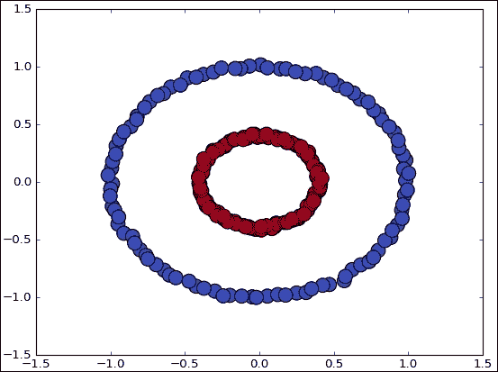

# 项目 2 -- 综合数据集上的最近邻

在这个项目中，我们将加载一个数据集，使用该数据集，以前的算法（k 均值）在分离类时遇到问题。

## 数据集生成

该数据集是第一个示例中具有两个类的相同循环类数据集，但是这次我们将通过增加一些噪声（从`0.01`到`0.12`）来增加错误概率：

```py
data, features = make_circles(n_samples=N, shuffle=True, noise=0.12,factor=0.4)

```

这是生成的训练数据图：


## 模型架构

将保留数据的变量只是原始数据和测试列表，其中将包含计算出的测试数据类：

```py
data, features = make_circles(n_samples=N, shuffle=True, noise= 0.12, factor=0.4)
tr_data, tr_features= data[:cut], features[:cut]
te_data,te_features=data[cut:], features[cut:]
test=[]

```

## 损失函数说明

在聚类中，我们将使用函数来优化为欧式距离，与第 1 章，探索和转换数据相同。 它是在集群分配循环上计算的，获取从新点到现有训练点的距离，要求最小值的索引，然后使用该索引搜索最近的邻居的类：

```py
distances = tf.reduce_sum(tf.square(tf.sub(i , tr_data)),reduction_indices=1)
neighbor = tf.arg_min(distances,0)

```

## 停止条件

在这个简单的示例中，一旦访问了测试分区的所有元素，我们将完成操作。

## 结果描述

这是测试数据类分布的图形，在这里我们可以看到清晰分开的类。 我们可以观察到，至少在此有限的数据集范围内，此方法比非重叠，斑点优化，k 均值方法更好。



## 完整源代码

以下是完整的源代码：

```py
import tensorflow as tf 
import numpy as np 
import time 

import matplotlib 
import matplotlib.pyplot as plt 

from sklearn.datasets.samples_generator import make_circles 

N=210 
K=2 
# Maximum number of iterations, if the conditions are not met 
MAX_ITERS = 1000 
cut=int(N*0.7) 

start = time.time() 

data, features = make_circles(n_samples=N, shuffle=True, noise= 0.12, factor=0.4) 
tr_data, tr_features= data[:cut], features[:cut] 
te_data,te_features=data[cut:], features[cut:] 
test=[] 

fig, ax = plt.subplots() 
ax.scatter(tr_data.transpose()[0], tr_data.transpose()[1], marker = 'o', s = 100, c = tr_features, cmap=plt.cm.coolwarm ) 
plt.plot() 

sess = tf.Session() 
sess.run(tf.initialize_all_variables()) 

for i, j in zip(te_data, te_features): 
    distances = tf.reduce_sum(tf.square(tf.sub(i , tr_data)),reduction_indices=1) 
    neighbor = tf.arg_min(distances,0) 

    test.append(tr_features[sess.run(neighbor)]) 
print test 
fig, ax = plt.subplots() 
ax.scatter(te_data.transpose()[0], te_data.transpose()[1], marker = 'o', s = 100, c = test, cmap=plt.cm.coolwarm ) 
plt.plot() 

end = time.time() 
print ("Found in %.2f seconds" % (end-start)) 

print "Cluster assignments:", test 

```