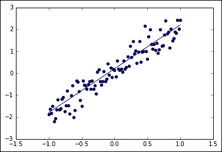

# 单变量线性建模函数

如前所述，在线性回归中，我们尝试找到一个线性方程，以最小化数据点和建模线之间的距离。

此关系可以用以下标准线性函数表示：


模型函数采用以下形式：

在这里，`ss0` 或 `bias`是截距，`x`的函数值为零，`ss1`是建模线的斜率。 变量`x`通常被称为自变量，`y`被称为因变量，但它们也可以分别称为回归变量和响应变量。

## 样本数据生成

在下面的示例中，我们将基于`ss0` = `2.0`的线，加上最大幅度为`0.4`的垂直噪声，生成近似样本随机分布。

```py
In[]: 
#Indicate the matplotlib to show the graphics inline 
%matplotlib inline  
import matplotlib.pyplot as plt # import matplotlib 
import numpy as np # import numpy 
trX = np.linspace(-1, 1, 101) # Linear space of 101 and [-1,1] 
#Create The y function based on the x axis 
trY = 2 * trX + np.random.randn(*trX.shape) * 0.4 + 0.2  
plt.figure() # Create a new figure 
plt.scatter(trX,trY) #Plot a scatter draw of the random datapoints 
# Draw one line with the line function 
plt.plot (trX, .2 + 2 * trX)
```

结果图将如下所示：



加噪声线性采样和线性函数