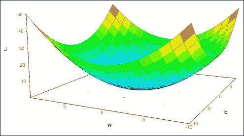
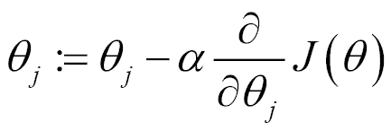

# 最小化成本函数

下一步是设置最小化`cost`函数的方法。 在线性演算中，定位极小值任务的基本特征之一被简化为计算函数的导数并寻找其零点。 为此，该函数必须具有导数，最好是凸的。 可以证明最小二乘函数符合这两个条件。 这对于避免已知的局部极小问题非常有用。

损失函数表示

## 最小二乘的一般最小值

我们尝试解决的问题（最小二乘）可以用矩阵形式表示：

在此，`J`是成本函数，具有以下解决方案：

在本章中，我们将使用迭代方法梯度下降，该方法将在以后的章节中以更通用的方式使用。

## 迭代方法 -- 梯度下降

梯度下降本身就是一种迭代方法，并且是机器学习领域中最常用的优化算法。 考虑到可以用它优化的参数组合的复杂性，它结合了简单的方法和良好的收敛速度。

2D 线性回归从具有随机定义的权重或线性系数乘数的函数开始。 定义第一个值后，第二步是以以下形式应用递归函数：

在该方程式中，我们可以轻松推导该方法的机理。 我们从一组初始系数开始，然后朝函数最大变化的相反方向移动。 `α`变量被称为 step，将影响我们在梯度搜索方向上移动最小的距离。

最后一步是可选地测试迭代之间的更改，并查看更改是否大于 epsilon 或检查是否达到了迭代次数。

如果函数不是凸函数，建议使用随机值多次运行梯度下降，然后选择成本值最低的系数。 在非凸函数的情况下，梯度下降最终以最小值出现，这可能是局部的。 因此，对于非凸函数，结果取决于初始值，建议将它们随机设置多次，并在所有解决方案中选择成本最低的解决方案。