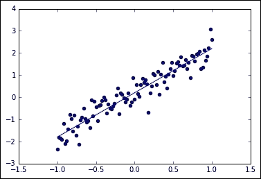
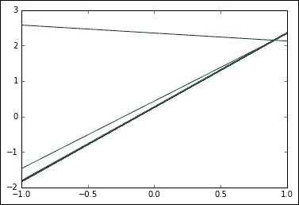
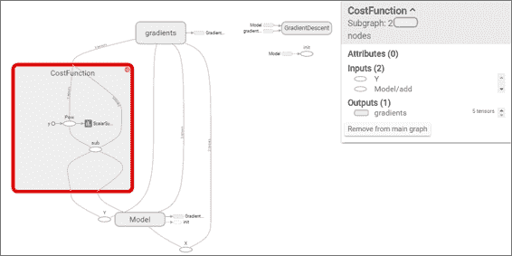
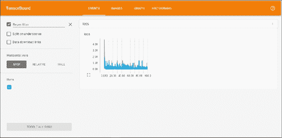

# 示例 1 -- 单变量线性回归

现在，我们将在一个项目中工作，在该项目中，我们将应用前面几页中简要介绍的所有概念。 在此示例中，我们将创建一个近似线性分布； 之后，我们将创建一个回归模型，该模型试图拟合线性函数以最小化误差函数（由最小二乘法定义）。

给定一个新样本，该模型将使我们能够预测输入值的结果。

## 数据集说明

对于此示例，我们将生成一个包含线性函数并添加噪声的合成数据集：

```py
import TensorFlow as tf
import numpy as np
trX = np.linspace(-1, 1, 101)
trY = 2 * trX + np.random.randn(*trX.shape) * 0.4 + 0.2 # create a y value which is approximately linear but with some random noise

```

使用这些线，我们可以将线表示为散点图和理想线函数。

```py
import matplotlib.pyplot as plt 
plt.scatter(trX,trY) 
plt.plot (trX, .2 + 2 * trX)  

```



生成的样本和原始线性函数无噪声

## 模型架构

1.  现在，我们创建一个变量来保存`x`和`y`轴中的值。 然后，我们将模型定义为`X`和权重`w`的乘积。
2.  然后，我们生成一些变量，并为其分配初始值以启动模型：

    ```py
            In[]: 
            X = tf.placeholder("float", name="X") # create symbolic variables 
            Y = tf.placeholder("float", name = "Y") 

    ```

3.  现在，我们通过将`name_scope`声明为`Model`来定义模型。 此作用域将其包含的所有变量分组，以形成具有同类实体的唯一实体。 在此范围内，我们首先定义一个函数，该函数接收`x`轴坐标，权重（斜率）和偏差的变量。 然后，我们创建一个新变量`objects,`来保存不断变化的参数，并使用`y_model`变量实例化该模型：

    ```py
             with tf.name_scope("Model"):

               def model(X, w, b):
                 return tf.mul(X, w) + b # just define the line as X*w + b0 

               w = tf.Variable(-1.0, name="b0") # create a shared variable
               b = tf.Variable(-2.0, name="b1") # create a shared variable
               y_model = model(X, w, b)

    ```

在仪表板上，您可以看到我们一直在收集的损失函数的图像。 在图部分中，放大模型时，您可以看到求和与乘法运算，参数变量`b0`和`b1`以及应用于模型的梯度运算，如下所示：


## 成本函数描述和优化器循环

1.  在`Cost Function`中，我们创建了一个新的范围以包括该组的所有操作，并使用先前创建的`y_model`来说明用于计算损失的计算出的`y`轴值。

    ```py
            with tf.name_scope("CostFunction"): 
            cost = (tf.pow(Y-y_model, 2)) # use sqr error for cost  

    ```

2.  为了定义选择的`optimizer,`，我们初始化一个`GradientDescentOptimizer`，步骤将是`0.01`，这似乎是收敛的合理起点。

    ```py
             train_op = tf.train.GradientDescentOptimizer(0.05).minimize(cost) 

    ```

3.  现在是时候创建会话并初始化要保存在 TensorBoard 中进行查看的变量了。 在此示例中，我们将为每个迭代保存一个标量变量以及最后一个样本的误差结果。 我们还将图结构保存在文件中以供查看。

    ```py
            sess = tf.Session() 
            init = tf.initialize_all_variables()
            tf.train.write_graph(sess.graph,
              '/home/ubuntu/linear','graph.pbtxt')
            cost_op = tf.scalar_summary("loss", cost) 
            merged = tf.merge_all_summaries() 
            sess.run(init) 
            writer = tf.train.SummaryWriter('/home/ubuntu/linear',
              sess.graph) 

    ```

4.  对于模型训练，我们将目标设置为 100 次迭代，然后将每个样本发送到梯度下降的`train`操作。 每次迭代后，我们绘制建模线并将最后一个误差的值添加到`summary`中。

    ```py
            In[]:
            for i in range(100):
             for (x, y) in zip(trX, trY): 
               sess.run(train_op, feed_dict={X: x, Y: y}) 
               summary_str = sess.run(cost_op, feed_dict={X: x, Y: y})
               writer.add_summary(summary_str, i) 
             b0temp=b.eval(session=sess)
             b1temp=w.eval(session=sess)
             plt.plot (trX, b0temp + b1temp * trX )
    ```

结果图如下： 我们可以看到初始行如何迅速收敛为更合理的结果：



放大 CostFunction 范围后，我们可以看到幂和减法运算以及书面摘要，如下图所示：



## 停止条件

## 结果描述

现在让我们检查参数结果，打印`w`和`b`变量的`run`输出：

```py
printsess.run(w) # Should be around 2  
printsess.run(b) #Should be around 0.2 
2.09422 
0.256044 

```

现在是时候再次以图形方式查看数据和建议的最后一行。

```py
plt.scatter(trX,trY) 
plt.plot (trX, testb + trX * testw) 

```


## 使用 TensorBoard 查看结果

现在，让我们回顾一下保存在 TensorBoard 中的数据。

为了启动 TensorBoard，您可以转到 logs 目录并执行以下行：

```py
$ tensorboard --logdir=. 

```

TensorBoard 将加载事件和图形文件，并且将在`6006`端口上监听。 然后，您可以从浏览器转到`localhost:6000`，然后查看 TensorBoard 仪表板，如下图所示：



## 完整源代码

以下是完整的源代码：

```py
import matplotlib.pyplot as plt # import matplotlib 
import numpy as np # import numpy 
import tensorflow as tf 
import numpy as np 

trX = np.linspace(-1, 1, 101) #Create a linear space of 101 points between 1 and 1 
trY = 2 * trX + np.random.randn(*trX.shape) * 0.4 + 0.2 #Create The y function based on the x axis 
plt.figure() # Create a new figure 
plt.scatter(trX,trY) #Plot a scatter draw of the random datapoints 
plt.plot (trX, .2 + 2 * trX) # Draw one line with the line function 

get_ipython().magic(u'matplotlib inline') 

import matplotlib.pyplot as plt 
import tensorflow as tf 
import numpy as np 

trX = np.linspace(-1, 1, 101) 
trY = 2 * trX + np.random.randn(*trX.shape) * 0.4 + 0.2 # create a y value which is approximately linear but with some random noise 

plt.scatter(trX,trY) 
plt.plot (trX, .2 + 2 * trX) 

X = tf.placeholder("float", name="X") # create symbolic variables 
Y = tf.placeholder("float", name = "Y") 

withtf.name_scope("Model"): 

    def model(X, w, b): 
        returntf.mul(X, w) + b # We just define the line as X*w + b0   

    w = tf.Variable(-1.0, name="b0") # create a shared variable 
    b = tf.Variable(-2.0, name="b1") # create a shared variable 
    y_model = model(X, w, b) 

withtf.name_scope("CostFunction"): 
    cost = (tf.pow(Y-y_model, 2)) # use sqr error for cost function 

train_op = tf.train.GradientDescentOptimizer(0.05).minimize(cost) 

sess = tf.Session() 
init = tf.initialize_all_variables() 
tf.train.write_graph(sess.graph, '/home/ubuntu/linear','graph.pbtxt') 
cost_op = tf.scalar_summary("loss", cost) 
merged = tf.merge_all_summaries() 
sess.run(init) 
writer = tf.train.SummaryWriter('/home/ubuntu/linear', sess.graph) 

fori in range(100): 
for (x, y) in zip(trX, trY): 
sess.run(train_op, feed_dict={X: x, Y: y})     
summary_str = sess.run(cost_op, feed_dict={X: x, Y: y}) 
writer.add_summary(summary_str, i)        
    b0temp=b.eval(session=sess) 
    b1temp=w.eval(session=sess) 
plt.plot (trX, b0temp + b1temp * trX ) 

printsess.run(w) # Should be around 2  
printsess.run(b) #Should be around 0.2 

plt.scatter(trX,trY) 
plt.plot (trX, sess.run(b) + trX * sess.run(w)) 

```


