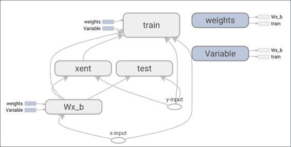

# 处理计算工作流程 -- TensorFlow 的数据流程图

TensorFlow 的数据流图是模型计算如何工作的符号表示：



在 TensorBoard 上绘制的简单数据流图表示

简而言之，数据流图是一个完整的 TensorFlow 计算，表示为一个图，其中节点是操作，边是操作之间的数据流。

通常，节点执行数学运算，但也表示连接以输入数据或变量，或推出结果。

边缘描述节点之间的输入/输出关系。 这些数据边仅传输张量。 节点被分配给计算设备，并且一旦它们进入边缘上的所有张量都可用，就会异步并行执行。

所有运算都有一个名称，并表示一个抽象计算（例如，矩阵求逆或乘积）。

## 计算图构建

通常在库用户创建张量和模型将支持的操作时构建计算图，因此无需直接构建`Graph()`对象。 Python 张量构造函数，例如`tf.constant()`，会将必要的元素添加到默认图。 TensorFlow 操作也会发生同样的情况。

例如，`c = tf.matmul(a, b)`创建一个`MatMul`类型的操作，该操作将张量`a`和`b`作为输入并产生`c`作为输出。

### 有用的操作对象方法

*   `tf.Operation.type`：返回操作的类型（例如`MatMul`）
*   `tf.Operation.inputs`：返回代表操作输入的张量对象列表
*   `tf.Graph.get_operations()`：返回图中的操作列表
*   `tf.Graph.version`：返回图的自动数字版本

## 馈送

TensorFlow 还提供了一种馈送机制，可将张量直接修补到图中的任何操作中。

提要用张量值临时替换操作的输出。 您将提要数据作为`run()`调用的参数提供。 提要仅用于传递给它的运行调用。 最常见的用例涉及通过使用`tf.placeholder()`创建特定的操作，使其指定为`feed`操作。

## 变量

在大多数计算中，图执行多次。 大多数张量都无法通过图的一次执行而幸存。 但是，变量是一种特殊的操作，它可以将句柄返回到持久可变的张量，该张量在图执行过程中仍然存在。 对于 TensorFlow 的机器学习应用，模型的参数通常存储在变量中保存的张量中，并在运行模型的训练图时进行更新。

### 变量初始化

要初始化变量，只需使用张量作为参数调用`Variable`对象构造函数。

在此示例中，我们使用`1000`零数组初始化了一些变量：

```py
b = tf.Variable(tf.zeros([1000])) 

```

## 保存数据流程图

数据流图是使用 Google 的协议缓冲区编写的，因此以后可以使用多种语言进行读取。

### 图序列化语言 -- 协议缓冲区

协议缓冲区是一种不依赖语言，不依赖平台的可扩展机制，用于序列化结构化数据。 首先定义数据结构，然后可以使用专门生成的代码来使用多种语言进行读写。

#### 有用的方法

`tf.Graph.as_graph_def(from_version=None, add_shapes=False)`：返回此图的序列化`GraphDef`表示形式。

参数：

*   `from_version`：如果设置了此选项，它将返回带有从该版本添加的节点的`GraphDef`
*   `add_shapes`：如果`true`，则向每个节点添加一个 shape 属性

### 建立图的示例

在此示例中，我们将构建一个非常简单的数据流图，并观察生成的 protobuffer 文件的概述：

```py
import tensorflow as tf 
g = tf.Graph() 
with g.as_default(): 
import tensorflow as tf 
sess = tf.Session() 
W_m = tf.Variable(tf.zeros([10, 5])) 
x_v = tf.placeholder(tf.float32, [None, 10]) 
result = tf.matmul(x_v, W_m) 
print g.as_graph_def() 

```

生成的 protobuffer（摘要）为：

```py
node {
  name: "zeros"
  op: "Const"
  attr {
    key: "dtype"
    value {
      type: DT_FLOAT
    }
  }
  attr {
    key: "value"
    value {
      tensor {
        dtype: DT_FLOAT
        tensor_shape {
          dim {
            size: 10
          }
          dim {
            size: 5
          }
        }
        float_val: 0.0
      }
    }
  }
}
...
node {
  name: "MatMul"
  op: "MatMul"
  input: "Placeholder"
  input: "Variable/read"
  attr {
    key: "T"
    value {
      type: DT_FLOAT
    }
  }
...
}
versions {
  producer: 8
}
```