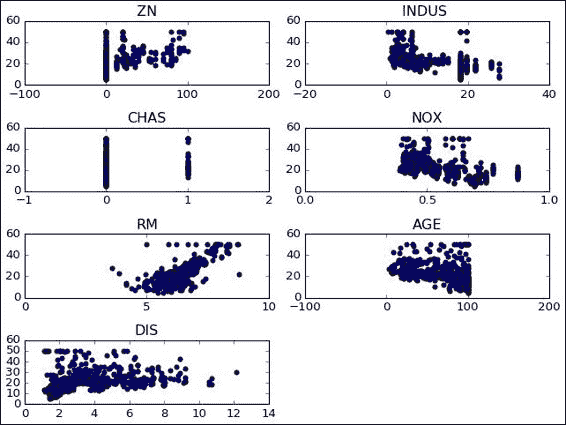
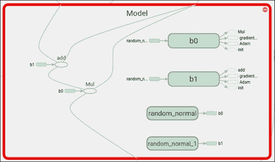

# 示例 2 -- 多元线性回归

在此示例中，我们将处理涉及多个变量的回归问题。

这将基于 1993 年波士顿某些郊区不同价格的研究数据集。 它最初包含 13 个变量以及该处房产的平均价格。

与原始文件相比，文件中唯一的变化是删除了一个变量`(b)`，该变量在种族上对不同的郊区进行了概述。

除此之外，我们将选择一些我们认为具有线性条件可以建模的良好条件的变量。

## 有用的库和方法

本部分包含一个有用的库列表，我们将在此示例中以及本书其余部分中 TensorFlow 之外的部分中使用这些库，以帮助解决我们将要解决的各种问题。

### Pandas 库

当我们想快速读取并获得有关正常大小的数据文件的提示时，创建读取缓冲区和其他附加机制可能会减少开销。 这是熊猫当前的现实生活用例之一。

这是[ Pandas 网站](http://pandas.pydata.org/)的摘录：

> “ Pandas 是 BSD 许可的开放源代码库，为 Python 提供了高表现，易于使用的数据结构和数据分析工具。”

熊猫的主要特征如下：

*   它具有 CSV 和文本文件，MS Excel，SQL 数据库甚至面向科学的 HDF5 格式的读写文件功能。
*   CSV 文件加载例程自动识别列标题并支持更直接的列寻址
*   数据结构自动转换为 NumPy 多维数组

## 数据集说明

数据集以 CSV 文件表示，我们将使用 Pandas 库打开它。

数据集包含以下变量：

*   `CRIM`：按城镇划分的人均犯罪率
*   `ZN`：划定面积超过 25,000 平方英尺的住宅用地的比例。
*   `INDUS`：每个城镇的非零售业务英亩比例
*   `CHAS`：查尔斯河虚拟变量（如果区域限制河流，则为 1；否则为 0）
*   `NOX`：一氧化氮浓度（百万分之几）
*   `RM`：每个住宅的平均房间数
*   `AGE`：1940 年之前建造的自有住房的比例
*   `DIS`：到五个波士顿就业中心的加权距离
*   `RAD`：径向公路的可达性指数
*   `TAX`：每 10,000 美元的全值财产税率
*   `PTRATIO`：按城镇划分的师生比率
*   `LSTAT`：人口状况降低％
*   `MEDV`：自有住房的中位数价值，以$ 1000 为单位

在这里，我们有一个简单的程序，它将读取数据集并创建数据的详细说明：

```py
import tensorflow.contrib.learn as skflow 
fromsklearn import datasets, metrics, preprocessing 
import numpy as np 
import pandas as pd 

df = pd.read_csv("data/boston.csv", header=0) 
printdf.describe() 

```

这将输出数据集变量的统计摘要。 前六个结果如下：

```py

CRIM         ZN       INDUS         CHAS         NOX          RM  \ 
count  506.000000  506.000000  506.000000  506.000000  506.000000  506.000000    
mean     3.613524   11.363636   11.136779    0.069170    0.554695    6.284634    
std      8.601545   23.322453    6.860353    0.253994    0.115878    0.702617    
min      0.006320    0.000000    0.460000    0.000000    0.385000    3.561000    
25%      0.082045    0.000000    5.190000    0.000000    0.449000    5.885500   
50%      0.256510    0.000000    9.690000    0.000000    0.538000    6.208500    
75%      3.677082   12.500000   18.100000    0.000000    0.624000    6.623500    
max     88.976200  100.000000   27.740000    1.000000    0.871000    8.780000    

```



## 模型架构

在此示例中，我们将使用的模型很简单，但是几乎包含了处理更复杂模型所需的所有元素。

在下图中，我们看到了整个设置的不同参与者：模型，CostFunction 和梯度。 TensorFlow 真正有用的功能是能够自动微分模型和函数。


在这里，我们可以找到上一节中表示的变量的定义：`w`，`b`和模型线性方程。

```py
X = tf.placeholder("float", name="X") # create symbolic variables 
Y = tf.placeholder("float", name = "Y") 

withtf.name_scope("Model"): 
    w = tf.Variable(tf.random_normal([2], stddev=0.01), name="b0") # create a shared variable 
    b = tf.Variable(tf.random_normal([2], stddev=0.01), name="b1") # create a shared variable 
def model(X, w, b): 
returntf.mul(X, w) + b # We just define the line as X*w + b0   
y_model = model(X, w, b)
```



## 损失函数说明和优化器循环

在此示例中，我们将使用常用的均方误差，但是这次使用了多变量； 因此我们应用 reduce_mean 来收集不同维度上的误差值：

```py
withtf.name_scope("CostFunction"): 
    cost = tf.reduce_mean(tf.pow(Y-y_model, 2)) # use sqr error for cost function 
train_op = tf.train.AdamOptimizer(0.1).minimize(cost)
```


```py
 for a in range (1,10): 
    cost1=0.0 
fori, j in zip(xvalues, yvalues):    
sess.run(train_op, feed_dict={X: i, Y: j})  
        cost1+=sess.run(cost, feed_dict={X: i, Y: i})/506.00 
        #writer.add_summary(summary_str, i)  
xvalues, yvalues = shuffle (xvalues, yvalues) 

```

## 停止条件

停止条件将仅由针对所有数据样本训练参数来确定外循环中确定的周期数。

## 结果描述

结果如下：

```py
1580.53295174 
[ 2.25225258  1.30112672] 
[ 0.80297691  0.22137061] 
1512.3965525 
[ 4.62365675  2.90244412] 
[ 1.16225874  0.28009811] 
1495.47174799 
[ 6.52791834  4.29297304] 
[ 0.824792270.17988272] 
... 
1684.6247849 
[ 29.71323776  29.96078873] 
[-0.68271929 -0.13493828] 
1688.25864746 
[ 29.78564262  30.09841156] 
[-0.58272243 -0.08323665] 
1684.27538102 
[ 29.75390816  30.13044167] 
[-0.59861398 -0.11895057] 

```

从结果中我们可以看到，在训练的最后阶段，建模线同时基于以下系数：

`price = 0.6 x Industry + 29.75`

`price = 0.1 x Age + 30.13`

## 完整源代码

以下是完整的源代码：

```py
import matplotlib.pyplot as plt 
import tensorflow as tf 
import tensorflow.contrib.learn as skflow 
from sklearn.utils import shuffle 
import numpy as np 
import pandas as pd 

df = pd.read_csv("data/boston.csv", header=0) 
printdf.describe() 

f, ax1 = plt.subplots() 
plt.figure() # Create a new figure 

y = df['MEDV'] 

for i in range (1,8): 
    number = 420 + i 
    ax1.locator_params(nbins=3) 
    ax1 = plt.subplot(number) 
    plt.title(list(df)[i]) 
    ax1.scatter(df[df.columns[i]],y) #Plot a scatter draw of the datapoints 
plt.tight_layout(pad=0.4, w_pad=0.5, h_pad=1.0) 

X = tf.placeholder("float", name="X") # create symbolic variables 
Y = tf.placeholder("float", name = "Y") 

with tf.name_scope("Model"): 

    w = tf.Variable(tf.random_normal([2], stddev=0.01), name="b0") # create a shared variable 
    b = tf.Variable(tf.random_normal([2], stddev=0.01), name="b1") # create a shared variable 

    def model(X, w, b): 
        return tf.mul(X, w) + b # We just define the line as X*w + b0   

    y_model = model(X, w, b) 

with tf.name_scope("CostFunction"): 
    cost = tf.reduce_mean(tf.pow(Y-y_model, 2)) # use sqr error for cost function 

train_op = tf.train.AdamOptimizer(0.001).minimize(cost) 

sess = tf.Session() 
init = tf.initialize_all_variables() 
tf.train.write_graph(sess.graph, '/home/bonnin/linear2','graph.pbtxt') 
cost_op = tf.scalar_summary("loss", cost) 
merged = tf.merge_all_summaries() 
sess.run(init) 
writer = tf.train.SummaryWriter('/home/bonnin/linear2', sess.graph) 

xvalues = df[[df.columns[2], df.columns[4]]].values.astype(float) 
yvalues = df[df.columns[12]].values.astype(float) 
b0temp=b.eval(session=sess) 
b1temp=w.eval(session=sess) 

for a in range (1,10): 
    cost1=0.0 
for i, j in zip(xvalues, yvalues):    
sess.run(train_op, feed_dict={X: i, Y: j})  
        cost1+=sess.run(cost, feed_dict={X: i, Y: i})/506.00 
        #writer.add_summary(summary_str, i)  
xvalues, yvalues = shuffle (xvalues, yvalues) 
print (cost1) 
b0temp=b.eval(session=sess) 
b1temp=w.eval(session=sess) 
print (b0temp) 
print (b1temp) 
#plt.plot (trX, b0temp + b1temp * trX ) 

```