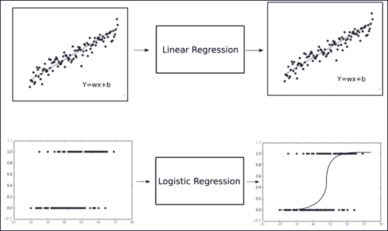

# 问题描述

线性回归旨在解决的问题不是基于连续函数的值预测，这一次，我们想知道样本属于确定类别的可能性。

在本章中，我们将依靠线性模型的一般化来解决回归问题，但最终目标是解决分类问题，我们必须应用标签或将观察集中的所有元素分配给预定义的组。

在上图中，我们可以看到如何对旧问题和新问题进行分类。 第一个（线性回归）可以想象为价值不断增长的连续体。

另一个是基于`x`值的输出只能具有两个不同值的域。 在第二张图的特定情况下，我们可以看到对其中一个选项的特定偏向极端：在左侧，偏向 0 `y`值，在右侧偏向某个值。 共 1。

鉴于即使在进行回归从而寻找连续值的情况下，这种项也可能有些棘手，实际上，最终目标是为具有离散变量的分类问题建立预测。

此处的关键是要了解我们将获得与类有关的项目的概率，而不是完全离散的值。