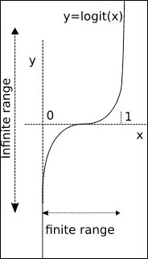

# sigmoid 函数的前身 -- Logit 函数

在研究逻辑函数之前，我们将回顾该函数所基于的原始函数，并为其提供一些更一般的属性。

本质上，当我们谈论`logit`函数时，我们正在使用随机变量`p`的函数，更具体地说，是与伯努利分布相对应的函数。

## 伯努利分布

在解释理论细节之前，值得注意的是伯努利分布是一个随机变量，它具有：

*   取值为 0 且失败概率为`q = 1 - p`

*   取值为 1，成功概率为`p`

可以表示如下（对于具有伯努利分布的随机变量`X`）：

这是一种概率分布，它将以二元选项的形式表示事件的发生概率，就像我们要表示自己的变量（特征的存在，事件的发生，现象的因果关系等）一样。

## 链接函数

在尝试建立广义线性模型时，我们要从线性函数开始，并从因变量开始，获取到概率分布的映射。

由于选项具有二元性质，因此通常选择的分布是最近提到的 Bernoulli 分布，而倾向于 logistic 函数的链接函数是`logit`函数。

## Logit 函数

我们可以利用的可能变量之一是`p`等于 1 的几率的自然对数。 此函数称为`logit`函数：

我们也可以将`logit`函数称为对数奇数函数，因为对于给定的概率`p`，我们正在计算赔率的对数`(p/1-p)`：

因此，正如我们可以直观地推断出的那样，用自变量的组合替换`X`，无论它们的值是什么，用从负无穷大到无穷大的任何出现替换`X`，我们将响应缩放到`0`和`1`。

## Logit 反函数的重要性

假设我们计算`logit`函数的逆。 这将使我们编写以下函数：

此函数是`sigmoid`函数。