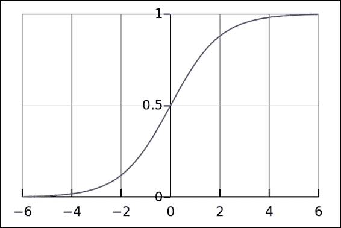
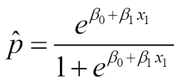
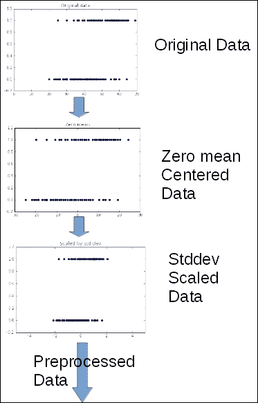

# sigmoid 函数

逻辑函数将帮助我们在新的回归任务中表示二元类别。

在下图中，您将找到`sigmoid`函数的图形表示：



逻辑函数或 Sigmoid 的图形表示

## Logistic 函数作为线性建模概括

逻辑函数`δ(t)`定义如下：


该方程式的正常解释是`t`代表一个简单的自变量。 但是，我们将改进此模型，并假定`t`是单个解释变量`x`的线性函数（对 t 是多个解释变量的线性组合的情况进行类似处理）。

然后，我们将`t`表示为：


### 最终估计的回归方程

因此，我们从以下等式开始：


使用所有这些元素，我们可以计算回归方程，这将为我们提供回归概率：



下图将显示如何将从任意范围的映射最终转换为范围`[0, 1]`，该范围可以解释为表示事件发生的概率 p：


什么影响会改变线性函数的参数？ 它们是将更改`sigmoid`函数的中心斜率和从零开始的位移的值，从而使其可以更精确地减小回归值与实际数据点之间的误差。

## 逻辑函数的属性

函数空间中的每条曲线都可以通过可能适用的目标来描述。 对于 logistic 函数，它们是：

*   根据一个或多个独立变量对事件的概率`p`进行建模。 例如，鉴于先前的资格，被授予奖品的可能性。
*   对确定的观测值进行估计（这是回归部分）`p`，与事件未发生的可能性有关。
*   预测自变量变化对二元响应的影响。
*   通过计算某项属于确定类别的概率对观察进行分类。

### 损失函数

在上一节中，我们看到了近似的`p^`函数，该函数将对样本属于特定类别的概率进行建模。 为了衡量我们对解的近似程度，我们将寻找精心选择的损失函数。

该损失函数表示为：


该损失函数的主要特性是它不会以类似的方式惩罚误差，当误差增加到远远超过 0.5 时，误差惩罚因子会渐近增长。

## 多类应用 -- softmax 回归

到目前为止，我们仅针对两个类的情况进行分类，或者以概率语言对事件发生概率`p`进行分类。

在要决定两个以上类别的情况下，有两种主要方法： 一对一，一对全。

*   第一种技术包括计算许多模型，这些模型代表每个类别相对于所有其他类别的概率。
*   第二个由一组概率组成，其中我们代表一个类别相对于所有其他类别的概率。
*   第二种方法是`softmax`回归的输出格式，它是 n 个类的逻辑回归的概括。

因此，为了训练样本，我们将使用句柄`y(i)ε{1,...,K},`将二元标签`( y(i)ε{0,1})`更改为向量标签，其中`K`是类别数，标签 Y 可以采用`K`不同的值， 而不是只有两个。

因此，对于这种特定技术，给定测试输入`X`，我们想要针对`k=1,...,K`的每个值估计`P`（`y=k|x`）的概率。 `softmax`回归将输出`K`维向量（其元素总和为 1），从而为我们提供了`K`估计的概率。

在下图中，我们表示在单类和多类逻辑回归的概率映射上发生的映射：


### 成本函数

`softmax`函数的成本函数是自适应的交叉熵函数，该函数不是线性的，因此对大阶函数差异的惩罚要比对小阶函数的惩罚更大。


在这里，`c`是类别编号，`I`是各个训练样本索引，`yc`对于期望的类别为 1，对于其余类别为 0。

扩展这个方程，我们得到以下结果：


### 迭代方法的数据标准化

正如我们将在以下各节中看到的那样，对于逻辑回归，我们将使用`gradient descent`方法来最小化成本函数。



此方法对特征数据的形式和分布非常敏感。

因此，我们将进行一些预处理，以便获得更好，更快的收敛结果。

我们将把这种方法的理论原因留给其他书籍，但我们将总结其原因，即通过归一化可以平滑误差表面，使迭代`gradient descent`更快地达到最小误差。

### 输出的单热表示

为了将`softmax`函数用作回归函数，我们必须使用一种称为单热编码的编码。 这种编码形式只是将变量的数字整数值转换为数组，其中将值列表转换为数组列表，每个数组的长度与该列表的最大值相同，并且每个数组的表示方式是在值的索引上添加 1，其余元素保持为 0。

例如，这将是单热编码形式的列表[1、3、2、4]的表示形式：

```py
[[0 1 0 0 0] 
[0 0 0 1 0] 
[0 0 1 0 0]
[0 0 0 0 1]]
```