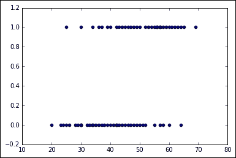

# 示例 1 -- 单变量 logistic 回归

在第一个示例中，我们将使用单变量 logistic 回归（患者年龄）来估计心脏病的概率。

## 有用的库和方法

从 0.8 版开始，TensorFlow 提供了一种生成热点的方法。 用于此生成的函数是`tf.one_hot`，其形式如下：

```py
tf.one_hot(indices, depth, on_value=1, off_value=0, axis=None, dtype=tf.float32, name=None)
```

此函数生成通用的单热编码数据结构，该结构可以指定值，生成轴，数据类型等。

在生成的张量中，索引的指示值将采用`on_value`（默认值为`1`），其他值将具有`off_value`（默认`0`）。

`Dtype`是生成的张量的数据类型； 默认值为`float32`。

depth 变量定义每个元素将具有多少列。 我们假设它在逻辑上应该为`max(indices) + 1`，但也可以将其切掉。

### TensorFlow 的 softmax 实现

在 TensorFlow 中应用`softmax`回归的方法包括`tf.nn.log_softmax, with the following form:`

```py
tf.nn.log_softmax(logits, name=None)
```

在这里，参数为：

*   `logits`：张量必须为以下类型之一：`float32`，`float64` 形状为`[batch_size, num_classes]`的 2D
*   `name`：操作的名称（可选）

此函数返回具有与`logits`相同类型和形状的张量。

## 数据集说明和加载

我们将讨论的第一种情况是我们要拟合逻辑回归的方法，仅测量一个变量，并且只有两个可能的结果。

### CHDAGE 数据集

对于第一个简单的示例，我们将使用一个非常简单且经过研究的数据集，该数据集以在书中出版而闻名。 应用逻辑回归第三版，David W. Hosmer Jr.，Stanley Lemeshow，Rodney X. Sturdivant，作者：Wiley。

列出`age`的年限（AGE），以及对心脏病风险因素进行假设性研究的 100 名受试者是否患有严重冠心病（CHD）的证据。 该表还包含一个标识符变量（ID）和一个年龄组变量（AGEGRP）。 结果变量是 CHD，它用`0`值编码以表示不存在 CHD，或用`1`编码以指示其存在于个体中。 通常，可以使用任何两个值，但是我们发现使用零和一最为方便。 我们将此数据集称为 CHDAGE 数据。

#### CHDAGE 数据集格式

CHDAGE 数据集是一个两列的 CSV 文件，我们将从外部仓库下载该文件。

在第 1 章（探索和转换数据）中，我们使用了本机 TensorFlow 方法来读取数据集。 在本章中，我们将使用一个互补且流行的库来获取数据。

进行此新添加的原因是，鉴于数据集只有 100 个元组，实际上只需要一行读取即可，而且`pandas`库提供了免费但简单但强大的分析方法 。

因此，在该项目的第一阶段，我们将开始加载 CHDAGE 数据集的实例，然后将打印有关数据的重要统计信息，然后进行预处理。

在对数据进行一些绘制之后，我们将构建一个由激活函数组成的模型，该激活函数将在特殊情况下成为`softmax`函数，在特殊情况下它将变为标准逻辑回归。 那就是只有两个类别（疾病的存在与否）。

#### 数据集加载和预处理实现

首先，我们导入所需的库，并指示所有`matplotlib`程序都将内联（如果我们使用 Jupyter）：

```py
>>> import pandas as pd 
>>> import numpy as np 
>>> %matplotlib inline 
>>> import matplotlib.pyplot as plt 

```

然后，我们读取数据并要求`pandas`检查有关数据集的重要统计信息：

```py
>>> df = pd.read_csv("data/CHD.csv", header=0) 
>>> print df.describe() 

```

```py
    age        chd
    count  100.000000  100.00000
    mean    44.380000    0.43000
    std     11.721327    0.49757
    min     20.000000    0.00000
    25%     34.750000    0.00000
    50%     44.000000    0.00000
    75%     55.000000    1.00000
    max     69.000000    1.000000

```

然后，我们继续绘制数据以了解数据：

```py
plt.figure() # Create a new figure 
plt.scatter(df['age'],df['chd']) #Plot a scatter draw of the random datapoints 

```



## 模型架构

在这里，我们从以下变量开始，描述将在其中构建模型元素的代码部分：

```py
learning_rate = 0.8 #Learning speed 
batch_size = 100 #number of samples for the batch 
display_step = 2 #number of steps before showing progress
```

在这里，我们为图创建初始变量和占位符，即单变量`x`和`y`浮点值：

```py
x = tf.placeholder("float", [None, 1]) # Placeholder for the 1D data 
y = tf.placeholder("float", [None, 2]) # Placeholder for the classes (2)
```

现在，我们将创建线性模型变量，随着模型拟合的进行，将对其进行修改和更新：

```py
W = tf.Variable(tf.zeros([1, 2])) 
b = tf.Variable(tf.zeros([2]))
```

最后，我们将对线性函数应用`softmax`操作来构建激活函数：

```py
activation = tf.nn.softmax(tf.matmul(x, W) + b) 

```

## 损失函数描述和优化器循环

在这里，我们仅将互相关函数定义为`loss`函数，并定义`optimizer`操作，即`gradient descent`。 以下各章将对此进行解释； 现在，您可以看到它是一个黑框，它将改变变量，直到损失最小：

```py
cost = tf.reduce_mean(-tf.reduce_sum(y*tf.log(activation), reduction_indices=1)) 
optimizer = tf.train.GradientDescentOptimizer(learning_rate).minimize(cost) 
#Iterate through all the epochs 
for epoch in range(training_epochs): 
        avg_cost = 0\. 
        total_batch = 400/batch_size 
# Loop over all batches 
        for i in range(total_batch): 
            # Transform the array into a one hot format 

        temp=tf.one_hot(indices = df['chd'].values, depth=2, on_value = 1, off_value = 0, axis = -1 , name = "a")       
        batch_xs, batch_ys =(np.transpose([df['age']])-44.38)/11.721327, temp 

        # Fit training using batch data 
        sess.run(optimizer, feed_dict={x: batch_xs.astype(float), y: batch_ys.eval()}) 

        # Compute average loss, suming the corrent cost divided by the batch total number 
        avg_cost += sess.run(cost, feed_dict={x: batch_xs.astype(float), y: batch_ys.eval()})/total_batch 

```

## 停止条件

一旦根据训练周期对数据进行了训练，该过程将简单地停止。

## 结果描述

这将是程序的输出：

```py
Epoch: 0001 cost= 0.638730764
[ 0.04824295 -0.04824295]
[[-0.17459483  0.17459483]]
Epoch: 0002 cost= 0.589489654
[ 0.08091066 -0.08091066]
[[-0.29231569  0.29231566]]
Epoch: 0003 cost= 0.565953553
[ 0.10427245 -0.10427245]
[[-0.37499282  0.37499279]]
Epoch: 0004 cost= 0.553756475
[ 0.12176144 -0.12176143]
[[-0.43521613  0.4352161 ]]
Epoch: 0005 cost= 0.547019333
[ 0.13527818 -0.13527818]
[[-0.48031801  0.48031798]]

```

### 跨周期拟合函数的表示

在下图中，我们表示了拟合函数在不同周期之间的进展：


## 完整源代码

这是完整的源代码：

```py
import pandas as pd 
import numpy as np 
get_ipython().magic(u'matplotlib inline') 
import matplotlib.pyplot as plt 
import tensorflow as tf 

df = pd.read_csv("data/CHD.csv", header=0) 
# Parameters 

learning_rate = 0.2 
training_epochs = 5 
batch_size = 100 
display_step = 1 
sess = tf.Session() 
b=np.zeros((100,2)) 

# tf Graph Input 

x = tf.placeholder("float", [None, 1]) 
y = tf.placeholder("float", [None, 2]) 

# Create model 
# Set model weights 
W = tf.Variable(tf.zeros([1, 2])) 
b = tf.Variable(tf.zeros([2])) 

# Construct model 
activation = tf.nn.softmax(tf.matmul(x, W) + b) 
# Minimize error using cross entropy 
cost = tf.reduce_mean(-tf.reduce_sum(y*tf.log(activation), reduction_indices=1)) # Cross entropy 
optimizer = tf.train.GradientDescentOptimizer(learning_rate).minimize(cost) # Gradient Descent 

# Initializing the variables 
init = tf.initialize_all_variables() 

# Launch the graph 

with tf.Session() as sess: 
    tf.train.write_graph(sess.graph, './graphs','graph.pbtxt') 
    sess.run(init) 
    writer = tf.train.SummaryWriter('./graphs', sess.graph) 
    #Initialize the graph structure 

    graphnumber=321 

    #Generate a new graph 
    plt.figure(1) 

    #Iterate through all the epochs 
    for epoch in range(training_epochs): 
        avg_cost = 0\. 
        total_batch = 400/batch_size 
        # Loop over all batches 

        for i in range(total_batch): 
            # Transform the array into a one hot format 

            temp=tf.one_hot(indices = df['chd'].values, depth=2, on_value = 1, off_value = 0, axis = -1 , name = "a")       
            batch_xs, batch_ys = (np.transpose([df['age']])-44.38)/11.721327, temp 

            # Fit training using batch data 
            sess.run(optimizer, feed_dict={x: batch_xs.astype(float), y: batch_ys.eval()}) 

            # Compute average loss, suming the corrent cost divided by the batch total number 
            avg_cost += sess.run(cost, feed_dict={x: batch_xs.astype(float), y: batch_ys.eval()})/total_batch 
        # Display logs per epoch step 

        if epoch % display_step == 0: 
            print "Epoch:", '%05d' % (epoch+1), "cost=", "{:.8f}".format(avg_cost) 

            #Generate a new graph, and add it to the complete graph 

            trX = np.linspace(-30, 30, 100) 
            print (b.eval()) 
            print (W.eval()) 
            Wdos=2*W.eval()[0][0]/11.721327 
            bdos=2*b.eval()[0] 

            # Generate the probabiliy function 
            trY = np.exp(-(Wdos*trX)+bdos)/(1+np.exp(-(Wdos*trX)+bdos) ) 

            # Draw the samples and the probability function, whithout the normalization 
            plt.subplot(graphnumber) 
            graphnumber=graphnumber+1 

            #Plot a scatter draw of the random datapoints 
            plt.scatter((df['age']),df['chd']) 
            plt.plot(trX+44.38,trY) #Plot a scatter draw of the random datapoints 
            plt.grid(True) 

        #Plot the final graph 
        plt.savefig("test.svg")  

```

### 图形表示

使用 TensorBoard 实用程序，我们将看到操作链。 请注意，在一半的操作图中，我们定义了主要的全局操作（“小数点”）以及应用于其余项的梯度操作，这是进行`loss`函数最小化所必需的。 这是接下来几章要讨论的主题。

