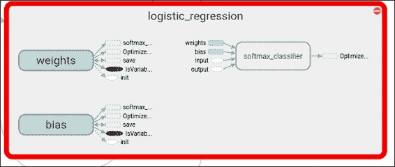

# 示例 2 -- 使用 skflow 的单变量 logistic 回归

在此示例中，我们将探索单变量示例域，但是这次我们将使用来自新库的帮助，该库为我们简化了模型构建，称为`skflow`。

## 有用的库和方法

在机器学习库领域中，有很多选择。 最知名的之一是`sklearn`，我们在第 2 章聚类中讨论过。

在 TensorFlow 发布之后的很早，一个新的贡献库就出现了，叫做`skflow`，其主要目的是模拟`sklearn`的界面和工作流程，在这个 TensorFlow 会话环境中工作更简洁。

在下面的示例中，我们将使用`skflow`界面重复先前回归的分析。

在示例中，我们还将看到 skflow 如何为回归模型自动生成详细且组织良好的图，只需将日志目录设置为参数即可。

## 数据集说明

使用`pandas`库，数据集加载阶段与前面的示例相同：

```py
import pandas as pd 

df = pd.read_csv("data/CHD.csv", header=0) 
print df.describe() 

```

## 模型架构

这是`my_model`的代码段：

```py
 def my_model(X, y): 
    return skflow.models.logistic_regression(X, y) 

X1 =a.fit_transform(df['age'].astype(float)) 
y1 = df['chd'].values 
classifier = skflow.TensorFlowEstimator(model_fn=my_model, n_classes=2) 

```

在这里，我们可以使用`softmax`分类器查看逻辑回归阶段的详细视图：




## 结果描述

```py
score = metrics.accuracy_score(df['chd'].astype(float), classifier.predict(X)) 
print("Accuracy: %f" % score) 

```

输出结果可观（为了简化模型）74％的准确率：

```py
Accuracy: 0.740000

```

## 完整源代码

这是完整的源代码：

```py
import tensorflow.contrib.learn as skflow 
from sklearn import datasets, metrics, preprocessing 
import numpy as np 
import pandas as pd 

df = pd.read_csv("data/CHD.csv", header=0) 
print df.describe() 

def my_model(X, y): 
    return skflow.models.logistic_regression(X, y) 

a = preprocessing.StandardScaler() 

X1 =a.fit_transform(df['age'].astype(float)) 

y1 = df['chd'].values 

classifier = skflow.TensorFlowEstimator(model_fn=my_model, n_classes=2) 
classifier.fit(X1,y1 , logdir='/tmp/logistic') 

score = metrics.accuracy_score(df['chd'].astype(float), classifier.predict(X)) 
print("Accuracy: %f" % score) 

```