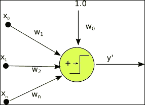
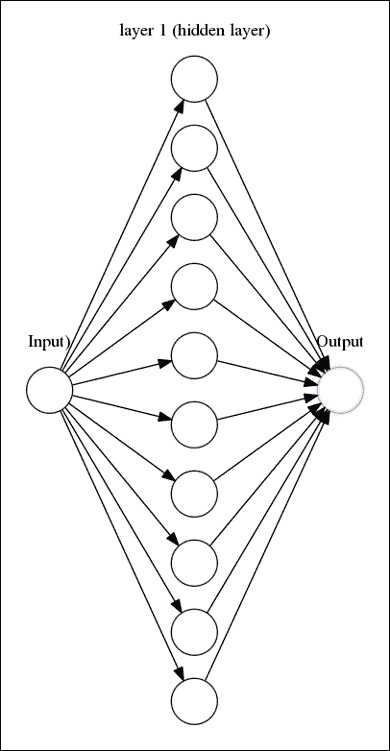

# 初步概念

为了将简单的框架构建到神经网络的组件和架构中，我们将对原始概念进行简单明了的构建，这些原始概念为当前，复杂而多样的神经网络格局铺平了道路。

## 人工神经元

人工神经元是一种数学函数，被视为真实生物神经元的模型。

它的主要特征是它接收一个或多个输入（训练数据），并对它们求和以产生输出。 此外，通常对总和进行加权（权重和偏差），然后将总和传递给非线性函数（激活函数或传递函数）。

## 原始示例 -- 感知器

感知器是实现人工神经元的最简单方法之一，并且它的算法可以追溯到 1950 年代，最早是在 1960 年代实现的。

从本质上讲，它是一种学习二分类函数的算法，该算法将一个实数映射为两个数：

下图显示了单层感知器

### 感知机算法

感知器的简化算法为：

1.  用随机分布初始化权重（通常为低值）
2.  选择一个输入向量并将其呈现给网络，
3.  为指定的输入向量和权重值计算网络的输出 y'。
4.  The function for a perceptron is:

    

5.  如果 y'≠y，则通过添加更改`Δw = yx[i]`修改所有连接`w[i]`
6.  返回步骤 2。

## 神经网络层

单层感知器可以推广到彼此连接的多个层，但是仍然存在问题；表示函数是输入的线性组合，并且感知器只是一种线性分类器，不可能正确拟合非线性函数。

## 神经网络激活函数

仅靠单变量线性分类器，神经网络的学习表现就不会那么好。 甚至机器学习中的一些轻微复杂的问题都涉及多个非线性变量，因此开发了许多变体来替代感知器的传递函数。

为了表示非线性模型，可以在激活函数中使用许多不同的非线性函数。 这意味着神经元将对输入变量的变化做出反应的方式发生变化。 实际上，最常用的激活函数是：

*   Sigmoid: 规范的激活函数，对于计算分类属性的概率具有很好的属性。

    

*   Tanh: 与 Sigmoid 非常相似，但其值范围是`[-1,1]`而不是`[0,1]`

    

*   Relu: 这称为整流线性单元，其主要优点之一是它不受“梯度消失”问题的影响，该问题通常存在于网络的第一层，趋向于 0 或很小的 epsilon 值：

    

## 梯度和反向传播算法

当我们描述感知器的学习阶段时，我们描述了根据权重对最终误差的“责任”来按比例调整权重的阶段。

在这个复杂的神经元网络中，误差的责任将分布在整个架构中应用于数据的所有函数之间。

因此，一旦我们计算了总误差，并且将整个函数应用于原始数据，我们现在就必须尝试调整方程式中的所有变量以将其最小化。

正如 Optimization 领域所研究的那样，我们需要知道的是能够使该误差最小化的是损失函数的梯度。

鉴于数据要经过许多权重和传递函数，因此必须通过链式法则来解决合成函数的梯度。

## 最小化损失函数：梯度下降

让我们看下图以了解损失函数：

### 神经网络问题的选择 -- 分类与回归

神经网络可用于回归问题和分类问题。 架构上的共同差异在于输出层：为了能够带来实数为基础的结果，不应应用诸如 Sigmoid 之类的标准化函数，这样我们就不会将变量的结果更改为许多可能的类别值之一，获得了可能的连续结果。

## 有用的库和方法

在本章中，我们将使用 TensorFlow 和实用程序库中的一些新实用程序，这些是最重要的实用程序：

### TensorFlow 激活函数

TensorFlow 导航中最常用的函数：

*   `tf.sigmoid(x)`：标准 S 形函数
*   `tf.tanh(x)`：双曲正切
*   `tf.nn.relu(features)`：Relu 传递函数

TensorFlow 导航的其他函数：

*   `tf.nn.elu(features)`：计算指数线性：如果`< 0`则为`exp(features) - 1`，否则为`features`
*   `tf.nn.softsign(features)`：计算 softsign：`features / (abs(features) + 1)`
*   `tf.nn.bias_add(value, bias)`：为值增加偏差

### TensorFlow 损失优化方法

TensorFlow 损失优化方法如下所述：

*   `tf.train.GradientDescentOptimizer(learning_rate, use_locking, name)`：这是原始的梯度下降方法，仅具有学习率参数
*   `tf.train.AdagradOptimizer(learning_rate, initial_accumulator_value, use_locking, name)`：此方法使学习率适应参数的频率，从而提高了最小搜索稀疏参数的效率
*   `tf.train.AdadeltaOptimizer(learning_rate, rho, epsilon, use_locking, name)`：这是改良的 AdaGrad，它将限制频繁参数的累积到最大窗口，因此它考虑了一定数量的步骤，而不是整个参数历史记录。
*   `tf.train.AdamOptimizer tf.train.AdamOptimizer.__init__(learning_rate, beta1, beta2, epsilon, use_locking, name)`：此方法在计算梯度时会添加一个因子，该因子对应于过去梯度的平均值，等同于动量因子。 因此，来自自适应矩估计的亚当这个名字。

### Sklearn 预处理实用程序

让我们看一下以下 Sklearn 预处理实用程序：

*   `preprocessing.StandardScaler()`：数据集的正则化是许多机器学习估计器的普遍要求，因此，为了使收敛更加直接，数据集将必须更像是标准正态分布，即具有零均值和单位方差的高斯曲线。 在实践中，我们通常会忽略分布的形状，而只是通过删除每个特征的平均值来变换数据以使其居中，然后通过将非恒定特征除以它们的标准偏差来缩放它。 对于此任务，我们使用 StandardScaler，它实现了前面提到的任务。 它还存储转换，以便能够将其重新应用于测试集。
*   `StandardScaler` 。 `fit_transform()`：简单地将数据调整为所需格式。 StandardScaler 对象将保存转换变量，因此您将能够取回非规格化数据。
*   `cross_validation.train_test_split`：此方法将数据集分为训练和测试段，我们只需要提供分配给每个阶段的数据集的百分比即可。