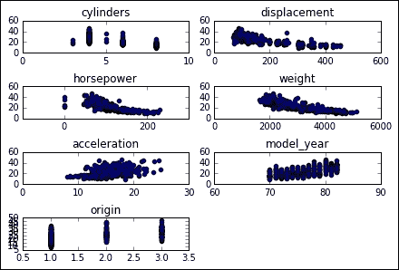

# 第二个项目 -- 使用非线性回归建模汽车的燃油效率

在此示例中，我们将进入一个区域，其中神经网络可提供大部分附加价值； 解决非线性问题。 为了开始这一旅程，我们将基于几个变量对几种汽车模型的燃油效率建模一个回归模型，该变量可以更好地用非线性函数表示。

## 数据集说明和加载

对于这个问题，我们将分析一个非常著名的，标准的，格式正确的数据集，该数据集将使我们能够分析一个多变量问题：根据离散和连续的一些相关变量来猜测汽车的 mpg。

这可以被认为是一个玩具，并且有些过时了，但是它将为更复杂的问题铺平道路，并且具有已经被众多书目分析的优势。

属性信息

该数据集具有以下数据列：

*   `mpg`：连续
*   `cylinders`：多值离散
*   `displacement`：连续
*   `horsepower`：连续
*   `weight`：连续
*   `acceleration`：连续
*   `model year:`多值离散
*   `origin`：多值离散
*   `car name`：字符串（将不使用）

我们将不对数据进行详细的分析，但是我们可以非正式地推断出所有连续变量都与增加或减少目标变量相关：



## 数据集预处理

对于此任务，我们将使用来自 sklearn 的上述缩放器对象：

*   `scaler = preprocessing.StandardScaler()`
*   `X_train = scaler.fit_transform(X_train)`

## 建模架构

我们将要构建的是一个前馈神经网络，具有多变量输入和简单输出：


## 收敛性测试

```py
score = metrics.mean_squared_error(regressor.predict(scaler.transform(X_test)), y_test)
print('MSE: {0:f}'.format(score))
```

## 结果描述

```py
Step #99, avg. train loss: 182.33624
Step #199, avg. train loss: 25.09151
Step #300, epoch #1, avg. train loss: 11.92343
Step #400, epoch #1, avg. train loss: 11.20414
Step #500, epoch #1, avg. train loss: 5.14056
Total Mean Squared Error: 15.0792258911
```

```py
%matplotlib inline  
import matplotlib.pyplot as plt 
import pandas as pd 

from sklearn import datasets, cross_validation, metrics 
from sklearn import preprocessing 
from tensorflow.contrib import skflow 

# Read the original dataset 
df = pd.read_csv("data/mpg.csv", header=0) 
# Convert the displacement column as float 
df['displacement']=df['displacement'].astype(float) 
# We get data columns from the dataset 
# First and last (mpg and car names) are ignored for X 
X = df[df.columns[1:8]] 
y = df['mpg'] 

plt.figure() # Create a new figure 

for i in range (1,8): 
    number = 420 + i 
    ax1.locator_params(nbins=3) 
    ax1 = plt.subplot(number) 
    plt.title(list(df)[i]) 
    ax1.scatter(df[df.columns[i]],y) #Plot a scatter draw of the  datapoints 
plt.tight_layout(pad=0.4, w_pad=0.5, h_pad=1.0) 
# Split the datasets 

X_train, X_test, y_train, y_test = cross_validation.train_test_split(X, y, 
test_size=0.25) 

# Scale the data for convergency optimization 
scaler = preprocessing.StandardScaler() 

# Set the transform parameters 
X_train = scaler.fit_transform(X_train) 

# Build a 2 layer fully connected DNN with 10 and 5 units respectively 
regressor = skflow.TensorFlowDNNRegressor(hidden_units=[10, 5], 
steps=500, learning_rate=0.051, batch_size=1) 

# Fit the regressor 
regressor.fit(X_train, y_train) 

# Get some metrics based on the X and Y test data 
score = metrics.mean_squared_error(regressor.predict(scaler.transform(X_test)), y_test) 

print(" Total Mean Squared Error: " + str(score)) 

```