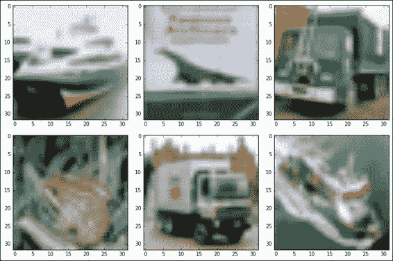

# 示例 2 -- 使用 CIFAR10 数据集进行图像分类

在此示例中，我们将研究图像理解中使用最广泛的数据集之一，该数据集用作简单但通用的基准。 在此示例中，我们将构建一个简单的 CNN 模型，以了解解决此类分类问题所需的一般计算结构。

## 数据集说明和加载

该数据集包含 40,000 个`32x32`像素的图像，代表以下类别：飞机，汽车，鸟类，猫，鹿，狗，青蛙，马，船和卡车。 在此示例中，我们将只处理 10,000 个图像包中的第一个。

以下是您可以在数据集中找到的一些图像示例：



## 数据集预处理

我们必须对原始数据集进行一些数据结构调整，首先将其转换为`[10000, 3, 32, 32]`多维数组，然后将通道维移动到最后一个顺序。

```py
datadir='data/cifar-10-batches-bin/' 
plt.ion() 
G = glob.glob (datadir + '*.bin') 
A = np.fromfile(G[0],dtype=np.uint8).reshape([10000,3073]) 
labels = A [:,0] 
images = A [:,1:].reshape([10000,3,32,32]).transpose (0,2,3,1) 
plt.imshow(images[14]) 
print labels[11] 
images_unroll = A [:,1:] 

```

## 建模架构

在这里，我们将定义我们的建模函数，该函数是一系列卷积和池化操作，并使用最终的平坦层和逻辑回归来确定当前样本的分类概率。

```py
def conv_model (X, y): 
X= tf. reshape(X, [-1, 32, 32, 3]) 
    with tf.variable_scope('conv_layer1'): 
        h_conv1=tf.contrib.layers.conv2d(X, num_outputs=16,  kernel_size=[5,5],  activation_fn=tf.nn.relu)#print (h_conv1) 
        h_pool1=max_pool_2x2(h_conv1)#print (h_pool1) 
with tf.variable_scope('conv_layer2'): 
        h_conv2=tf.contrib.layers.conv2d(h_pool1, num_outputs=16, kernel_size=[5,5], activation_fn=tf.nn.relu) 
    #print (h_conv2) 
    h_pool2=max_pool_2x2(h_conv2) 
    h_pool2_flat = tf.reshape(h_pool2,  [-1,8*8*16 ]) 
    h_fc1 = tf.contrib.layers.stack(h_pool2_flat, tf.contrib.layers.fully_connected ,[96,48], activation_fn=tf.nn.relu ) 

return skflow.models.logistic_regression(h_fc1,y) 

```

## 损失函数说明和优化器

以下是函数：

```py
classifier = skflow.TensorFlowEstimator(model_fn=conv_model, n_classes=10, batch_size=100, steps=2000, learning_rate=0.01)
```

### 训练和准确率测试

使用以下两个命令，我们开始使用图像集对模型进行拟合并生成训练后模型的评分：

```py
%time classifier.fit(images, labels, logdir='/tmp/cnn_train/')
%time score =metrics.accuracy_score(labels, classifier.predict(images))
```

## 结果描述

结果如下：

| 参数 | 结果 1 | 结果 2 |
| --- | --- | --- |
| CPU 时间 | 用户 35 分钟 6 秒 | 用户 39.8 秒 |
| 系统 | 1 分钟 50 秒 | 7.19 秒 |
| 总时间 | 36 分钟 57 秒 | 47 秒 |
| 墙上时间 | 25 分钟 3 秒 | 32.5 秒 |
| 准确率 | 0.612200 |  |

### 完整源代码

以下是完整的源代码：

```py
import glob 
import numpy as np 
import matplotlib.pyplot as plt 
import tensorflow as tf 
import tensorflow.contrib.learn as skflow 
from sklearn import metrics 
from tensorflow.contrib import learn 

datadir='data/cifar-10-batches-bin/' 

plt.ion() 
G = glob.glob (datadir + '*.bin') 
A = np.fromfile(G[0],dtype=np.uint8).reshape([10000,3073]) 
labels = A [:,0] 
images = A [:,1:].reshape([10000,3,32,32]).transpose (0,2,3,1) 
plt.imshow(images[15]) 
print labels[11] 
images_unroll = A [:,1:] 
def max_pool_2x2(tensor_in): 
    return tf.nn.max_pool(tensor_in,  ksize= [1,2,2,1], strides= [1,2,2,1], padding='SAME') 

def conv_model (X, y): 
    X= tf. reshape(X, [-1, 32, 32, 3]) 
    with tf.variable_scope('conv_layer1'): 
        h_conv1=tf.contrib.layers.conv2d(X, num_outputs=16,  kernel_size=[5,5],  activation_fn=tf.nn.relu)#print (h_conv1) 
        h_pool1=max_pool_2x2(h_conv1)#print (h_pool1) 
    with tf.variable_scope('conv_layer2'): 
        h_conv2=tf.contrib.layers.conv2d(h_pool1, num_outputs=16, kernel_size=[5,5], activation_fn=tf.nn.relu) 
    #print (h_conv2) 
    h_pool2=max_pool_2x2(h_conv2) 
    h_pool2_flat = tf.reshape(h_pool2,  [-1,8*8*16 ]) 
    h_fc1 = tf.contrib.layers.stack(h_pool2_flat, tf.contrib.layers.fully_connected ,[96,48], activation_fn=tf.nn.relu ) 
    return skflow.models.logistic_regression(h_fc1,y) 

images = np.array(images,dtype=np.float32) 
classifier = skflow.TensorFlowEstimator(model_fn=conv_model, n_classes=10, batch_size=100, steps=2000, learning_rate=0.01) 

%time classifier.fit(images, labels, logdir='/tmp/cnn_train/') 
%time score =metrics.accuracy_score(labels, classifier.predict(images)) 

```