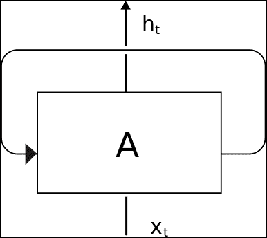
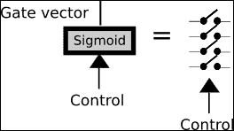
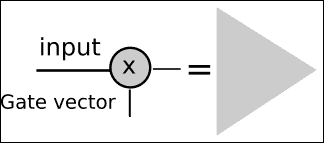
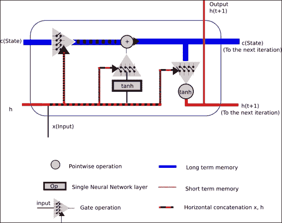
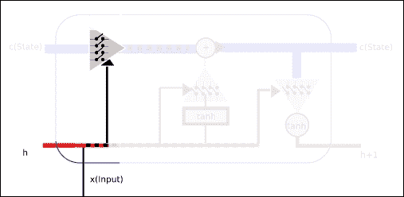
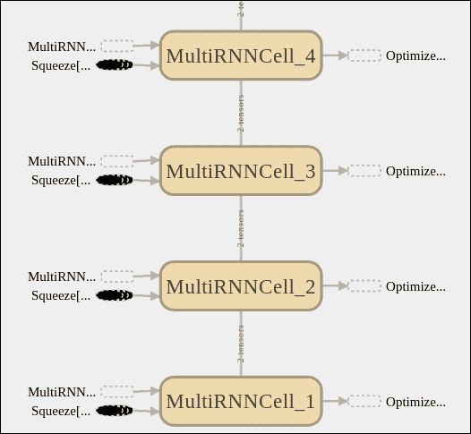

# 循环神经网络

知识通常不会从虚无中出现。 许多新的想法是先前知识的结合而诞生的，因此这是一种有用的模仿行为。 传统的神经网络不包含任何将先前看到的元素转换为当前状态的机制。

为了实现这一概念，我们有循环神经网络，即 RNN。 可以将循环神经网络定义为神经网络的顺序模型，该模型具有重用已给定信息的特性。 他们的主要假设之一是，当前信息依赖于先前的数据。 在下图中，我们观察到称为单元的 RNN 基本元素的简化图：



单元的主要信息元素是输入（`Xt`），状态和输出（`ht`）。 但是正如我们之前所说，单元没有独立的状态，因此它还存储状态信息。 在下图中，我们将显示一个“展开”的 RNN 单元，显示其从初始状态到输出最终`h[n]`值的过程，中间有一些中间状态。


一旦我们定义了单元的动态性，下一个目标就是研究制造或定义 RNN 单元的内容。 在标准 RNN 的最常见情况下，仅存在一个神经网络层，该神经网络层将输入和先前状态作为输入，应用 tanh 操作，并输出新状态`h(t+1).`


这种简单的设置能够随着周期的过去而对信息进行汇总，但是进一步的实验表明，对于复杂的知识而言，序列距离使得难以关联某些上下文（例如，建筑师知道设计漂亮的建筑物）似乎是一种简单的结构， 请记住，但是将它们关联所需的上下文需要增加顺序才能将两个概念关联起来。 这也带来了爆炸和消失梯度的相关问题。

## 梯度爆炸和消失

循环神经网络的主要问题之一发生在反向传播阶段，鉴于其递归性质，误差反向传播所具有的步骤数与一个非常深的网络相对应。 梯度计算的这种级联可能在最后阶段导致非常不重要的值，或者相​​反，导致不断增加且不受限制的参数。 这些现象被称为消失和爆炸梯度。 这是创建 LSTM 架构的原因之一。

## LSTM 神经网络

长短期内存（LSTM）是一种特定的 RNN 架构，其特殊的架构使它们可以表示长期依赖性。 而且，它们是专门为记住长时间的信息模式和信息而设计的。

## 门操作 -- 基本组件

为了更好地理解 lstm 单元内部的构造块，我们将描述 LSTM 的主要操作块：gate 操作。

此操作基本上有一个多元输入，在此块中，我们决定让一些输入通过，将其他输入阻塞。 我们可以将其视为信息过滤器，并且主要有助于获取和记住所需的信息元素。

为了实现此操作，我们采用了一个多元控制向量（标有箭头），该向量与具有 S 型激活函数的神经网络层相连。 应用控制向量并通过 S 型函数，我们将得到一个类似于二元的向量。

我们将用许多开关符号来表示此操作：



定义了二元向量后，我们将输入函数与向量相乘，以便对其进行过滤，仅让部分信息通过。 我们将用一个三角形来表示此操作，该三角形指向信息行进的方向。



LSTM 单元格的一般结构

在下面的图片中，我们代表了 LSTM Cell 的一般结构。 它主要由上述三个门操作组成，以保护和控制单元状态。

此操作将允许丢弃（希望不重要）低状态数据，并且将新数据（希望重要）合并到状态中。



上一个图试图显示一个 LSTM Cell 的运行中发生的所有概念。

作为输入，我们有：

*   单元格状态将存储长期信息，因为它从一开始就从单元格训练的起点进行优化的权重，并且
*   短期状态`h(t)`，将在每次迭代中直接与当前输入结合使用，因此，其状态将受输入的最新值的影响更大

作为输出，我们得到了结合所有门操作的结果。

## 操作步骤

在本节中，我们将描述信息将对其操作的每个循环步骤执行的所有不同子步骤的概括。

### 第 1 部分 -- 设置要忘记的值（输入门）

在本节中，我们将采用来自短期的值，再加上输入本身，并且这些值将由多元 S 型表示的二元函数的值设置。 根据输入和短期记忆值，S 形输出将允许或限制一些先前的知识或单元状态中包含的权重。



### 第 2 部分 -- 设置要保留的值，更改状态

然后是时候设置过滤器了，该过滤器将允许或拒绝将新的和短期的内存合并到单元半永久状态。

因此，在此阶段，我们将确定将多少新信息和半新信息合并到新单元状态中。 此外，我们最终将通过我们一直在配置的信息过滤器，因此，我们将获得更新的长期状态。

为了规范新的和短期的信息，我们通过具有`tanh`激活的神经网络传递新的和短期的信息，这将允许在正则化（`-1,1`）范围内提供新信息。


### 第 3 部分 -- 输出已过滤的单元状态

现在轮到短期状态了。 它还将使用新的和先前的短期状态来允许新信息通过，但是输入将是长期状态，点乘以 tanh 函数，再一次将输入标准化为（`-1,1`）范围。


## 其他 RNN 架构

通常，在本章中，假设 RNN 的领域更为广泛，我们将集中讨论 LSTM 类型的循环神经网络单元。 例如，还采用了 RNN 的其他变体，并为该领域增加了优势。

*   具有窥孔的 LSTM：在此网络中，单元门连接到单元状态
*   Gate Recurring Unit：这是一个更简单的模型，它结合了忘记门和输入门，合并了单元的状态和隐藏状态，因此大大简化了网络的训练

## TensorFlow LSTM 有用的类和方法

在本节中，我们将回顾可用于构建 LSTM 层的主要类和方法，我们将在本书的示例中使用它们。

### 类`tf.nn.rnn_cell.BasicLSTMCell`

此类基本的 LSTM 递归网络单元，具有遗忘偏差，并且没有其他相关类型（如窥孔）的奇特特性，即使在不应影响的阶段，它也可以使单元查看所得状态。

以下是主要参数：

*   `num_units`：整数，LSTM 单元的单元数
*   `forget_bias`：浮动，此偏差（默认为`1`）被添加到忘记门，以便允许第一次迭代以减少初始训练步骤的信息丢失。
*   `activation`：内部状态的激活函数（默认为标准`tanh`）

### 类`MultiRNNCell`（`RNNCell`）

在将用于此特定示例的架构中，我们将不会使用单个单元来考虑历史值。 在这种情况下，我们将使用一组连接的单元格。 因此，我们将实例化`MultiRNNCell`类。

```py
MultiRNNCell(cells, state_is_tuple=False)
```

这是`multiRNNCell`的构造函数，此方法的主要参数是单元格，它将是我们要堆栈的`RNNCells`的实例。



### `learning.ops.split_squeeze(dim, num_split, tensor_in)`

此函数将输入拆分为一个维度，然后压缩拆分后的张量所属的前一个维度。 它需要切割的尺寸，切割方式的数量，然后是张量的切割。 它返回相同的张量，但缩小一维。