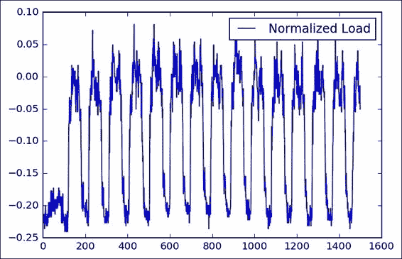
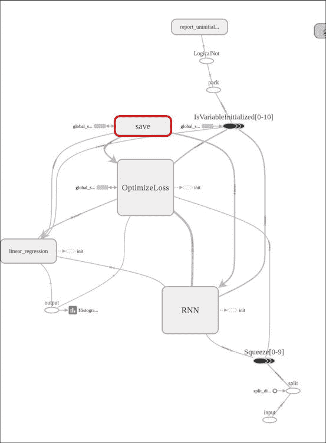
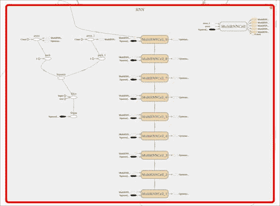
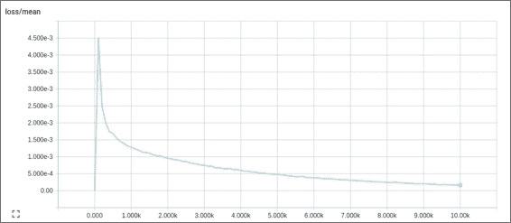
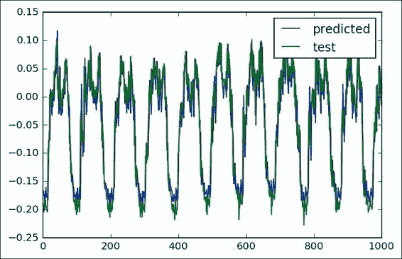

# 示例 1 -- 能耗数据的单变量时间序列预测

在此示例中，我们将解决回归域的问题。 我们将要处理的数据集是一个周期内对一个家庭的许多功耗量度的汇总。 正如我们可以推断的那样，这种行为很容易遵循以下模式（当人们使用微波炉准备早餐时，这种行为会增加，醒来后的电脑数量会有所增加，下午可能会有所减少，而到了晚上，一切都会增加。 灯，从午夜开始直到下一个起床时间减少为零）。

因此，让我们尝试在一个示例案例中对此行为进行建模。

## 数据集说明和加载

在此示例中，我们将使用 [Artur Trindade](https://archive.ics.uci.edu/ml/datasets/ElectricityLoadDiagrams20112014) 的电力负荷图数据集。

这是原始数据集的描述：

> 数据集没有缺失值。 每 15 分钟以 kW 为单位的值。 要以 kWh 为单位转换值，必须将值除以 4。每一列代表一个客户端。 在 2011 年之后创建了一些客户。在这些情况下，消费被视为零。 所有时间标签均以葡萄牙语小时为单位。 但是，整天呈现 96 个小节（24 * 15）。 每年 3 月的时间更改日（只有 23 小时），所有时间点的凌晨 1:00 和 2:00 之间均为零。 每年 10 月的时间变更日（有 25 个小时），上午 1:00 和凌晨 2:00 之间的值合计消耗两个小时。

为了简化我们的模型描述，我们仅对一位客户进行了完整的测量，并将其格式转换为标准 CSV。 它位于本章代码文件夹的数据子文件夹中

使用以下代码行，我们将打开并表示客户的数据：

```py
import pandas as pd 
from matplotlib import pyplot as plt
df = pd.read_csv("data/elec_load.csv", error_bad_lines=False)
plt.subplot()
plot_test, = plt.plot(df.values[:1500], label='Load')
plt.legend(handles=[plot_test])
```


我看一下这种表示形式（我们看一下前 1500 个样本），我们看到了一个初始瞬态状态，可能是在进行测量时可能出现的状态，然后我们看到了一个清晰的高，低功耗水平的循环。

从简单的观察中，我们还可以看到冰柱或多或少是 100 个样本的，非常接近该数据集每天的 96 个样本。

## 数据集预处理

为了确保反向传播方法更好的收敛性，我们应该尝试对输入数据进行正则化。

因此，我们将应用经典的缩放和居中技术，减去平均值，然后按最大值的底数进行缩放。

为了获得所需的值，我们使用熊猫`describe()`方法。

```py
                Load 
count  140256.000000 
mean      145.332503 
std        48.477976 
min         0.000000 
25%       106.850998 
50%       151.428571 
75%       177.557604 
max       338.218126 

```



## 建模架构

在这里，我们将简要描述将尝试对电力消耗变化进行建模的架构：

最终的架构基本上由 10 个成员串联的 LSTM 多单元组成，该单元的末尾具有线性回归或变量，对于给定的历史记录，它将线性单元数组输出的结果转换为最终的实数。 值（在这种情况下，我们必须输入最后 5 个值才能预测下一个）。

```py
def lstm_model(time_steps, rnn_layers, dense_layers=None): 
    def lstm_cells(layers): 
        return [tf.nn.rnn_cell.BasicLSTMCell(layer['steps'],state_is_tuple=True) 
                for layer in layers] 

    def dnn_layers(input_layers, layers): 
            return input_layers 

    def _lstm_model(X, y): 
        stacked_lstm = tf.nn.rnn_cell.MultiRNNCell(lstm_cells(rnn_layers), state_is_tuple=True) 
        x_ = learn.ops.split_squeeze(1, time_steps, X) 
        output, layers = tf.nn.rnn(stacked_lstm, x_, dtype=dtypes.float32) 
        output = dnn_layers(output[-1], dense_layers) 
        return learn.models.linear_regression(output, y) 

    return _lstm_model 

```

下图显示了主要模块，随后由学习模块进行了补充，您可以在其中看到 RNN 阶段，优化器以及输出之前的最终线性回归。



在这张图片中，我们看了 RNN 阶段，在那里我们可以观察到各个 LSTM 单元的级联，输入的挤压以及该学习包所添加的所有互补操作。



然后，我们将使用回归器完成模型的定义：

```py
regressor = learn.TensorFlowEstimator(model_fn=lstm_model( 
                                    TIMESTEPS, RNN_LAYERS, DENSE_LAYERS), n_classes=0, 
                                      verbose=2,  steps=TRAINING_STEPS, optimizer='Adagrad', 
                                      learning_rate=0.03, batch_size=BATCH_SIZE) 

```

## 损失函数说明

对于损失函数，经典回归参数均方误差将：

```py
rmse = np.sqrt(((predicted - y['test']) ** 2).mean(axis=0))
```

## 收敛性测试

在这里，我们将为当前模型运行拟合函数：

```py
regressor.fit(X['train'], y['train'], monitors=[validation_monitor], logdir=LOG_DIR) 

```

并将获得以下内容（很好）！ 错误率。 我们可以做的一项工作是避免对数据进行标准化，并查看平均误差是否相同（注意：不是，差很多）

这是我们将获得的简单控制台输出：

```py
MSE: 0.001139 

```

这是生成的损耗/均值图形，它告诉我们误差在每次迭代中如何衰减：



## 结果描述

现在我们可以得到真实测试值和预测值的图形，在图形中我们可以看到平均误差表明我们的递归模型具有很好的预测能力：



## 完整源代码

以下是完整的源代码：

```py

import numpy as np 
import pandas as pd 
import tensorflow as tf 
from matplotlib import pyplot as plt 

from tensorflow.python.framework import dtypes 
from tensorflow.contrib import learn 

import logging 
logging.basicConfig(level=logging.INFO) 

from tensorflow.contrib import learn 
from sklearn.metrics import mean_squared_error 

LOG_DIR = './ops_logs' 
TIMESTEPS = 5 
RNN_LAYERS = [{'steps': TIMESTEPS}] 
DENSE_LAYERS = None 
TRAINING_STEPS = 10000 
BATCH_SIZE = 100 
PRINT_STEPS = TRAINING_STEPS / 100 

def lstm_model(time_steps, rnn_layers, dense_layers=None): 
    def lstm_cells(layers): 
        return [tf.nn.rnn_cell.BasicLSTMCell(layer['steps'],state_is_tuple=True) 
                for layer in layers] 

    def dnn_layers(input_layers, layers): 
            return input_layers 

    def _lstm_model(X, y): 
        stacked_lstm = tf.nn.rnn_cell.MultiRNNCell(lstm_cells(rnn_layers), state_is_tuple=True) 
        x_ = learn.ops.split_squeeze(1, time_steps, X) 
        output, layers = tf.nn.rnn(stacked_lstm, x_, dtype=dtypes.float32) 
        output = dnn_layers(output[-1], dense_layers) 
        return learn.models.linear_regression(output, y) 

    return _lstm_model 

regressor = learn.TensorFlowEstimator(model_fn=lstm_model(TIMESTEPS, RNN_LAYERS, DENSE_LAYERS), n_classes=0, 
                                      verbose=2,  steps=TRAINING_STEPS, optimizer='Adagrad', 
                                      learning_rate=0.03, batch_size=BATCH_SIZE) 

df = pd.read_csv("data/elec_load.csv", error_bad_lines=False) 
plt.subplot() 
plot_test, = plt.plot(df.values[:1500], label='Load') 
plt.legend(handles=[plot_test]) 

print df.describe() 
array=(df.values- 147.0) /339.0 
plt.subplot() 
plot_test, = plt.plot(array[:1500], label='Normalized Load') 
plt.legend(handles=[plot_test]) 

listX = [] 
listy = [] 
X={} 
y={} 

for i in range(0,len(array)-6): 
    listX.append(array[i:i+5].reshape([5,1])) 
    listy.append(array[i+6]) 

arrayX=np.array(listX) 
arrayy=np.array(listy) 

X['train']=arrayX[0:12000] 
X['test']=arrayX[12000:13000] 
X['val']=arrayX[13000:14000] 

y['train']=arrayy[0:12000] 
y['test']=arrayy[12000:13000] 
y['val']=arrayy[13000:14000] 

# print y['test'][0] 
# print y2['test'][0] 

#X1, y2 = generate_data(np.sin, np.linspace(0, 100, 10000), TIMESTEPS, seperate=False) 
# create a lstm instance and validation monitor 
validation_monitor = learn.monitors.ValidationMonitor(X['val'], y['val'], 
                                                      every_n_steps=PRINT_STEPS, 
                                                      early_stopping_rounds=1000) 

regressor.fit(X['train'], y['train'], monitors=[validation_monitor], logdir=LOG_DIR) 

predicted = regressor.predict(X['test']) 
rmse = np.sqrt(((predicted - y['test']) ** 2).mean(axis=0)) 
score = mean_squared_error(predicted, y['test']) 
print ("MSE: %f" % score) 

#plot_predicted, = plt.plot(array[:1000], label='predicted') 

plt.subplot() 
plot_predicted, = plt.plot(predicted, label='predicted') 

plot_test, = plt.plot(y['test'], label='test') 
plt.legend(handles=[plot_predicted, plot_test]) 

```