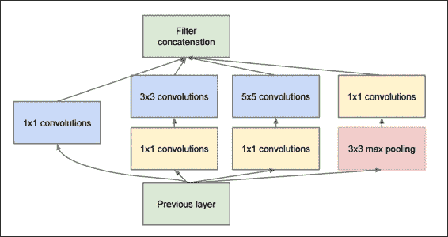
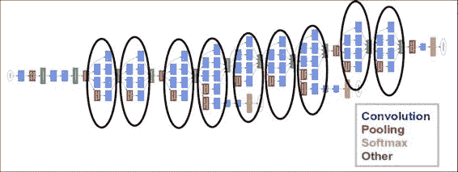

# Alexnet

经过几年的中断（即使 LeCun 继续将其网络应用到其他任务，例如人脸和物体识别），可用结构化数据和原始处理能力的指数增长，使团队得以增长和调整模型， 在某种程度上被认为是不可能的，因此可以增加模型的复杂性，而无需等待数月的训练。

来自许多技术公司和大学的计算机研究团队开始竞争一些非常艰巨的任务，包括图像识别。 对于以下挑战之一，即 Imagenet 分类挑战，开发了 Alexnet 架构：

Alexnet 架构

## 主要功能

从其第一层具有卷积运算的意义上讲，Alexnet 可以看作是增强的 LeNet5。 但要添加未使用过的最大池化层，然后添加一系列密集的连接层，以建立最后的输出类别概率层。 视觉几何组（VGG）模型

图像分类挑战的其他主要竞争者之一是牛津大学的 VGG。

VGG 网络架构的主要特征是它们将卷积滤波器的大小减小到一个简单的 3x3，并按顺序组合它们。

微小的卷积内核的想法破坏了 LeNet 及其后继者 Alexnet 的最初想法，后者最初使用的过滤器高达 11x11 过滤器，但复杂得多且表现低下。 过滤器大小的这种变化是当前趋势的开始：

VGG 中每层的参数编号摘要

然而，使用一系列小的卷积权重的积极变化，总的设置是相当数量的参数（数以百万计的数量级），因此它必须受到许多措施的限制。

## 原始的初始模型

在由 Alexnet 和 VGG 主导的两个主要研究周期之后，Google 凭借非常强大的架构 Inception 打破了挑战，该架构具有多次迭代。

这些迭代的第一个迭代是从其自己的基于卷积神经网络层的架构版本（称为 GoogLeNet）开始的，该架构的名称让人想起了始于网络的方法。

## GoogLenet（Inception V1）

1 启动模块

GoogLeNet 是这项工作的第一个迭代，如下图所示，它具有非常深的架构，但是它具有九个链式初始模块的令人毛骨悚然的总和，几乎没有或根本没有修改：

盗梦空间原始架构

与两年前发布的 Alexnet 相比，它是如此复杂，但它设法减少了所需的参数数量并提高了准确率。

但是，由于几乎所有结构都由相同原始结构层构建块的确定排列和重复组成，因此提高了此复杂架构的理解和可伸缩性。

## 批量归一化初始化（V2）

2015 年最先进的神经网络在提高迭代效率的同时，还存在训练不稳定的问题。

为了理解问题的构成，首先我们将记住在前面的示例中应用的简单正则化步骤。 它主要包括将这些值以零为中心，然后除以最大值或标准偏差，以便为反向传播的梯度提供良好的基线。

在训练非常大的数据集的过程中，发生的事情是，经过大量训练示例之后，不同的值振荡开始放大平均参数值，就像在共振现象中一样。 我们非常简单地描述的被称为协方差平移。

有和没有批量归一化的表现比较

这是开发批归一化技术的主要原因。

再次简化了过程描述，它不仅包括对原始输入值进行归一化，还对每一层上的输出值进行了归一化，避免了在层之间出现不稳定性之前就开始影响或漂移这些值。

这是 Google 在 2015 年 2 月发布的改进版 GoogLeNet 实现中提供的主要功能，也称为 Inception V2。