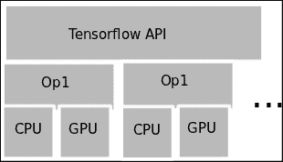

# TensorFlow 上的 GPU 支持

TensorFlow 对至少两种计算设备具有本机支持：CPU 和 GPU。 为此，它为支持的每种计算设备实现每个操作的一个版本：



## 记录设备放置和设备能力

在尝试执行计算之前，TensorFlow 允许您记录所有可用资源。 这样，我们只能将操作应用于现有的计算类型。

### 查询计算能力

为了获取机器上计算元素的日志，我们可以在创建 TensorFlow 会话时使用`log_device_placement`标志，方法是：

```py
python
>>>Import tensorflow as tf
>>>sess = tf.Session(config=tf.ConfigProto(log_device_placement=True))

```

这是命令的输出：


选择 GPU 来运行代码

此长输出主要显示了所需的不同`CUDA`库的加载，然后显示了名称（`GRID K520`）和 GPU 的计算能力。

## 选择用于计算的 CPU

如果我们有可用的 GPU，但仍想继续使用 CPU，则可以通过`tf.Graph.device`方法选择一个。

方法调用如下：

```py
tf.Graph.device(device_name_or_function) : 

```

该函数接收处理单元字符串，返回处理单元字符串的函数或不返回处理单元字符串，并返回分配了处理单元的上下文管理器。

如果参数是一个函数，则每个操作都将调用此函数来决定它将在哪个处理单元中执行，这是组合所有操作的有用元素。

### 设备命名

为了指定在指定设备时我们指的是哪个计算单元，TensorFlow 使用以下格式的简单方案：


设备 ID 格式

设备标识示例包括：

*   `"/cpu:0"`：计算机的第一个 CPU
*   `"/gpu:0"`：您计算机的 GPU（如果有）
*   `"/gpu:1"`：计算机的第二个 GPU，依此类推

可用时，如果没有相反指示，则使用第一个 GPU 设备。