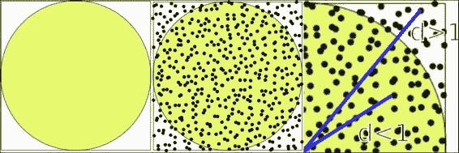
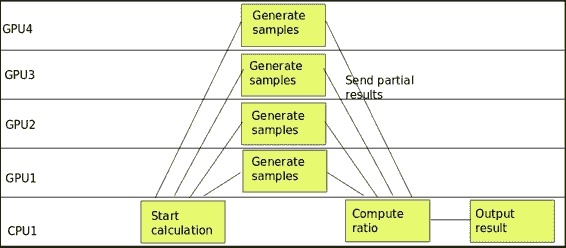

# 示例 2 -- 并行计算 Pi

该示例将作为并行处理的介绍，实现 Pi 的蒙特卡洛近似。

蒙特卡洛（Monte Carlo）利用随机数序列执行近似。

为了解决这个问题，我们将抛出许多随机样本，因为我们知道圆内的样本与正方形上的样本之比与面积比相同。



随机区域计算技术

计算假设概率分布均匀，则分配的样本数与图形的面积成比例。

我们使用以下比例：


Pi 的面积比例

从上述比例，我们可以推断出圆中的样本数/正方形的样本数也是`0.78`。

另一个事实是，我们可以为计算生成的随机样本越多，答案就越近似。 这是在增加 GPU 数量时会给我们带来更多样本和准确率。

我们做的进一步减少是我们生成（X，Y）坐标，范围从（0..1），因此随机数生成更直接。 因此，我们需要确定样本是否属于圆的唯一标准是`distance = d &lt; 1.0`（圆的半径）。

## 解决方案实现

该解决方案将基于 CPU。 它将管理服务器中拥有的 GPU 资源（在本例中为`4`），然后我们将接收结果，并进行最终的样本求和。

### 提示

注意：此方法的收敛速度非常慢，为 O（n &lt;sup class="calibre32"&gt;1/2&lt;/sup&gt; ），但由于其简单性，将作为示例。



计算任务时间表

在上图中，我们看到了计算的并行行为，即样本生成和主要活动计数。

## 源代码

源代码如下：

```py
import tensorflow as tf 
import numpy as np 
c = [] 
#Distribute the work between the GPUs 
for d in ['/gpu:0', '/gpu:1', '/gpu:2', '/gpu:3']: 
    #Generate the random 2D samples 
    i=tf.constant(np.random.uniform(size=10000), shape=[5000,2]) 
    with tf.Session() as sess: 
        tf.initialize_all_variables() 
        #Calculate the euclidean distance to the origin 
        distances=tf.reduce_sum(tf.pow(i,2),1) 
        #Sum the samples inside the circle 
        tempsum = sess.run(tf.reduce_sum(tf.cast(tf.greater_equal(tf.cast(1.0,tf.float64),distances),tf.float64))) 
        #append the current result to the results array 
        c.append( tempsum) 
    #Do the final ratio calculation on the CPU 
    with tf.device('/cpu:0'): 
        with tf.Session() as sess: 
            sum = tf.add_n(c) 
            print (sess.run(sum/20000.0)*4.0) 

```