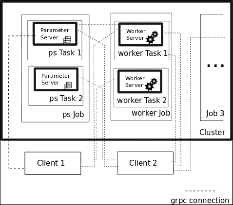
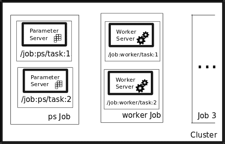

# 分布式 TensorFlow

分布式 TensorFlow 是一项补充技术，旨在轻松高效地创建计算节点集群，并以无缝方式在节点之间分配作业。

这是创建分布式计算环境以及大规模执行模型的训练和运行的标准方法，因此能够完成生产，大量数据设置中的主要任务非常重要。

## 技术组件

在本节中，我们将描述分布式 TensorFlow 计算设置上的所有组件，从最细粒度的任务元素到整个集群描述。

### 作业

作业定义了一组同类任务，通常针对解决问题领域的同一子集。

区分作业的示例有：

*   参数服务器作业，它将模型参数存储在一个单独的作业中，并负责将初始和当前参数值分配给所有分布式节点
*   工作器作业，在其中执行所有计算密集型任务

### 任务

任务是工作的细分，执行不同的步骤或并行的工作单元以解决其工作的问题区域，并且通常附加到单个过程中。

每个作业都有许多任务，它们由索引标识。 通常，索引为 0 的任务被视为主要任务或协调者任务。

### 服务器

服务器是代表专用于实现任务的一组物理设备的逻辑对象。 服务器将专门分配给一个任务。

#### 组合概述

在下图中，我们将代表集群计算设置中的所有参与部分：



TensorFlow 集群设置元素

该图包含由`ps`和 worker 作业代表的两个作业，以及可以从客户端为其创建的 grpc 通讯通道（在附录 A-库安装和附加提示中介绍）。 对于每种作业类型，都有服务器执行不同的任务，从而解决了作业域问题的子集。

### 创建一个 TensorFlow 集群

分布式集群程序的第一个任务是定义和创建一个 ClusterSpec 对象，该对象包含真实服务器实例的地址和端口，它们将成为集群的一部分。

定义此 ClusterSpec 的两种主要方法是：

*   创建一个`tf.train.ClusterSpec`对象，该对象指定所有群集任务
*   在创建`tf.train.Server`时，传递上述 ClusterSpec 对象，并将本地任务与作业名称和任务索引相关联

#### ClusterSpec 定义格式

ClusterSpec 对象是使用协议缓冲区格式定义的，该格式是基于 JSON 的特殊格式。

格式如下：

```py
{ 
    "job1 name": [ 
        "task0 server uri", 
        "task1 server uri" 
         ... 
    ] 
... 
    "jobn name"[ 
        "task0 server uri", 
        "task1 server uri" 
    ]}) 
... 

```

因此，这将是使用参数服务器任务服务器和三个工作者任务服务器创建集群的函数调用：

```py
tf.train.ClusterSpec({ 
    "worker": [ 
        "wk0.example.com:2222", 
        "wk1.example.com:2222", 
        "wk2.example.com:2222" 
    ], 
    "ps": [ 
        "ps0.example.com:2222", 
    ]}) 

```

#### 创建`tf.Train.Server`

创建 ClusterSpec 之后，我们现在可以在运行时准确了解集群配置。 我们将继续创建本地服务器实例，并创建一个`tf.train.Server`实例：

这是一个示例服务器创建，它使用集群对象，作业名称和任务索引作为参数：

```py
server = tf.train.Server(cluster, job_name="local", task_index=[Number of server]) 

```

## 集群操作 -- 将计算方法发送到任务

为了开始学习集群的操作，我们需要学习计算资源的寻址。

首先，我们假设我们已经创建了一个集群，它具有不同的作业和任务资源。 任何资源的 ID 字符串具有以下形式：


上下文管理器中资源的常规调用是 with 关键字，具有以下结构。

```py
with tf.device("/job:ps/task:1"): 
  [Code Block] 

```

with 关键字指示在需要任务标识符时，将使用上下文管理器指令中指定的任务标识符。

下图说明了一个示例集群设置，其中包含设置的所有不同部分的地址名称：



服务器元素命名

### 分布式示例代码结构

此示例代码将向您显示解决集群中不同任务的程序的大致结构，特别是参数服务器和辅助作业：

```py
#Address the Parameter Server task 
with tf.device("/job:ps/task:1"): 
  weights = tf.Variable(...) 
  bias = tf.Variable(...) 

#Address the Parameter Server task 
with tf.device("/job:worker/task:1"): 
    #... Generate and train a model 
  layer_1 = tf.nn.relu(tf.matmul(input, weights_1) + biases_1) 
  logits = tf.nn.relu(tf.matmul(layer_1, weights_2) + biases_2) 
  train_op = ... 

#Command the main task of the cluster 
with tf.Session("grpc://worker1.cluster:2222") as sess: 
  for i in range(100): 
    sess.run(train_op) 

```