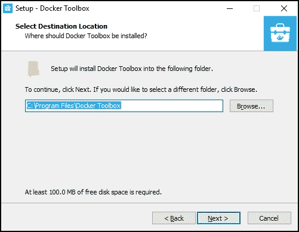

# Windows 安装

现在轮到 Windows 操作系统了。 首先，我们必须说这不是 TensorFlow 生态系统的首选，但是我们绝对可以使用 Windows 操作系统进行开发。

## 经典 Docker 工具箱方法

此方法使用经典的工具箱方法，该方法可用于大多数最新的 Windows 版本（从 Windows 7 开始，始终使用 64 位操作系统）。

### 提示

为了使 Docker（特别是 VirtualBox）正常工作，您需要安装 VT-X 扩展。 这是您需要在 BIOS 级别执行的任务。

### 安装步骤

在这里，我们将列出在 Windows 中通过 Docker 安装`tensorflow`所需的不同步骤。

#### 下载 Docker 工具箱安装程序

安装程序的当前 URL 位于[此链接](https://github.com/docker/toolbox/releases/download/v1.12.0/DockerToolbox-1.12.0.exe)。

执行安装程序后，我们将看到第一个安装屏幕：


Docker Toolbox 安装第一个屏幕



Docker 工具箱安装程序路径选择器

然后，选择安装中需要的所有组件：


Docker Toolbox 软件包选择屏幕

完成各种安装操作后，我们的 Docker 安装将准备就绪：


Docker 工具箱安装最终屏幕

#### 创建 Docker 机器

为了创建初始机器，我们将在 Docker Terminal 中执行以下命令：

```py
docker-machine create vdocker -d virtualbox

```


Docker 初始映像安装

然后，在命令窗口中，键入以下内容：

```py
FOR /f "tokens=*" %i IN ('docker-machine env --shell cmd vdocker') DO %i docker run -it b.gcr.io/tensorflow/tensorflow

```

这将打印并读取运行最近创建的虚拟机所需的许多变量。

最后，要安装`tensorflow`容器，请像在 Linux 控制台上一样从同一控制台进行操作：

```py
docker run -it -p 8888:8888 gcr.io/tensorflow/tensorflow

```

### 提示

如果您不想执行 Jupyter，但想直接启动到控制台，则可以通过以下方式运行 Docker 映像：

```py
run -it -p 8888:8888 gcr.io/tensorflow/tensorflow bash

```