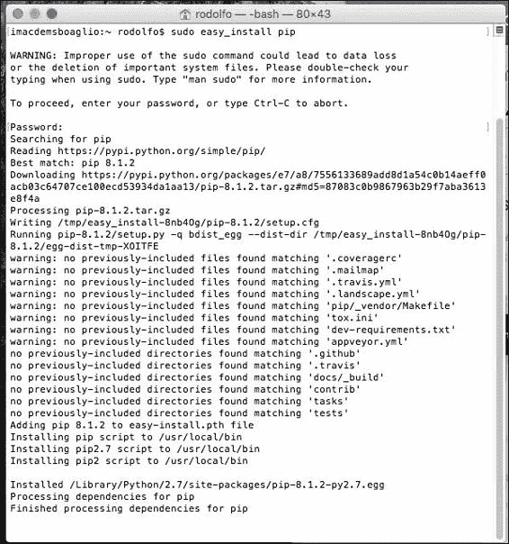
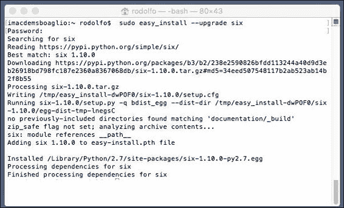
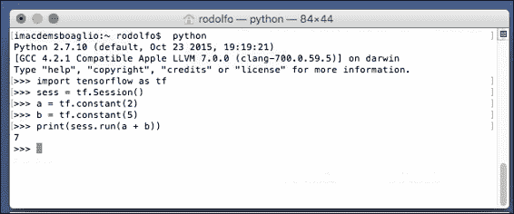

# MacOS X 安装

现在转到在 MacOS X 上进行安装。安装过程与 Linux 非常相似。 它们基于 OS X El Capitan 版本。 我们还将参考不支持 GPU 的 2.7 版 Python。

安装要求安装用户具有 sudo 特权。

## 安装点

在此步骤中，我们将使用`easy_install`软件包管理器安装 pip 软件包管理器，该软件包管理器包含在安装工具 Python 软件包中，并且默认情况下包含在操作系统中。

对于此安装，我们将在终端中执行以下操作：

```py
$ sudo easy_install pip

```



然后，我们将安装六个模块，这是一个兼容性模块，可帮助 Python 2 程序支持 Python 3 编程：

要安装`six`，我们执行以下命令：

```py
sudo easy_install --upgrade six

```



在安装`six`软件包之后，我们通过执行以下命令来继续安装`tensorflow`软件包：

```py
sudo pip install -ignore-packages six https://storage.googleapis.com/tensorflow/mac/cpu/tensorflow-0.10.0-py2-none-any.whl

```


然后我们调整`numpy`包的路径，这在 El Capitan 中是必需的：

```py
sudo easy_install numpy

```


现在我们准备导入`tensorflow`模块并运行一些简单的示例：

