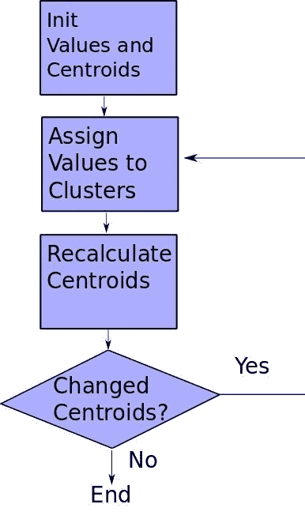
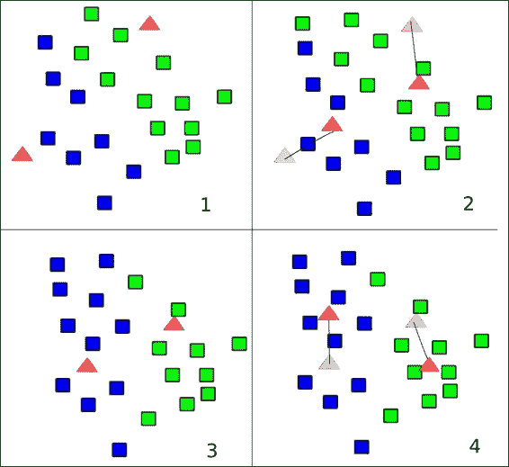

# k 均值

k-means 是一种非常流行的聚类算法，可以轻松实现。 这非常简单，将它作为具有良好类分离性的数据集的第一个过程应用，可以对数据有很好的先验理解。

## k 均值的力学

k 均值尝试使用成员的平均值作为主要指标，将一组样本分成 k 个不相交的组或簇。 这一点通常称为质心，指代具有相同名称的算术实体，并表示为任意尺寸空间中的向量。

k 均值是一种幼稚的方法，因为它通过查找适当的质心而起作用，但是不知道先验簇的数量是多少。

为了评估多少簇能够很好地表示所提供的数据，Elbow 方法是一种比较流行的方法。

### 算法迭代准则

此方法的标准和目标是最小化从群集成员到所有包含群集的样本的实际质心的平方距离之和。 这也称为惯性最小化。

k 均值的误差最小化准则

## k 均值算法细分

k-means 算法的机制可以通过以下流程图总结：

k 均值过程的简化流程图

该算法可以简化如下：

1.  我们从未分类的样本开始，以 k 个元素为起始质心。 为了简洁起见，也可以简化此算法，使元素列表中的第一个元素成为第一个元素。
2.  然后，我们计算样本与首先选择的样本之间的距离，并获得第一个计算出的质心（或其他代表值）。 您可以看到图中的质心向着更常识的质心移动。
3.  形心更改后，它们的位移将引起各个距离发生更改，因此群集成员身份可能会更改。
4.  这是我们重新计算质心并在不满足停止条件的情况下重复第一步的时候。

停止条件可以有多种类型：

*   在 N 次迭代之后，可能是要么我们选择了一个非常大的数，然后我们将进行不必要的计算，否则它可能会收敛得很慢，并且如果质心没有非常稳定的方法，我们将得到非常令人难以置信的结果。 如果我们有一个很长的迭代过程，那么这个停止条件也可以作为最后的手段。
*   参考先前的平均结果，可能的更好的迭代收敛标准是看重心的变化，无论是在总位移还是总簇元切换中。 最后一个通常被使用，因此一旦没有更多元素从其当前群集更改为另一个群集，我们将停止该过程。

k 均值简化图形

### k 均值的优缺点

这种方法的优点是：

*   它可以很好地扩展（大多数计算可以并行运行）
*   它已经被用于很多应用中

但是，简单性也要付出代价（没有适用的规则）：

*   它需要先验知识（可能的簇数应事先知道）
*   离群值可以推入质心的值，因为它们的值与任何其他样本相同
*   由于我们假设该图是凸且各向同性的，因此对于非圆形定界簇来说效果不佳