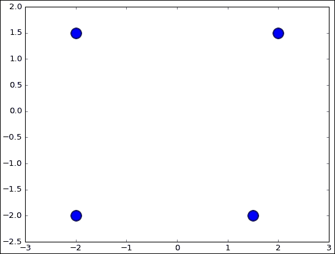
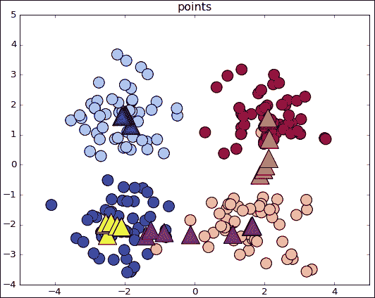

# 二、聚类

在本章中，我们将开始应用在上一章中学到的数据转换操作，并开始使用聚类技术在某些给定信息中找到有趣的模式，发现数据组或集群。

在此过程中，我们还将获得两个新工具：能够通过 scikit-learn 库从一组代表性数据结构中生成合成样本集，并且能够通过 matplotlib 库以图形方式绘制我们的数据和模型结果 。

我们将在本章中介绍的主题如下：

*   了解群集的工作原理，并将其与替代的现有分类技术进行比较
*   使用 scikit-learn 和 matplotlib 丰富数据集选择的可能性，并获得看起来专业的数据图形表示
*   实现 k 均值聚类算法
*   实现最近邻法，并将结果与​​k 均值进行比较

# 从数据中学习 -- 无监督学习

在本章中，我们将回顾两种无监督学习的情况。

无监督学习基本上包括在先前的数据集中查找模式。 通常，很少或没有信息提供给该技术，并且该过程应该能够自动确定信息的组织方式，并识别数据组织中的不同结构。

# 聚类

最初可用于未标记数据集的最简单的操作之一是尝试了解数据集成员共同特征的可能组。

为此，可以将数据集划分为任意数量的段，其中每个段都可以表示为中心质量（质心）点，该点代表属于已确定组或聚类的点。

为了定义将同一组分配给不同组成员的标准，我们需要定义一个表示数据元素之间距离的概念，因此我们可以简单地说，所有类成员比任何其他质心更接近自己的质心 。

在下图中，我们可以看到典型聚类算法的结果以及聚类中心的表示形式：


样本聚类算法输出

# k 均值

k-means 是一种非常流行的聚类算法，可以轻松实现。 这非常简单，将它作为具有良好类分离性的数据集的第一个过程应用，可以对数据有很好的先验理解。

## k 均值的力学

k 均值尝试使用成员的平均值作为主要指标，将一组样本分成 k 个不相交的组或簇。 这一点通常称为质心，指代具有相同名称的算术实体，并表示为任意尺寸空间中的向量。

k 均值是一种幼稚的方法，因为它通过查找适当的质心而起作用，但是不知道先验簇的数量是多少。

为了评估多少簇能够很好地表示所提供的数据，Elbow 方法是一种比较流行的方法。

### 算法迭代准则

此方法的标准和目标是最小化从群集成员到所有包含群集的样本的实际质心的平方距离之和。 这也称为惯性最小化。


k 均值的误差最小化准则


## k 均值算法细分

k-means 算法的机制可以通过以下流程图总结：


k 均值过程的简化流程图

该算法可以简化如下：

1.  我们从未分类的样本开始，以 k 个元素为起始质心。 为了简洁起见，也可以简化此算法，使元素列表中的第一个元素成为第一个元素。
2.  然后，我们计算样本与首先选择的样本之间的距离，并获得第一个计算出的质心（或其他代表值）。 您可以看到图中的质心向着更常识的质心移动。
3.  形心更改后，它们的位移将引起各个距离发生更改，因此群集成员身份可能会更改。
4.  这是我们重新计算质心并在不满足停止条件的情况下重复第一步的时候。

停止条件可以有多种类型：

*   在 N 次迭代之后，可能是要么我们选择了一个非常大的数，然后我们将进行不必要的计算，否则它可能会收敛得很慢，并且如果质心没有非常稳定的方法，我们将得到非常令人难以置信的结果。 如果我们有一个很长的迭代过程，那么这个停止条件也可以作为最后的手段。
*   参考先前的平均结果，可能的更好的迭代收敛标准是看重心的变化，无论是在总位移还是总簇元切换中。 最后一个通常被使用，因此一旦没有更多元素从其当前群集更改为另一个群集，我们将停止该过程。


k 均值简化图形

### k 均值的优缺点

这种方法的优点是：

*   它可以很好地扩展（大多数计算可以并行运行）
*   它已经被用于很多应用中

但是，简单性也要付出代价（没有适用的规则）：

*   它需要先验知识（可能的簇数应事先知道）
*   离群值可以推入质心的值，因为它们的值与任何其他样本相同
*   由于我们假设该图是凸且各向同性的，因此对于非圆形定界簇来说效果不佳

# k 最近邻

k 最近邻（k-nn）是一种简单的经典聚类方法，它将很好地介绍此类技术，着眼于每个样本的附近，并假设每个新样本都应属于的类别。 已经知道的数据点。


## k 最近邻的力学

k-nn 可以在我们的多种配置中实现，但是在本章中，我们将使用“半监督”方法。 我们将从一定数量的已分配样本开始，稍后我们将根据训练集的特征猜测集群成员。


最近邻算法

在上图中，我们可以看到该算法的细分。 可以通过以下步骤进行总结：

1.  我们将先前已知的样本放在数据结构上。
2.  然后，我们读取要分类的下一个样本，并计算从新样本到训练集的每个样本的欧几里得距离。
3.  我们通过根据欧几里得距离选择最近的样本的类别来确定新元素的类别。 k-nn 方法需要对 k 个最接近的样本进行投票。
4.  我们重复该过程，直到没有剩余的样本为止。

### k-nn 的优缺点

这种方法的优点是：

*   简单; 无需调整参数
*   没有正规训练； 我们只需要更多的训练实例来改进模型

缺点：

*   计算昂贵（必须计算点与每个新样本之间的所有距离）

## 有用库的实用示例

在以下各节中，我们将讨论一些有用的库。

### matplotlib 绘图库

数据绘图是数据科学学科不可或缺的一部分。 因此，我们需要一个非常强大的框架来绘制结果。 对于此任务，我们没有在 TensorFlow 中实现的通用解决方案，我们将使用 matplotlib 库。

在 matplotlib 站点（`http://matplotlib.org/`）中，定义为：

> “ matplotlib 是一个 Python 2D 绘图库，它以各种硬拷贝格式和跨平台的交互式环境生成出版物质量的图形。”

#### 合成样本的数据绘图

在此示例中，我们将生成一个包含 100 个随机数的列表，生成样本图，并将结果保存在图形文件中：

```py
    import tensorflow as tf
    import numpy as np
    import matplotlib.pyplot as plt
    with tf.Session() as sess:
        fig, ax = plt.subplots()
        ax.plot(tf.random_normal([100]).eval(), tf.random_normal([100] ).eval(),'o')
        ax.set_title('Sample random plot for TensorFlow')
        plt.savefig("result.png")

```

这是结果图像：


使用 TensorFlow 和 matplotlib 生成的示例图

### 提示

为了查看 scikit 数据集模块的更一般的解释，请参考 [matplotlib.org](http://matplotlib.org/)。

### scikit-learn 数据集模块

TensorFlow 当前未实现用于轻松生成合成数据集的方法。 因此，我们将使用`sklearn`库作为帮助程序。

#### 关于 scikit-learn 库

[从其网站](http://scikit-learn.org/stable/)：

> “ scikit-learn（以前为 scikits.learn）是针对 Python 编程语言的开源机器学习库。它具有各种分类，回归和聚类模型，旨在与 Python 数字和科学库 NumPy 和 SciPy 互操作。”

在此示例中，我们将使用数据集模块，该模块处理许多众所周知的合成和现场提取的数据集的生成和加载。

### 提示

为了查看 scikit 数据集模块的更一般的解释，请参考[此链接](http://scikit-learn.org/stable/datasets/)。

### 合成数据集类型

我们将使用一些生成的数据集类型：


Blob，圆和月亮数据集类型

### Blob 数据集

该数据集是测试简单聚类算法的理想选择。 不会出现问题，因为数据是一致地分组的，并且类别的分离很明确。

#### 采用的方法

以下方法用于所采用的方法：

```py
sklearn.datasets.make_blobs(n_samples=100, n_features=2,  centers=3, cluster_std=1.0, center_box=(-10.0, 10.0),  shuffle=True, random_state=None) 

```

在这里，`n_samples`是数据总数，`n_features`是数据的列数或特征数，`centers`是中心列表或许多随机中心，`cluster_std`是标准偏差，`center_box`是随机生成中心时每个聚类中心的边界框，`shuffle`指示是否必须对样本进行混洗，`random_state`是随机种子。

### 圆圈数据集

这是在其他圆圈中具有圆圈的数据集。 这是一个非线性的，可分离的问题，因此需要通过非线性模型来解决。 这排除了诸如 k 均值的简单算法。 在本章中，我们将尝试使用它来阐明观点。

#### 采用的方法

以下方法用于所采用的方法：

```py
sklearn.datasets.make_circles(n_samples=100,shuffle=True,noise=None, random_state=None,factor=0.8) 

```

在这里，`n_samples`是数据总数，`shuffle`表示是否必须对样本进行混洗，`noise`是要应用于循环数据的随机量的数量，`random_state`是随机种子，并且`factor`是圆之间的比例因子。

### 月亮数据集

这是另一个非线性问题，但是具有另一种类型的类分离，因为没有诸如圆环之类的闭合。

# 项目 1 -- 在合成数据集上进行 k 均值聚类

## 数据集说明和加载

在本章中，我们将使用生成的数据集，这些数据集经过特殊设计以具有特殊的属性。 目标属性中的两个是类别线性分离的可能性以及是否存在明显分离的群集。

### 生成数据集

通过这些行，我们创建了数据结构，其中将包含用于解决方案的所有元素，即：

```py
centers = [(-2, -2), (-2, 1.5), (1.5, -2), (2, 1.5)] 
data, features = make_blobs (n_samples=200, centers=centers, n_features = 2, cluster_std=0.8, shuffle=False, random_state=42) 

```

通过 matplotlib 绘制数据集图：

```py
    ax.scatter(np.asarray(centers).transpose()[0], np.asarray(centers).transpose()[1], marker = 'o', s = 250)
    plt.plot()

```

## 模型架构

points 变量包含数据集点的 2D 坐标，质心变量将包含组中心点的坐标，`cluster_assignments`变量包含每个数据元素的质心索引。

例如，`cluster_assignments[2] = 1`表示`data[2]`数据点属于具有中心重心`1`的群集。 重心`1`的位置位于`centroids[1]`中。

```py
points=tf.Variable(data) 
cluster_assignments = tf.Variable(tf.zeros([N], dtype=tf.int64)) 
centroids = tf.Variable(tf.slice(points.initialized_value(), [0,0], [K,2])) 

```

然后，我们可以使用 matplotlib 绘制这些质心的位置：

```py
fig, ax = plt.subplots() 
ax.scatter(np.asarray(centers).transpose()[0], np.asarray(centers).transpose()[1], marker = 'o', s = 250) 
plt.show() 

```


初始中心播种

## 损失函数描述和优化器循环

然后，我们将对所有质心进行 N 份复制，对每个点进行 K 份复制，对每个点进行 N x K 份复制，因此我们可以针对每个维度计算出每个点与每个质心之间的距离：

```py
rep_centroids = tf.reshape(tf.tile(centroids, [N, 1]), [N, K, 2]) 
rep_points = tf.reshape(tf.tile(points, [1, K]), [N, K, 2]) 
sum_squares = tf.reduce_sum(tf.square(rep_points - rep_centroids),  
reduction_indices=2) 

```

然后，我们对所有维度执行总和，并获得最低总和的索引（这将是分配给每个点的质心或聚类的索引）：

```py
best_centroids = tf.argmin(sum_squares, 1) 

```

质心也将使用完整源代码中定义的`bucket:mean`函数进行更新。

## 停止条件

这是新质心和分配不变的停止条件：

```py
did_assignments_change = tf.reduce_any(tf.not_equal(best_centroids, cluster_assignments)) 

```

在这里，我们使用`control_dependencies`来计算是否需要更新质心：

```py
with tf.control_dependencies([did_assignments_change]): 
    do_updates = tf.group( 
    centroids.assign(means), 
    cluster_assignments.assign(best_centroids)) 

```

## 结果描述

程序执行后，我们得到以下输出：


这是一轮迭代后质心变化的汇总图，其中绘制了从算法生成的原始聚类。

在下图中，我们针对这种明显分离的情况表示了 k 均值算法在应用中的不同阶段：


每次迭代的质心变化

## 完整源代码

以下是完整的源代码：

```py
import tensorflow as tf 
import numpy as np 
import time 

import matplotlib 
import matplotlib.pyplot as plt 

from sklearn.datasets.samples_generator import make_blobs 
from sklearn.datasets.samples_generator import make_circles 

DATA_TYPE = 'blobs' 

# Number of clusters, if we choose circles, only 2 will be enough 
if (DATA_TYPE == 'circle'): 
    K=2 
else: 
    K=4 

# Maximum number of iterations, if the conditions are not met 
MAX_ITERS = 1000 

start = time.time() 

centers = [(-2, -2), (-2, 1.5), (1.5, -2), (2, 1.5)] 
if (DATA_TYPE == 'circle'): 
    data, features = make_circles(n_samples=200, shuffle=True, noise= 0.01, factor=0.4) 
else: 
    data, features = make_blobs (n_samples=200, centers=centers, n_features = 2, cluster_std=0.8, shuffle=False, random_state=42) 

fig, ax = plt.subplots() 
ax.scatter(np.asarray(centers).transpose()[0], np.asarray(centers).transpose()[1], marker = 'o', s = 250) 
plt.show() 

fig, ax = plt.subplots() 
if (DATA_TYPE == 'blobs'): 
ax.scatter(np.asarray(centers).transpose()[0], np.asarray(centers).transpose()[1], marker = 'o', s = 250) 
ax.scatter(data.transpose()[0], data.transpose()[1], marker = 'o', s = 100, c = features, cmap=plt.cm.coolwarm ) 
plt.plot() 

points=tf.Variable(data) 
cluster_assignments = tf.Variable(tf.zeros([N], dtype=tf.int64)) 
centroids = tf.Variable(tf.slice(points.initialized_value(), [0,0], [K,2])) 

sess = tf.Session() 
sess.run(tf.initialize_all_variables()) 

rep_centroids = tf.reshape(tf.tile(centroids, [N, 1]), [N, K, 2]) 
rep_points = tf.reshape(tf.tile(points, [1, K]), [N, K, 2]) 
sum_squares = tf.reduce_sum(tf.square(rep_points - rep_centroids),  
reduction_indices=2) 
best_centroids = tf.argmin(sum_squares, 1) 

did_assignments_change = tf.reduce_any(tf.not_equal(best_centroids, cluster_assignments)) 

def bucket_mean(data, bucket_ids, num_buckets): 
total = tf.unsorted_segment_sum(data, bucket_ids, num_buckets) 
count = tf.unsorted_segment_sum(tf.ones_like(data), bucket_ids, num_buckets) 
return total / count 

means = bucket_mean(points, best_centroids, K) 

with tf.control_dependencies([did_assignments_change]): 
do_updates = tf.group( 
centroids.assign(means), 
cluster_assignments.assign(best_centroids)) 

changed = True 
iters = 0 

fig, ax = plt.subplots() 
if (DATA_TYPE == 'blobs'): 
    colourindexes=[2,1,4,3] 
else: 
    colourindexes=[2,1] 
while changed and iters < MAX_ITERS: 
fig, ax = plt.subplots() 
iters += 1 
[changed, _] = sess.run([did_assignments_change, do_updates]) 
[centers, assignments] = sess.run([centroids, cluster_assignments]) 
ax.scatter(sess.run(points).transpose()[0], sess.run(points).transpose()[1], marker = 'o', s = 200, c = assignments, cmap=plt.cm.coolwarm ) 
ax.scatter(centers[:,0],centers[:,1], marker = '^', s = 550, c = colourindexes, cmap=plt.cm.plasma) 
ax.set_title('Iteration ' + str(iters)) 
plt.savefig("kmeans" + str(iters) +".png") 

ax.scatter(sess.run(points).transpose()[0], sess.run(points).transpose()[1], marker = 'o', s = 200, c = assignments, cmap=plt.cm.coolwarm ) 
plt.show() 

end = time.time() 
print ("Found in %.2f seconds" % (end-start)), iters, "iterations" 
print "Centroids:" 
print centers 
print "Cluster assignments:", assignments 

```

这是观察算法机制的最简单情况。 当数据来自真实世界时，这些类通常没有那么清晰地分开，并且标记数据样本更加困难。

## 圆合成数据上的 k 均值

对于圆图，我们观察到这种数据表征并不容易用一组简单的方法表示。 如图所示，两个圆要么共享一个质心的位置，要么真的很接近，因此我们无法预测明确的结果：



圆型数据集

对于此数据集，我们仅使用两个类来确保了解此算法的主要缺点：


k 均值应用于圆形综合数据集

如我们所见，初始中心向样本数量最集中的区域漂移，因此将数据线性划分。 这是我们现阶段使用的简单模型的局限性之一。 为了处理非线性可分离性样本，我们可以尝试本章范围以外的其他统计方法，例如基于密度的带噪应用空间聚类（DBSCAN）。

# 项目 2 -- 综合数据集上的最近邻

在这个项目中，我们将加载一个数据集，使用该数据集，以前的算法（k 均值）在分离类时遇到问题。

## 数据集生成

该数据集是第一个示例中具有两个类的相同循环类数据集，但是这次我们将通过增加一些噪声（从`0.01`到`0.12`）来增加错误概率：

```py
data, features = make_circles(n_samples=N, shuffle=True, noise=0.12,factor=0.4)

```

这是生成的训练数据图：



## 模型架构

将保留数据的变量只是原始数据和测试列表，其中将包含计算出的测试数据类：

```py
data, features = make_circles(n_samples=N, shuffle=True, noise= 0.12, factor=0.4)
tr_data, tr_features= data[:cut], features[:cut]
te_data,te_features=data[cut:], features[cut:]
test=[]

```

## 损失函数说明

在聚类中，我们将使用函数来优化为欧式距离，与第 1 章，探索和转换数据相同。 它是在集群分配循环上计算的，获取从新点到现有训练点的距离，要求最小值的索引，然后使用该索引搜索最近的邻居的类：

```py
distances = tf.reduce_sum(tf.square(tf.sub(i , tr_data)),reduction_indices=1)
neighbor = tf.arg_min(distances,0)

```

## 停止条件

在这个简单的示例中，一旦访问了测试分区的所有元素，我们将完成操作。

## 结果描述

这是测试数据类分布的图形，在这里我们可以看到清晰分开的类。 我们可以观察到，至少在此有限的数据集范围内，此方法比非重叠，斑点优化，k 均值方法更好。


## 完整源代码

以下是完整的源代码：

```py
import tensorflow as tf 
import numpy as np 
import time 

import matplotlib 
import matplotlib.pyplot as plt 

from sklearn.datasets.samples_generator import make_circles 

N=210 
K=2 
# Maximum number of iterations, if the conditions are not met 
MAX_ITERS = 1000 
cut=int(N*0.7) 

start = time.time() 

data, features = make_circles(n_samples=N, shuffle=True, noise= 0.12, factor=0.4) 
tr_data, tr_features= data[:cut], features[:cut] 
te_data,te_features=data[cut:], features[cut:] 
test=[] 

fig, ax = plt.subplots() 
ax.scatter(tr_data.transpose()[0], tr_data.transpose()[1], marker = 'o', s = 100, c = tr_features, cmap=plt.cm.coolwarm ) 
plt.plot() 

sess = tf.Session() 
sess.run(tf.initialize_all_variables()) 

for i, j in zip(te_data, te_features): 
    distances = tf.reduce_sum(tf.square(tf.sub(i , tr_data)),reduction_indices=1) 
    neighbor = tf.arg_min(distances,0) 

    test.append(tr_features[sess.run(neighbor)]) 
print test 
fig, ax = plt.subplots() 
ax.scatter(te_data.transpose()[0], te_data.transpose()[1], marker = 'o', s = 100, c = test, cmap=plt.cm.coolwarm ) 
plt.plot() 

end = time.time() 
print ("Found in %.2f seconds" % (end-start)) 

print "Cluster assignments:", test 

```

# 总结

在本章中，我们简单地概述了一些我们可以实现的最基本的模型，但是尝试在解释中尽可能地详细。

从现在开始，我们将能够生成综合数据集，从而使我们能够快速测试模型对于不同数据配置的适当性，从而评估它们的优缺点，而不必加载具有大量未知特征的模型。

此外，我们已经实现了第一个迭代方法并测试了收敛性，该任务将以类似的方式在后续章节中继续进行，但是将使用更精细，更精确的方法。

在下一章中，我们将使用线性函数解决分类问题，并且首次使用训练集中的先前数据来学习其特征。 这是监督学习技术的目标，通常对于解决许多现实生活中的问题更有用。

