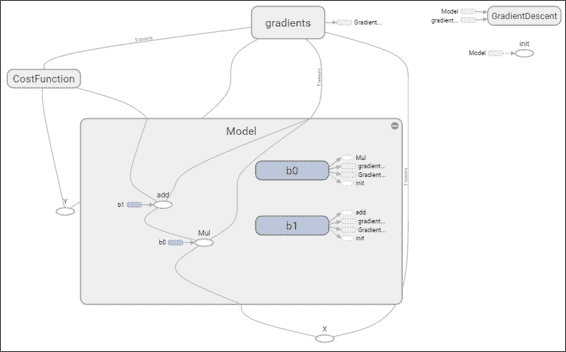
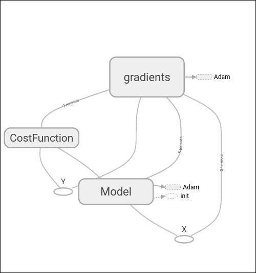
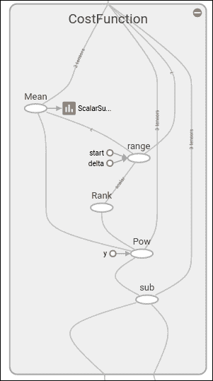

# 三、线性回归

在本章中，我们将开始应用机器学习项目中使用的所有标准步骤，以便使用一条使误差和损失函数最小化的线来拟合先前给定的数据。

在上一章中，我们看到了范围有限和许多可能解决方案的问题。 这些类型的模型还与定性评估类型相关，即基于先前的标签为样本分配标签。 通常在与社会领域有关的问题中发现该结果。

我们还可能对预测（先前建模的）函数的确切数字输出值感兴趣。 这种方法类似于物理领域，可用于在事先了解一系列历史值的情况下预测温度或湿度或某种商品的价值，这称为回归分析。

在线性回归的情况下，我们在输入变量和输出变量之间寻找线性关系表示的确定关系。

# 单变量线性建模函数

如前所述，在线性回归中，我们尝试找到一个线性方程，以最小化数据点和建模线之间的距离。

此关系可以用以下标准线性函数表示：


模型函数采用以下形式：

在这里，`ss0` 或 `bias`是截距，`x`的函数值为零，`ss1`是建模线的斜率。 变量`x`通常被称为自变量，`y`被称为因变量，但它们也可以分别称为回归变量和响应变量。

## 样本数据生成

在下面的示例中，我们将基于`ss0` = `2.0`的线，加上最大幅度为`0.4`的垂直噪声，生成近似样本随机分布。

```py
In[]: 
#Indicate the matplotlib to show the graphics inline 
%matplotlib inline  
import matplotlib.pyplot as plt # import matplotlib 
import numpy as np # import numpy 
trX = np.linspace(-1, 1, 101) # Linear space of 101 and [-1,1] 
#Create The y function based on the x axis 
trY = 2 * trX + np.random.randn(*trX.shape) * 0.4 + 0.2  
plt.figure() # Create a new figure 
plt.scatter(trX,trY) #Plot a scatter draw of the random datapoints 
# Draw one line with the line function 
plt.plot (trX, .2 + 2 * trX)
```

结果图将如下所示：


加噪声线性采样和线性函数

# 成本函数的确定

与所有机器学习技术一样，我们必须确定一个误差函数，我们需要将其最小化，这表明解决问题的适当性。

用于线性回归的最常用的`cost`函数称为最小二乘。

## 最小二乘

为了计算函数的最小二乘误差，我们通常会寻找一种测量点与建模线的接近程度的方法。 因此，我们定义了一个函数，用于测量每个元组`x[n]`和`y[n]`与建模线的对应值之间的距离。

对于 2D 回归，我们有一个数字元组`(X[0],Y[0]),(X[1],Y[1])...(X[n],Y[n])`的列表，通过最小化以下函数，可以找到`β[0]`和`β[1]`的值：


简单来说，求和代表预测值与实际值之间的欧几里得距离之和。

进行运算的原因是，平方误差的总和为我们提供了一个唯一且简单的全局数，预期数与实数之差为我们提供了适当的距离，平方幂为我们提供了一个正数，这会惩罚一个整数。 多于线性的时尚。

# 最小化成本函数

下一步是设置最小化`cost`函数的方法。 在线性演算中，定位极小值任务的基本特征之一被简化为计算函数的导数并寻找其零点。 为此，该函数必须具有导数，最好是凸的。 可以证明最小二乘函数符合这两个条件。 这对于避免已知的局部极小问题非常有用。


损失函数表示

## 最小二乘的一般最小值

我们尝试解决的问题（最小二乘）可以用矩阵形式表示：


在此，`J`是成本函数，具有以下解决方案：


在本章中，我们将使用迭代方法梯度下降，该方法将在以后的章节中以更通用的方式使用。

## 迭代方法 -- 梯度下降

梯度下降本身就是一种迭代方法，并且是机器学习领域中最常用的优化算法。 考虑到可以用它优化的参数组合的复杂性，它结合了简单的方法和良好的收敛速度。

2D 线性回归从具有随机定义的权重或线性系数乘数的函数开始。 定义第一个值后，第二步是以以下形式应用递归函数：


在该方程式中，我们可以轻松推导该方法的机理。 我们从一组初始系数开始，然后朝函数最大变化的相反方向移动。 `α`变量被称为 step，将影响我们在梯度搜索方向上移动最小的距离。

最后一步是可选地测试迭代之间的更改，并查看更改是否大于 epsilon 或检查是否达到了迭代次数。

如果函数不是凸函数，建议使用随机值多次运行梯度下降，然后选择成本值最低的系数。 在非凸函数的情况下，梯度下降最终以最小值出现，这可能是局部的。 因此，对于非凸函数，结果取决于初始值，建议将它们随机设置多次，并在所有解决方案中选择成本最低的解决方案。

# 示例部分

现在让我们讨论有用的库和模块。

## TensorFlow 中的优化器方法 -- 训练模块

训练或参数优化阶段是机器学习工作流程的重要组成部分。

为此，TensorFlow 具有一个`tf.train`模块，该模块是一组对象的帮助程序，致力于实现数据科学家所需的各种不同优化策略。 此模块提供的主要对象称为优化器。

### `tf.train.Optimizer`类

`Optimizer`类允许您为`loss`函数计算梯度并将其应用于模型的不同变量。 在最著名的算法子类中，我们找到了梯度下降，Adam 和 Adagrad。

关于该类的一个主要提示是`Optimizer`类本身无法实例化。 子类之一。

如前所述，TensorFlow 允许您以符号方式定义函数，因此梯度也将以符号方式应用，从而提高了结果的准确率以及要应用于数据的操作的通用性。

为了使用`Optimizer`类，我们需要执行以下步骤：

1.  创建具有所需参数的`Optimizer`（在这种情况下为梯度下降）。

    ```py
            opt = GradientDescentOptimizer(learning_rate= [learning rate]) 

    ```

2.  为`cost`函数创建一个调用`minimize`方法的操作。

    ```py
            optimization_op = opt.minimize(cost, var_list=[variables list]) 

    ```

`minimize`方法具有以下形式：

```py
tf.train.Optimizer.minimize(loss, global_step=None, var_list=None, gate_gradients=1, aggregation_method=None, colocate_gradients_with_ops=False, name=None) 

```

主要参数如下：

*   `loss`：这是一个张量，其中包含要最小化的值。
*   `global_step`：`Optimizer`工作后，此变量将增加 1。
*   `var_list`：包含要优化的变量。

### 提示

实际上，`optimize`方法结合了对`compute_gradients()`和`apply_gradients()`的调用。 如果要在应用梯度之前对其进行处理，请显式调用`compute_gradients()`和`apply_gradients()`，而不要使用此函数。 如果我们只想进行一步训练，就必须以`opt_op.run().`的形式执行`run`方法

### 其他优化器实例类型

以下是其他`Optimizer`实例类型：

*   `tf.train.AdagradOptimizer`：这是一种基于参数频率的自适应方法，学习率单调下降。
*   `tf.train.AdadeltaOptimizer`：这是对 Adagrad 的改进，它的学习率没有下降。
*   `tf.train.MomentumOptimizer`：这是一种适应性方法，可解决尺寸之间的不同变化率。
*   并且还有其他更具体的参数，例如`tf.train.AdamOptimizer`，`tf.train.FtrlOptimizer`和`tf.train.RMSPropOptimizer`。

# 示例 1 -- 单变量线性回归

现在，我们将在一个项目中工作，在该项目中，我们将应用前面几页中简要介绍的所有概念。 在此示例中，我们将创建一个近似线性分布； 之后，我们将创建一个回归模型，该模型试图拟合线性函数以最小化误差函数（由最小二乘法定义）。

给定一个新样本，该模型将使我们能够预测输入值的结果。

## 数据集说明

对于此示例，我们将生成一个包含线性函数并添加噪声的合成数据集：

```py
import TensorFlow as tf
import numpy as np
trX = np.linspace(-1, 1, 101)
trY = 2 * trX + np.random.randn(*trX.shape) * 0.4 + 0.2 # create a y value which is approximately linear but with some random noise

```

使用这些线，我们可以将线表示为散点图和理想线函数。

```py
import matplotlib.pyplot as plt 
plt.scatter(trX,trY) 
plt.plot (trX, .2 + 2 * trX)  

```


生成的样本和原始线性函数无噪声

## 模型架构

1.  现在，我们创建一个变量来保存`x`和`y`轴中的值。 然后，我们将模型定义为`X`和权重`w`的乘积。
2.  然后，我们生成一些变量，并为其分配初始值以启动模型：

    ```py
            In[]: 
            X = tf.placeholder("float", name="X") # create symbolic variables 
            Y = tf.placeholder("float", name = "Y") 

    ```

3.  现在，我们通过将`name_scope`声明为`Model`来定义模型。 此作用域将其包含的所有变量分组，以形成具有同类实体的唯一实体。 在此范围内，我们首先定义一个函数，该函数接收`x`轴坐标，权重（斜率）和偏差的变量。 然后，我们创建一个新变量`objects,`来保存不断变化的参数，并使用`y_model`变量实例化该模型：

    ```py
             with tf.name_scope("Model"):

               def model(X, w, b):
                 return tf.mul(X, w) + b # just define the line as X*w + b0 

               w = tf.Variable(-1.0, name="b0") # create a shared variable
               b = tf.Variable(-2.0, name="b1") # create a shared variable
               y_model = model(X, w, b)

    ```

在仪表板上，您可以看到我们一直在收集的损失函数的图像。 在图部分中，放大模型时，您可以看到求和与乘法运算，参数变量`b0`和`b1`以及应用于模型的梯度运算，如下所示：



## 成本函数描述和优化器循环

1.  在`Cost Function`中，我们创建了一个新的范围以包括该组的所有操作，并使用先前创建的`y_model`来说明用于计算损失的计算出的`y`轴值。

    ```py
            with tf.name_scope("CostFunction"): 
            cost = (tf.pow(Y-y_model, 2)) # use sqr error for cost  

    ```

2.  为了定义选择的`optimizer,`，我们初始化一个`GradientDescentOptimizer`，步骤将是`0.01`，这似乎是收敛的合理起点。

    ```py
             train_op = tf.train.GradientDescentOptimizer(0.05).minimize(cost) 

    ```

3.  现在是时候创建会话并初始化要保存在 TensorBoard 中进行查看的变量了。 在此示例中，我们将为每个迭代保存一个标量变量以及最后一个样本的误差结果。 我们还将图结构保存在文件中以供查看。

    ```py
            sess = tf.Session() 
            init = tf.initialize_all_variables()
            tf.train.write_graph(sess.graph,
              '/home/ubuntu/linear','graph.pbtxt')
            cost_op = tf.scalar_summary("loss", cost) 
            merged = tf.merge_all_summaries() 
            sess.run(init) 
            writer = tf.train.SummaryWriter('/home/ubuntu/linear',
              sess.graph) 

    ```

4.  对于模型训练，我们将目标设置为 100 次迭代，然后将每个样本发送到梯度下降的`train`操作。 每次迭代后，我们绘制建模线并将最后一个误差的值添加到`summary`中。

    ```py
            In[]:
            for i in range(100):
             for (x, y) in zip(trX, trY): 
               sess.run(train_op, feed_dict={X: x, Y: y}) 
               summary_str = sess.run(cost_op, feed_dict={X: x, Y: y})
               writer.add_summary(summary_str, i) 
             b0temp=b.eval(session=sess)
             b1temp=w.eval(session=sess)
             plt.plot (trX, b0temp + b1temp * trX )
    ```

结果图如下： 我们可以看到初始行如何迅速收敛为更合理的结果：


放大 CostFunction 范围后，我们可以看到幂和减法运算以及书面摘要，如下图所示：


## 停止条件

## 结果描述

现在让我们检查参数结果，打印`w`和`b`变量的`run`输出：

```py
printsess.run(w) # Should be around 2  
printsess.run(b) #Should be around 0.2 
2.09422 
0.256044 

```

现在是时候再次以图形方式查看数据和建议的最后一行。

```py
plt.scatter(trX,trY) 
plt.plot (trX, testb + trX * testw) 

```


## 使用 TensorBoard 查看结果

现在，让我们回顾一下保存在 TensorBoard 中的数据。

为了启动 TensorBoard，您可以转到 logs 目录并执行以下行：

```py
$ tensorboard --logdir=. 

```

TensorBoard 将加载事件和图形文件，并且将在`6006`端口上监听。 然后，您可以从浏览器转到`localhost:6000`，然后查看 TensorBoard 仪表板，如下图所示：


## 完整源代码

以下是完整的源代码：

```py
import matplotlib.pyplot as plt # import matplotlib 
import numpy as np # import numpy 
import tensorflow as tf 
import numpy as np 

trX = np.linspace(-1, 1, 101) #Create a linear space of 101 points between 1 and 1 
trY = 2 * trX + np.random.randn(*trX.shape) * 0.4 + 0.2 #Create The y function based on the x axis 
plt.figure() # Create a new figure 
plt.scatter(trX,trY) #Plot a scatter draw of the random datapoints 
plt.plot (trX, .2 + 2 * trX) # Draw one line with the line function 

get_ipython().magic(u'matplotlib inline') 

import matplotlib.pyplot as plt 
import tensorflow as tf 
import numpy as np 

trX = np.linspace(-1, 1, 101) 
trY = 2 * trX + np.random.randn(*trX.shape) * 0.4 + 0.2 # create a y value which is approximately linear but with some random noise 

plt.scatter(trX,trY) 
plt.plot (trX, .2 + 2 * trX) 

X = tf.placeholder("float", name="X") # create symbolic variables 
Y = tf.placeholder("float", name = "Y") 

withtf.name_scope("Model"): 

    def model(X, w, b): 
        returntf.mul(X, w) + b # We just define the line as X*w + b0   

    w = tf.Variable(-1.0, name="b0") # create a shared variable 
    b = tf.Variable(-2.0, name="b1") # create a shared variable 
    y_model = model(X, w, b) 

withtf.name_scope("CostFunction"): 
    cost = (tf.pow(Y-y_model, 2)) # use sqr error for cost function 

train_op = tf.train.GradientDescentOptimizer(0.05).minimize(cost) 

sess = tf.Session() 
init = tf.initialize_all_variables() 
tf.train.write_graph(sess.graph, '/home/ubuntu/linear','graph.pbtxt') 
cost_op = tf.scalar_summary("loss", cost) 
merged = tf.merge_all_summaries() 
sess.run(init) 
writer = tf.train.SummaryWriter('/home/ubuntu/linear', sess.graph) 

fori in range(100): 
for (x, y) in zip(trX, trY): 
sess.run(train_op, feed_dict={X: x, Y: y})     
summary_str = sess.run(cost_op, feed_dict={X: x, Y: y}) 
writer.add_summary(summary_str, i)        
    b0temp=b.eval(session=sess) 
    b1temp=w.eval(session=sess) 
plt.plot (trX, b0temp + b1temp * trX ) 

printsess.run(w) # Should be around 2  
printsess.run(b) #Should be around 0.2 

plt.scatter(trX,trY) 
plt.plot (trX, sess.run(b) + trX * sess.run(w)) 

```


# 示例 2 -- 多元线性回归

在此示例中，我们将处理涉及多个变量的回归问题。

这将基于 1993 年波士顿某些郊区不同价格的研究数据集。 它最初包含 13 个变量以及该处房产的平均价格。

与原始文件相比，文件中唯一的变化是删除了一个变量`(b)`，该变量在种族上对不同的郊区进行了概述。

除此之外，我们将选择一些我们认为具有线性条件可以建模的良好条件的变量。

## 有用的库和方法

本部分包含一个有用的库列表，我们将在此示例中以及本书其余部分中 TensorFlow 之外的部分中使用这些库，以帮助解决我们将要解决的各种问题。

### Pandas 库

当我们想快速读取并获得有关正常大小的数据文件的提示时，创建读取缓冲区和其他附加机制可能会减少开销。 这是熊猫当前的现实生活用例之一。

这是[ Pandas 网站](http://pandas.pydata.org/)的摘录：

> “ Pandas 是 BSD 许可的开放源代码库，为 Python 提供了高表现，易于使用的数据结构和数据分析工具。”

熊猫的主要特征如下：

*   它具有 CSV 和文本文件，MS Excel，SQL 数据库甚至面向科学的 HDF5 格式的读写文件功能。
*   CSV 文件加载例程自动识别列标题并支持更直接的列寻址
*   数据结构自动转换为 NumPy 多维数组

## 数据集说明

数据集以 CSV 文件表示，我们将使用 Pandas 库打开它。

数据集包含以下变量：

*   `CRIM`：按城镇划分的人均犯罪率
*   `ZN`：划定面积超过 25,000 平方英尺的住宅用地的比例。
*   `INDUS`：每个城镇的非零售业务英亩比例
*   `CHAS`：查尔斯河虚拟变量（如果区域限制河流，则为 1；否则为 0）
*   `NOX`：一氧化氮浓度（百万分之几）
*   `RM`：每个住宅的平均房间数
*   `AGE`：1940 年之前建造的自有住房的比例
*   `DIS`：到五个波士顿就业中心的加权距离
*   `RAD`：径向公路的可达性指数
*   `TAX`：每 10,000 美元的全值财产税率
*   `PTRATIO`：按城镇划分的师生比率
*   `LSTAT`：人口状况降低％
*   `MEDV`：自有住房的中位数价值，以$ 1000 为单位

在这里，我们有一个简单的程序，它将读取数据集并创建数据的详细说明：

```py
import tensorflow.contrib.learn as skflow 
fromsklearn import datasets, metrics, preprocessing 
import numpy as np 
import pandas as pd 

df = pd.read_csv("data/boston.csv", header=0) 
printdf.describe() 

```

这将输出数据集变量的统计摘要。 前六个结果如下：

```py

CRIM         ZN       INDUS         CHAS         NOX          RM  \ 
count  506.000000  506.000000  506.000000  506.000000  506.000000  506.000000    
mean     3.613524   11.363636   11.136779    0.069170    0.554695    6.284634    
std      8.601545   23.322453    6.860353    0.253994    0.115878    0.702617    
min      0.006320    0.000000    0.460000    0.000000    0.385000    3.561000    
25%      0.082045    0.000000    5.190000    0.000000    0.449000    5.885500   
50%      0.256510    0.000000    9.690000    0.000000    0.538000    6.208500    
75%      3.677082   12.500000   18.100000    0.000000    0.624000    6.623500    
max     88.976200  100.000000   27.740000    1.000000    0.871000    8.780000    

```


## 模型架构

在此示例中，我们将使用的模型很简单，但是几乎包含了处理更复杂模型所需的所有元素。

在下图中，我们看到了整个设置的不同参与者：模型，CostFunction 和梯度。 TensorFlow 真正有用的功能是能够自动微分模型和函数。



在这里，我们可以找到上一节中表示的变量的定义：`w`，`b`和模型线性方程。

```py
X = tf.placeholder("float", name="X") # create symbolic variables 
Y = tf.placeholder("float", name = "Y") 

withtf.name_scope("Model"): 
    w = tf.Variable(tf.random_normal([2], stddev=0.01), name="b0") # create a shared variable 
    b = tf.Variable(tf.random_normal([2], stddev=0.01), name="b1") # create a shared variable 
def model(X, w, b): 
returntf.mul(X, w) + b # We just define the line as X*w + b0   
y_model = model(X, w, b)
```


## 损失函数说明和优化器循环

在此示例中，我们将使用常用的均方误差，但是这次使用了多变量； 因此我们应用 reduce_mean 来收集不同维度上的误差值：

```py
withtf.name_scope("CostFunction"): 
    cost = tf.reduce_mean(tf.pow(Y-y_model, 2)) # use sqr error for cost function 
train_op = tf.train.AdamOptimizer(0.1).minimize(cost)
```



```py
 for a in range (1,10): 
    cost1=0.0 
fori, j in zip(xvalues, yvalues):    
sess.run(train_op, feed_dict={X: i, Y: j})  
        cost1+=sess.run(cost, feed_dict={X: i, Y: i})/506.00 
        #writer.add_summary(summary_str, i)  
xvalues, yvalues = shuffle (xvalues, yvalues) 

```

## 停止条件

停止条件将仅由针对所有数据样本训练参数来确定外循环中确定的周期数。

## 结果描述

结果如下：

```py
1580.53295174 
[ 2.25225258  1.30112672] 
[ 0.80297691  0.22137061] 
1512.3965525 
[ 4.62365675  2.90244412] 
[ 1.16225874  0.28009811] 
1495.47174799 
[ 6.52791834  4.29297304] 
[ 0.824792270.17988272] 
... 
1684.6247849 
[ 29.71323776  29.96078873] 
[-0.68271929 -0.13493828] 
1688.25864746 
[ 29.78564262  30.09841156] 
[-0.58272243 -0.08323665] 
1684.27538102 
[ 29.75390816  30.13044167] 
[-0.59861398 -0.11895057] 

```

从结果中我们可以看到，在训练的最后阶段，建模线同时基于以下系数：

`price = 0.6 x Industry + 29.75`

`price = 0.1 x Age + 30.13`

## 完整源代码

以下是完整的源代码：

```py
import matplotlib.pyplot as plt 
import tensorflow as tf 
import tensorflow.contrib.learn as skflow 
from sklearn.utils import shuffle 
import numpy as np 
import pandas as pd 

df = pd.read_csv("data/boston.csv", header=0) 
printdf.describe() 

f, ax1 = plt.subplots() 
plt.figure() # Create a new figure 

y = df['MEDV'] 

for i in range (1,8): 
    number = 420 + i 
    ax1.locator_params(nbins=3) 
    ax1 = plt.subplot(number) 
    plt.title(list(df)[i]) 
    ax1.scatter(df[df.columns[i]],y) #Plot a scatter draw of the datapoints 
plt.tight_layout(pad=0.4, w_pad=0.5, h_pad=1.0) 

X = tf.placeholder("float", name="X") # create symbolic variables 
Y = tf.placeholder("float", name = "Y") 

with tf.name_scope("Model"): 

    w = tf.Variable(tf.random_normal([2], stddev=0.01), name="b0") # create a shared variable 
    b = tf.Variable(tf.random_normal([2], stddev=0.01), name="b1") # create a shared variable 

    def model(X, w, b): 
        return tf.mul(X, w) + b # We just define the line as X*w + b0   

    y_model = model(X, w, b) 

with tf.name_scope("CostFunction"): 
    cost = tf.reduce_mean(tf.pow(Y-y_model, 2)) # use sqr error for cost function 

train_op = tf.train.AdamOptimizer(0.001).minimize(cost) 

sess = tf.Session() 
init = tf.initialize_all_variables() 
tf.train.write_graph(sess.graph, '/home/bonnin/linear2','graph.pbtxt') 
cost_op = tf.scalar_summary("loss", cost) 
merged = tf.merge_all_summaries() 
sess.run(init) 
writer = tf.train.SummaryWriter('/home/bonnin/linear2', sess.graph) 

xvalues = df[[df.columns[2], df.columns[4]]].values.astype(float) 
yvalues = df[df.columns[12]].values.astype(float) 
b0temp=b.eval(session=sess) 
b1temp=w.eval(session=sess) 

for a in range (1,10): 
    cost1=0.0 
for i, j in zip(xvalues, yvalues):    
sess.run(train_op, feed_dict={X: i, Y: j})  
        cost1+=sess.run(cost, feed_dict={X: i, Y: i})/506.00 
        #writer.add_summary(summary_str, i)  
xvalues, yvalues = shuffle (xvalues, yvalues) 
print (cost1) 
b0temp=b.eval(session=sess) 
b1temp=w.eval(session=sess) 
print (b0temp) 
print (b1temp) 
#plt.plot (trX, b0temp + b1temp * trX ) 

```

# 总结

在本章中，我们使用 TensorFlow 的训练实用程序构建了第一个具有标准损失函数的完整模型。 我们还建立了一个多元模型来说明多个维度来计算回归。 除此之外，我们使用 TensorBoard 在训练阶段观察变量的行为。

在下一章中，我们将开始使用非线性模型，通过它我们将更接近神经网络领域，这是 TensorFlow 的主要支持领域，其效用提供了巨大价值。

