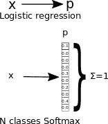
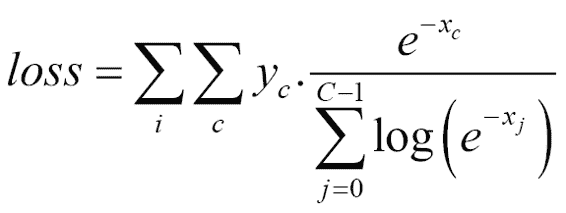
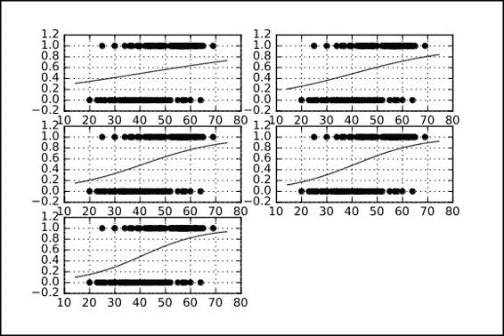
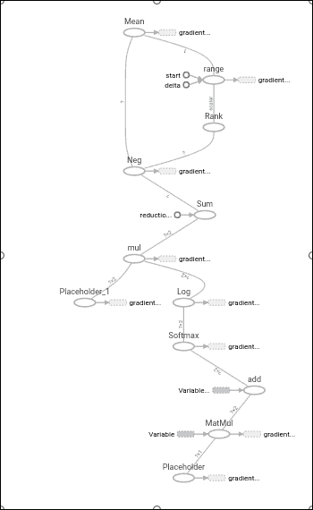
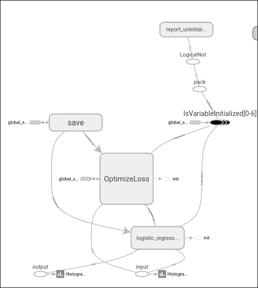

# 四、逻辑回归

在上一章中，我们已经看到了一种将现实的一部分建模为线性函数的方法，该函数具有独立变量，并且偏差最小化了误差函数。

除了某些非常明确定义的问题（预期结果是连续的变量和函数）之外，这种特殊的分析还不够。

但是，如果我们面对具有定性因变量的数据，将会发生什么？ 例如，是否存在确定的特征； 受试者有金色的头发吗？ 病人以前有病吗？

这些是我们将在本章中处理的问题。

# 问题描述

线性回归旨在解决的问题不是基于连续函数的值预测，这一次，我们想知道样本属于确定类别的可能性。

在本章中，我们将依靠线性模型的一般化来解决回归问题，但最终目标是解决分类问题，我们必须应用标签或将观察集中的所有元素分配给预定义的组。


在上图中，我们可以看到如何对旧问题和新问题进行分类。 第一个（线性回归）可以想象为价值不断增长的连续体。

另一个是基于`x`值的输出只能具有两个不同值的域。 在第二张图的特定情况下，我们可以看到对其中一个选项的特定偏向极端：在左侧，偏向 0 `y`值，在右侧偏向某个值。 共 1。

鉴于即使在进行回归从而寻找连续值的情况下，这种项也可能有些棘手，实际上，最终目标是为具有离散变量的分类问题建立预测。

此处的关键是要了解我们将获得与类有关的项目的概率，而不是完全离散的值。

# sigmoid 函数的前身 -- Logit 函数

在研究逻辑函数之前，我们将回顾该函数所基于的原始函数，并为其提供一些更一般的属性。

本质上，当我们谈论`logit`函数时，我们正在使用随机变量`p`的函数，更具体地说，是与伯努利分布相对应的函数。

## 伯努利分布

在解释理论细节之前，值得注意的是伯努利分布是一个随机变量，它具有：

*   取值为 0 且失败概率为`q = 1 - p`

*   取值为 1，成功概率为`p`

可以表示如下（对于具有伯努利分布的随机变量`X`）：


这是一种概率分布，它将以二元选项的形式表示事件的发生概率，就像我们要表示自己的变量（特征的存在，事件的发生，现象的因果关系等）一样。

## 链接函数

在尝试建立广义线性模型时，我们要从线性函数开始，并从因变量开始，获取到概率分布的映射。

由于选项具有二元性质，因此通常选择的分布是最近提到的 Bernoulli 分布，而倾向于 logistic 函数的链接函数是`logit`函数。

## Logit 函数

我们可以利用的可能变量之一是`p`等于 1 的几率的自然对数。 此函数称为`logit`函数：


我们也可以将`logit`函数称为对数奇数函数，因为对于给定的概率`p`，我们正在计算赔率的对数`(p/1-p)`：


因此，正如我们可以直观地推断出的那样，用自变量的组合替换`X`，无论它们的值是什么，用从负无穷大到无穷大的任何出现替换`X`，我们将响应缩放到`0`和`1`。

## Logit 反函数的重要性

假设我们计算`logit`函数的逆。 这将使我们编写以下函数：


此函数是`sigmoid`函数。

# sigmoid 函数

逻辑函数将帮助我们在新的回归任务中表示二元类别。

在下图中，您将找到`sigmoid`函数的图形表示：


逻辑函数或 Sigmoid 的图形表示

## Logistic 函数作为线性建模概括

逻辑函数`δ(t)`定义如下：


该方程式的正常解释是`t`代表一个简单的自变量。 但是，我们将改进此模型，并假定`t`是单个解释变量`x`的线性函数（对 t 是多个解释变量的线性组合的情况进行类似处理）。

然后，我们将`t`表示为：


### 最终估计的回归方程

因此，我们从以下等式开始：


使用所有这些元素，我们可以计算回归方程，这将为我们提供回归概率：


下图将显示如何将从任意范围的映射最终转换为范围`[0, 1]`，该范围可以解释为表示事件发生的概率 p：


什么影响会改变线性函数的参数？ 它们是将更改`sigmoid`函数的中心斜率和从零开始的位移的值，从而使其可以更精确地减小回归值与实际数据点之间的误差。

## 逻辑函数的属性

函数空间中的每条曲线都可以通过可能适用的目标来描述。 对于 logistic 函数，它们是：

*   根据一个或多个独立变量对事件的概率`p`进行建模。 例如，鉴于先前的资格，被授予奖品的可能性。
*   对确定的观测值进行估计（这是回归部分）`p`，与事件未发生的可能性有关。
*   预测自变量变化对二元响应的影响。
*   通过计算某项属于确定类别的概率对观察进行分类。

### 损失函数

在上一节中，我们看到了近似的`p^`函数，该函数将对样本属于特定类别的概率进行建模。 为了衡量我们对解的近似程度，我们将寻找精心选择的损失函数。

该损失函数表示为：


该损失函数的主要特性是它不会以类似的方式惩罚误差，当误差增加到远远超过 0.5 时，误差惩罚因子会渐近增长。

## 多类应用 -- softmax 回归

到目前为止，我们仅针对两个类的情况进行分类，或者以概率语言对事件发生概率`p`进行分类。

在要决定两个以上类别的情况下，有两种主要方法： 一对一，一对全。

*   第一种技术包括计算许多模型，这些模型代表每个类别相对于所有其他类别的概率。
*   第二个由一组概率组成，其中我们代表一个类别相对于所有其他类别的概率。
*   第二种方法是`softmax`回归的输出格式，它是 n 个类的逻辑回归的概括。

因此，为了训练样本，我们将使用句柄`y(i)ε{1,...,K},`将二元标签`( y(i)ε{0,1})`更改为向量标签，其中`K`是类别数，标签 Y 可以采用`K`不同的值， 而不是只有两个。

因此，对于这种特定技术，给定测试输入`X`，我们想要针对`k=1,...,K`的每个值估计`P`（`y=k|x`）的概率。 `softmax`回归将输出`K`维向量（其元素总和为 1），从而为我们提供了`K`估计的概率。

在下图中，我们表示在单类和多类逻辑回归的概率映射上发生的映射：



### 成本函数

`softmax`函数的成本函数是自适应的交叉熵函数，该函数不是线性的，因此对大阶函数差异的惩罚要比对小阶函数的惩罚更大。


在这里，`c`是类别编号，`I`是各个训练样本索引，`yc`对于期望的类别为 1，对于其余类别为 0。

扩展这个方程，我们得到以下结果：



### 迭代方法的数据标准化

正如我们将在以下各节中看到的那样，对于逻辑回归，我们将使用`gradient descent`方法来最小化成本函数。


此方法对特征数据的形式和分布非常敏感。

因此，我们将进行一些预处理，以便获得更好，更快的收敛结果。

我们将把这种方法的理论原因留给其他书籍，但我们将总结其原因，即通过归一化可以平滑误差表面，使迭代`gradient descent`更快地达到最小误差。

### 输出的单热表示

为了将`softmax`函数用作回归函数，我们必须使用一种称为单热编码的编码。 这种编码形式只是将变量的数字整数值转换为数组，其中将值列表转换为数组列表，每个数组的长度与该列表的最大值相同，并且每个数组的表示方式是在值的索引上添加 1，其余元素保持为 0。

例如，这将是单热编码形式的列表[1、3、2、4]的表示形式：

```py
[[0 1 0 0 0] 
[0 0 0 1 0] 
[0 0 1 0 0]
[0 0 0 0 1]]
```

# 示例 1 -- 单变量 logistic 回归

在第一个示例中，我们将使用单变量 logistic 回归（患者年龄）来估计心脏病的概率。

## 有用的库和方法

从 0.8 版开始，TensorFlow 提供了一种生成热点的方法。 用于此生成的函数是`tf.one_hot`，其形式如下：

```py
tf.one_hot(indices, depth, on_value=1, off_value=0, axis=None, dtype=tf.float32, name=None)
```

此函数生成通用的单热编码数据结构，该结构可以指定值，生成轴，数据类型等。

在生成的张量中，索引的指示值将采用`on_value`（默认值为`1`），其他值将具有`off_value`（默认`0`）。

`Dtype`是生成的张量的数据类型； 默认值为`float32`。

depth 变量定义每个元素将具有多少列。 我们假设它在逻辑上应该为`max(indices) + 1`，但也可以将其切掉。

### TensorFlow 的 softmax 实现

在 TensorFlow 中应用`softmax`回归的方法包括`tf.nn.log_softmax, with the following form:`

```py
tf.nn.log_softmax(logits, name=None)
```

在这里，参数为：

*   `logits`：张量必须为以下类型之一：`float32`，`float64` 形状为`[batch_size, num_classes]`的 2D
*   `name`：操作的名称（可选）

此函数返回具有与`logits`相同类型和形状的张量。

## 数据集说明和加载

我们将讨论的第一种情况是我们要拟合逻辑回归的方法，仅测量一个变量，并且只有两个可能的结果。

### CHDAGE 数据集

对于第一个简单的示例，我们将使用一个非常简单且经过研究的数据集，该数据集以在书中出版而闻名。 应用逻辑回归第三版，David W. Hosmer Jr.，Stanley Lemeshow，Rodney X. Sturdivant，作者：Wiley。

列出`age`的年限（AGE），以及对心脏病风险因素进行假设性研究的 100 名受试者是否患有严重冠心病（CHD）的证据。 该表还包含一个标识符变量（ID）和一个年龄组变量（AGEGRP）。 结果变量是 CHD，它用`0`值编码以表示不存在 CHD，或用`1`编码以指示其存在于个体中。 通常，可以使用任何两个值，但是我们发现使用零和一最为方便。 我们将此数据集称为 CHDAGE 数据。

#### CHDAGE 数据集格式

CHDAGE 数据集是一个两列的 CSV 文件，我们将从外部仓库下载该文件。

在第 1 章（探索和转换数据）中，我们使用了本机 TensorFlow 方法来读取数据集。 在本章中，我们将使用一个互补且流行的库来获取数据。

进行此新添加的原因是，鉴于数据集只有 100 个元组，实际上只需要一行读取即可，而且`pandas`库提供了免费但简单但强大的分析方法 。

因此，在该项目的第一阶段，我们将开始加载 CHDAGE 数据集的实例，然后将打印有关数据的重要统计信息，然后进行预处理。

在对数据进行一些绘制之后，我们将构建一个由激活函数组成的模型，该激活函数将在特殊情况下成为`softmax`函数，在特殊情况下它将变为标准逻辑回归。 那就是只有两个类别（疾病的存在与否）。

#### 数据集加载和预处理实现

首先，我们导入所需的库，并指示所有`matplotlib`程序都将内联（如果我们使用 Jupyter）：

```py
>>> import pandas as pd 
>>> import numpy as np 
>>> %matplotlib inline 
>>> import matplotlib.pyplot as plt 

```

然后，我们读取数据并要求`pandas`检查有关数据集的重要统计信息：

```py
>>> df = pd.read_csv("data/CHD.csv", header=0) 
>>> print df.describe() 

```

```py
    age        chd
    count  100.000000  100.00000
    mean    44.380000    0.43000
    std     11.721327    0.49757
    min     20.000000    0.00000
    25%     34.750000    0.00000
    50%     44.000000    0.00000
    75%     55.000000    1.00000
    max     69.000000    1.000000

```

然后，我们继续绘制数据以了解数据：

```py
plt.figure() # Create a new figure 
plt.scatter(df['age'],df['chd']) #Plot a scatter draw of the random datapoints 

```


## 模型架构

在这里，我们从以下变量开始，描述将在其中构建模型元素的代码部分：

```py
learning_rate = 0.8 #Learning speed 
batch_size = 100 #number of samples for the batch 
display_step = 2 #number of steps before showing progress
```

在这里，我们为图创建初始变量和占位符，即单变量`x`和`y`浮点值：

```py
x = tf.placeholder("float", [None, 1]) # Placeholder for the 1D data 
y = tf.placeholder("float", [None, 2]) # Placeholder for the classes (2)
```

现在，我们将创建线性模型变量，随着模型拟合的进行，将对其进行修改和更新：

```py
W = tf.Variable(tf.zeros([1, 2])) 
b = tf.Variable(tf.zeros([2]))
```

最后，我们将对线性函数应用`softmax`操作来构建激活函数：

```py
activation = tf.nn.softmax(tf.matmul(x, W) + b) 

```

## 损失函数描述和优化器循环

在这里，我们仅将互相关函数定义为`loss`函数，并定义`optimizer`操作，即`gradient descent`。 以下各章将对此进行解释； 现在，您可以看到它是一个黑框，它将改变变量，直到损失最小：

```py
cost = tf.reduce_mean(-tf.reduce_sum(y*tf.log(activation), reduction_indices=1)) 
optimizer = tf.train.GradientDescentOptimizer(learning_rate).minimize(cost) 
#Iterate through all the epochs 
for epoch in range(training_epochs): 
        avg_cost = 0\. 
        total_batch = 400/batch_size 
# Loop over all batches 
        for i in range(total_batch): 
            # Transform the array into a one hot format 

        temp=tf.one_hot(indices = df['chd'].values, depth=2, on_value = 1, off_value = 0, axis = -1 , name = "a")       
        batch_xs, batch_ys =(np.transpose([df['age']])-44.38)/11.721327, temp 

        # Fit training using batch data 
        sess.run(optimizer, feed_dict={x: batch_xs.astype(float), y: batch_ys.eval()}) 

        # Compute average loss, suming the corrent cost divided by the batch total number 
        avg_cost += sess.run(cost, feed_dict={x: batch_xs.astype(float), y: batch_ys.eval()})/total_batch 

```

## 停止条件

一旦根据训练周期对数据进行了训练，该过程将简单地停止。

## 结果描述

这将是程序的输出：

```py
Epoch: 0001 cost= 0.638730764
[ 0.04824295 -0.04824295]
[[-0.17459483  0.17459483]]
Epoch: 0002 cost= 0.589489654
[ 0.08091066 -0.08091066]
[[-0.29231569  0.29231566]]
Epoch: 0003 cost= 0.565953553
[ 0.10427245 -0.10427245]
[[-0.37499282  0.37499279]]
Epoch: 0004 cost= 0.553756475
[ 0.12176144 -0.12176143]
[[-0.43521613  0.4352161 ]]
Epoch: 0005 cost= 0.547019333
[ 0.13527818 -0.13527818]
[[-0.48031801  0.48031798]]

```

### 跨周期拟合函数的表示

在下图中，我们表示了拟合函数在不同周期之间的进展：



## 完整源代码

这是完整的源代码：

```py
import pandas as pd 
import numpy as np 
get_ipython().magic(u'matplotlib inline') 
import matplotlib.pyplot as plt 
import tensorflow as tf 

df = pd.read_csv("data/CHD.csv", header=0) 
# Parameters 

learning_rate = 0.2 
training_epochs = 5 
batch_size = 100 
display_step = 1 
sess = tf.Session() 
b=np.zeros((100,2)) 

# tf Graph Input 

x = tf.placeholder("float", [None, 1]) 
y = tf.placeholder("float", [None, 2]) 

# Create model 
# Set model weights 
W = tf.Variable(tf.zeros([1, 2])) 
b = tf.Variable(tf.zeros([2])) 

# Construct model 
activation = tf.nn.softmax(tf.matmul(x, W) + b) 
# Minimize error using cross entropy 
cost = tf.reduce_mean(-tf.reduce_sum(y*tf.log(activation), reduction_indices=1)) # Cross entropy 
optimizer = tf.train.GradientDescentOptimizer(learning_rate).minimize(cost) # Gradient Descent 

# Initializing the variables 
init = tf.initialize_all_variables() 

# Launch the graph 

with tf.Session() as sess: 
    tf.train.write_graph(sess.graph, './graphs','graph.pbtxt') 
    sess.run(init) 
    writer = tf.train.SummaryWriter('./graphs', sess.graph) 
    #Initialize the graph structure 

    graphnumber=321 

    #Generate a new graph 
    plt.figure(1) 

    #Iterate through all the epochs 
    for epoch in range(training_epochs): 
        avg_cost = 0\. 
        total_batch = 400/batch_size 
        # Loop over all batches 

        for i in range(total_batch): 
            # Transform the array into a one hot format 

            temp=tf.one_hot(indices = df['chd'].values, depth=2, on_value = 1, off_value = 0, axis = -1 , name = "a")       
            batch_xs, batch_ys = (np.transpose([df['age']])-44.38)/11.721327, temp 

            # Fit training using batch data 
            sess.run(optimizer, feed_dict={x: batch_xs.astype(float), y: batch_ys.eval()}) 

            # Compute average loss, suming the corrent cost divided by the batch total number 
            avg_cost += sess.run(cost, feed_dict={x: batch_xs.astype(float), y: batch_ys.eval()})/total_batch 
        # Display logs per epoch step 

        if epoch % display_step == 0: 
            print "Epoch:", '%05d' % (epoch+1), "cost=", "{:.8f}".format(avg_cost) 

            #Generate a new graph, and add it to the complete graph 

            trX = np.linspace(-30, 30, 100) 
            print (b.eval()) 
            print (W.eval()) 
            Wdos=2*W.eval()[0][0]/11.721327 
            bdos=2*b.eval()[0] 

            # Generate the probabiliy function 
            trY = np.exp(-(Wdos*trX)+bdos)/(1+np.exp(-(Wdos*trX)+bdos) ) 

            # Draw the samples and the probability function, whithout the normalization 
            plt.subplot(graphnumber) 
            graphnumber=graphnumber+1 

            #Plot a scatter draw of the random datapoints 
            plt.scatter((df['age']),df['chd']) 
            plt.plot(trX+44.38,trY) #Plot a scatter draw of the random datapoints 
            plt.grid(True) 

        #Plot the final graph 
        plt.savefig("test.svg")  

```

### 图形表示

使用 TensorBoard 实用程序，我们将看到操作链。 请注意，在一半的操作图中，我们定义了主要的全局操作（“小数点”）以及应用于其余项的梯度操作，这是进行`loss`函数最小化所必需的。 这是接下来几章要讨论的主题。



# 示例 2 -- 使用 skflow 的单变量 logistic 回归

在此示例中，我们将探索单变量示例域，但是这次我们将使用来自新库的帮助，该库为我们简化了模型构建，称为`skflow`。

## 有用的库和方法

在机器学习库领域中，有很多选择。 最知名的之一是`sklearn`，我们在第 2 章聚类中讨论过。

在 TensorFlow 发布之后的很早，一个新的贡献库就出现了，叫做`skflow`，其主要目的是模拟`sklearn`的界面和工作流程，在这个 TensorFlow 会话环境中工作更简洁。

在下面的示例中，我们将使用`skflow`界面重复先前回归的分析。

在示例中，我们还将看到 skflow 如何为回归模型自动生成详细且组织良好的图，只需将日志目录设置为参数即可。

## 数据集说明

使用`pandas`库，数据集加载阶段与前面的示例相同：

```py
import pandas as pd 

df = pd.read_csv("data/CHD.csv", header=0) 
print df.describe() 

```

## 模型架构

这是`my_model`的代码段：

```py
 def my_model(X, y): 
    return skflow.models.logistic_regression(X, y) 

X1 =a.fit_transform(df['age'].astype(float)) 
y1 = df['chd'].values 
classifier = skflow.TensorFlowEstimator(model_fn=my_model, n_classes=2) 

```

在这里，我们可以使用`softmax`分类器查看逻辑回归阶段的详细视图：




## 结果描述

```py
score = metrics.accuracy_score(df['chd'].astype(float), classifier.predict(X)) 
print("Accuracy: %f" % score) 

```

输出结果可观（为了简化模型）74% 的准确率：

```py
Accuracy: 0.740000

```

## 完整源代码

这是完整的源代码：

```py
import tensorflow.contrib.learn as skflow 
from sklearn import datasets, metrics, preprocessing 
import numpy as np 
import pandas as pd 

df = pd.read_csv("data/CHD.csv", header=0) 
print df.describe() 

def my_model(X, y): 
    return skflow.models.logistic_regression(X, y) 

a = preprocessing.StandardScaler() 

X1 =a.fit_transform(df['age'].astype(float)) 

y1 = df['chd'].values 

classifier = skflow.TensorFlowEstimator(model_fn=my_model, n_classes=2) 
classifier.fit(X1,y1 , logdir='/tmp/logistic') 

score = metrics.accuracy_score(df['chd'].astype(float), classifier.predict(X)) 
print("Accuracy: %f" % score) 

```

# 总结

在本章中，我们学习了一种新的建模技术，即逻辑函数，并从一种简单的分类任务入手。

我们还学习了一种通过`pandas`库读取基于文本的数据的新方法。

此外，我们还看到了与`skflow`库一起使用的经典工作流的一种补充方法。

在下一章中，我们将开始处理更复杂的架构，并进入 TensorFlow 库擅长的领域：训练，测试和最终实现神经网络以解决实际问题。

