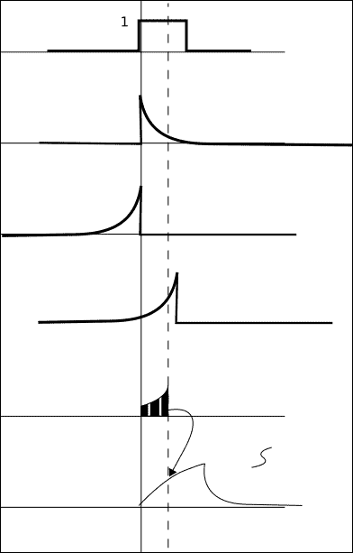
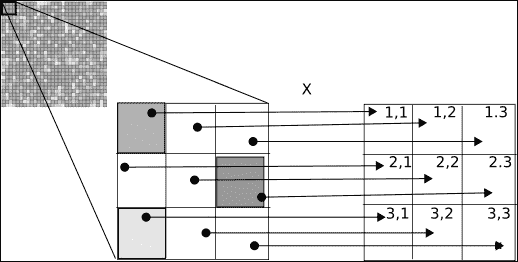
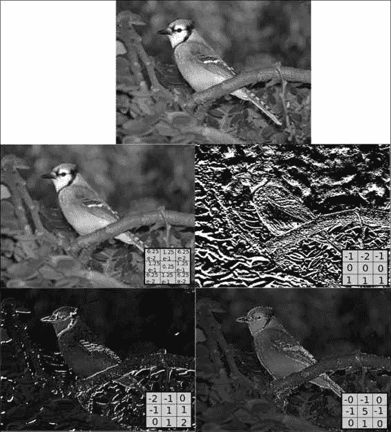
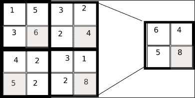
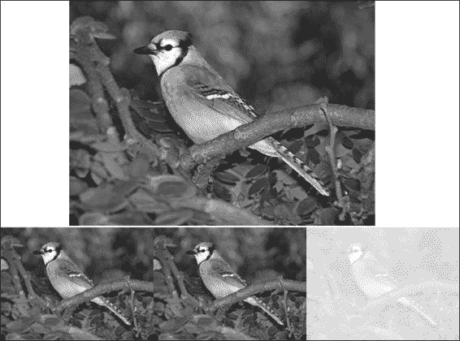
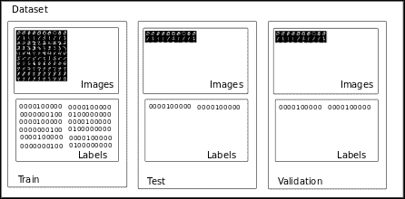
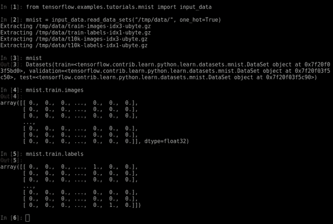

# 六、卷积神经网络

卷积神经网络是当前使用的许多最高级模型的一部分。 它们被用于许多领域，但是主要的应用领域是图像分类和特征检测领域。

我们将在本章中介绍的主题如下：

*   了解卷积函数和卷积网络如何工作以及构建它们的主要操作类型
*   将卷积运算应用于图像数据并学习一些应用于图像的预处理技术，以提高方法的准确率
*   使用 CNN 的简单设置对 MNIST 数据集的数字进行分类
*   使用应用于彩色图像的 CNN 模型对 CIFAR 数据集的真实图像进行分类

# 卷积神经网络的起源

新认知加速器是福岛教授在 1980 年发表的论文中介绍的卷积网络的前身，并且是一种能容忍位移和变形的自组织神经网络。

这个想法在 1986 年再次出现在原始反向传播论文的书本中，并在 1988 年被用于语音识别中的时间信号。

最初的设计后来在 1998 年通过 LeCun 的论文将基于梯度的学习应用于文档识别中进行了审查和改进，该论文提出了 LeNet-5 网络，该网络能够对手写数字进行分类。 与其他现有模型相比，该模型显示出更高的表现，尤其是在 SVM 的几种变体上，SVM 是出版年份中表现最高的操作之一。

然后在 2003 年对该论文进行了概括，论文为图像解释的层次神经网络。 但是，总的来说，我们将使用 LeCun 的 LeNet 论文架构的近似表示。

## 卷积入门

为了理解在这些类型的操作中应用于信息的操作，我们将从研究卷积函数的起源开始，然后我们将解释如何将此概念应用于信息。

为了开始跟踪操作的历史发展，我们将开始研究连续域中的卷积。

### 连续卷积

此操作的最初使用来自 18 世纪，并且可以在原始应用上下文中表示为将两个按时出现的特征混合在一起的操作。

从数学上讲，它可以定义如下：


当我们尝试将此操作概念化为算法时，可以在以下步骤中解释前面的方程式：

1.  翻转信号：这是变量的`(-τ)`部分。
2.  移动它：这是由`g(τ)`的`t`求和因子给出的。
3.  乘以：这是`f`和`g`的乘积。
4.  积分结果曲线：这是较不直观的部分，因为每个瞬时值都是积分的结果。



### 离散卷积

卷积可以转换为离散域，并以离散项描述离散函数：


## 卷积核

在离散域中应用卷积的概念时，经常会使用内核。

内核可以定义为`nxm`维矩阵，通常是在所有维上长的几个元素，通常是`m = n`。

卷积运算包括将对应的像素与内核相乘，一次一个像素，然后将这些值相加，以便将该值分配给中央像素。

然后将应用相同的操作，将卷积矩阵向左移动，直到访问了所有可能的像素。

在以下示例中，我们有一个包含许多像素的图像和一个大小为`3x3`的内核，这在图像处理中特别常见：



## 卷积运算的解释

回顾了连续场和离散场的卷积运算的主要特征之后，现在让我们看一下该运算在机器学习中的用途。

卷积核突出或隐藏模式。 根据受过训练的（或在示例中，手动设置）参数，我们可以开始发现参数，例如不同尺寸的方向和边缘。 我们也可能通过诸如模糊内核之类的方法覆盖一些不必要的细节或离群值。

正如 LeCun 在他的基础论文中所述：

> 卷积网络可以看作是合成自己的特征提取器。

卷积神经网络的这一特性是相对于以前的数据处理技术的主要优势。 我们可以非常灵活地确定已确定数据集的主要组成部分，并通过这些基本构件的组合来表示其他样本。

## 在 TensorFlow 中应用卷积

TensorFlow 提供了多种卷积方法。 规范形式通过`conv2d`操作应用。 让我们看一下此操作的用法：

```py
tf.nn.conv2d(input, filter, strides, padding, use_cudnn_on_gpu, data_format, name=None)
```

我们使用的参数如下：

*   `input`：这是将对其应用操作的原始张量。 它具有四个维度的确定格式，默认维度顺序如下所示。
*   `[batch, in_height, in_width, in_channels]`：批量是允许您拥有图像集合的维度。 顺序称为`NHWC`。 另一个选项是`NCWH`。

    例如，单个`100x100` 像素彩色图像将具有以下形状：

    ```py
            [1,100,100,3]
    ```

*   `filter`：这是代表`kernel`或`filter`的张量。 它有一个非常通用的方法：

```py
        [filter_height, filter_width, in_channels, out_channels]
```

*   `strides`：这是四个`int`张量数据类型的列表，这些数据类型指示每个维度的滑动窗口。
*   `Padding`：可以是`SAME`或`VALID`。 `SAME`将尝试保留初始张量尺寸，但`VALID`将允许其增长，以防计算输出大小和填充。
*   `use_cudnn_on_gpu`：这指示是否使用`CUDA GPU CNN`库来加速计算。
*   `data_format`：这指定数据的组织顺序（`NHWC`或`NCWH`）。

### 其他卷积运算

TensorFlow 提供了多种应用卷积的方法，如下所示：

*   `tf.nn.conv2d_transpose`：这适用于`conv2d`的转置（梯度），并用于反卷积网络中
*   `tf.nn.conv1d`：给定 3D 输入和`filter`张量，这将执行 1D 卷积
*   `tf.nn.conv3d`：给定 5D 输入和`filter`张量，这将执行 3D 卷积

### 示例代码 -- 将卷积应用于灰度图像

在此示例代码中，我们将读取 GIF 格式的灰度图像，该图像将生成一个三通道张量，但每个像素具有相同的 RGB 值。 然后，我们将张量转换为真实的灰度矩阵，应用`kernel`，并在 JPEG 格式的输出图像中检索结果。

### 注意

请注意，您可以调整`kernel`变量中的参数以观察图像变化的影响。

以下是示例代码：

```py
import tensorflow as tf 

#Generate the filename queue, and read the gif files contents 
filename_queue = tf.train.string_input_producer(tf.train.match_filenames_once("data/test.gif")) 
reader = tf.WholeFileReader() 
key, value = reader.read(filename_queue) 
image=tf.image.decode_gif(value) 

#Define the kernel parameters 
kernel=tf.constant( 
[ 
[[[-1.]],[[-1.]],[[-1.]]], 
[[[-1.]],[[8.]],[[-1.]]], 
[[[-1.]],[[-1.]],[[-1.]]] 
]             
) 

#Define the train coordinator 
coord = tf.train.Coordinator() 

with tf.Session() as sess: 
tf.initialize_all_variables().run() 
threads = tf.train.start_queue_runners(coord=coord) 
#Get first image 
image_tensor = tf.image.rgb_to_grayscale(sess.run([image])[0]) 
#apply convolution, preserving the image size 
imagen_convoluted_tensor=tf.nn.conv2d(tf.cast(image_tensor, tf.float32),kernel,[1,1,1,1],"SAME") 
#Prepare to save the convolution option 
file=open ("blur2.jpg", "wb+") 
#Cast to uint8 (0..255), previous scalation, because the convolution could alter the scale of the final image 
out=tf.image.encode_jpeg(tf.reshape(tf.cast(imagen_convoluted_tensor/tf.reduce_max(imagen_convoluted_tensor)*255.,tf.uint8), tf.shape(imagen_convoluted_tensor.eval()[0]).eval())) 
file.close() 
coord.request_stop() 
coord.join(threads) 

```

### 示例核的结果

在下图中，您可以观察到参数的变化如何影响图像的结果。 第一张图片是原始图片。

滤镜类型为从左到右，从上到下模糊，底部 Sobel（从上到下搜索边的一种滤镜），浮雕（突出显示拐角边）和轮廓（概述图像的外部边界）。



## 二次采样操作 -- 池化

在 TensorFlow 中通过称为池化的操作执行二次采样操作。 这个想法是应用一个（大小不一的）内核并提取内核覆盖的元素之一，其中`max_pool`和`avg_pool`是最著名的一些元素，它们仅获得最大和平均值。 应用内核的元素。

在下图中，您可以看到将`2x2`内核应用于单通道`16x16`矩阵的操作。 它只是保持其覆盖的内部区域的最大值。



可以进行的合并操作的类型也有所不同。 例如，在 LeCun 的论文中，应用于原始像素的运算必须将它们乘以一个可训练的参数，并添加一个额外的可训练`bias`。

### 下采样层的属性

二次采样层的主要目的与卷积层的目的大致相同。 减少信息的数量和复杂性，同时保留最重要的信息元素。 它们构建了基础信息的紧凑表示。

### 不变性

下采样层还允许将信息的重要部分从数据的详细表示转换为更简单的表示。 通过在图像上滑动滤镜，我们将检测到的特征转换为更重要的图像部分，最终达到 1 像素的图像，该特征由该像素值表示。 相反，此属性也可能导致模型丢失特征检测的局部性。

### 下采样层实现的表现

下采样层的实现要快得多，因为未使用的数据元素的消除标准非常简单。 通常，它只需要进行几个比较。

### 在 TensorFlow 中应用池化操作

首先，我们将分析最常用的`pool`操作`max_pool`。 它具有以下签名：

```py
tf.nn.max_pool(value, ksize, strides, padding, data_format, name)
```

此方法类似于`conv2d`，参数如下：

*   `value`：这是`float32`元素和形状（批量长度，高度，宽度，通道）的 4D 张量。
*   `ksize`：这是一个整数列表，代表每个维度上的窗口大小
*   `strides`：这是在每个尺寸上移动窗口的步骤
*   `data_format`：设置数据尺寸
*   `ordering`：`NHWC`或`NCHW`
*   `padding`：`VALID`或`SAME`

### 其他池化操作

*   `tf.nn.avg_pool`：这将返回每个窗口的平均值的缩减张量
*   `tf.nn.max_pool_with_argmax`：这将返回`max_pool`张量和具有`max_value`的平展索引的张量
*   `tf.nn.avg_pool3d`：此操作使用类似立方的窗口执行`avg_pool`操作； 输入有额外的深度
*   `tf.nn.max_pool3d`：执行与（`...`）相同的操作，但应用`max`操作

### 示例代码

在以下示例代码中，我们将采用原始格式：

```py
import tensorflow as tf 

#Generate the filename queue, and read the gif files contents 
filename_queue = tf.train.string_input_producer(tf.train.match_filenames_once("data/test.gif")) 
reader = tf.WholeFileReader() 
key, value = reader.read(filename_queue) 
image=tf.image.decode_gif(value) 

#Define the  coordinator 
coord = tf.train.Coordinator() 

def normalize_and_encode (img_tensor): 
    image_dimensions = tf.shape(img_tensor.eval()[0]).eval() 
    return tf.image.encode_jpeg(tf.reshape(tf.cast(img_tensor, tf.uint8), image_dimensions)) 

with tf.Session() as sess: 
    maxfile=open ("maxpool.jpg", "wb+") 
    avgfile=open ("avgpool.jpg", "wb+") 
    tf.initialize_all_variables().run() 
    threads = tf.train.start_queue_runners(coord=coord) 

    image_tensor = tf.image.rgb_to_grayscale(sess.run([image])[0]) 

    maxed_tensor=tf.nn.avg_pool(tf.cast(image_tensor, tf.float32),[1,2,2,1],[1,2,2,1],"SAME") 
    averaged_tensor=tf.nn.avg_pool(tf.cast(image_tensor, tf.float32),[1,2,2,1],[1,2,2,1],"SAME") 

    maxfile.write(normalize_and_encode(maxed_tensor).eval()) 
    avgfile.write(normalize_and_encode(averaged_tensor).eval()) 
    coord.request_stop() 
    maxfile.close() 
    avgfile.close() 
coord.join(threads) 

```

在下图中，我们首先看到原始图像和缩小尺寸的图像，然后是`max_pool`，然后是`avg_pool`。 如您所见，这两个图像看起来是相等的，但是如果我们绘制它们之间的图像差异，我们会发现，如果取最大值而不是均值（始终小于或等于均值），则会有细微的差异。



## 提高效率 - 丢弃操作

在大型神经网络训练过程中观察到的主要优点之一是过拟合，即为训练数据生成非常好的近似值，但为单点之间的区域发出噪声。

在过拟合的情况下，该模型专门针对训练数据集进行了调整，因此对于一般化将无用。 因此，尽管它在训练集上表现良好，但是由于缺乏通用性，因此它在测试数据集和后续测试中的表现很差。

因此，引入了丢弃操作。 此操作将某些随机选择的权重的值减小为零，从而使后续层为零。

这种方法的主要优点是，它避免了一层中的所有神经元同步优化其权重。 随机分组进行的这种适应避免了所有神经元都收敛到相同的目标，从而使适应的权重解相关。

在丢弃应用中发现的第二个属性是隐藏单元的激活变得稀疏，这也是理想的特性。

在下图中，我们表示了原始的完全连接的多层神经网络以及具有链接的丢弃的关联网络：


### 在 TensorFlow 中应用丢弃操作

为了应用`dropout`操作，TensorFlows 实现了`tf.nn.dropout`方法，其工作方式如下：

```py
tf.nn.dropout (x, keep_prob, noise_shape, seed, name)
```

参数如下：

*   `x`：这是原始张量
*   `keep_prob`：这是保留神经元的概率以及乘以其余节点的因子
*   `noise_shape`：这是一个四元素列表，用于确定尺寸是否将独立应用归零

#### 示例代码

在此样本中，我们将对样本向量应用丢弃操作。 丢弃还可以将丢弃传输到所有与架构相关的单元。

在下面的示例中，您可以看到将丢弃应用于`x`变量的结果，其归零概率为 0.5，并且在未发生这种情况的情况下，值加倍（乘以`1 / 1.5`，丢弃概率）：


显然，大约一半的输入已被清零（选择此示例是为了显示概率不会总是给出预期的四个零）。

可能使您感到惊讶的一个因素是应用于非放置元素的比例因子。 这项技术用于维护相同的网络，并在训练时将`keep_prob`设为 1，将其恢复到原始架构。

## 卷积层的构建方法

为了构建卷积神经网络层，存在一些通用的实践和方法，可以在构建深度神经网络的方式中将其视为准规范。

为了促进卷积层的构建，我们将看一些简单的实用函数。

### 卷积层

这是卷积层的一个示例，它连接一个卷积，添加一个`bias`参数总和，最后返回我们为整个层选择的激活函数（在这种情况下，`relu`操作很常见）。

```py
def conv_layer(x_in, weights, bias, strides=1): 
x = tf.nn.conv2d(x, weights, strides=[1, strides, strides, 1],                                                                      padding='SAME') 
x = tf.nn.bias_add(x_in, bias) 
return tf.nn.relu(x) 

```

### 下采样层

通常可以通过维持层的初始参数，通过`max_pool`操作来表示下采样层：

```py
def maxpool2d(x, k=2): 
return tf.nn.max_pool(x, ksize=[1, k, k, 1], strides=[1, k, k, 1], 
padding='SAME') 

```

# 示例 1 -- MNIST 数字分类

在本节中，我们将首次使用最知名的模式识别数据集中的一个。 它最初是为了训练神经网络来对支票上的手写数字进行字符识别而开发的。

原始数据集有 60,000 个不同的数字用于训练和 10,000 个用于测试，并且在使用时是原始使用的数据集的子集。

在下图中，我们显示了 LeNet-5 架构，这是有关该问题发布的第一个著名的卷积架构。

在这里，您可以看到层的尺寸和最后的结果表示：


## 数据集说明和加载

MNIST 是易于理解和阅读但难以掌握的数据集。 当前，有很多好的算法可以解决这个问题。 在我们的案例中，我们将寻求建立一个足够好的模型，以使其与 10% 的随机结果相去甚远。

为了访问 MNIST 数据集，我们将使用为 TensorFlow 的 MNIST 教程开发的一些实用工具类。

这两条线是我们拥有完整的 MNIST 数据集所需的全部工作。

在下图中，我们可以看到数据集对象的数据结构的近似值：



通过此代码，我们将打开并探索 MNIST 数据集：



要打印字符（在 Jupyter 笔记本中），我们将重塑表示图像的线性方式，形成`28x28`的方矩阵，分配灰度色图，并使用以下行绘制所得的数据结构：

```py
plt.imshow(mnist.train.images[0].reshape((28, 28), order='C'), cmap='Greys', interpolation='nearest')
```

下图显示了此行应用于不同数据集元素的结果：


## 数据集预处理

在此示例中，我们将不进行任何预处理； 我们只会提到，仅通过使用线性变换的现有样本（例如平移，旋转和倾斜的样本）扩展数据集示例，就可以实现更好的分类评分。

## 模型架构

在这里，我们将研究为该特定架构选择的不同层。

它开始生成带有名称的权重字典：

```py
'wc1': tf.Variable(tf.random_normal([5, 5, 1, 32])), 
'wc2': tf.Variable(tf.random_normal([5, 5, 32, 64])), 
'wd1': tf.Variable(tf.random_normal([7*7*64, 1024])), 
'out': tf.Variable(tf.random_normal([1024, n_classes])) 

```

对于每个权重，还将添加一个`bias`以说明常数。

然后我们定义连接的层，一层又一层地集成：

```py
conv_layer_1 = conv2d(x_in, weights['wc1'], biases['bc1']) 

conv_layer_1 = subsampling(conv_layer_1, k=2) 

conv_layer_2 = conv2d(conv_layer_1, weights['wc2'], biases['bc2']) 

conv_layer_2 = subsampling(conv_layer_2, k=2) 

fully_connected_layer = tf.reshape(conv_layer_2, [-1, weights['wd1'].get_shape().as_list()[0]]) 
fully_connected_layer = tf.add(tf.matmul(fully_connected_layer, weights['wd1']), biases['bd1']) 
fully_connected_layer = tf.nn.relu(fully_connected_layer) 

fully_connected_layer = tf.nn.dropout(fully_connected_layer, dropout) 

prediction_output = tf.add(tf.matmul(fully_connected_layer, weights['out']), biases['out']) 

```

## 损失函数说明

损失函数将是交叉熵误差函数的平均值，该函数通常是用于分类的 softmax 函数。

```py
cost = tf.reduce_mean(tf.nn.softmax_cross_entropy_with_logits(pred, y)) 

```

## 损失函数优化器

对于此示例，我们将使用改进的`AdamOptimizer`，其学习率可配置，我们将其定义为 0.001。

```py
optimizer = tf.train.AdamOptimizer
           (learning_rate=learning_rate).minimize(cost)
```

## 准确率测试

准确率测试计算标签和结果之间比较的平均值，以获得`0`和`1`之间的值。

```py
correct_pred = tf.equal(tf.argmax(pred, 1), tf.argmax(y, 1)) 
accuracy = tf.reduce_mean(tf.cast(correct_pred, tf.float32)) 

```

## 结果说明

此示例的结果简洁明了，并且假设我们仅训练 10,000 个样本，则准确率不是一流的，但与十分之一的随机采样结果明显分开：

```py
Optimization Finished! 
Testing Accuracy: 0.382812 

```

## 完整源代码

以下是源代码：

```py
import tensorflow as tf 
%matplotlib inline 
import matplotlib.pyplot as plt  
# Import MINST data 
from tensorflow.examples.tutorials.mnist import input_data 
mnist = input_data.read_data_sets("/tmp/data/", one_hot=True) 
# Parameters 
learning_rate = 0.001 
training_iters = 2000 
batch_size = 128 
display_step = 10 

# Network Parameters 
n_input = 784 # MNIST data input (img shape: 28*28) 
n_classes = 10 # MNIST total classes (0-9 digits) 
dropout = 0.75 # Dropout, probability to keep units 

# tf Graph input 
x = tf.placeholder(tf.float32, [None, n_input]) 
y = tf.placeholder(tf.float32, [None, n_classes]) 
keep_prob = tf.placeholder(tf.float32) #dropout (keep probability) 

#plt.imshow(X_train[1202].reshape((20, 20), order='F'), cmap='Greys',  interpolation='nearest') 

# Create some wrappers for simplicity 
def conv2d(x, W, b, strides=1): 
    # Conv2D wrapper, with bias and relu activation 
    x = tf.nn.conv2d(x, W, strides=[1, strides, strides, 1], padding='SAME') 
    x = tf.nn.bias_add(x, b) 
    return tf.nn.relu(x) 
def maxpool2d(x, k=2): 
    # MaxPool2D wrapper 
    return tf.nn.max_pool(x, ksize=[1, k, k, 1], strides=[1, k, k, 1], 
                          padding='SAME') 
# Create model 
def conv_net(x, weights, biases, dropout): 
    # Reshape input picture 
    x = tf.reshape(x, shape=[-1, 28, 28, 1]) 

    # Convolution Layer 
    conv1 = conv2d(x, weights['wc1'], biases['bc1']) 
    # Max Pooling (down-sampling) 
    conv1 = maxpool2d(conv1, k=2) 

    # Convolution Layer 
    conv2 = conv2d(conv1, weights['wc2'], biases['bc2']) 
    # Max Pooling (down-sampling) 
    conv2 = maxpool2d(conv2, k=2) 

    # Fully connected layer 
    # Reshape conv2 output to fit fully connected layer input 
    fc1 = tf.reshape(conv2, [-1, weights['wd1'].get_shape().as_list()[0]]) 
    fc1 = tf.add(tf.matmul(fc1, weights['wd1']), biases['bd1']) 
    fc1 = tf.nn.relu(fc1) 
    # Apply Dropout 
    fc1 = tf.nn.dropout(fc1, dropout) 

    # Output, class prediction 
    out = tf.add(tf.matmul(fc1, weights['out']), biases['out']) 
    return out 
# Store layers weight & bias 
weights = { 
# 5x5 conv, 1 input, 32 outputs 
'wc1': tf.Variable(tf.random_normal([5, 5, 1, 32])), 
# 5x5 conv, 32 inputs, 64 outputs 
'wc2': tf.Variable(tf.random_normal([5, 5, 32, 64])), 
# fully connected, 7*7*64 inputs, 1024 outputs 
'wd1': tf.Variable(tf.random_normal([7*7*64, 1024])), 
# 1024 inputs, 10 outputs (class prediction) 
'out': tf.Variable(tf.random_normal([1024, n_classes])) 
} 

biases = { 
'bc1': tf.Variable(tf.random_normal([32])), 
'bc2': tf.Variable(tf.random_normal([64])), 
'bd1': tf.Variable(tf.random_normal([1024])), 
'out': tf.Variable(tf.random_normal([n_classes])) 
} 

# Construct model 
pred = conv_net(x, weights, biases, keep_prob) 

# Define loss and optimizer 
cost = tf.reduce_mean(tf.nn.softmax_cross_entropy_with_logits(pred, y)) 
optimizer = tf.train.AdamOptimizer(learning_rate=learning_rate).minimize(cost) 

# Evaluate model 
correct_pred = tf.equal(tf.argmax(pred, 1), tf.argmax(y, 1)) 
accuracy = tf.reduce_mean(tf.cast(correct_pred, tf.float32)) 

# Initializing the variables 
init = tf.initialize_all_variables() 

# Launch the graph 
with tf.Session() as sess: 
    sess.run(init) 
    step = 1 
    # Keep training until reach max iterations 
    while step * batch_size < training_iters: 
        batch_x, batch_y = mnist.train.next_batch(batch_size) 
        test = batch_x[0] 
        fig = plt.figure() 
        plt.imshow(test.reshape((28, 28), order='C'), cmap='Greys', 
        interpolation='nearest') 
        print (weights['wc1'].eval()[0]) 
        plt.imshow(weights['wc1'].eval()[0][0].reshape(4, 8), cmap='Greys',  interpolation='nearest') 
        # Run optimization op (backprop) 
        sess.run(optimizer, feed_dict={x: batch_x, y: batch_y, 
                                       keep_prob: dropout}) 
        if step % display_step == 0: 
            # Calculate batch loss and accuracy 
            loss, acc = sess.run([cost, accuracy], feed_dict={x: batch_x, 
                                                              y: batch_y, 
                                                            keep_prob: 1.})
            print "Iter " + str(step*batch_size) + ", Minibatch Loss= " + \ 
                  "{:.6f}".format(loss) + ", Training Accuracy= " + \ 
                  "{:.5f}".format(acc) 
        step += 1 
    print "Optimization Finished!" 

    # Calculate accuracy for 256 mnist test images 
    print "Testing Accuracy:", \ 
        sess.run(accuracy, feed_dict={x: mnist.test.images[:256],
                                      y: mnist.test.labels[:256],
                                      keep_prob: 1.}) 

```

# 示例 2 -- CIFAR10 数据集和图像分类

在此示例中，我们将研究图像理解中使用最广泛的数据集之一，该数据集用作简单但通用的基准。 在此示例中，我们将构建一个简单的 CNN 模型，以了解解决此类分类问题所需的一般计算结构。

## 数据集说明和加载

该数据集包含 40,000 个`32x32`像素的图像，代表以下类别：飞机，汽车，鸟类，猫，鹿，狗，青蛙，马，船和卡车。 在此示例中，我们将只处理 10,000 个图像包中的第一个。

以下是您可以在数据集中找到的一些图像示例：


## 数据集预处理

我们必须对原始数据集进行一些数据结构调整，首先将其转换为`[10000, 3, 32, 32]`多维数组，然后将通道维移动到最后一个顺序。

```py
datadir='data/cifar-10-batches-bin/' 
plt.ion() 
G = glob.glob (datadir + '*.bin') 
A = np.fromfile(G[0],dtype=np.uint8).reshape([10000,3073]) 
labels = A [:,0] 
images = A [:,1:].reshape([10000,3,32,32]).transpose (0,2,3,1) 
plt.imshow(images[14]) 
print labels[11] 
images_unroll = A [:,1:] 

```

## 模型架构

在这里，我们将定义我们的建模函数，该函数是一系列卷积和池化操作，并使用最终的平坦层和逻辑回归来确定当前样本的分类概率。

```py
def conv_model (X, y): 
X= tf. reshape(X, [-1, 32, 32, 3]) 
    with tf.variable_scope('conv_layer1'): 
        h_conv1=tf.contrib.layers.conv2d(X, num_outputs=16,  kernel_size=[5,5],  activation_fn=tf.nn.relu)#print (h_conv1) 
        h_pool1=max_pool_2x2(h_conv1)#print (h_pool1) 
with tf.variable_scope('conv_layer2'): 
        h_conv2=tf.contrib.layers.conv2d(h_pool1, num_outputs=16, kernel_size=[5,5], activation_fn=tf.nn.relu) 
    #print (h_conv2) 
    h_pool2=max_pool_2x2(h_conv2) 
    h_pool2_flat = tf.reshape(h_pool2,  [-1,8*8*16 ]) 
    h_fc1 = tf.contrib.layers.stack(h_pool2_flat, tf.contrib.layers.fully_connected ,[96,48], activation_fn=tf.nn.relu ) 

return skflow.models.logistic_regression(h_fc1,y) 

```

## 损失函数说明和优化器

以下是函数：

```py
classifier = skflow.TensorFlowEstimator(model_fn=conv_model, n_classes=10, batch_size=100, steps=2000, learning_rate=0.01)
```

### 训练和准确率测试

使用以下两个命令，我们开始使用图像集对模型进行拟合并生成训练后模型的评分：

```py
%time classifier.fit(images, labels, logdir='/tmp/cnn_train/')
%time score =metrics.accuracy_score(labels, classifier.predict(images))
```

## 结果描述

结果如下：

| 参数 | 结果 1 | 结果 2 |
| --- | --- | --- |
| CPU 时间 | 用户 35 分钟 6 秒 | 用户 39.8 秒 |
| 系统 | 1 分钟 50 秒 | 7.19 秒 |
| 总时间 | 36 分钟 57 秒 | 47 秒 |
| 墙上时间 | 25 分钟 3 秒 | 32.5 秒 |
| 准确率 | 0.612200 |  |

### 完整源代码

以下是完整的源代码：

```py
import glob 
import numpy as np 
import matplotlib.pyplot as plt 
import tensorflow as tf 
import tensorflow.contrib.learn as skflow 
from sklearn import metrics 
from tensorflow.contrib import learn 

datadir='data/cifar-10-batches-bin/' 

plt.ion() 
G = glob.glob (datadir + '*.bin') 
A = np.fromfile(G[0],dtype=np.uint8).reshape([10000,3073]) 
labels = A [:,0] 
images = A [:,1:].reshape([10000,3,32,32]).transpose (0,2,3,1) 
plt.imshow(images[15]) 
print labels[11] 
images_unroll = A [:,1:] 
def max_pool_2x2(tensor_in): 
    return tf.nn.max_pool(tensor_in,  ksize= [1,2,2,1], strides= [1,2,2,1], padding='SAME') 

def conv_model (X, y): 
    X= tf. reshape(X, [-1, 32, 32, 3]) 
    with tf.variable_scope('conv_layer1'): 
        h_conv1=tf.contrib.layers.conv2d(X, num_outputs=16,  kernel_size=[5,5],  activation_fn=tf.nn.relu)#print (h_conv1) 
        h_pool1=max_pool_2x2(h_conv1)#print (h_pool1) 
    with tf.variable_scope('conv_layer2'): 
        h_conv2=tf.contrib.layers.conv2d(h_pool1, num_outputs=16, kernel_size=[5,5], activation_fn=tf.nn.relu) 
    #print (h_conv2) 
    h_pool2=max_pool_2x2(h_conv2) 
    h_pool2_flat = tf.reshape(h_pool2,  [-1,8*8*16 ]) 
    h_fc1 = tf.contrib.layers.stack(h_pool2_flat, tf.contrib.layers.fully_connected ,[96,48], activation_fn=tf.nn.relu ) 
    return skflow.models.logistic_regression(h_fc1,y) 

images = np.array(images,dtype=np.float32) 
classifier = skflow.TensorFlowEstimator(model_fn=conv_model, n_classes=10, batch_size=100, steps=2000, learning_rate=0.01) 

%time classifier.fit(images, labels, logdir='/tmp/cnn_train/') 
%time score =metrics.accuracy_score(labels, classifier.predict(images)) 

```

# 总结

在本章中，我们了解了最先进的神经网络架构的组成部分之一：卷积神经网络。 使用此新工具，我们可以处理更复杂的数据集和概念抽象，因此我们将能够了解最新的模型。

在下一章中，我们将使用另一种新形式的神经网络以及更新的神经网络架构的一部分：循环神经网络。

