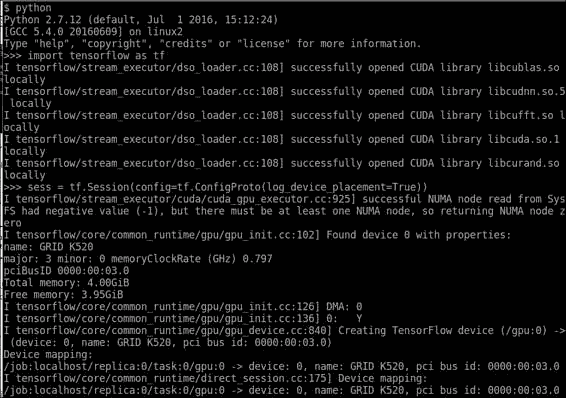
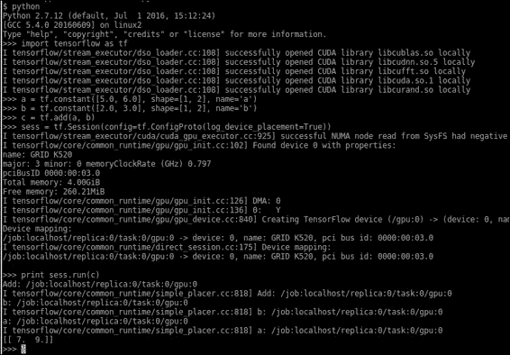
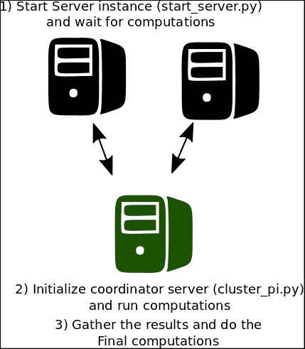
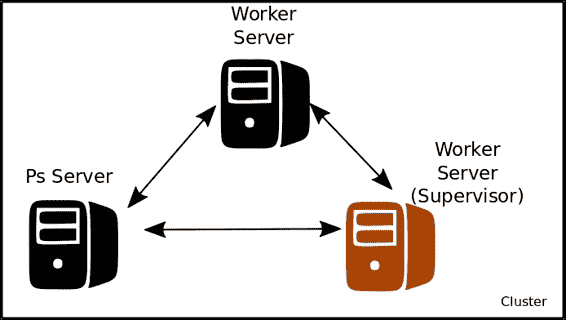

# 九、大规模运行模型 -- GPU 和服务

到目前为止，我们一直在运行在主机的主 CPU 上运行的代码。 这意味着最多使用所有不同的处理器内核（低端处理器使用 2 或 4 个内核，高级处理器使用多达 16 个内核）。

在过去的十年中，通用处理单元（GPU）已成为所有高表现计算设置中无处不在的部分。 它的大量固有并行度非常适合于高维矩阵乘法以及机器学习模型训练和运行所需的其他运算。

尽管如此，即使拥有真正强大的计算节点，也存在许多任务，即使是最强大的单个服务器也无法应对。

因此，必须开发一种训练和运行模型的分布式方法。 这是分布式 TensorFlow 的原始功能。

在本章中，您将：

*   了解如何发现 TensorFlow 可用的计算资源
*   了解如何将任务分配给计算节点中的任何不同计算单元
*   了解如何记录 GPU 操作
*   了解如何不仅在主主机中而且在许多分布式单元的集群中分布计算

# TensorFlow 上的 GPU 支持

TensorFlow 对至少两种计算设备具有本机支持：CPU 和 GPU。 为此，它为支持的每种计算设备实现每个操作的一个版本：


## 记录设备放置和设备能力

在尝试执行计算之前，TensorFlow 允许您记录所有可用资源。 这样，我们只能将操作应用于现有的计算类型。

### 查询计算能力

为了获取机器上计算元素的日志，我们可以在创建 TensorFlow 会话时使用`log_device_placement`标志，方法是：

```py
python
>>>Import tensorflow as tf
>>>sess = tf.Session(config=tf.ConfigProto(log_device_placement=True))

```

这是命令的输出：



选择 GPU 来运行代码

此长输出主要显示了所需的不同`CUDA`库的加载，然后显示了名称（`GRID K520`）和 GPU 的计算能力。

## 选择用于计算的 CPU

如果我们有可用的 GPU，但仍想继续使用 CPU，则可以通过`tf.Graph.device`方法选择一个。

方法调用如下：

```py
tf.Graph.device(device_name_or_function) : 

```

该函数接收处理单元字符串，返回处理单元字符串的函数或不返回处理单元字符串，并返回分配了处理单元的上下文管理器。

如果参数是一个函数，则每个操作都将调用此函数来决定它将在哪个处理单元中执行，这是组合所有操作的有用元素。

### 设备命名

为了指定在指定设备时我们指的是哪个计算单元，TensorFlow 使用以下格式的简单方案：


设备 ID 格式

设备标识示例包括：

*   `"/cpu:0"`：计算机的第一个 CPU
*   `"/gpu:0"`：您计算机的 GPU（如果有）
*   `"/gpu:1"`：计算机的第二个 GPU，依此类推

可用时，如果没有相反指示，则使用第一个 GPU 设备。

# 示例 1 -- 将操作分配给 GPU

在此示例中，我们将创建两个张量，将现有 GPU 定位为默认位置，并将在配置了 CUDA 环境的服务器上执行张量总和（您将在附录 A-库安装和其他中学习安装该张量） 提示）。



在这里，我们看到常量和求和操作都是在`/gpu:0`服务器上构建的。 这是因为 GPU 是可用时首选的计算设备类型。

# 示例 2 -- 并行计算 Pi

该示例将作为并行处理的介绍，实现 Pi 的蒙特卡洛近似。

蒙特卡洛（Monte Carlo）利用随机数序列执行近似。

为了解决这个问题，我们将抛出许多随机样本，因为我们知道圆内的样本与正方形上的样本之比与面积比相同。


随机区域计算技术

计算假设概率分布均匀，则分配的样本数与图形的面积成比例。

我们使用以下比例：


Pi 的面积比例

从上述比例，我们可以推断出圆中的样本数/正方形的样本数也是`0.78`。

另一个事实是，我们可以为计算生成的随机样本越多，答案就越近似。 这是在增加 GPU 数量时会给我们带来更多样本和准确率。

我们做的进一步减少是我们生成`(X, Y)`坐标，范围是`(0..1)`，因此随机数生成更直接。 因此，我们需要确定样本是否属于圆的唯一标准是`distance = d < 1.0`（圆的半径）。

## 解决方案实现

该解决方案将基于 CPU。 它将管理服务器中拥有的 GPU 资源（在本例中为`4`），然后我们将接收结果，并进行最终的样本求和。

### 提示

注意：此方法的收敛速度非常慢，为`O(n^1/2)`，但由于其简单性，将作为示例。


计算任务时间表

在上图中，我们看到了计算的并行行为，即样本生成和主要活动计数。

## 源代码

源代码如下：

```py
import tensorflow as tf 
import numpy as np 
c = [] 
#Distribute the work between the GPUs 
for d in ['/gpu:0', '/gpu:1', '/gpu:2', '/gpu:3']: 
    #Generate the random 2D samples 
    i=tf.constant(np.random.uniform(size=10000), shape=[5000,2]) 
    with tf.Session() as sess: 
        tf.initialize_all_variables() 
        #Calculate the euclidean distance to the origin 
        distances=tf.reduce_sum(tf.pow(i,2),1) 
        #Sum the samples inside the circle 
        tempsum = sess.run(tf.reduce_sum(tf.cast(tf.greater_equal(tf.cast(1.0,tf.float64),distances),tf.float64))) 
        #append the current result to the results array 
        c.append( tempsum) 
    #Do the final ratio calculation on the CPU 
    with tf.device('/cpu:0'): 
        with tf.Session() as sess: 
            sum = tf.add_n(c) 
            print (sess.run(sum/20000.0)*4.0) 

```

# 分布式 TensorFlow

分布式 TensorFlow 是一项补充技术，旨在轻松高效地创建计算节点集群，并以无缝方式在节点之间分配作业。

这是创建分布式计算环境以及大规模执行模型的训练和运行的标准方法，因此能够完成生产，大量数据设置中的主要任务非常重要。

## 技术组件

在本节中，我们将描述分布式 TensorFlow 计算设置上的所有组件，从最细粒度的任务元素到整个集群描述。

### 作业

作业定义了一组同类任务，通常针对解决问题领域的同一子集。

区分作业的示例有：

*   参数服务器作业，它将模型参数存储在一个单独的作业中，并负责将初始和当前参数值分配给所有分布式节点
*   工作器作业，在其中执行所有计算密集型任务

### 任务

任务是工作的细分，执行不同的步骤或并行的工作单元以解决其工作的问题区域，并且通常附加到单个过程中。

每个作业都有许多任务，它们由索引标识。 通常，索引为 0 的任务被视为主要任务或协调者任务。

### 服务器

服务器是代表专用于实现任务的一组物理设备的逻辑对象。 服务器将专门分配给一个任务。

#### 组合概述

在下图中，我们将代表集群计算设置中的所有参与部分：


TensorFlow 集群设置元素

该图包含由`ps`和`worker`作业代表的两个作业，以及可以从客户端为其创建的 grpc 通讯通道（在附录 A 库安装和附加提示中介绍）。 对于每种作业类型，都有服务器执行不同的任务，从而解决了作业域问题的子集。

### 创建一个 TensorFlow 集群

分布式集群程序的第一个任务是定义和创建一个`ClusterSpec`对象，该对象包含真实服务器实例的地址和端口，它们将成为集群的一部分。

定义此`ClusterSpec`的两种主要方法是：

*   创建一个`tf.train.ClusterSpec`对象，该对象指定所有群集任务
*   在创建`tf.train.Server`时，传递上述`ClusterSpec`对象，并将本地任务与作业名称和任务索引相关联

#### `ClusterSpec`定义格式

`ClusterSpec`对象是使用协议缓冲区格式定义的，该格式是基于 JSON 的特殊格式。

格式如下：

```py
{ 
    "job1 name": [ 
        "task0 server uri", 
        "task1 server uri" 
         ... 
    ] 
... 
    "jobn name"[ 
        "task0 server uri", 
        "task1 server uri" 
    ]}) 
... 

```

因此，这将是使用参数服务器任务服务器和三个工作者任务服务器创建集群的函数调用：

```py
tf.train.ClusterSpec({ 
    "worker": [ 
        "wk0.example.com:2222", 
        "wk1.example.com:2222", 
        "wk2.example.com:2222" 
    ], 
    "ps": [ 
        "ps0.example.com:2222", 
    ]}) 

```

#### 创建`tf.Train.Server`

创建`ClusterSpec`之后，我们现在可以在运行时准确了解集群配置。 我们将继续创建本地服务器实例，并创建一个`tf.train.Server`实例：

这是一个示例服务器创建，它使用集群对象，作业名称和任务索引作为参数：

```py
server = tf.train.Server(cluster, job_name="local", task_index=[Number of server]) 

```

## 集群操作 -- 将计算方法发送到任务

为了开始学习集群的操作，我们需要学习计算资源的寻址。

首先，我们假设我们已经创建了一个集群，它具有不同的作业和任务资源。 任何资源的 ID 字符串具有以下形式：


上下文管理器中资源的常规调用是`with`关键字，具有以下结构。

```py
with tf.device("/job:ps/task:1"): 
  [Code Block] 

```

`with`关键字指示在需要任务标识符时，将使用上下文管理器指令中指定的任务标识符。

下图说明了一个示例集群设置，其中包含设置的所有不同部分的地址名称：


服务器元素命名

### 分布式示例代码结构

此示例代码将向您显示解决集群中不同任务的程序的大致结构，特别是参数服务器和辅助作业：

```py
#Address the Parameter Server task 
with tf.device("/job:ps/task:1"): 
  weights = tf.Variable(...) 
  bias = tf.Variable(...) 

#Address the Parameter Server task 
with tf.device("/job:worker/task:1"): 
    #... Generate and train a model 
  layer_1 = tf.nn.relu(tf.matmul(input, weights_1) + biases_1) 
  logits = tf.nn.relu(tf.matmul(layer_1, weights_2) + biases_2) 
  train_op = ... 

#Command the main task of the cluster 
with tf.Session("grpc://worker1.cluster:2222") as sess: 
  for i in range(100): 
    sess.run(train_op) 

```

# 示例 3 -- 分布式 Pi 计算

在此示例中，我们将更改视角，从一台具有多个计算资源的服务器变为一台具有多个资源的服务器集群。

分布式版本的执行将具有不同的设置，如下图所示：



分布式协调运行

## 服务器脚本

该脚本将在每个计算节点上执行，这将生成一批样本，并通过可用服务器的数量增加生成的随机数的数量。 在这种情况下，我们将使用两台服务器，并假设我们在本地主机中启动它们，并在命令行中指示索引号。 如果要在单独的节点中运行它们，则只需替换`ClusterSpec`定义中的本地主机地址（如果希望它更具代表性，则可以替换名称）。

该脚本的源代码如下：

```py
import tensorflow as tf 
tf.app.flags.DEFINE_string("index", "0","Server index") 
FLAGS = tf.app.flags.FLAGS 
print FLAGS.index 
cluster = tf.train.ClusterSpec({"local": ["localhost:2222", "localhost:2223"]}) 
server = tf.train.Server(cluster, job_name="local", task_index=int(FLAGS.index)) 
server.join() 

```

在`localhost`中执行此脚本的命令行如下：

```py
python start_server.py -index=0 #Server  task 0
python start_server.py -index=1 #Server task 1

```

这是其中一台服务器的预期输出：


单个服务器启动命令行

## 客户端脚本

然后，我们获得了客户端脚本，该脚本将向集群成员发送随机数创建任务，并将执行最终的 Pi 计算，几乎与 GPU 示例相同。

## 完整源代码

源代码如下：

```py
import tensorflow as tf 
import numpy as np 

tf.app.flags.DEFINE_integer("numsamples", "100","Number of samples per server") 
FLAGS = tf.app.flags.FLAGS 

print ("Sample number per server: " + str(FLAGS.numsamples)  ) 
cluster = tf.train.ClusterSpec({"local": ["localhost:2222", "localhost:2223"]}) 
#This is the list containing the sumation of samples on any node 
c=[] 

def generate_sum(): 
        i=tf.constant(np.random.uniform(size=FLAGS.numsamples*2), shape=[FLAGS.numsamples,2]) 
        distances=tf.reduce_sum(tf.pow(i,2),1) 
        return (tf.reduce_sum(tf.cast(tf.greater_equal(tf.cast(1.0,tf.float64),distances),tf.int32))) 

with tf.device("/job:local/task:0"): 
        test1= generate_sum() 

with tf.device("/job:local/task:1"): 
        test2= generate_sum() 
#If your cluster is local, you must replace localhost by the address of the first node 
with tf.Session("grpc://localhost:2222") as sess: 
      result = sess.run(tf.cast(test1 + test2,tf.float64)/FLAGS.numsamples*2.0) 
      print(result) 

```

# 示例 4 -- 在集群中运行分布式模型

这个非常简单的示例将为我们提供分布式 TensorFlow 设置工作原理的示例。

在此示例中，我们将执行一个非常简单的任务，尽管如此，它仍将在机器学习过程中采取所有必需的步骤。



分布式训练集群设置

`Ps Server`将包含要求解的线性函数的不同参数（在本例中为`x`和`b0`），两个工作服务器将对变量进行训练，该变量将不断更新和改进。 最后一个，在协作模式下工作。

## 示例代码

示例代码如下：

```py
import tensorflow as tf 
import numpy as np 
from sklearn.utils import shuffle 

# Here we define our cluster setup via the command line 
tf.app.flags.DEFINE_string("ps_hosts", "", 
                           "Comma-separated list of hostname:port pairs") 
tf.app.flags.DEFINE_string("worker_hosts", "", 
                           "Comma-separated list of hostname:port pairs") 

# Define the characteristics of the cluster node, and its task index 
tf.app.flags.DEFINE_string("job_name", "", "One of 'ps', 'worker'") 
tf.app.flags.DEFINE_integer("task_index", 0, "Index of task within the job") 

FLAGS = tf.app.flags.FLAGS 

def main(_): 
  ps_hosts = FLAGS.ps_hosts.split(",") 
  worker_hosts = FLAGS.worker_hosts.split(",") 

  # Create a cluster following the command line paramaters. 
  cluster = tf.train.ClusterSpec({"ps": ps_hosts, "worker": worker_hosts}) 

  # Create the local task. 
  server = tf.train.Server(cluster, 
                           job_name=FLAGS.job_name, 
                           task_index=FLAGS.task_index) 

  if FLAGS.job_name == "ps": 
    server.join() 
  elif FLAGS.job_name == "worker": 

    # Assigns ops to the local worker by default. 
    with tf.device(tf.train.replica_device_setter( 
        worker_device="/job:worker/task:%d" % FLAGS.task_index, 
        cluster=cluster)): 

      #Define the training set, and the model parameters, loss function and training operation 
      trX = np.linspace(-1, 1, 101) 
      trY = 2 * trX + np.random.randn(*trX.shape) * 0.4 + 0.2 # create a y value 
      X = tf.placeholder("float", name="X") # create symbolic variables 
      Y = tf.placeholder("float", name = "Y") 

      def model(X, w, b): 
        return tf.mul(X, w) + b # We just define the line as X*w + b0  

      w = tf.Variable(-1.0, name="b0") # create a shared variable 
      b = tf.Variable(-2.0, name="b1") # create a shared variable 
      y_model = model(X, w, b) 

      loss = (tf.pow(Y-y_model, 2)) # use sqr error for cost function 
      global_step = tf.Variable(0) 

      train_op = tf.train.AdagradOptimizer(0.8).minimize( 
          loss, global_step=global_step) 

    #Create a saver, and a summary and init operation 
      saver = tf.train.Saver() 
      summary_op = tf.merge_all_summaries() 
      init_op = tf.initialize_all_variables() 

    # Create a "supervisor", which oversees the training process. 
    sv = tf.train.Supervisor(is_chief=(FLAGS.task_index == 0), 
                             logdir="/tmp/train_logs", 
                             init_op=init_op, 
                             summary_op=summary_op, 
                             saver=saver, 
                             global_step=global_step, 
                             save_model_secs=600) 

    # The supervisor takes care of session initialization, restoring from 
    # a checkpoint, and closing when done or an error occurs. 
    with sv.managed_session(server.target) as sess: 
      # Loop until the supervisor shuts down 
      step = 0 
      while not sv.should_stop() : 
        # Run a training step asynchronously. 
        # See `tf.train.SyncReplicasOptimizer` for additional details on how to 
        # perform *synchronous* training. 
        for i in range(100): 
          trX, trY = shuffle (trX, trY, random_state=0) 
          for (x, y) in zip(trX, trY): 
              _, step = sess.run([train_op, global_step],feed_dict={X: x, Y: y}) 
          #Print the partial results, and the current node doing the calculation 
          print ("Partial result from node: " + str(FLAGS.task_index) + ", w: " + str(w.eval(session=sess))+ ", b0: " + str(b.eval(session=sess))) 
    # Ask for all the services to stop. 
    sv.stop() 

if __name__ == "__main__": 
  tf.app.run() 

```

在参数服务器当前主机中：

```py
python trainer.py  --ps_hosts=localhost:2222   --worker_hosts=localhost:2223,localhost:2224   --job_name=ps -task_index=0
he first

```

在工作器主机编号中：

```py
python trainer.py  --ps_hosts=localhost:2222   --worker_hosts=localhost:2223,localhost:2224   --job_name=worker -task_index=0

```

在第二个工作者主机中：

```py
python trainer.py  --ps_hosts=localhost:2222   --worker_hosts=localhost:2223,localhost:2224   --job_name=worker --task_index=1

```

# 总结

在本章中，我们回顾了 TensorFlow 工具箱中的两个主要元素，以在高表现环境中实现我们的模型，无论是在单服务器还是分布式集群环境中。

在下一章中，我们将查看有关如何在各种环境和工具下安装 TensorFlow 的详细说明。

