# 语义分割

在本章中，我们将学习各种语义分割技术并为其训练模型。 分割是逐像素分类任务。 解决分割问题的思想是对对象检测问题的扩展。 分割在医学和卫星图像理解等应用中非常有用。

本章将涵盖以下主题：

*   学习语义分割和实例分割之间的区别
*   细分数据集和指标
*   语义分割算法
*   分割在医学和卫星图像中的应用
*   实例分割算法

# 预测像素

图像分类是预测标签或类别的任务。 对象检测是预测几种基于深度学习的算法及其相应边界框的列表的任务。 边界框可能在其中包含除检测到的对象以外的其他对象。 在某些应用中，将每个像素标记到标签很重要，而不是可能包含多个对象的边框。 **语义分割**是预测逐像素标签的任务。

这是图像及其对应的语义分割的示例：

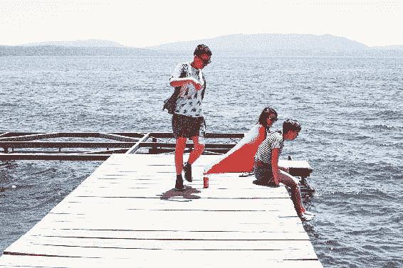 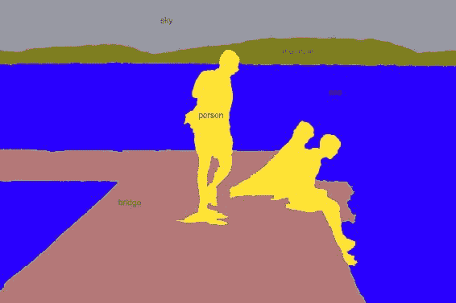 >

如图中所示，使用每个像素的标签预测输入图像。 标签可以是天空，树木，人，山和桥。 标签不是分配给整个图像，而是分配给每个像素。 语义分割独立标记像素。 您会注意到每个人都没有区别。 图像中的所有人员均以相同的方式标记。

这是区分相同标签的每个实例的示例：

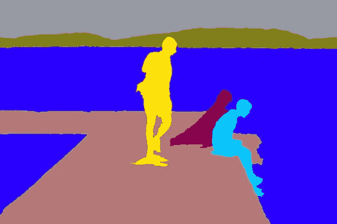

用像素标记分割每个实例的任务称为**实例分割**。 实例分割可以被认为是具有像素级标签的对象检测的扩展。 语义分段和实例分段的应用非常广泛，下一部分将提供一些应用。

# 诊断医学影像

可以使用分割技术来诊断医学图像。 现代医学成像技术，例如**磁共振成像**（ **MRI** ），**计算机断层扫描**（ **CT** ）和**视网膜病变**创建高质量的图像。 可以将通过这种技术生成的图像划分为多个区域，以检测来自脑部扫描的肿瘤或来自视网膜扫描的斑点。 一些设备提供体积图像，这些图像也可以通过分段进行分析。 分割视频以进行机器人手术，使医生能够在机器人协助的手术中仔细查看区域。 在本章的后面，我们将看到如何分割医学图像。

# 通过卫星图像了解地球

卫星图像最近变得越来越丰富。 卫星捕获的图像提供了地球整个表面的高分辨率视图。 通过分析卫星图像，我们可以了解有关地球的几件事，例如：

*   衡量与经济增长相关的国家的建筑率
*   测量油箱
*   规划和组织交通
*   计算森林砍伐及其影响
*   通过对动物进行计数并跟踪其运动来帮助保护野生动植物
*   发现考古遗址
*   绘制自然灾害造成的损坏区域

卫星图像还有更多的应用可能。 对于上述大多数问题，解决方案始于卫星图像的分割。 在本章的后面，我们将看到如何分割卫星图像。

# 使机器人能够看到

分割场景对于机器人看清周围世界并与之互动至关重要。 工业和家用机器人必须处理这些物体。 一旦根据对象跨越了机器人的视野，就可以进行处理。 还有更多值得一提的应用程序：

*   对缺陷进行细分的工具的工业检查
*   时装行业的色彩诊断； 可以将图像与各种时尚对象进行分割并将其用于颜色解析
*   区分背景与前景以应用人像效果

在下一部分中，我们将学习一些用于评估细分算法的公共数据集。

# 数据集

第 4 章，*对象检测*中提到的`PASCAL`和`COCO`数据集也可以用于分割任务。 注释是不同的，因为它们是按像素标记的。 新算法通常以`COCO`数据集为基准。 `COCO`还具有诸如草，墙和天空之类的东西数据集。 像素精度属性可用作评估算法的指标。

除了上面提到的那些以外，在医学影像和卫星影像领域还有其他几个数据集。 这里提供了指向其中一些链接的供您参考：

*   <http://www.cs.bu.edu/~betke/BiomedicalImageSegmentation/>
*   <https://www.kaggle.com/c/intel-mobileodt-cervical-cancer-screening/data>
*   <https://www.kaggle.com/c/diabetic-retinopathy-detection>
*   <https://grand-challenge.org/all_challenges/>
*   <http://www.via.cornell.edu/databases/>
*   <https://www.kaggle.com/c/dstl-satellite-imagery-feature-detection>
*   <https://aws.amazon.com/public-datasets/spacenet/>
*   <https://www.iarpa.gov/challenges/fmow.html>
*   <https://www.kaggle.com/c/planet-understanding-the-amazon-from-space> 

为分割任务创建训练数据非常昂贵。 有在线工具可用于注释数据集。 麻省理工学院 **MIT 大学**提供的 **LabelMe** 移动应用程序非常适合注释，可以从[下载 http://labelme.csail.mit.edu/Release3.0](http://labelme.csail.mit.edu/Release3.0) 。

# 语义分割算法

提出了几种基于深度学习的算法来解决图像分割任务。 可以在像素级别应用滑动窗口方法进行分割。 滑动窗口方法会拍摄图像并将图像分成较小的作物。 图像的每种裁剪都被分类为标签。 这种方法昂贵且效率低下，因为它不会重用重叠补丁之间的共享功能。 在以下各节中，我们将讨论一些可以克服此问题的算法。

# 完全卷积网络

**全卷积网络**（ **FCN** ）引入了端到端卷积网络的思想。 通过删除完全连接的层，可以将任何标准的 CNN 架构用于 FCN，其实现在第 4 章，*对象检测*中进行了显示。 完全连接的层被卷积层代替。 最终层的深度较高，尺寸较小。 因此，可以执行一维卷积以达到所需的标签数量。 但是对于分割，必须保留空间尺寸。 因此，构建完整的卷积网络时没有最大池，如下所示：


该网络的损耗是通过平均每个像素和小批量的交叉熵损耗来计算的。 最后一层的深度等于类数。 FCN 与对象检测相似，只是保留了空间尺寸。 由于某些像素可能会被错误预测，因此该架构产生的输出将很粗糙。 计算量很大，在下一节中，我们将看到如何解决此问题。

# SegNet 架构

**SegNet** 具有编码器和解码器方法。 编码器具有各种卷积层，而解码器具有各种解卷积层。 SegNet 改进了 FCN 产生的粗略输出。 因此，它的内存占用较少。 当特征尺寸减小时，通过反卷积将其再次上采样至图像大小，从而反转了卷积效果。 反卷积学习用于上采样的参数。 由于池层中信息的丢失，这种体系结构的输出将很粗糙。


现在，让我们学习几个新概念，这些概念称为上采样，无规则卷积和转置卷积，它们将帮助我们更好地理解该网络。

# 通过合并对图层进行上采样

在第 1 章和*入门*中，我们讨论了最大池化。 最大池化是一种从窗口中选取最大值的采样策略。 对于上采样，可以相反。 每个值都可以用零包围，以对该层进行上采样，如下所示：

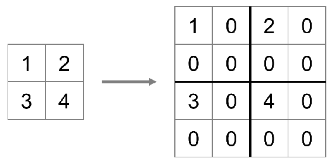

将零添加到与上采样数字相同的位置。 通过记住下采样的位置并将其用于上采样，可以改善解池功能，如下所示：

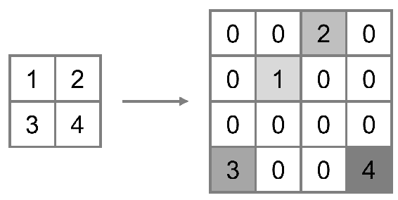

从索引角度来看，上采样比附加零产生更好的结果。 这种通过池对层进行上采样的方法是无法学到的，并且可以按原样工作。 接下来，我们将看到如何使用可学习的参数进行上采样和下采样。

# 通过卷积对图层进行采样

可以使用卷积直接对图层进行升采样或降采样。 可以增加用于卷积的步幅以引起下采样，如下所示：


通过卷积的下采样被称为**无孔卷积**或**扩张卷积**或**大卷积**。 类似地，可以通过学习内核将其反转为升采样，如下所示：

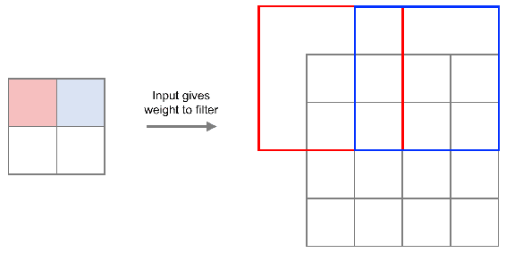

直接使用卷积的上采样可以称为**转置卷积**。 其他一些同义词是**反卷积**或**分数步卷积**或**上卷积**。 现在，了解了升采样的过程。 这是描述先前算法的代码片段：

```py
input_height = 360 input_width = 480 kernel = 3 filter_size = 64 pad = 1 pool_size = 2
```

输入之后，它遵循大小逐渐减小的通常的卷积神经网络，可以称为编码器。 以下代码可用于定义编码器：

```py
model = tf.keras.models.Sequential()
model.add(tf.keras.layers.Layer(input_shape=(3, input_height, input_width)))

# encoder model.add(tf.keras.layers.ZeroPadding2D(padding=(pad, pad)))
model.add(tf.keras.layers.Conv2D(filter_size, kernel, kernel,
  border_mode='valid'))
model.add(tf.keras.layers.BatchNormalization())
model.add(tf.keras.layers.Activation('relu'))
model.add(tf.keras.layers.MaxPooling2D(pool_size=(pool_size, pool_size)))

model.add(tf.keras.layers.ZeroPadding2D(padding=(pad, pad)))
model.add(tf.keras.layers.Conv2D(128, kernel, kernel, border_mode='valid'))
model.add(tf.keras.layers.BatchNormalization())
model.add(tf.keras.layers.Activation('relu'))
model.add(tf.keras.layers.MaxPooling2D(pool_size=(pool_size, pool_size)))

model.add(tf.keras.layers.ZeroPadding2D(padding=(pad, pad)))
model.add(tf.keras.layers.Conv2D(256, kernel, kernel, border_mode='valid'))
model.add(tf.keras.layers.BatchNormalization())
model.add(tf.keras.layers.Activation('relu'))
model.add(tf.keras.layers.MaxPooling2D(pool_size=(pool_size, pool_size)))

model.add(tf.keras.layers.ZeroPadding2D(padding=(pad, pad)))
model.add(tf.keras.layers.Conv2D(512, kernel, kernel, border_mode='valid'))
model.add(tf.keras.layers.BatchNormalization())
model.add(tf.keras.layers.Activation('relu'))
```

可以使用以下代码将编码器的输出以增大的尺寸馈入解码器：

```py
# decoder model.add(tf.keras.layers.ZeroPadding2D(padding=(pad, pad)))
model.add(tf.keras.layers.Conv2D(512, kernel, kernel, border_mode='valid'))
model.add(tf.keras.layers.BatchNormalization())

model.add(tf.keras.layers.UpSampling2D(size=(pool_size, pool_size)))
model.add(tf.keras.layers.ZeroPadding2D(padding=(pad, pad)))
model.add(tf.keras.layers.Conv2D(256, kernel, kernel, border_mode='valid'))
model.add(tf.keras.layers.BatchNormalization())

model.add(tf.keras.layers.UpSampling2D(size=(pool_size, pool_size)))
model.add(tf.keras.layers.ZeroPadding2D(padding=(pad, pad)))
model.add(tf.keras.layers.Conv2D(128, kernel, kernel, border_mode='valid'))
model.add(tf.keras.layers.BatchNormalization())

model.add(tf.keras.layers.UpSampling2D(size=(pool_size, pool_size)))
model.add(tf.keras.layers.ZeroPadding2D(padding=(pad, pad)))
model.add(tf.keras.layers.Conv2D(filter_size, kernel, kernel, border_mode='valid'))
model.add(tf.keras.layers.BatchNormalization())

model.add(tf.keras.layers.Conv2D(nClasses, 1, 1, border_mode='valid', ))
```

解码图像的大小与输入的大小相同，并且可以使用以下代码来训练整个模型：

```py
model.outputHeight = model.output_shape[-2]
model.outputWidth = model.output_shape[-1]

model.add(tf.keras.layers.Reshape((nClasses, model.output_shape[-2] * model.output_shape[-1]),
  input_shape=(nClasses, model.output_shape[-2], model.output_shape[-1])))

model.add(tf.keras.layers.Permute((2, 1)))
model.add(tf.keras.layers.Activation('softmax'))

model.compile(loss="categorical_crossentropy", optimizer=tf.keras.optimizers.Adam, metrics=['accuracy'])
```

这种对图像进行编码和解码的方式克服了基于 FCN 的模型的缺点。 接下来，我们将看到具有膨胀卷积的不同概念。

# 跳过连接以进行更好的培训

分割输出的粗糙程度可以通过跳过体系结构来限制，并且可以获得更高的分辨率。 另一种替代方法是按比例放大最后三层并将其平均，如下所示：

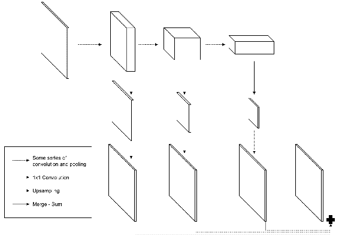

此算法将在后面的部分中用作卫星图像的示例。

# 膨胀卷积

逐像素分类和图像分类在结构上不同。 因此，减少信息的池化层将产生粗略的分段。 但是请记住，池化对于拥有更广阔的视野并允许采样至关重要。 引入了一种名为**扩张卷积**的新想法，以解决该问题，从而在进行更广阔视野的同时减少损耗。 扩大的卷积本质上是通过跳过窗口中的每个像素来进行卷积，如下所示：

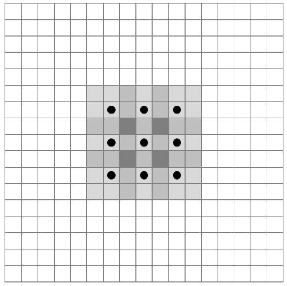

膨胀距离随层而变化。 这样的分割结果的输出被放大以得到更精细的分辨率。 训练了一个单独的网络以进行多尺度聚合。

# 深度实验室

Chen 等人提出的 [DeepLab](https://arxiv.org/pdf/1606.00915.pdf) 在多个尺度上执行卷积，并使用来自各种尺度的特征获得分数图。 然后对得分图进行插值，并通过**条件随机字段**（ **CRF** ）进行最终分割。 图像的这种比例处理可以通过使用其自己的 CNN 处理各种大小的图像，或者通过具有不同水平的卷积卷积的并行卷积来执行。

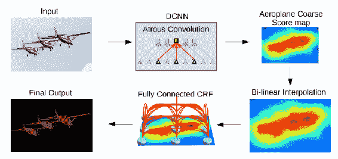

经 Chen 等人许可复制。

# 互联网

膨胀卷积需要更大的输入，因此占用大量内存。 使用高分辨率图片时，这会带来计算问题。 [里德等人](https://arxiv.org/pdf/1611.06612.pdf)提出了一种称为 RefiNet 的方法来克服此问题，如下所示：

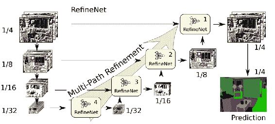

经 Reid 等人许可复制。

RefiNet 使用编码器，然后使用解码器。 CNN 的编码器输出。 解码器连接各种大小的功能：

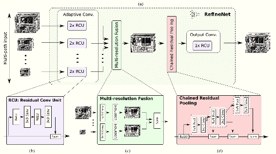

经 Reid 等人许可复制。

串联完成后会放大低维特征。

# PSP 网

Zhoa 等人介绍的 PSPnet 中使用了全局内容。 （https://arxiv.org/pdf/1612.01105.pdf），方法是增加池化层的内核大小。 汇集以金字塔的方式进行。 金字塔同时覆盖图像的各个部分和大小。 架构之间存在损失，因此无法进行适当的监管。


经 Zhao 等人许可复制。

# 大内核很重要

[Peng 等人](https://arxiv.org/pdf/1703.02719.pdf)展示了大内核的重要性。 大内核比小内核具有更大的接受范围。 这些大内核的计算复杂度可用于以较小的内核来克服。 最后有一个边界优化网络。

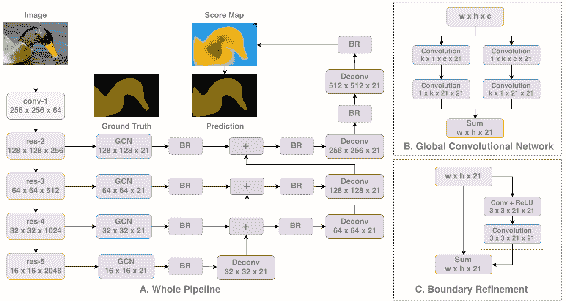

经 Peng 等人许可复制。

# DeepLab v3

[Chen 等人在论文中使用批处理归一化](https://arxiv.org/pdf/1706.05587.pdf)以提高性能。 功能的多尺度以级联方式编码，以提高性能：


经 Chen 等人许可复制。


经 Chen 等人许可复制。

我们已经看到了几种架构可以使用深度学习提高图像分割的准确性。 接下来，我们将看到在医学成像中的应用。

# 超神经分割

Kaggler 是一个组织进行预测建模和分析竞赛的组织。 Kagglers 曾经受到挑战，要从颈部超声图像中分割神经结构。 可以从[这里](https://www.kaggle.com/c/ultrasound-nerve-segmentation)下载有关该数据的数据。 Ronneberger 等人提出的 [UNET 模型](https://arxiv.org/pdf/1505.04597.pdf)类似于自动编码器，但具有卷积而不是完全连接的层。 这里有一个编码部分，其卷积减小，而解码器部分的卷积增大，如下所示：

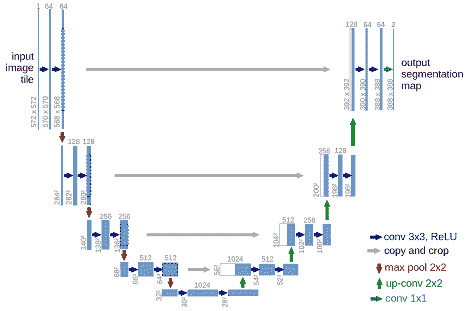

该图说明了 UNET 模型的体系结构[经 Ronneberger 等人许可复制]

相似大小的编码器和解码器部分的卷积通过跳过连接来学习。 模型的输出是一个介于 0 到 1 之间的掩码。让我们从导入函数开始，借助以下代码：

```py
import os
from skimage.transform import resize
from skimage.io import imsave
import numpy as np
from data import load_train_data, load_test_data
```

在所有导入之后，我们现在将使用以下代码定义大小：

```py
image_height, image_width = 96, 96 smoothness = 1.0 work_dir = ''
```

现在我们将定义`dice_coefficient`及其损失函数。 在这种情况下，`dice_coefficient`也是度量标准：

```py
def dice_coefficient(y1, y2):
    y1 = tf.flatten(y1)
    y2 = tf.flatten(y2)
    return (2\. * tf.sum(y1 * y2) + smoothness) / (tf.sum(y1) + tf.sum(y2) + smoothness)

def dice_coefficient_loss(y1, y2):
    return -dice_coefficient(y1, y2)
```

UNET 模型可以定义如下：

```py
def preprocess(imgs):
    imgs_p = np.ndarray((imgs.shape[0], image_height, image_width), dtype=np.uint8)
    for i in range(imgs.shape[0]):
        imgs_p[i] = resize(imgs[i], (image_width, image_height), preserve_range=True)
    imgs_p = imgs_p[..., np.newaxis]
    return imgs_p

def covolution_layer(filters, kernel=(3,3), activation='relu', input_shape=None):
    if input_shape is None:
        return tf.keras.layers.Conv2D(
            filters=filters,
  kernel=kernel,
  activation=activation)
    else:
        return tf.keras.layers.Conv2D(
            filters=filters,
  kernel=kernel,
  activation=activation,
  input_shape=input_shape)

def concatenated_de_convolution_layer(filters):
    return tf.keras.layers.concatenate([
        tf.keras.layers.Conv2DTranspose(
            filters=filters,
  kernel=(2, 2),
  strides=(2, 2),
  padding='same'
  )],
  axis=3
  )

```

所有层都已连接并使用，如以下代码所示：

```py
unet = tf.keras.models.Sequential()
inputs = tf.keras.layers.Input((image_height, image_width, 1))
input_shape = (image_height, image_width, 1)
unet.add(covolution_layer(32, input_shape=input_shape))
unet.add(covolution_layer(32))
unet.add(pooling_layer())

unet.add(covolution_layer(64))
unet.add(covolution_layer(64))
unet.add(pooling_layer())

unet.add(covolution_layer(128))
unet.add(covolution_layer(128))
unet.add(pooling_layer())

unet.add(covolution_layer(256))
unet.add(covolution_layer(256))
unet.add(pooling_layer())

unet.add(covolution_layer(512))
unet.add(covolution_layer(512))
```

这些层是连接在一起的，并使用了反卷积层：

```py
unet.add(concatenated_de_convolution_layer(256))
unet.add(covolution_layer(256))
unet.add(covolution_layer(256))

unet.add(concatenated_de_convolution_layer(128))
unet.add(covolution_layer(128))
unet.add(covolution_layer(128))

unet.add(concatenated_de_convolution_layer(64))
unet.add(covolution_layer(64))
unet.add(covolution_layer(64))

unet.add(concatenated_de_convolution_layer(32))
unet.add(covolution_layer(32))
unet.add(covolution_layer(32))

unet.add(covolution_layer(1, kernel=(1, 1), activation='sigmoid'))

unet.compile(optimizer=tf.keras.optimizers.Adam(lr=1e-5),
  loss=dice_coefficient_loss,
  metrics=[dice_coefficient])

```

接下来，可以通过使用以下代码对模型进行图像训练：

```py
x_train, y_train_mask = load_train_data()

x_train = preprocess(x_train)
y_train_mask = preprocess(y_train_mask)

x_train = x_train.astype('float32')
mean = np.mean(x_train)
std = np.std(x_train)

x_train -= mean
x_train /= std

y_train_mask = y_train_mask.astype('float32')
y_train_mask /= 255.   unet.fit(x_train, y_train_mask, batch_size=32, epochs=20, verbose=1, shuffle=True,
  validation_split=0.2)

x_test, y_test_mask = load_test_data()
x_test = preprocess(x_test)

x_test = x_test.astype('float32')
x_test -= mean
x_test /= std

y_test_pred = unet.predict(x_test, verbose=1)

for image, image_id in zip(y_test_pred, y_test_mask):
    image = (image[:, :, 0] * 255.).astype(np.uint8)
    imsave(os.path.join(work_dir, str(image_id) + '.png'), image)
```

图像可以进行预处理和使用。 现在可以进行图像的训练和测试了。 训练模型后，分割会产生良好的结果，如下所示：


我们已经训练了可以分割医学图像的模型。 该算法可以在几种用例中使用。 在下一节中，我们将看到如何分割卫星图像。

# 分割卫星图像

在本节中，我们将使用**国际摄影测量与遥感学会**（ **ISPRS** ）提供的数据集。 数据集包含 5 毫米分辨率的德国波茨坦的卫星图像。 这些图像带有红外和图像高度轮廓的附加数据。 与图像相关联的六个标签是：

*   建造
*   植被
*   树木
*   驾驶室
*   杂乱无章
*   不透水的

总共提供了 8,000 x 6,000 色块的 38 张图像。 请转到[页面](http://www2.isprs.org/commissions/comm3/wg4/data-request-form2.html)并填写表格。 之后，在表单上选择以下选项：

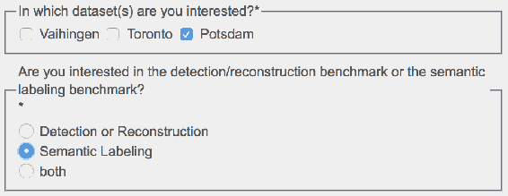

发布表格后，将向您发送电子邮件，从中可以下载数据。

# 为细分建模 FCN

导入库并获得输入的形状。 标签数定义为`6`：

```py
from .resnet50 import ResNet50
nb_labels = 6   img_height, img_width, _ = input_shape
input_tensor = tf.keras.layers.Input(shape=input_shape)
weights = 'imagenet'
```

在 ImageNet 上预先训练的`ResNet`模型将用作基本模型。 以下代码可用于使用`ResNet`定义基本模型：

```py
resnet50_model = ResNet50(
    include_top=False, weights='imagenet', input_tensor=input_tensor)
```

现在，我们将使用以下代码从`ResNet`中获取最后三层：

```py
final_32 = resnet50_model.get_layer('final_32').output
final_16 = resnet50_model.get_layer('final_16').output
final_x8 = resnet50_model.get_layer('final_x8').output
```

必须压缩每个跳过连接以匹配等于标签数的通道：

```py

c32 = tf.keras.layers.Conv2D(nb_labels, (1, 1))(final_32)
c16 = tf.keras.layers.Conv2D(nb_labels, (1, 1))(final_16)
c8 = tf.keras.layers.Conv2D(nb_labels, (1, 1))(final_x8)
```

可以使用双线性插值来调整压缩跳过连接的输出大小。 可以通过使用可以计算 TensorFlow 操作的`Lambda`层来实现插值。 以下代码段可用于使用 lambda 层进行插值：

```py
def resize_bilinear(images):
    return tf.image.resize_bilinear(images, [img_height, img_width])

r32 = tf.keras.layers.Lambda(resize_bilinear)(c32)
r16 = tf.keras.layers.Lambda(resize_bilinear)(c16)
r8 = tf.keras.layers.Lambda(resize_bilinear)(c8)
```

使用以下代码，可以通过添加三个值来合并我们定义的三层：

```py
m = tf.keras.layers.Add()([r32, r16, r8])
```

可以使用 softmax 激活来应用模型的概率。 在应用 softmax 之前和之后调整模型大小：

```py
x = tf.keras.ayers.Reshape((img_height * img_width, nb_labels))(m)
x = tf.keras.layers.Activation('img_height')(x)
x = tf.keras.layers.Reshape((img_height, img_width, nb_labels))(x)

fcn_model = tf.keras.models.Model(input=input_tensor, output=x)
```

已经定义了一个简单的 FCN 层，经过训练后，它会产生以下结果：


您会看到六个标签的预测是合理的。 接下来，我们将学习分割实例。

# 分割实例

在分析图像时，我们的兴趣只会吸引到图像中的某些实例。 因此，它不得不从图像的其余部分中分割这些实例。 从其余信息中分离所需信息的过程被广泛称为**分割实例**。 在此过程中，首先拍摄输入图像，然后将边界框与对象一起定位，最后，将为每个类别预测逐像素掩码。 对于每个对象，都将计算像素级精度。 有几种用于分割实例的算法。 最近的算法之一是 He 等人提出的 [**Mask RCNN** 算法](https://arxiv.org/pdf/1703.06870.pdf)。 下图描绘了 Mask R-CNN 的体系结构：

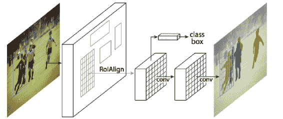

经 He 等人许可复制。

该架构看起来与 R-CNN 类似，但增加了分段功能。 这是一个具有端到端培训的多阶段网络。 学习了区域提案。 该网络分为两个部分，一个用于检测，另一个用于分类评分。 结果非常好，如下所示：

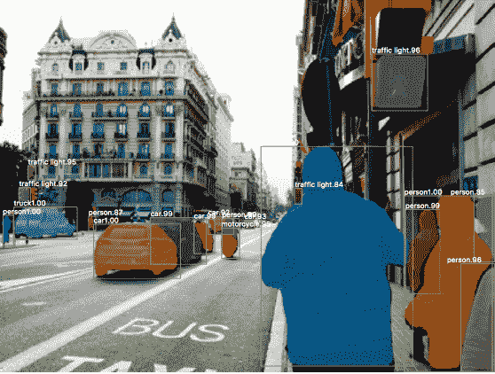

该图说明了分割实例的过程，请注意，准确地检测了对象并进行了相应的分割。

同一网络还可以预测人的姿势。 分割和检测这两个任务是并行处理的。

# 摘要

在本章中，我们学习了各种分割算法。 我们还看到了用于基准测试的数据集和指标。 我们将学到的技术应用于卫星和医学图像的细分。 最后，我们谈到了 Mask R-CNN 算法的实例分割。

在下一章中，我们将学习相似性学习。 相似性学习模型学习两个图像之间的比较机制。 对于面部识别等多种应用很有用。 我们将学习几种可用于相似性学习的模型架构。