# 图片字幕

在本章中，我们将处理字幕图像的问题。 这涉及到检测对象，并且还提出了图像的文本标题。 图像字幕也可以称为**图像文本转换**。 曾经被认为是一个非常棘手的问题，我们现在在此方面取得了相当不错的成绩。 对于本章，需要具有相应标题的图像数据集。 在本章中，我们将详细讨论图像字幕的技术和应用。

我们将在本章介绍以下主题：

*   了解用于评估它们的不同数据集和指标
*   了解用于自然语言处理问题的一些技巧
*   向量模型的不同词
*   几种用于图像字幕的算法
*   不良结果和改进范围

# 了解问题和数据集

自动生成图像标题的过程是一项重要的深度学习任务，因为它结合了语言和视觉这两个世界。 该问题的独特性使其成为计算机视觉中的主要问题之一。 用于图像字幕的深度学习模型应该能够识别图像中存在的对象，并能够以自然语言生成表示对象与动作之间关系的文本。 此问题的数据集很少。 其中最著名的数据集是第 4 章，“对象检测”中对象检测中涵盖的 COCO 数据集的扩展。

# 了解用于图像字幕的自然语言处理

由于必须从图像中生成自然语言，因此熟悉**自然语言处理**（**NLP**）变得很重要。 NLP 的概念是一个广泛的主题，因此我们将范围限制为与图像字幕相关的主题。 自然语言的一种形式是**文本**。 文本是单词或字符的序列。 文本的原子元素称为**令牌**，它是**字符**的序列。 字符是文本的原子元素。

为了处理文本形式的任何自然语言，必须通过删除标点符号，方括号等对文本进行预处理。 然后，必须通过将文本分隔为空格来将文本标记为单词。 然后，必须将单词转换为向量。 接下来，我们将看到矢量转换如何提供帮助。

# 以矢量形式表达单词

矢量形式的单词可以帮助自己执行算术运算。 向量必须紧凑，尺寸较小。 同义词应具有相似的向量，而反义词应具有不同的向量。 可以将单词转换为向量，以便可以如下所示比较关系：

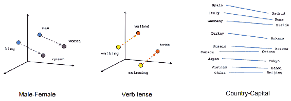

该向量算法使得能够在不同实体之间的语义空间中进行比较。 接下来，我们将看到如何创建可将单词转换为矢量表示的深度学习模型。

# 将单词转换为矢量

通过在大型文本语料库上训练模型，可以将单词转换为向量。 训练模型，使得给定一个单词，该模型可以预测附近的单词。 在预测附近单词的单次热编码之前，首先对单词进行单次热编码，然后进行隐藏层。 以这种方式进行训练将创建单词的紧凑表示。 可以通过两种方式获得单词的上下文，如下所示：

*   **跳跃图**（**SkipGram**）：给定一个单词，尝试预测几个接近的单词
*   **连续词袋**（**CBOW**）：通过给定一组词来预测一个词，从而跳过跳跃语法

下图说明了这些过程：

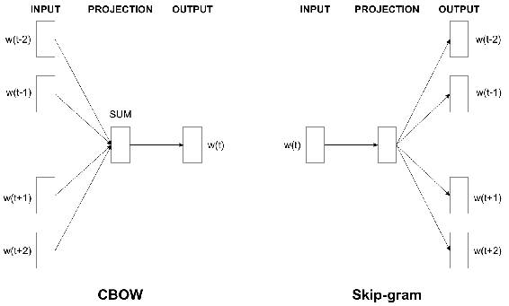

两种方法均显示出良好的结果。 单词在嵌入空间中转换为向量。 接下来，我们将看到训练嵌入空间的详细信息。

# 训练嵌入

可以使用如下所示的模型来训练嵌入：

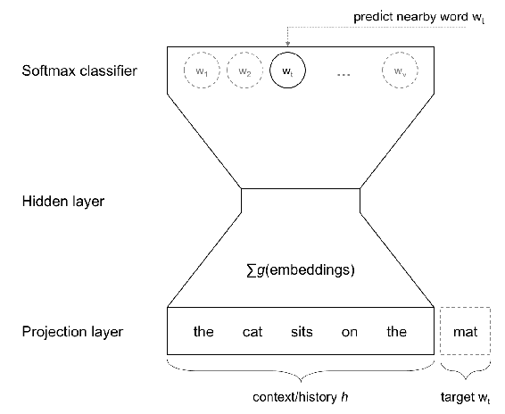

如上图所示，目标词是根据上下文或历史预测的。 该预测基于 **Softmax 分类器**。 隐藏层将嵌入作为紧凑的表示形式学习。 请注意，这不是完整的深度学习模型，但它仍然可以正常工作。 这是嵌入的低维可视化：

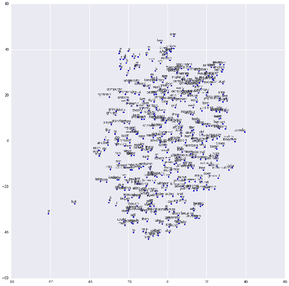

使用 Softmax 分类器的嵌入的低维可视化

该可视化使用 TensorBoard 生成。 具有相似语义或不同词性的单词会一起出现。

我们已经学习了如何训练用于生成文本的紧凑表示。 接下来，我们将看到图像字幕的方法。

# 图像字幕处理方法及相关问题

已经提出了几种对图像进行字幕的方法。 直观地，将图像转换为视觉特征，并从这些特征生成文本。 生成的文本将采用词嵌入的形式。 生成文本的一些主要方法涉及 LSTM 和关注。 让我们从使用旧的生成文本的方法开始。

# 使用条件随机场链接图像和文本

Kulkarni 等人在[论文](http://www.tamaraberg.com/papers/generation_cvpr11.pdf)中，提出了一种从图像中查找对象和属性并使用它来生成文本的方法。 **条件随机场**（**CRF**）。 传统上，CRF 用于结构化预测，例如文本生成。 生成文本的流程如下所示：

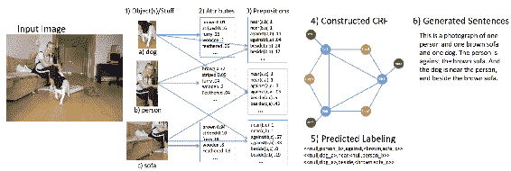

该图说明了使用 CRF 生成文本的过程（摘自 Kulkarni 等人）

CRF 的使用在以适当的前置词以连贯的方式生成文本方面存在局限性。 结果显示在这里：

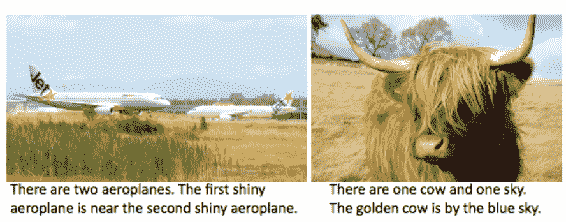

复制自 Kulkarni 等人

结果对对象和属性具有正确的预测，但无法生成良好的描述。

# 在 CNN 功能上使用 RNN 生成字幕

Vinyals 等人在[论文](https://arxiv.org/pdf/1411.4555.pdf)中提出了一种端到端可训练的深度学习用于图像字幕的方法，该方法将 CNN 和 RNN 背靠背地堆叠在一起。 这是一个端到端的可训练模型。 结构如下所示：

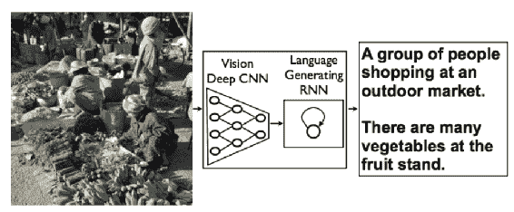

转载自 Vinyals 等人（2015 年）

该模型可以生成以自然语言完成的句子。 CNN 和 **LSTM** 的展开图如下所示：

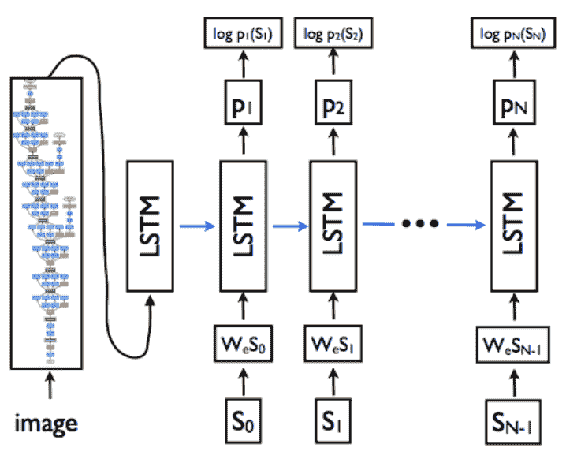

该图说明了 CNN 和 LSTM 架构（摘自 Vinyals 等人）

这是 **LSTM** 的展开视图。 此处显示了一组选择性的结果：

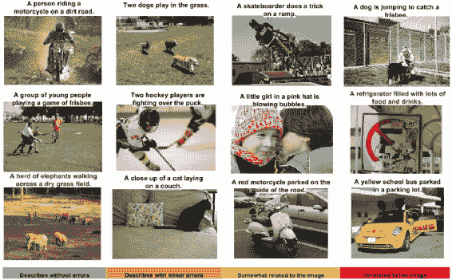

转载自 Vinyals 等人（2015 年）

在此过程中，CNN 将图像编码为特征，RNN 从中生成句子。

# 使用图像排名创建字幕

Ordonez 等人在[论文](http://papers.nips.cc/paper/4470-im2text-describing-images-using-1-million-captioned-photographs.pdf)中，提出了一种方法对图像进行排名，然后生成标题。 此过程的流程如下所示：


复制自 Ordonez 等人（2015）

从排名图像中提取的高级信息可用于生成文本。 下图显示，可用于排名的图像越多，结果将越好：


复制自 Ordonez 等人（2015）

# 从图像检索字幕和从字幕检索图像

Chen 等人在[论文](https://www.cs.cmu.edu/~xinleic/papers/cvpr15_rnn.pdf)中，提出了一种从文本中检索图像和从图像中检索文本的方法。 这是双向映射。 下图显示了一个用自然语言解释图像的人和另一个在视觉上思考它的人：

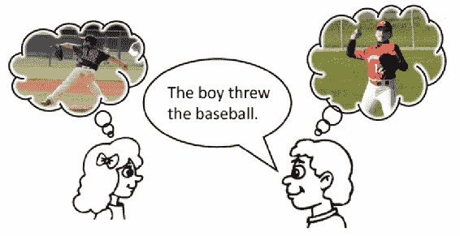

转载自 Chen 等人（2015）

检索字幕可以通过以下方式通过潜在空间连接图像和文本的编码器来实现：

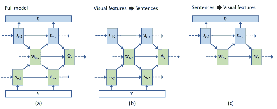

转载自 Chen 等人（2015）

图像中的第一个模型是用于训练的完整模型。 如图中所示，视觉功能也可以用于生成句子，反之亦然。

# 密集字幕

Johnson 等人在[论文](https://www.cv-foundation.org/openaccess/content_cvpr_2016/papers/Johnson_DenseCap_Fully_Convolutional_CVPR_2016_paper.pdf)中，提出了一种用于密集字幕的方法。 首先，让我们看一些结果，以了解任务：

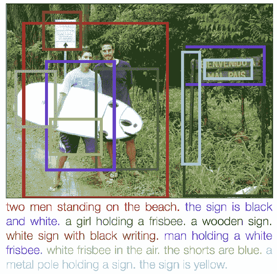

转载自 Johnson 等人

如您所见，为图像中的对象和动作生成了单独的标题； 由此得名; **密集字幕**。 这是 Johnson 等人提出的架构：

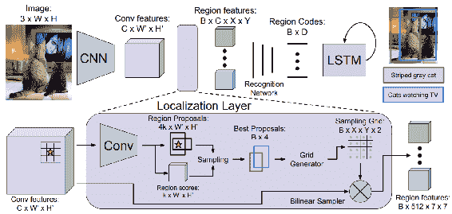

转自 Johnson 等人

该体系结构实质上是 Faster-RCNN 和 **LSTM** 的组合。 产生该区域以产生对象检测结果，并且使用该区域的视觉特征来产生字幕。

# 使用 RNN 字幕

Donahue 等人在[论文](https://arxiv.org/pdf/1411.4389.pdf)中，提出了**长期循环卷积网络**（**LRCN**） 用于图像字幕的任务。 此模型的体系结构如下所示：

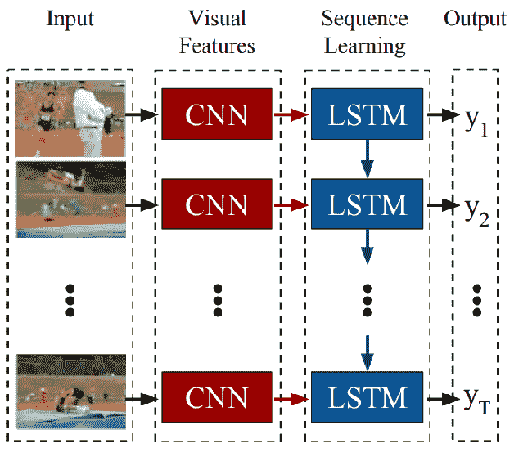

转载自 Donahue 等人

图中显示了 CNN 和 LSTM 在整个时间上的权重，这使得该方法可扩展到任意长序列。

# 使用多峰度量空间

Mao 等人在[论文](http://papers.nips.cc/paper/4470-im2text-describing-images-using-1-million-captioned-photographs.pdf)中提出了一种使用**多模态嵌入空间**生成字幕的方法。 下图说明了这种方法：

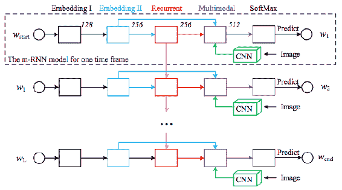

转自毛等人。

Kiros 等人在[论文](https://arxiv.org/pdf/1411.2539.pdf)中提出了另一种生成字幕的多模态方法，该方法可以将图像和文本嵌入同一多模态空间。 下图说明了这种方法：


复制自 Kiros 等人

两种多模式方法都给出了良好的结果。

# 使用注意力网络进行字幕

Xu 等人在[论文](https://arxiv.org/pdf/1502.03044.pdf)中，提出了一种使用**注意力机制**进行图像字幕的方法。 注意力机制对图像的某些区域比其他区域赋予更多权重。 注意还可以实现可视化，向我们展示模型生成下一个单词时所关注的位置。 建议的模型如下所示：

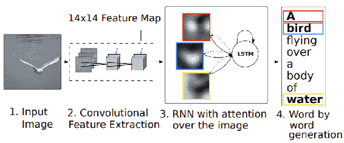

转载自徐等人。

首先，从图像中提取 CNN 特征。 然后，将关注的 RNN 应用于生成单词的图像。

# 知道什么时候看

[Lu 等人](https://arxiv.org/pdf/1612.01887.pdf)提出了一种引起关注的方法，可提供出色的结果。 知道何时看待注意力捕获的区域会产生更好的结果。 流程如下所示：

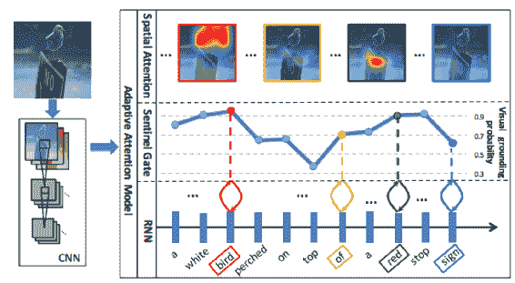

摘自 Lu 等人

注意力机制如下所示：

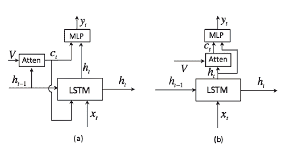

摘自 Lu 等人

结果重点突出的区域如下：

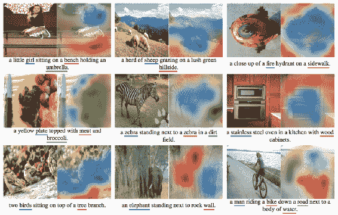

摘自 Lu 等人

生成字幕时注意力的释放在此处可视化：


摘自 Lu 等人

我们已经看到，用于生成字幕几种方法。 接下来，我们将看到一个实现。

# 实施基于注意力的图像字幕

让我们使用以下代码从 VGG 和 LSTM 模型定义 CNN：

```py
vgg_model = tf.keras.applications.vgg16.VGG16(weights='imagenet',
  include_top=False,
  input_tensor=input_tensor,
  input_shape=input_shape)

word_embedding = tf.keras.layers.Embedding(
    vocabulary_size, embedding_dimension, input_length=sequence_length)
embbedding = word_embedding(previous_words)
embbedding = tf.keras.layers.Activation('relu')(embbedding)
embbedding = tf.keras.layers.Dropout(dropout_prob)(embbedding)

cnn_features_flattened = tf.keras.layers.Reshape((height * height, shape))(cnn_features)
net = tf.keras.layers.GlobalAveragePooling1D()(cnn_features_flattened)

net = tf.keras.layers.Dense(embedding_dimension, activation='relu')(net)
net = tf.keras.layers.Dropout(dropout_prob)(net)
net = tf.keras.layers.RepeatVector(sequence_length)(net)
net = tf.keras.layers.concatenate()([net, embbedding])
net = tf.keras.layers.Dropout(dropout_prob)(net)
```

现在，我们已经定义了 CNN，接下来使用以下代码定义关注层：

```py
h_out_linear = tf.keras.layers.Convolution1D(
    depth, 1, activation='tanh', border_mode='same')(h)
h_out_linear = tf.keras.layers.Dropout(
    dropout_prob)(h_out_linear)
h_out_embed = tf.keras.layers.Convolution1D(
    embedding_dimension, 1, border_mode='same')(h_out_linear)
z_h_embed = tf.keras.layers.TimeDistributed(
    tf.keras.layers.RepeatVector(num_vfeats))(h_out_embed)

Vi = tf.keras.layers.Convolution1D(
    depth, 1, border_mode='same', activation='relu')(V)

Vi = tf.keras.layers.Dropout(dropout_prob)(Vi)
Vi_emb = tf.keras.layers.Convolution1D(
    embedding_dimension, 1, border_mode='same', activation='relu')(Vi)

z_v_linear = tf.keras.layers.TimeDistributed(
    tf.keras.layers.RepeatVector(sequence_length))(Vi)
z_v_embed = tf.keras.layers.TimeDistributed(
    tf.keras.layers.RepeatVector(sequence_length))(Vi_emb)

z_v_linear = tf.keras.layers.Permute((2, 1, 3))(z_v_linear)
z_v_embed = tf.keras.layers.Permute((2, 1, 3))(z_v_embed)

fake_feat = tf.keras.layers.Convolution1D(
    depth, 1, activation='relu', border_mode='same')(s)
fake_feat = tf.keras.layers.Dropout(dropout_prob)(fake_feat)

fake_feat_embed = tf.keras.layers.Convolution1D(
    embedding_dimension, 1, border_mode='same')(fake_feat)
z_s_linear = tf.keras.layers.Reshape((sequence_length, 1, depth))(fake_feat)
z_s_embed = tf.keras.layers.Reshape(
    (sequence_length, 1, embedding_dimension))(fake_feat_embed)

z_v_linear = tf.keras.layers.concatenate(axis=-2)([z_v_linear, z_s_linear])
z_v_embed = tf.keras.layers.concatenate(axis=-2)([z_v_embed, z_s_embed])

z = tf.keras.layers.Merge(mode='sum')([z_h_embed,z_v_embed])
z = tf.keras.layers.Dropout(dropout_prob)(z)
z = tf.keras.layers.TimeDistributed(
    tf.keras.layers.Activation('tanh'))(z)
attention= tf.keras.layers.TimeDistributed(
    tf.keras.layers.Convolution1D(1, 1, border_mode='same'))(z)

attention = tf.keras.layers.Reshape((sequence_length, num_vfeats))(attention)
attention = tf.keras.layers.TimeDistributed(
    tf.keras.layers.Activation('softmax'))(attention)
attention = tf.keras.layers.TimeDistributed(
    tf.keras.layers.RepeatVector(depth))(attention)
attention = tf.keras.layers.Permute((1,3,2))(attention)
w_Vi = tf.keras.layers.Add()([attention,z_v_linear])
sumpool = tf.keras.layers.Lambda(lambda x: K.sum(x, axis=-2),
  output_shape=(depth,))
c_vec = tf.keras.layers.TimeDistributed(sumpool)(w_Vi)
atten_out = tf.keras.layers.Merge(mode='sum')([h_out_linear,c_vec])
h = tf.keras.layers.TimeDistributed(
    tf.keras.layers.Dense(embedding_dimension,activation='tanh'))(atten_out)
h = tf.keras.layers.Dropout(dropout_prob)(h)

predictions = tf.keras.layers.TimeDistributed(
    tf.keras.layers.Dense(vocabulary_size, activation='softmax'))(h)
```

在前面的代码的帮助下，我们定义了一个深度学习模型，该模型将 CNN 功能与 RNN 结合在一起，并借助注意力机制。 目前，这是生成字幕的最佳方法。

# 摘要

在本章中，我们已经了解了与图像标题相关的问题。 我们看到了一些涉及自然语言处理和各种`word2vec`模型（例如`GLOVE`）的技术。 我们了解了`CNN2RNN`，度量学习和组合目标等几种算法。 后来，我们实现了一个结合了 CNN 和 LSTM 的模型。

在下一章中，我们就来了解生成模型。 我们将从头开始学习和实现样式算法，并介绍一些最佳模型。 我们还将介绍很酷的**生成对抗网络**（**GAN**）及其各种应用。