# 生成模型

生成模型已经成为计算机视觉中的重要应用。 与前几章讨论的应用程序根据图像进行预测不同，生成模型可以为特定目标创建图像。 在本章中，我们将了解：

*   生成模型的应用
*   样式转移算法
*   训练超分辨率图像模型
*   生成模型的实施和培训
*   当前模型的缺点

在本章的最后，您将能够实现一些出色的应用程序来传递样式，并理解与生成模型相关的可能性和困难。

# 生成模型的应用

让我们从生成模型的可能应用开始本章。 应用程序是巨大的。 我们将看到其中一些应用程序，以了解动机和可能性。

# 艺术风格转移

艺术风格转移是将艺术风格转移到任何图像的过程。 例如，可以使用一幅图像的艺术风格和另一幅图​​像的内容来创建图像。 Gatys 等人在此显示了一个结合了几种不同样式的图像示例。 （ [https://www.cv-foundation.org/openaccess/content_cvpr_2016/papers/Gatys_Image_Style_Transfer_CVPR_2016_paper.pdf](https://www.cv-foundation.org/openaccess/content_cvpr_2016/papers/Gatys_Image_Style_Transfer_CVPR_2016_paper.pdf) ）。 图像 **A** 是应用了样式的照片，其结果显示在其他图像中：

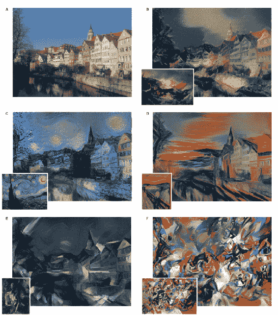

转载自盖蒂斯等。

此应用程序引起了公众的注意，并且市场上有几种提供此功能的移动应用程序。

# 预测视频中的下一帧

可以使用生成模型从合成视频集中预测未来的帧。 在下面由 Lotter 等人提出的图像中。 （ [https://arxiv.org/pdf/1511.06380.pdf](https://arxiv.org/pdf/1511.06380.pdf) ）左侧的图像是前一帧的模型，而右侧的图像相对于前一帧有两种算法 基本事实：

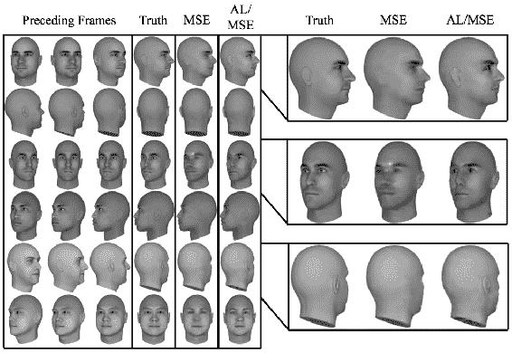

复制自 Lotter 等。

生成模型生成的框架将是现实的。

# 图像超分辨率

**超分辨率**是从较小的图像创建高分辨率图像的过程。 传统上，插值用于创建更大的图像。 但是插值通过提供平滑效果而错过了高频细节。 经过训练的生成模型针对此超分辨率的特定目的而创建的图像具有出色的细节。 以下是 Ledig 等人提出的此类模型的示例。 （ [https://arxiv.org/pdf/1609.04802.pdf](https://arxiv.org/pdf/1609.04802.pdf) ）。 左侧是通过 **4 倍缩放**生成的，看起来与右侧的原件没有区别：

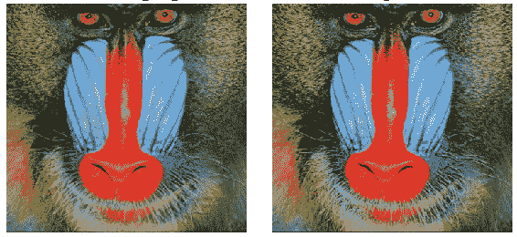

转自 Ledig 等。

超分辨率对于在高质量的显示器或打印件上呈现低分辨率的图像很有用。 另一个应用可能是重建高质量的压缩图像。

# 交互式图像生成

生成模型可用于通过**交互作用**创建图像。 用户可以添加编辑内容，并且可以生成图像，以反映编辑内容，如 Zhu 等人建议的那样。 （ [https://arxiv.org/pdf/1609.03552v2.pdf](https://arxiv.org/pdf/1609.03552v2.pdf) ）：

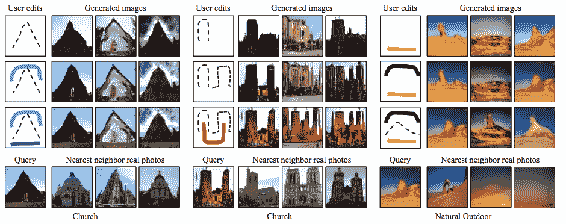

复制自 Zhu 等。

如图所示，图像是根据编辑的形状和颜色生成的。 底部的绿色笔触创建了草原，矩形创建了摩天大楼，依此类推。 图像将被生成并通过用户的进一步输入进行微调。 生成的图像还可以用于检索可以利用的最相似的真实图像。 提供交互式图像生成是一种直观搜索图像的全新方法。

# 图像到图像的翻译

图像可用于生成具有特定目标的其他图像，因此此过程称为**图像到图像的转换**。 此处显示了此类翻译的一些示例，以及由 Isola 等人提出的相应标准。 （ [https://arxiv.org/pdf/1611.07004.pdf](https://arxiv.org/pdf/1611.07004.pdf) ）：

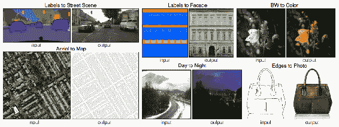

复制自 Isola 等。

带有标签的图形可以转换为逼真的图像以用于创意目的。 黑白图像可以转换为彩色图像。 这样的翻译对于照片编辑应用程序，为旧电影着色，服装设计等非常有用。

# 文字到图像的生成

可以从文本描述中生成图像，其步骤类似于图像到图像的翻译。 以下是一些由 Reed 等人展示的自然文本描述生成的示例。 （ [https://arxiv.org/pdf/1605.05396.pdf](https://arxiv.org/pdf/1605.05396.pdf) ）：

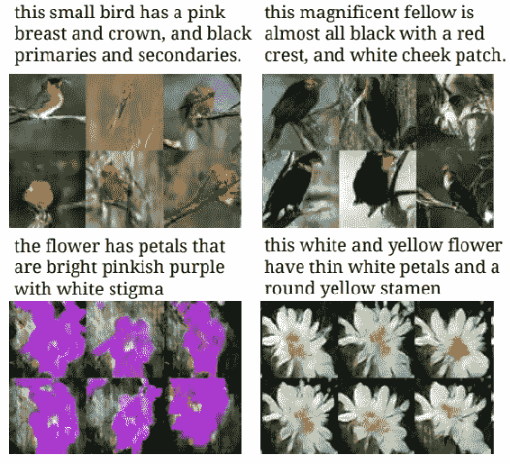

复制自 Reed 等。

当前，此模型仅适用于少数几个对象。 从文本生成图像还不够实际，无法在应用程序中使用。

# 修补

修复是填充图像中的间隙的过程，如下所示：

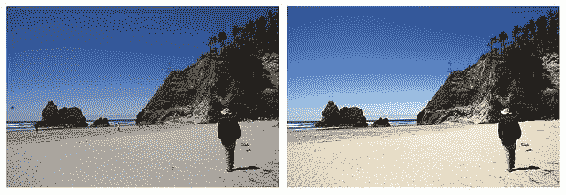

资料来源：https://www.flickr.com/photos/littleredelf/4756059924/

左侧的图像是正常图像，右侧的图像是经过处理的图像。 从图像中可以看到，不需要的东西已从图片中删除。 修补对于从图像中删除不需要的对象以及填充扫描图稿的空间很有用。

# 调和

融合是将图像的一部分平滑地粘贴到另一个图像上而没有任何伪影的过程。 此处显示的图像**和**表示一种图像放置在另一图像上的情况，给人留下不好的印象。 图像 **b** 和 **c** 代表传统的混合技术，例如**修正的 Poisson 方法**和**多样条方法[** 。

最终图像或图像 **d** 显示了混合生成方法的结果，该方法比 Wu 等人的其他方法提供了更好的结果。 （ [https://arxiv.org/pdf/1703.07195.pdf](https://arxiv.org/pdf/1703.07195.pdf) ）：

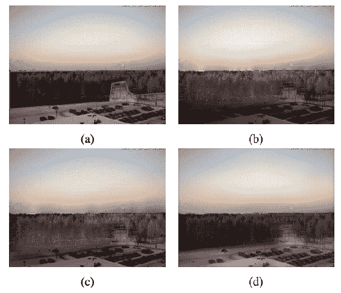

摘自 Wu 等。

混合对于照片编辑和电影行业中的特殊效果非常有用。

# 转换属性

可以使用生成模型来更改图像的属性。 兰珀（Lample）等人在此显示，可以修改人的脸部以反映不同的属性，例如性别，眼镜，年龄等。 （ [https://research.fb.com/wp-content/uploads/2017/11/fader_networks__conditional_attribute_based_image_generation_by_disentangling_in_latent_space.pdf](https://research.fb.com/wp-content/uploads/2017/11/fader_networks__conditional_attribute_based_image_generation_by_disentangling_in_latent_space.pdf) ）：

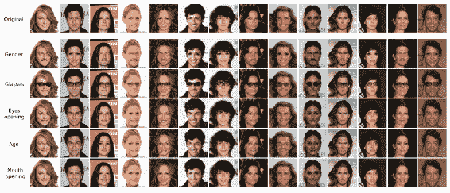

转载于 Lample 等人。

更改属性既可以用于创意应用程序，也可以用于娱乐，也可以用于生成更多具有变化的训练数据。

# 创建训练数据

生成模型可用于大规模生成训练，甚至可用于完善为训练而创建的合成图像。 这是使用 Wang 等人的生成模型为交通标志识别创建的合成图像。 （ [https://arxiv.org/pdf/1707.03124.pdf](https://arxiv.org/pdf/1707.03124.pdf) ）


转载自 Wang 等。

使用这些图像可以使分类更加准确。

# 创建新的动画角色

生成模型可用于创建具有各种条件的新动画角色，例如面部表情，发型，服装等，如 Jin 等人所示。 （ [https://arxiv.org/pdf/1708.05509.pdf](https://arxiv.org/pdf/1708.05509.pdf) ）：


转载自 Jin 等。

创建具有不同属性的新角色可以彻底改变动画产业。

# 照片的 3D 模型

我们可以使用生成模型从 2D 图像创建 3D 模型，如 Wu 等人所示。 （ [https://arxiv.org/pdf/1610.07584.pdf](https://arxiv.org/pdf/1610.07584.pdf) ）：


摘自 Wu 等。

从图像创建 3D 模型对于机器人技术，增强现实和动画行业很有用。 在以下各节中，我们将学习它们背后的算法。 在下一节中，我们将实现神经艺术风格的转换。

# 神经艺术风格的转移

我们将要实现的第一个应用程序是**神经艺术风格转换**。 在这里，我们将 **Van Gogh** 艺术的样式转移到图像上。 图像可以视为样式和内容的组合。 艺术风格转换技术将图像转换为看起来像具有特定绘画风格的绘画。 我们将看到如何编写这个想法。 `loss`功能将比较生成的图像与照片内容和绘画风格。 因此，针对图像像素而不是针对网络权重执行优化。 通过将照片的内容与生成的图像相比较，然后是绘画风格和生成的图像，可以计算出两个值。

# 内容丢失

由于像素不是一个好的选择，我们将使用各个图层的 CNN 功能，因为它们可以更好地表示内容。 如 [第 3 章](../Text/03.html)，*图像检索*， 所示，初始层具有高频，例如边缘，拐角和纹理。 后面的层代表对象，因此更适合内容。 后者可以比像素更好地将*对象与*对象进行比较。 但是为此，我们需要先使用以下代码导入所需的库：

```py
import numpy as np
from PIL import Image
from scipy.optimize import fmin_l_bfgs_b
from scipy.misc import imsave
from vgg16_avg import VGG16_Avg
from keras import metrics
from keras.models import Model
from keras import backend as K
```

现在，让我们使用以下命令加载所需的图像：

```py
content_image = Image.open(work_dir + 'bird_orig.png')
```

我们将在此实例中使用以下图片：

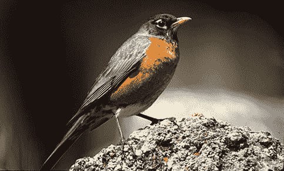

当我们使用 VGG 架构提取特征时，必须从所有图像中减去所有`ImageNet`图像的均值，如以下代码所示：

```py
imagenet_mean = np.array([123.68, 116.779, 103.939], dtype=np.float32)

def subtract_imagenet_mean(image):
    return (image - imagenet_mean)[:, :, :, ::-1]
```

请注意，通道是不同的。 `preprocess`函数拍摄生成的图像并减去平均值，然后反转通道。 `deprocess`函数由于进行了预处理步骤而使效果相反，如以下代码所示：

```py
def add_imagenet_mean(image, s):
    return np.clip(image.reshape(s)[:, :, :, ::-1] + imagenet_mean, 0, 255)
```

首先，我们将了解如何使用其他图像中的内容创建图像。 这是根据**随机噪声** 创建图像的过程。 此处使用的内容是某层中**激活**的总和。 我们将使随机噪声和图像之间的内容损失最小化，这被称为内容损失。 该损耗类似于逐像素损耗，但应用于层激活，因此将捕获内容而没有噪声。 任何 CNN 体系结构都可以用来转发内容图像和随机噪声。 比较这两个输出的激活，进行激活并计算均方误差。

冻结 CNN 权重时，将更新随机图像的像素。 在这种情况下，我们将冻结 VGG 网络。 现在，可以加载 VGG 模型。 生成图像对子采样技术（例如 **max pooling** ）非常敏感。 无法从最大池中取回像素值。 因此，**平均池**比最大池更平滑。 使用平均池转换 VGG 模型的功能用于加载模型，如下所示：

```py
vgg_model = VGG16_Avg(include_top=False)
```

请注意，即使合并类型已更改，此模型的权重也与原始模型相同。 ResNet 和 Inception 模型不适合此操作，因为它们无法提供各种抽象。 我们将从模型冻结的最后一个 VGG 模型的卷积层`block_conv1`中获取激活。 这是 VGG 的第三层，具有广阔的接收范围。 这里给出了相同的代码供您参考：

```py
content_layer = vgg_model.get_layer('block5_conv1').output
```

现在，使用截断的 VGG 创建新模型，直到具有良好功能的图层。 因此，该图像现在可以加载，并且可以用于执行前向推断，以获得**实际激活的层**。 使用以下代码创建 TensorFlow 变量以捕获激活：

```py
content_model = Model(vgg_model.input, content_layer)
content_image_array = subtract_imagenet_mean(np.expand_dims(np.array(content_image), 0))
content_image_shape = content_image_array.shape
target = K.variable(content_model.predict(content_image_array))
```

让我们定义一个评估器类，以计算图像的损耗和梯度。 下列类在迭代的任意点返回损耗和梯度值：

```py
class ConvexOptimiser(object):
    def __init__(self, cost_function, tensor_shape):
        self.cost_function = cost_function
        self.tensor_shape = tensor_shape
        self.gradient_values = None    def loss(self, point):
        loss_value, self.gradient_values = self.cost_function([point.reshape(self.tensor_shape)])
        return loss_value.astype(np.float64)

    def gradients(self, point):
        return self.gradient_values.flatten().astype(np.float64)
```

损失函数可以定义为特定卷积层的激活值之间的均方误差。 损失将在生成的图像和原始内容照片的层之间进行计算，如下所示：

```py
mse_loss = metrics.mean_squared_error(content_layer, target)
```

可以通过考虑模型的输入来计算损耗的梯度，如下所示：

```py
grads = K.gradients(mse_loss, vgg_model.input)
```

函数的输入是模型的输入，输出将是损耗和梯度值的数组，如下所示：

```py
cost_function = K.function([vgg_model.input], [mse_loss]+grads)
```

此函数是确定性的要优化的，因此不需要 **SGD** ：

```py
optimiser = ConvexOptimiser(cost_function, content_image_shape)
```

可以使用简单的优化程序来优化此功能，因为它是凸的，因此是确定性的。 我们还可以在迭代的每个步骤中保存图像。 我们将以可访问渐变的方式进行定义，就像我们使用 scikit-learn 的优化程序进行最终优化一样。 注意，该损失函数是凸的，因此，简单的优化器足以满足计算要求。 可以使用以下代码定义优化器：

```py
def optimise(optimiser, iterations, point, tensor_shape, file_name):
    for i in range(iterations):
        point, min_val, info = fmin_l_bfgs_b(optimiser.loss, point.flatten(),
  fprime=optimiser.gradients, maxfun=20)
        point = np.clip(point, -127, 127)
        print('Loss:', min_val)
        imsave(work_dir + 'gen_'+file_name+'_{i}.png', add_imagenet_mean(point.copy(), tensor_shape)[0])
    return point
```

优化器采用`loss`函数，点和渐变，然后返回更新。 需要使用以下代码生成随机图像，以使内容损失最小化：

```py
def generate_rand_img(shape):
    return np.random.uniform(-2.5, 2.5, shape)/1 generated_image = generate_rand_img(content_image_shape)
```

这是创建的随机图像：

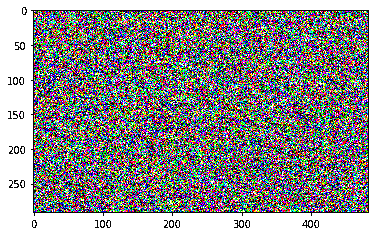

该优化可以运行 10 次迭代以查看结果，如下所示：

```py
iterations = 10 generated_image = optimise(optimiser, iterations, generated_image, content_image_shape, 'content')
```

如果一切顺利，那么在迭代过程中，损失应如下图所示：

```py
Current loss value: 73.2010421753
Current loss value: 22.7840042114
Current loss value: 12.6585302353
Current loss value: 8.53817081451
Current loss value: 6.64649534225
Current loss value: 5.56395864487
Current loss value: 4.83072710037
Current loss value: 4.32800722122
Current loss value: 3.94804215431
Current loss value: 3.66387653351
```

这是生成的图像，现在，它看起来几乎像只鸟。 可以运行优化以进行进一步的迭代以完成此操作：

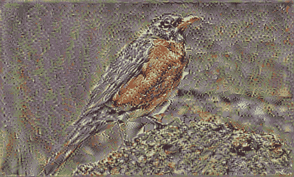

优化器拍摄图像并更新像素，以使内容相同。 虽然效果较差，但可以在一定程度上重现图像内容。 通过迭代获得的所有图像都很好地说明了图像的生成方式。 此过程不涉及批处理。 在下一节中，我们将看到如何以绘画风格创建图像。

# 使用 Gram 矩阵的样式损失

创建具有原始图像内容的图像后，我们将看到如何仅使用样式创建图像。 样式可以认为是图像颜色和纹理的混合。 为此，我们将定义样式丢失。 首先，我们将覆盖图像并将其转换为数组，如以下代码所示：

```py
style_image = Image.open(work_dir + 'starry_night.png')
style_image = style_image.resize(np.divide(style_image.size, 3.5).astype('int32'))
```

这是我们加载的样式图像：

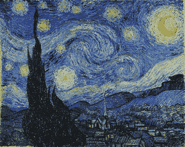

现在，我们将使用以下代码通过更改通道对该图像进行预处理：

```py
style_image_array = subtract_imagenet_mean(np.expand_dims(style_image, 0)[:, :, :, :3])
style_image_shape = style_image_array.shape
```

为此，我们将考虑以下几层，就像我们在以下代码中所做的那样：

```py
model = VGG16_Avg(include_top=False, input_shape=shp[1:])
outputs = {l.name: l.output for l in model.layers}
```

现在，我们将使用以下代码将多层作为前四个块的数组输出：

```py
layers = [outputs['block{}_conv1'.format(o)] for o in range(1,3)]
```

现在创建一个新模型，该模型可以使用以下代码输出所有这些层并分配目标变量：

```py
layers_model = Model(model.input, layers)
targs = [K.variable(o) for o in layers_model.predict(style_arr)]
```

使用 **Gram 矩阵**计算样式损失。 革兰氏矩阵是矩阵及其转置的乘积。 激活值可以简单地转置和相乘。 然后将此矩阵用于计算样式和随机图像之间的误差。 克矩阵会丢失位置信息，但会保留纹理信息。 我们将使用以下代码定义 Gram 矩阵：

```py
def grammian_matrix(matrix):
    flattened_matrix = K.batch_flatten(K.permute_dimensions(matrix, (2, 0, 1)))
    matrix_transpose_dot = K.dot(flattened_matrix, K.transpose(flattened_matrix))
    element_count = matrix.get_shape().num_elements()
    return matrix_transpose_dot / element_count
```

您可能现在已经知道，它是一对列之间的相关性的度量。 高度和宽度尺寸被展平。 这不包括任何本地信息，因为坐标信息被忽略。 样式损失计算输入图像的 Gram 矩阵与目标之间的均方误差，如以下代码所示：

```py
def style_mse_loss(x, y):
    return metrics.mse(grammian_matrix(x), grammian_matrix(y))
```

现在，我们使用以下代码通过汇总各层的所有激活来计算损失：

```py
style_loss = sum(style_mse_loss(l1[0], l2[0]) for l1, l2 in zip(style_features, style_targets))
grads = K.gradients(style_loss, vgg_model.input)
style_fn = K.function([vgg_model.input], [style_loss]+grads)
optimiser = ConvexOptimiser(style_fn, style_image_shape)
```

然后，通过创建随机图像，以与以前相同的方式解决它。 但是这次，我们还将应用高斯滤波器，如以下代码所示：

```py
generated_image = generate_rand_img(style_image_shape)
```

生成的随机图像如下所示：

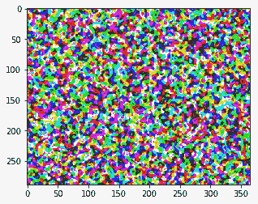

优化可以运行 10 次迭代以查看结果，如下所示：

```py
generated_image = optimise(optimiser, iterations, generated_image, style_image_shape)
```

如果一切顺利，求解器应打印类似于以下的损耗值：

```py
Current loss value: 5462.45556641
Current loss value: 189.738555908
Current loss value: 82.4192581177
Current loss value: 55.6530838013
Current loss value: 37.215713501
Current loss value: 24.4533748627
Current loss value: 15.5914745331
Current loss value: 10.9425945282
Current loss value: 7.66888141632
Current loss value: 5.84042310715
```

这是生成的图像：

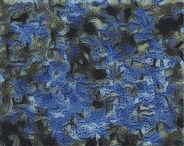

在这里，我们从随机噪声中创建了具有特定绘画风格的图像，而没有任何位置信息。 在下一节中，我们将看到如何结合使用-内容损失和样式损失。

# 风格转移

现在，我们知道了如何重建图像，以及如何构建捕获原始图像样式的图像。 显而易见的想法可能是通过加权并添加两个`loss`函数来将这两种方法结合起来，如以下代码所示：

```py
w,h = style.size
src = img_arr[:,:h,:w]
```

和以前一样，我们将获取一系列图层输出以计算样式损失。 但是，我们仍然只需要一层输出来计算内容损失。 我们如何知道要抓哪一层？ 如前所述，层越低，内容重构将越精确。 在将内容重建与样式相结合时，我们可以预期，对内容进行更宽松的重建将为样式带来更大的影响空间（例如：灵感）。 此外，即使没有相同的细节，后面的图层也可以确保图像看起来像相同的主题。 以下代码用于此过程：

```py
style_layers = [outputs['block{}_conv2'.format(o)] for o in range(1,6)]
content_name = 'block4_conv2'
content_layer = outputs[content_name]
```

现在，使用以下代码使用所需的输出层创建一个单独的样式模型：

```py
style_model = Model(model.input, style_layers)
style_targs = [K.variable(o) for o in style_model.predict(style_arr)]
```

我们还将使用以下代码为具有内容层的内容创建另一个模型：

```py
content_model = Model(model.input, content_layer)
content_targ = K.variable(content_model.predict(src))
```

现在，两种方法的合并就像合并它们各自的损失函数一样简单。 请注意，与我们之前的功能相反，此功能将产生三种不同类型的输出：

*   一个用于原始图像
*   一个用于模仿我们风格的图片
*   一个用于训练像素的随机图像

我们调整重建方式的一种方法是更改​​内容损失系数，此处为 1/10。 如果增加分母，则样式将对图像产生较大影响，而如果太大，则非结构化样式将掩盖图像的原始内容。 同样，如果它太小，则图像将没有足够的样式。 我们将在此过程中使用以下代码：

```py
style_wgts = [0.05,0.2,0.2,0.25,0.3] 
```

`loss`函数同时包含样式和内容层，如下所示：

```py
loss = sum(style_loss(l1[0], l2[0])*w
           for l1,l2,w in zip(style_layers, style_targs, style_wgts))
loss += metrics.mse(content_layer, content_targ)/10
grads = K.gradients(loss, model.input)
transfer_fn = K.function([model.input], [loss]+grads) evaluator  =  Evaluator(transfer_fn,  shp)
```

我们将使用以下代码像以前一样运行求解器 10 次迭代：

```py
iterations=10
x = rand_img(shp) x  =  solve_image(evaluator,  iterations,  x)
```

损耗值应按如下所示打印：

```py
Current loss value: 2557.953125
Current loss value: 732.533630371
Current loss value: 488.321166992
Current loss value: 385.827178955
Current loss value: 330.915924072
Current loss value: 293.238189697
Current loss value: 262.066864014
Current loss value: 239.34185791
Current loss value: 218.086700439
Current loss value: 203.045211792
```

这些结果是惊人的。 他们每个人都以艺术家的风格来完成原始图像的复制工作。 生成的图像如下所示：

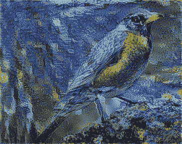

现在，我们将结束样式转换部分。 此操作确实很慢，但可以处理任何图像。 在下一节中，我们将看到如何使用类似的想法来创建超分辨率网络。 有几种方法可以改善这种情况，例如：

*   将 高斯 滤镜添加到随机图像
*   为图层添加不同的权重
*   可以使用不同的图层和权重来满足
*   初始化图像而不是随机图像
*   颜色可以保存
*   掩码可以用于 的，用于指定所需的内容
*   任何草图都可以转换为绘画
*   绘制草图并创建图像

通过训练 CNN 输出任何图像，都可以将其转换为艺术风格。

# 生成对抗网络

**生成对抗网络**（ **GAN** ）由 **Ian Goodfellow** 于 2014 年发明。这是一种无监督算法，其中两个神经网络被训练为鉴别器和生成器。 ， 同时。 该技术可以根据随机噪声生成图像，鉴别器可以评估是否为原始图像。 经过进一步培训后，生成器网络可以生成逼真的图像。 生成器网络通常是反卷积神经网络，而鉴别器是卷积神经网络。

理解这一点的一个很好的类比是，将生成器看作是伪造钱币的人，而将鉴别器看作是确定钱币是否为假币的警察。 生成器会根据警察的反馈不断提高伪钞的质量，直到警察无法区分伪钞和伪钞。 现在，让我们从实现开始。

# 甘香草

原始 GAN 称为**香草 GAN** 。 在构建模型之前，让我们定义一些对本章其余部分有用的层。 以下是`convolutional_layers`，其中添加了泄漏激活和正则化：

```py
def convolution_layer(input_layer,
  filters,
  kernel_size=[4, 4],
  activation=tf.nn.leaky_relu):
    layer = tf.layers.conv2d(
        inputs=input_layer,
  filters=filters,
  kernel_size=kernel_size,
  activation=activation,
  kernel_regularizer=tf.nn.l2_loss,
  bias_regularizer=tf.nn.l2_loss,
  )
    add_variable_summary(layer, 'convolution')
    return layer
```

接下来，我们将使用以下代码定义与带有正则化的`convolution_layer`相反的`transpose_convolution_layer`：

```py
def transpose_convolution_layer(input_layer,
  filters,
  kernel_size=[4, 4],
  activation=tf.nn.relu,
  strides=2):
    layer = tf.layers.conv2d_transpose(
        inputs=input_layer,
  filters=filters,
  kernel_size=kernel_size,
  activation=activation,
  strides=strides,
  kernel_regularizer=tf.nn.l2_loss,
  bias_regularizer=tf.nn.l2_loss,
  )
    add_variable_summary(layer, 'convolution')
    return layer
```

接下来，我们将使用以下代码定义一个具有非线性激活的密集层：

```py
def dense_layer(input_layer,
  units,
  activation=tf.nn.relu):
    layer = tf.layers.dense(
        inputs=input_layer,
  units=units,
  activation=activation
    )
    add_variable_summary(layer, 'dense')
    return layer
```

现在，我们将定义一个生成器，该生成器将噪声作为输入并变为图像。 发生器由几个完全连接的层组成，然后是转置卷积层以对噪声进行上采样。 最后，提出了卷积层以使噪声成为单个通道。 每层之间都有批量归一化层，以使梯度平滑流动。 我们将使用以下代码定义生成器：

```py
def get_generator(input_noise, is_training=True):
    generator = dense_layer(input_noise, 1024)
    generator = tf.layers.batch_normalization(generator, training=is_training)
    generator = dense_layer(generator, 7 * 7 * 256)
    generator = tf.layers.batch_normalization(generator, training=is_training)
    generator = tf.reshape(generator, [-1, 7, 7, 256])
    generator = transpose_convolution_layer(generator, 64)
    generator = tf.layers.batch_normalization(generator, training=is_training)
    generator = transpose_convolution_layer(generator, 32)
    generator = tf.layers.batch_normalization(generator, training=is_training)
    generator = convolution_layer(generator, 3)
    generator = convolution_layer(generator, 1, activation=tf.nn.tanh)
    return generator
```

现在，我们将定义 GAN 的**鉴别器**部分，该部分可拍摄图像并尝试区分假冒商品和真实形象。 鉴别器是一个规则的卷积网络，上面有几个`convolutional_layers`，其后是致密层。 批归一化层位于层之间。 我们将使用以下代码来定义鉴别符：

```py
def get_discriminator(image, is_training=True):
    x_input_reshape = tf.reshape(image, [-1, 28, 28, 1],
  name='input_reshape')
    discriminator = convolution_layer(x_input_reshape, 64)
    discriminator = convolution_layer(discriminator, 128)
    discriminator = tf.layers.flatten(discriminator)
    discriminator = dense_layer(discriminator, 1024)
    discriminator = tf.layers.batch_normalization(discriminator, training=is_training)
    discriminator = dense_layer(discriminator, 2)
    return discriminator
```

创建鉴别器后，我们将使用以下代码创建一个噪声矢量，该噪声矢量将作为生成器的输入：

```py
input_noise = tf.random_normal([batch_size, input_dimension])
```

可以使用 TensorFlow 中的`tf.contrib.gan`模块创建 GAN 模型。 它采用了 generator 和 discriminator 方法及其相应的输入，如下所示：

```py
gan = tf.contrib.gan.gan_model(
    get_generator,
  get_discriminator,
  real_images,
  input_noise)
```

现在，可以使用以下代码从`gan_train`方法开始训练，该方法将`gan_train_ops`方法带给生成器和鉴别器以损失，并对优化器进行优化，并使用以下代码：

```py
tf.contrib.gan.gan_train(
    tf.contrib.gan.gan_train_ops(
        gan,
  tf.contrib.gan.gan_loss(gan),
  tf.train.AdamOptimizer(0.001),
  tf.train.AdamOptimizer(0.0001)))
```

通过运行此命令，将创建可从随机矢量输出图像的 GAN 模型。 生成的图像不受限制，可以来自任何标签。 在下一节中，我们将使用条件 GAN 生成所需的输出。

# Conditional GAN

有条件的 GAN 生成带有所需标签的图像。 例如，我们可以要求模型生成数字 8，而模型将生成数字 8。为此，需要标签以及使用模型训练的噪声，如下所示：

```py
gan = tf.contrib.gan.gan_model(
    get_generator,
  get_discriminator,
  real_images,
  (input_noise, labels))
```

其余的培训与香草 GAN 相似。 接下来，我们将使用 GAN 压缩图像。

# 对抗损失

对抗性损失是来自发电机的损失。 该损失可以与伪图像和真实图像之间的逐像素损失相结合，以形成组合的对抗性损失。 GAN 模型必须随`real_images`一起提供给生成器和鉴别器，如下所示：

```py
gan = tf.contrib.gan.gan_model(
    get_autoencoder,
  get_discriminator,
  real_images,
  real_images)
```

生成器是一个自动编码器。 可以在[第 3 章](../Text/03.html)，*图像检索*中找到该实现。 此后，我们将使用以下代码定义损失：

```py
loss = tf.contrib.gan.gan_loss(
    gan, gradient_penalty=1.0)

l1_pixel_loss = tf.norm(gan.real_data - gan.generated_data, ord=1)

loss = tf.contrib.gan.losses.combine_adversarial_loss(
    loss, gan, l1_pixel_loss, weight_factor=1)
```

GAN 损失的梯度是不利的。 然后，计算逐像素损失并将其添加到损失的损失中。 训练此模型将创建一个功能强大的自动编码器，可用于图像压缩。

# 图片翻译

正如我们在应用程序部分中所了解的，可以将一个图像转换为另一个图像。 输入图像被提供给鉴别器，而目标图像被提供给生成器，同时创建 GAN 模型，如下所示：

```py
gan = tf.contrib.gan.gan_model(
    get_generator,
  get_discriminator,
  real_images,
  input_images)
```

除像素级损失外，最小二乘损失也用于训练模型。 可以使用以下代码进行计算：

```py
loss = tf.contrib.gan.gan_loss(
    gan,
  tf.contrib.gan.losses.least_squares_generator_loss,
  tf.contrib.gan.losses.least_squares_discriminator_loss)

l1_loss = tf.norm(gan.real_data - gan.generated_data, ord=1)

gan_loss = tf.contrib.gan.losses.combine_adversarial_loss(
    loss, gan, l1_loss, weight_factor=1)
```

使用此技术，可以将一个图像转换为另一个图像。

# InfoGAN

InfoGAN 无需任何明确的监督培训即可生成所需标签的图像。 `infogan_model`接受非结构化和结构化的输入，如以下代码所示：

```py
info_gan = tf.contrib.gan.infogan_model(
    get_generator,
  get_discriminator,
  real_images,
  unstructured_input,
  structured_input)

loss = tf.contrib.gan.gan_loss(
    info_gan,
  gradient_penalty_weight=1,
  gradient_penalty_epsilon=1e-10,
  mutual_information_penalty_weight=1)
```

由于训练不稳定，因此将损失定义为罚款。 增加罚分可以在训练过程中提供更大的稳定性。

# GAN 的缺点

GAN 生成的图像具有一些缺点，例如计数，透视图和全局结构。 当前正在广泛研究以改进模型。

# 视觉对话模型

**视觉对话模型**（ **VDM** ）可以基于图像进行聊天。 VDM 应用了计算机视觉，**自然语言处理**（ **NLP** ）和聊天机器人的技术。 它发现了主要的应用程序，例如向盲人解释图像，向医生解释医学扫描，虚拟伴侣等。 接下来，我们将看到解决这一难题的算法。

# VDM 算法

**Lu et al** （ [https://research.fb.com/wp-content/uploads/2017/11/camera_ready_nips2017.pdf）](https://research.fb.com/wp-content/uploads/2017/11/camera_ready_nips2017.pdf))提出了此处讨论的算法。 Lu 等人提出了基于 GAN 的 VDM。 生成器生成答案，鉴别器对这些答案进行排名。 以下是该过程的示意图：

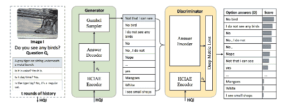

基于 GAN 技术的 VDM 架构[摘自 Lu 等人]

聊天历史，当前问题和图像将作为输入提供给生成器。 接下来，我们将看到生成器如何工作。

# 发电机

生成器具有编码器和解码器。 编码器将图像，问题和历史记录作为输入。 编码器首先关注 **LSTM** 的历史记录，并关注图像的输出。 流程如下所示：

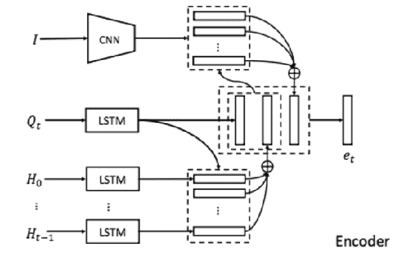

转载自 Lu 等。

整个历史记录都可用，并且 **LSTM** 记录了聊天的历史记录。 输出伴随有产生嵌入的图像。 编码器生成的嵌入被解码器用来创建答案。 解码器由 RNN 制成。 编码器和解码器一起形成生成器，生成可能的答案。 接下来，我们将了解鉴别器的工作原理。

# 鉴别器

鉴别器从生成器获取生成的序列并对其进行排序。 排名是通过对 n 对损失学习的嵌入完成的。 n 对损失类似于三重态损失，不同之处在于使用几对正负对进行比较。 这是该模型产生的一些结果。


转载自 Lu 等。

结果是合理的，并且比简单的鉴别器产生的结果更好。

# 摘要

在本章中，我们了解了生成模型和大量应用程序。 我们实施它们是为了在保留内容的同时将样式从一种转换为另一种。 我们看到了 GAN 背后的直觉和经过训练的模型可以做到这一点。 最后，我们了解了视觉对话系统。

在下一章中，我们将学习用于视频分析的深度学习方法。 我们将看到如何通过摄像机，文件等访问视频内容。 我们将通过在帧级别和整个视频上应用分类来实现视频分类。 稍后，我们将看到如何跟踪视频中的对象。