# 九、视频分类

在本章中，我们将看到如何训练视频数据的深度学习模型。 我们将开始按帧对视频进行分类。 然后，我们将使用时间信息以获得更好的准确率。 稍后，我们将图像的应用扩展到视频，包括姿势估计，字幕和生成视频。

在本章中，我们将涵盖的以下主题：

*   视频分类的数据集和算法
*   将视频分成帧并分类
*   在单个框架级别上训练视觉特征模型
*   了解 3D 卷积及其在视频中的使用
*   在视频上合并运动向量
*   将时间信息用于目标跟踪
*   人体姿势估计和视频字幕等应用

# 了解视频和分类

视频不过是一系列图像。 视频沿时间方向为图像带来了新的维度。 图像的空间特征和视频的时间特征可以放在一起，比仅图像提供更好的结果。 额外的维度还导致大量空间，因此增加了训练和推理的复杂性。 用于处理视频的计算需求非常高。 视频还改变了深度学习模型的架构，因为我们必须考虑时间特征。

视频分类是用类别标记视频的任务。 类别可以在帧级别，也可以在整个视频中。 视频中可能有执行的动作或任务。 因此，视频分类可以标记视频中存在的对象或标记视频中发生的动作。 在下一部分中，我们将看到用于视频分类任务的可用数据集。

# 探索视频分类数据集

视频分类是视频数据研究的主要问题。 拍摄了几个视频，并标记了与数据相关的各种对象或动作。 数据集根据大小，质量和标签类型而有所不同。 有些甚至包括多个视频标签。 这些视频通常很短。 长视频可能会执行各种操作，因此可以在分别对剪切的视频片段或摘要进行分类之前在时间上进行分割。 接下来，我们将考虑一些特定数据集的细节。

# UCF101

**佛罗里达中部大学**（**UCF101**）是用于动作识别的数据集。 这些视频是在 YouTube 上收集的，由逼真的动作组成。 此数据集中有 101 个操作类别。 还有另一个名为 **UCF50** 的数据集，它具有 50 个类别。 整个动作中该数据集中有 13,320 个视频。 这些视频具有背景，比例，姿势，遮挡和照明条件的多种变化。 动作类别分为 25 个，它们具有相似的变化，例如背景，姿势，比例，视点，照明等。

动作和每个动作的视频数显示如下：

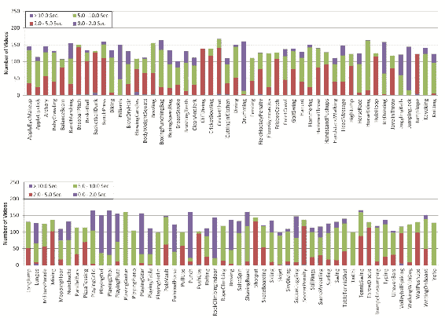

[来源](http://crcv.ucf.edu/data/UCF101/Number%20of%20Videos%202.jpg)

所有 101 个动作都分为五种类型的动作，如下所示：人与对象的交互，身体动作，人与人的交互，演奏乐器和运动。 数据集和标注可从[这里](http://crcv.ucf.edu/data/UCF101.php)下载。

接下来，我们将了解 YouTube-8M 数据集。

# YouTube-8M

**YouTube-8M** 数据集用于视频分类问题。 数据集包含带有标签和视觉特征的视频 URL。 以下是有关数据集的一些统计信息：

*   **视频 URL 的数量**：700 万
*   **影片剪辑的时长**：450,000
*   **类标签的数量**：4,716
*   **每个视频的平均标签数**：3.4

以下是各种类型的数据集摘要：

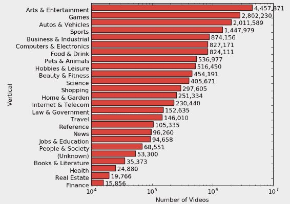

[来源](https://research.google.com/youtube8m/vertical-videos.png)

前面的图像可以让您一眼看出数据集中可用的标签类型。 视频数据很大，因此视觉特征被计算并随数据集一起提供。 [可以通过以下链接访问数据集](https://research.google.com/youtube8m/)。

# 其他数据集

还有更多的数据集可用于视频分类问题。 以下是更多数据集的详细信息：

*   **Sports-1M**：拥有 1,133,158 个具有 487 个类别的视频。 标注是自动完成的。 [数据集可以从以下位置下载](http://cs.stanford.edu/people/karpathy/deepvideo/)。
*   **UCF-11**（**佛罗里达大学-11**）：拥有 1,600 部视频，包含 11 动作。 视频的速度为 29.97 fps（每秒帧数）。 数据集可以与`UCF101`一起下载。
*   **HMDB-51**（**人体运动数据库-51**）：包含 5,100 个具有 51 个动作的视频。 [数据集在这里](http://serre-lab.clps.brown.edu/resource/hmdb-a-large-human-motion-database)。
*   **Hollywood2**：拥有 12 个动作的 1,707 个视频。 [数据集在这里](http://www.di.ens.fr/~laptev/actions/hollywood2)。

我们已经看到了可用于视频分类任务的数据集，以及描述和访问链接。 接下来，我们将看到如何加载视频并将其拆分为帧以进行进一步处理。

# 将视频分成帧

视频可以转换为帧并保存在目录中以备将来使用。 分成帧可以通过在训练过程之前对视频进行解压缩来帮助我们节省时间。 首先，让我们看一下将视频转换为帧的代码片段：

```py
import cv2
video_handle = cv2.VideoCapture(video_path)
frame_no = 0 while True:
  eof, frame = video_handle.read()
  if not eof:
      break
  cv2.imwrite("frame%d.jpg" % frame_no, frame)
  frame_no += 1
```

使用此代码段，所有前面的数据集都可以转换为帧。 请注意，这将需要大量的硬盘空间。

# 视频分类方法

视频必须针对几种应用进行分类。 由于视频中包含大量数据，因此还必须考虑训练和推理计算。 所有视频分类方法均受图像分类算法启发。 VGG，Inception 等标准架构用于帧级别的特征计算，然后进行进一步处理。 诸如 **CNN**，**注意**，先前章节中学习的和 **LSTM** 之类的概念将在此处有用。 直观地，以下方法可用于视频分类：

*   提取帧并使用在第 2 章，“图像分类”中学习的模型，以帧为基础进行分类。
*   提取在第 3 章，“图像检索”中学习的图像特征，并且可以按照第 7 章，“图像标题”中的描述，使用这些特征训练 RNN。
*   在整个视频上训练 **3D 卷积**网络。 3D 卷积是 2D 卷积的扩展； 我们将在以下各节中详细了解 3D 卷积的工作原理。
*   使用视频的**光流**可以进一步提高精度。 光流是对象运动的模式，我们将在接下来的部分中详细介绍。

我们将看到几种算法，它们在各种计算复杂性上都具有良好的准确率。 可以通过将数据集转换为帧并将其子采样为相同的长度来准备它。 一些预处理会有所帮助，例如减去 Imagenet 的均值。

# 为视频分类融合并行 CNN

就帧而言，由于图像的下采样，视频的预测可能不会产生良好的结果，从而丢失了精细的细节。 使用高分辨率的 CNN 将增加推理时间。 因此，[Karpathy 等人](https://static.googleusercontent.com/media/research.google.com/en//pubs/archive/42455.pdf)建议融合两个流，它们并行运行视频分类。 进行逐帧预测有两个问题，即：

*   由于较大的 CNN 架构，预测可能需要很长时间
*   独立的预测会沿时间维度丢失信息

使用更少的参数和两个并行运行的较小编码器可以简化架构。 视频同时通过两个 CNN 编码器传递。 一个编码器需要较低的分辨率并要处理高分辨率。 编码器具有交替的卷积，规范化和合并层。 两个编码器的最后一层通过全连接层连接。 另一个编码器具有相同的大小，但仅进行中心裁剪，如下所示：

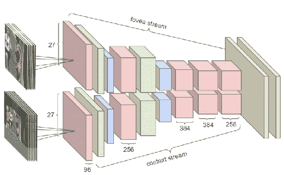

转载自 Karpathy 等人

帧的并行处理通过对视频进行下采样来加快运行时间。 CNN 架构的参数减半，同时保持相同的精度。 这两个流称为**中央凹**和**上下文**。 以下代码段显示了流：

```py
high_resolution_input = tf.placeholder(tf.float32, shape=[None, input_size])
low_resolution_input = tf.placeholder(tf.float32, shape=[None, input_size])
y_input = tf.placeholder(tf.float32, shape=[None, no_classes])
high_resolution_cnn = get_model(high_resolution_input)
low_resolution_cnn = get_model(low_resolution_input)
dense_layer_1 = tf.concat([high_resolution_cnn, low_resolution_cnn], 1)
dense_layer_bottleneck = dense_layer(dense_layer_1, 1024)
logits = dense_layer(dense_layer_bottleneck, no_classes)
```

下图显示了跨时间维度进行处理的帧：

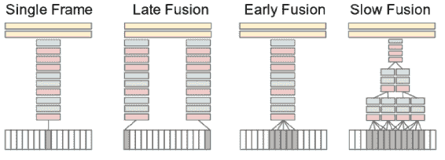

转自 Karpathy 等人

可以在不同的时间观看视频，而不是通过固定大小的剪辑。 在前面的图像中介绍了连接时间信息的三种方式。 后期融合需要更长的时间框架，而早期融合则需要几个帧。 慢速融合将后期融合和早期融合结合在一起，可获得良好效果。 该模型在`Sports1M`数据集上进行了训练，该数据集具有 487 个类别，并达到了 50% 的准确率。 将同一模型应用于`UCF101`时，可达到 60% 的精度。

# 长时间视频的分类

融合方法适用于短视频片段。 分类较长的视频很困难，因为必须计算和记住很多帧。 [Ng 等人](https://www.cv-foundation.org/openaccess/content_cvpr_2015/papers/Ng_Beyond_Short_Snippets_2015_CVPR_paper.pdf)提出了两种对较长视频进行分类的方法：

*   第一种方法是在时间上合并卷积特征。 最大池用作函数`aggregation`方法。
*   第二种方法是使用 LSTM 连接处理各种可变长度视频的卷积特征。

下图显示了这两种方法：

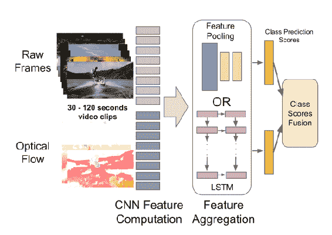

摘自 Ng 等人

可以提取 CNN 特征并将其馈送到小型 LSTM 网络，如以下代码所示：

```py
net = tf.keras.models.Sequential()
net.add(tf.keras.layers.LSTM(2048,
  return_sequences=False,
  input_shape=input_shape,
  dropout=0.5))
net.add(tf.keras.layers.Dense(512, activation='relu'))
net.add(tf.keras.layers.Dropout(0.5))
net.add(tf.keras.layers.Dense(no_classes, activation='softmax'))
```

添加 LSTM 进行特征池化可提供更好的表现。 特征以各种方式合并，如下图所示：

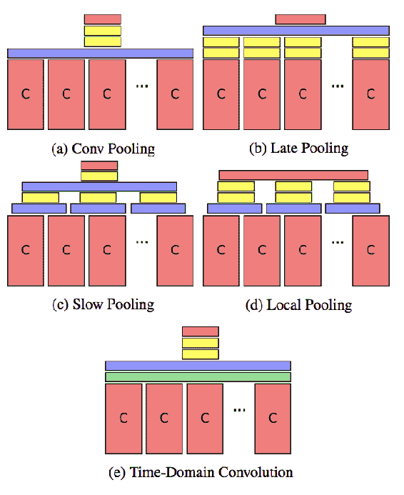

摘自 Ng 等人

如图所示，卷积特征可以几种不同的方式聚合。 池在全连接层之前完成。 该方法在`Sports1M`数据集和`UCF101`数据集中的准确率分别为 73.1% 和 88.6%。 下图显示了 LSTM 方法：

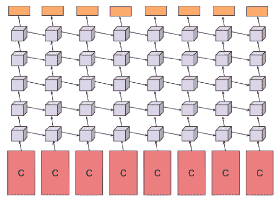

摘自 Ng 等人

该模型的计算量很高，因为使用了多个 LSTM。

# 为动作识别流式连接两个 CNN

视频中对象的运动具有有关视频中执行的动作的非常好的信息。 对象的运动可以通过光流来量化。 [Simonyan 和 Zisserman](http://papers.nips.cc/paper/5353-two-stream-convolutional-networks-for-action-recognition-in-videos.pdf) 提出了一种用于动作识别的方法，该方法使用来自图像和光流的两个流。

光流通过量化观察者与场景之间的相对运动来测量运动。 可以在[这里](https://www.youtube.com/watch?v=5VyLAH8BhF8)找到有关光流的详细讲座。 通过运行以下命令可以获得光流：

```py
p1, st, err = cv2.calcOpticalFlowPyrLK(old_gray, frame_gray, p0, None, **lk_params)
```

一个流采用单个帧并使用常规 CNN 预测动作。 另一个流获取多个帧并计算光流。 光流通过 CNN 进行预测。 下图显示了这两个预测：

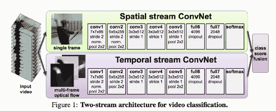

转载自 Simonyan 和 Zisserman

两种预测都可以与最终预测结合。

# 使用 3D 卷积的时间学习

可以使用 3D 卷积对视频进行分类。 3D 卷积运算将体积作为输入并输出，而 2D 卷积可以将 2D 或体积输出并输出 2D 图像。 区别如下所示：


复制自 Tran 等人

前两个图像属于 2D 卷积。 输出始终是图像。 同时，3D 卷积输出一个体积。 区别在于内核在 3 个方向上进行卷积运算。 [Tran 等人](https://www.cv-foundation.org/openaccess/content_iccv_2015/papers/Tran_Learning_Spatiotemporal_Features_ICCV_2015_paper.pdf)将 3D 卷积用于视频分类。 3D 卷积模型如下所示：


复制自 Tran 等人

以下是使用 3D 卷积的模型代码片段：

```py
net = tf.keras.models.Sequential()
net.add(tf.keras.layers.Conv3D(32,
  kernel_size=(3, 3, 3),
  input_shape=(input_shape)))
net.add(tf.keras.layers.Activation('relu'))
net.add(tf.keras.layers.Conv3D(32, (3, 3, 3)))
net.add(tf.keras.layers.Activation('softmax'))
net.add(tf.keras.layers.MaxPooling3D())
net.add(tf.keras.layers.Dropout(0.25))

net.add(tf.keras.layers.Conv3D(64, (3, 3, 3)))
net.add(tf.keras.layers.Activation('relu'))
net.add(tf.keras.layers.Conv3D(64, (3, 3, 3)))
net.add(tf.keras.layers.Activation('softmax'))
net.add(tf.keras.layers.MaxPool3D())
net.add(tf.keras.layers.Dropout(0.25))

net.add(tf.keras.layers.Flatten())
net.add(tf.keras.layers.Dense(512, activation='sigmoid'))
net.add(tf.keras.layers.Dropout(0.5))
net.add(tf.keras.layers.Dense(no_classes, activation='softmax'))
net.compile(loss=tf.keras.losses.categorical_crossentropy,
  optimizer=tf.keras.optimizers.Adam(), metrics=['accuracy'])
```

3D 卷积需要大量的计算能力。 3D 卷积在`Sports1M`数据集上达到 90.2% 的精度。

# 使用轨迹的分类

[Wang 等人](https://www.cv-foundation.org/openaccess/content_cvpr_2015/papers/Wang_Action_Recognition_With_2015_CVPR_paper.pdf)使用身体各部分的轨迹对所执行的动作进行分类。 这项工作结合了手工制作和深度学习的特征，可以进行最终预测。 以下是分类的表示形式：

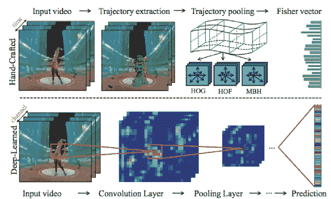

转载自 Wang 等人

手工制作的特征是 **Fisher 向量**，这些特征来自 CNN。 下图演示了轨迹和特征图的提取：

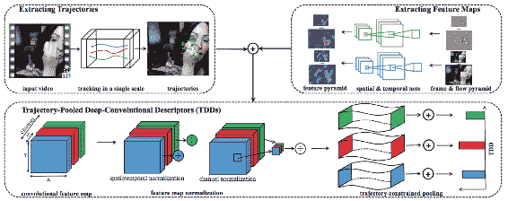

转载自 Wang 等人

轨迹和特征图都在时间上组合在一起，以形成关于时间片段的最终预测。

# 多模态融合

[杨等人](http://research.nvidia.com/sites/default/files/pubs/2016-10_Multilayer-and-Multimodal/MM16.pdf)提出了一种具有 4 个模型的多模态融合视频分类方法。 这四个模型分别是 3D 卷积特征，2D 光流，3D 光流和 2D 卷积特征。

该方法的数据流如下所示：

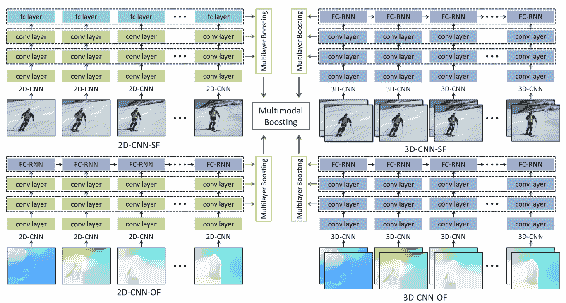

转载自 Yang 等人

现在，让我们了解 Convlet 。 Convlet 是来自单个内核的小卷积输出。 下图显示了 convlet 对卷积层中空间权重的学习：

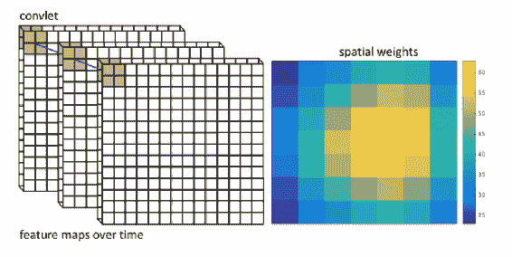

转载自 Yang 等人

空间权重指示卷积层中局部空间区域的区分度或重要性。 下图是在多层卷积层和全连接层上完成的多层表示融合的图示：

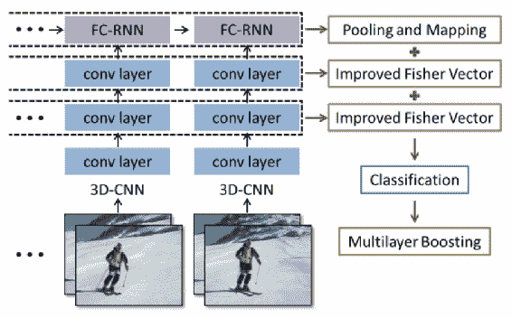

转载自 Yang 等人

增强机制用于组合预测。 **提升**是一种可以将多个模型预测组合为最终预测的机制。

# 用于分类的注意力区域

注意力机制可以用于分类。 注意力机制复制了人类专注于识别活动区域的行为。 注意力机制赋予某些区域比其他区域更多的权重。 训练时从数据中学习权重方法。 注意力机制主要有两种，即：

*   **柔和注意力**：性质确定，因此可以通过反向传播来学习。
*   **硬注意力**：性质随机，这需要复杂的学习机制。 由于需要采样数据，因此也很昂贵。

以下是软关注的可视化：

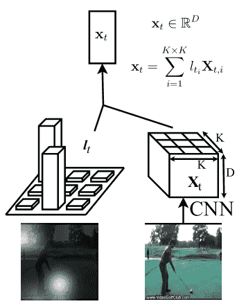

转载自 Sharma 等人

根据注意，计算并加权 **CNN** 特征。 对某些区域的关注或权重可以用于可视化。 [Sharma 等人](https://arxiv.org/pdf/1511.04119.pdf)使用此想法对视频进行分类。 **LSTM** 被用作卷积特征。 **LSTM** 通过注意以下帧来预测区域，如下图所示：

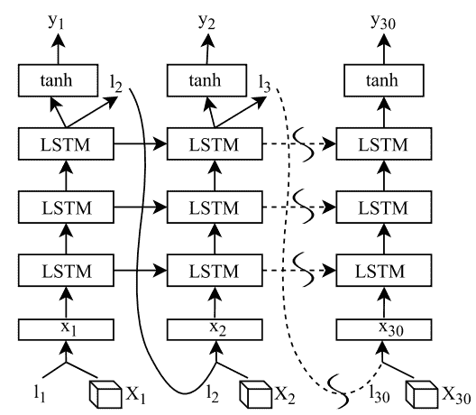

转自 Sharma 等人。

每个 **LSTM** 栈都会预测位置和标签。 每个栈具有三个 **LSTM** 。 **LSTM** 栈的输入是卷积特征立方体和位置。 位置概率是注意权重。 注意的使用提高了准确率以及可视化预测的方法。

我们已经看到了各种视频分类方法。 接下来，我们将学习视频中的其他应用。

# 将基于图像的方法扩展到视频

图像可用于姿势估计，样式转换，图像生成，分割，字幕等等。 同样，这些应用也在视频中找到位置。 使用时间信息可以改善来自图像的预测，反之亦然。 在本节中，我们将看到如何将这些应用扩展到视频。

# 人体姿势回归

人体姿势估计是视频数据的重要应用，可以改善其他任务，例如动作识别。 首先，让我们看一下可用于姿势估计的数据集的描述：

*   **PosesInTheWild** 数据集：包含 30 个带有人体姿势标注的视频。 [数据集在这里](https://lear.inrialpes.fr/research/posesinthewild/)。 该数据集带有人类上半身关节的标注。
*   **电影院中标记的帧**（**FLIC**）：从 30 部电影中获得的人体姿势数据集，[可在以下位置找到](https://bensapp.github.io/flic-dataset.html)。

[Pfister 等人](https://www.cv-foundation.org/openaccess/content_iccv_2015/papers/Pfister_Flowing_ConvNets_for_ICCV_2015_paper.pdf)提出了一种预测视频中人体姿势的方法。 以下是回归人体姿势的流水线：

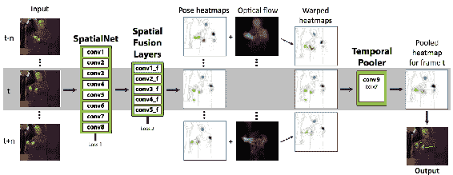

复制自 Pfister 等人

视频中的帧被获取并通过卷积网络。 融合层，并获得姿势热图。 姿势热图与光流结合以获得扭曲的热图。 合并时间范围内的扭曲热图，以生成合并的热图，得到最终姿势。

# 跟踪人脸标志

视频中的人脸分析需要人脸检测，界标检测，姿势估计，验证等。 计算地标对于捕获人脸动画，人机交互和人类活动识别尤其重要。 除了在帧上进行计算外，还可以在视频上进行计算。 [Gu 等人](http://research.nvidia.com/sites/default/files/pubs/2017-07_Dynamic-Facial-Analysis/rnnface.pdf)提出了一种使用视频中的人脸标志的检测和跟踪的联合估计的 RNN 方法。 结果优于逐帧预测和其他先前模型。 地标由 CNN 计算，时间方面在 RNN 中编码。 综合数据用于训练。

# 分割视频

使用时间信息时，可以更好地分割视频。 [加德（Gadde）等人](https://ps.is.tuebingen.mpg.de/uploads_file/attachment/attachment/386/gadde2017videocnns.pdf)提出了一种通过扭曲来组合时间信息的方法。 下图演示了该解决方案，该方法将两个帧分段并且结合了变形：

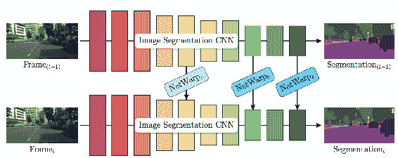

转载自 Gadde 等人

下图显示了翘曲网：


转载自 Gadde 等人

在两个帧之间计算光流，将它们与变形结合在一起。 变形模块获取光流，对其进行转换，然后将其与变形的表示相结合。

# 生成视频字幕

第 7 章，“图像字幕生成”说明了几种组合文本和图像的方法。 同样，可以为视频生成字幕，以描述上下文。 让我们看一下可用于字幕视频的数据集列表：

*   **微软研究 - 视频转文本**（**MSR-VTT**）具有 200,000 个视频剪辑和句子对。 [可以从以下网站获取更多详细信息](https://www.microsoft.com/en-us/research/publication/msr-vtt-a-large-video-description-dataset-for-bridging-video-and-language/)。
*   **MPII 电影描述语料库**（**MPII-MD**）[可以从以下网站获取](https://www.mpi-inf.mpg.de/departments/computer-vision-and-multimodal-computing/research/vision-and-language/mpii-movie-description-dataset)。 它有 68,000 个句子和 94 部电影。
*   **蒙特利尔视频标注数据集**（**M-VAD**）[可从以下网站获得](https://mila.quebec/en/publications/public-datasets/m-vad/)。它有 49,000 个剪辑。
*   **YouTube2Text** 包含 1,970 个视频，包含 80,000 个描述。

[姚等人](https://www.cv-foundation.org/openaccess/content_iccv_2015/papers/Yao_Describing_Videos_by_ICCV_2015_paper.pdf)提出了一种为视频添加字幕的方法。 经过训练以进行动作识别的 3D 卷积网络用于提取局部时间特征。 然后在特征上使用注意力机制以使用 RNN 生成文本。 该过程如下所示：

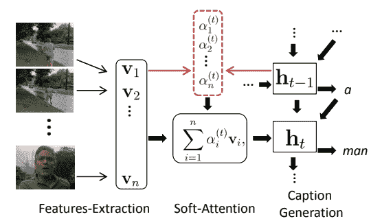

转载自 Yao 等人

[Donahue 等人](https://www.cv-foundation.org/openaccess/content_cvpr_2015/papers/Donahue_Long-Term_Recurrent_Convolutional_2015_CVPR_paper.pdf)提出了另一种视频字幕或描述方法，该方法将 **LSTM** 与卷积特征组合。

这类似于前面的方法，除了我们在此处使用 2D 卷积特征，如下图所示：

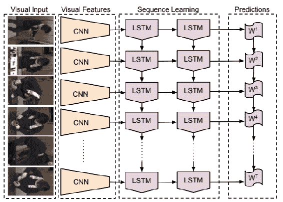

摘自 Donahue 等人

我们有几种将文本与图像结合起来的方法，例如活动识别，图像描述和视频描述技术。 下图说明了这些技术：

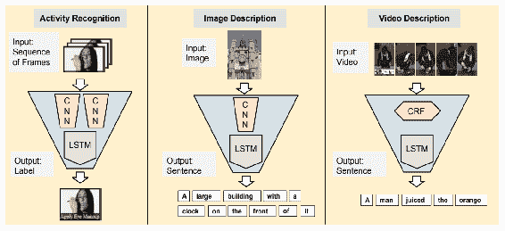

摘自 Donahue 等人

[Venugopalan 等人](https://www.cv-foundation.org/openaccess/content_iccv_2015/papers/Venugopalan_Sequence_to_Sequence_ICCV_2015_paper.pdf)提出了一种使用编码器-解码器方法进行视频字幕的方法。 以下是他提出的技术的可视化：

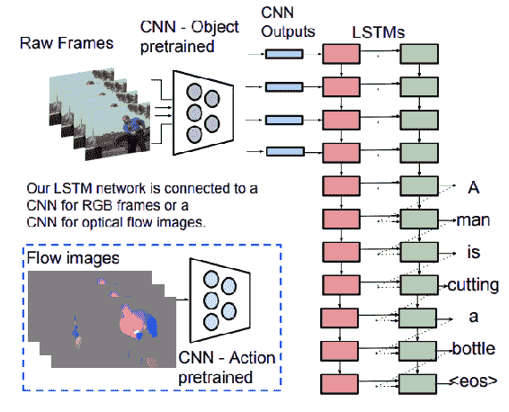

复制自 Venugopalan 等人

对于此方法，可以在图像的帧或光流上计算 **CNN**。

# 生成视频

可以使用生成模型以无监督的方式生成视频。 可以使用当前帧预测未来的帧。 [Ranzato 等人](https://arxiv.org/pdf/1412.6604.pdf)提出了一种受语言模型启发的视频生成方法。 RNN 模型用于拍摄图像补丁并预测下一个补丁。

# 总结

在本章中，我们涵盖了与视频分类有关的各种主题。 我们看到了如何将视频拆分为帧，以及如何将图像中的深度学习模型用于各种任务。 我们介绍了一些特定于视频的算法，例如跟踪对象。 我们看到了如何将基于视频的解决方案应用于各种场景，例如动作识别，手势识别，安全应用和入侵检测。

在下一章中，我们将学习如何将上一章中训练有素的模型部署到各种云和移动平台上的生产环境中。 我们将看到不同的硬件如何影响延迟和吞吐量方面的性能。