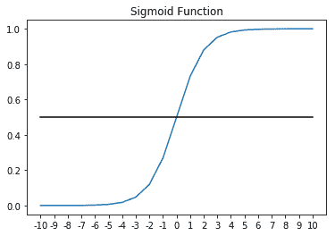
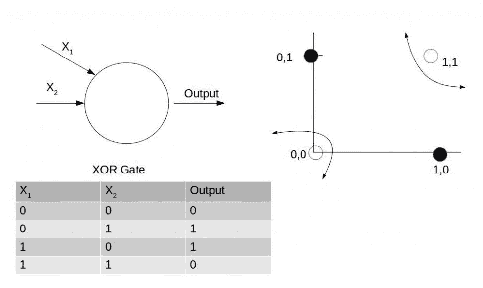
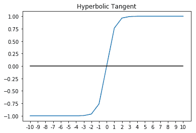
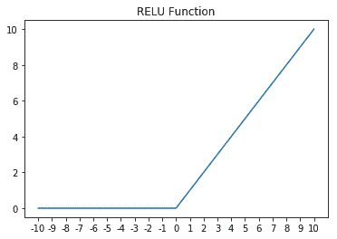
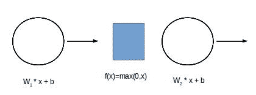

# 一、深度学习的基础

欢迎使用《深度学习快速参考》！ 在本书中，我将尝试使需要解决深度学习问题的数据科学家，机器学习工程师和软件工程师更容易使用，实用和使用深度学习技术。 如果您想训练自己的深度神经网络并且陷入困境，那么本指南很有可能会有所帮助。

本书动手了，旨在作为实用指南，可以帮助您快速解决问题。 它主要供需要使用深度学习解决问题的经验丰富的机器学习工程师和数据科学家使用。 除了本章（其中提供了一些我们将要开始使用的术语，框架和背景知识）之外，它并不意味着要按顺序阅读。 每章均包含一个实际示例，并附有代码，一些最佳实践和安全选择。 我们希望您能跳到所需的章节并开始使用。

本书不会深入研究深度学习和神经网络的理论。 有许多可以提供这种背景知识的精彩书籍，我强烈建议您至少阅读其中一本（也许是参考书目，也可以只是建议）。 我们希望提供足够的理论和数学直觉来帮助您入门。

我们将在本章介绍以下主题：

*   深度神经网络架构
*   深度学习的优化算法
*   深度学习框架
*   构建用于深度学习的数据集

# 深度神经网络架构

深度神经网络架构的结构可能会因网络的应用而有很大差异，但它们都有一些基本组件。 在本节中，我们将简要讨论这些组件。

在本书中，我将深度神经网络定义为一个具有多个隐藏层的网络。 除此之外，我们不会尝试将会员资格限制为*深度学习俱乐部*。 因此，我们的网络可能只有不到 100 个神经元，甚至可能有数百万个。 我们可能会使用特殊的神经元层，包括卷积和递归层，但尽管如此，我们仍将所有这些都称为神经元。

# 神经元

神经元是神经网络的原子单位。 有时这是受到生物学启发的。 但是，这是另一本书的主题。 神经元通常排列成层。 在本书中，如果我指的是特定的神经元，则将使用符号`n[k]^l`，其中`l`是神经元所在的层， `k`是神经元编号 。 由于我们将使用遵循第 0 个表示法的编程语言，因此我的表示法也将基于第 0 个表示法。

大多数神经元的核心是两个共同起作用的功能：线性功能和激活函数。 让我们从较高的角度看一下这两个组成部分。

# 神经元线性函数

神经元的第一部分是线性函数，其输出是输入的总和，每个输入乘以一个系数。 这个函数实际上或多或少是线性回归。 这些系数通常在神经网络中称为权重。 例如，给定某些神经元，其输入特征为`x1`，`x2`和`x3`，输出`z`，则此线性分量或神经元线性函数将简单地为：


在给定数据的情况下，`θ[1], θ[2], ..., θ[n]`是权重或系数，`b`是偏差项。

# 神经元激活函数

神经元的第二个功能是激活函数，其任务是在神经元之间引入非线性。 乙状结肠激活是一种常用的激活，您可能会通过逻辑回归来熟悉它。 它将神经元的输出压缩到输出空间，其中`z`的非常大的值被驱动为 1，而`z`的非常小的值被驱动为 0。

sigmoid 函数如下所示：




事实证明，激活函数对于中间神经元非常重要。 没有它，可以证明一堆具有线性激活的神经元（实际上不是激活，或更正式地说是`z = z`的激活函数）实际上只是一个线性函数。

在这种情况下，单个线性函数是不理想的，因为在许多情况下，我们的网络可能未针对当前问题指定。 也就是说，由于输入要素和目标变量之间的非线性关系（我们正在预测），网络无法很好地对数据建模。

不能用线性函数建模的函数的典型示例是排他的`OR`函数，如下图所示：



其他常见的激活函数是`tanh`功能和 ReLu 或整流线性激活。

双曲正切或`tanh`函数如下所示：




对于中间层，`tanh`通常比 Sigmoid 更好。 您可能会看到，`tanh`的输出将在`[-1, 1]`之间，而 Sigmoid 曲线的输出将为`[0, 1]`。 这种额外的宽度可为消失或爆炸的梯度问题提供一定的弹性，我们将在后面详细介绍。 到目前为止，仅需知道消失的梯度问题就可以使网络在早期的层中收敛非常慢（如果有的话）。 因此，使用`tanh`的网络趋于比使用 Sigmoid 激活的网络收敛更快。 也就是说，它们仍然不如 ReLu 快。

ReLu，或直线激活，简单定义为：


这是一个安全的赌注，我们在本书中的大部分时间都会使用它。 ReLu 不仅易于计算和区分，而且还可以抵抗消失的梯度问题。 ReLu 的唯一缺点是它的一阶导数未精确定义为 0。包括泄漏的 ReLu 在内的变体在计算上更加困难，但针对此问题更健壮。

为了完整起见，以下是 ReLu 的一些明显图表：



# 深度学习中的损失和成本函数

每个机器学习模型实际上都是从成本函数开始的。 简单来说，成本函数可让您衡量模型对训练数据的拟合程度。 在本书中，我们将损失函数定义为训练集中单个观测值的拟合正确性。 这样，成本函数通常将是整个训练集中损失的平均值。 稍后，当我们介绍每种类型的神经网络时，我们将重新讨论损失函数。 但是，请快速考虑线性回归的成本函数作为示例：


在这种情况下，损失函数为`(y_hat - y)^2`，这实际上是平方误差。 因此，我们的`cost`函数`J`实际上只是均方误差，或整个数据集的均方误差的平均值。 按照惯例，添加了术语 1/2 以使某些微积分更干净。

# 正向传播过程

正向传播是我们尝试使用单个观测值中存在的特征预测目标变量的过程。 想象一下，我们有一个两层神经网络。 在正向传播过程中，我们将从观察中出现的特征`x[1], x[2], ..., x[n]`开始，然后将这些特征乘以它们在第 1 层中的关联系数，并为每个神经元添加一个偏差项。 之后，我们会将输出发送到神经元的激活。 之后，输出将被发送到下一层，依此类推，直到到达网络的末端，然后剩下网络的预测：



# 反向传播过程

一旦正向传播完成，我们就可以对每个数据点进行网络预测。 我们也知道数据点的实际值。 通常，将预测定义为`y_hat`，而将目标变量的实际值定义为`y`。

一旦`y`和`y_hat`都已知，就可以使用成本函数计算网络误差。 回想一下，代价函数是`loss`函数的平均值。

为了使学习在网络中发生，网络的错误信号必须从最后一层到最后一层通过网络层向后传播。 我们反向传播的目标是在网络中向后传播该误差信号，同时随着信号的传播使用误差信号来更新网络权重。 在数学上，要做到这一点，我们需要对权重进行微调，以使成本函数最小，从而最小化成本函数。 此过程称为梯度下降。

梯度是误差函数相对于网络内每个权重的偏导数。 可以使用链法则和上面各层的梯度逐层计算每个权重的梯度。

一旦知道了每一层的梯度，我们就可以使用梯度下降算法来最小化`cost`函数。

梯度下降将重复此更新，直到网络的错误最小化并且该过程收敛为止：


梯度下降算法将梯度乘以称为`alpha`的学习率，然后从每个权重的当前值中减去该值。 学习率是一个超参数。

# 随机和小批量梯度下降

上一节中描述的算法假定整个数据集都进行正向和相应的反向传递，因此将其称为批梯度下降。

进行梯度下降的另一种可能方法是一次使用一个数据点，并随着我们的更新网络权重。 此方法可能有助于加快网络可能停止收敛的鞍点附近的收敛速度。 当然，仅单个点的误差估计可能无法很好地近似于整个数据集的误差。

解决此问题的最佳解决方案是使用小型批量梯度下降，其中我们将采用称为小型批量的数据的随机子集来计算误差并更新网络权重。 这几乎总是最好的选择。 它还有一个额外的好处，即可以将非常大的数据集自然地拆分为多个块，这些块可以更容易地在计算机的内存中甚至跨计算机的内存中进行管理。

这是对神经网络最重要部分之一的极高层次的描述，我们认为这与本书的实际性质相符。 实际上，大多数现代框架都为我们处理了这些步骤。 但是，至少在理论上，它们无疑是值得了解的。 我们鼓励读者在时间允许的情况下更深入地进行向前和向后传播。

# 深度学习的优化算法

梯度下降算法不是唯一可用于优化网络权重的优化算法，但它是大多数其他算法的基础。 虽然了解每种优化算法都有可能获得博士学位，但我们将为一些最实用的内容专门介绍几句话。

# 梯度下降和动量

通过使用具有动量的梯度下降，可以通过增加方向学习的速度来加快梯度下降，从而使梯度在方向上保持恒定，而在方向缓慢学习时，梯度会在方向上波动。 它允许梯度下降的速度增加。

动量的工作原理是引入速度项，并在更新规则中使用该项的加权移动平均值，如下所示：


在动量的情况下，最通常将`β`设置为 0.9，通常这不是需要更改的超参数。

# RMSProp 算法

RMSProp 是另一种算法，可以通过跨网络权重表示的多维空间，通过在某些方向上加快学习速度，并在其他方向上抑制振荡来加快梯度下降：


这具有在`v[t]`大的方向上进一步减少振荡的效果。

# Adam 优化器

Adam 是已知性能最好的**优化器**之一，这是我的首选。 它可以很好地解决各种问题。 它将动量和 RMSProp 的最佳部分组合到一个更新规则中：


其中`ε`很小，可以防止被 0 除。

亚当通常是一个不错的选择，当您进行原型设计时，这是一个很好的起点，因此，从亚当开始可以节省一些时间。

# 深度学习框架

虽然仅使用 Python 的`numpy`从头开始构建和训练深度神经网络是绝对可能的，但这将花费大量的时间和代码。 在几乎每种情况下，使用深度学习框架都更加实用。

在本书中，我们将使用 **TensorFlow** 和 **Keras** 来使开发深度神经网络变得更加轻松和快捷。

# 什么是 TensorFlow？

TensorFlow 是一个可用于快速构建深度神经网络的库。 在 TensorFlow 中，我们到目前为止已涵盖的数学运算被表示为节点。 这些节点之间的边缘是张量或多维数据阵列。 给定定义为图和损失函数的神经网络，TensorFlow 可以自动计算网络的梯度并优化图以最小化损失函数。

TensorFlow 是 Google 在 2015 年发布的一个开源项目。此后，它已经获得了很大的关注，并拥有庞大的用户社区。 虽然 TensorFlow 提供 Java，C++，Go 和 Python 的 API，但我们仅介绍 Python API。 本书使用了 Python API，因为它既是最常用的，也是开发新模型时最常用的 API。

通过在一个或多个图形处理单元上执行这些计算，TensorFlow 可以大大加快计算速度。 GPU 计算提供的加速已成为现代深度学习中的必要条件。

# 什么是 Keras？

尽管在 TensorFlow 中构建深度神经网络要比从头开始做起来容易得多，但 TensorFlow 仍然是一个非常底层的 API。 Keras 是一个高级 API，允许我们使用 TensorFlow（或 Theano 或 Microsoft 的 CNTK）快速构建深度学习网络。

用 Keras 和 TensorFlow 构建的模型是便携式的，也可以在本机 TensorFlow 中进行训练或使用。 TensorFlow 中构建的模型可以加载到 Keras 中并在其中使用。

# TensorFlow 的流行替代品

那里还有许多其他很棒的深度学习框架。 我们之所以选择 Keras 和 TensorFlow，主要是因为其受欢迎程度，易用性，支持的可用性以及生产部署的准备就绪。 无疑还有其他有价值的选择。

我最喜欢的 TensorFlow 替代品包括：

*   **Apache MXNet**：一个非常高性能的框架，带有一个名为 [**Gluon**](https://mxnet.apache.org/) 的新命令式接口
*   [**PyTorch**](http://pytorch.org/)：Facebook 最初开发的一种非常新颖且有希望的架构
*   [**CNTK**](https://www.microsoft.com/en-us/cognitive-toolkit/)：也可以与 Keras 一起使用的 Microsoft 深度学习框架

尽管我确实坚信 Keras 和 TensorFlow 是本书的正确选择，但我也想承认这些出色的框架以及每个项目对领域做出的贡献。

# TensorFlow 和 Keras 的 GPU 要求

在本书的其余部分，我们将使用 Keras 和 TensorFlow。 我们将探索的大多数示例都需要 GPU 来加速。 包括 TensorFlow 在内的大多数现代深度学习框架都使用 GPU 极大地加速了网络训练期间所需的大量计算。 如果没有 GPU，我们讨论的大多数模型的训练时间将过长。

如果您没有安装有 GPU 的计算机，则可以从包括 Amazon 的 Amazon Web Services 和 Google 的 Google Cloud Platform 在内的各种云提供商处租用基于 GPU 的计算实例。 对于本书中的示例，我们将在运行 Ubuntu Server 16.04 的 Amazon EC2 中使用`p2.xlarge`实例。 p2.xlarge 实例提供了具有 2,496 个 CUDA 内核的 Nvidia Tesla K80 GPU，这将使我们在本书中显示的模型的运行速度甚至比非常高端的台式计算机所能达到的速度快得多。

# 安装 Nvidia CUDA 工具包和 cuDNN

由于您可能会在深度学习工作中使用基于云的解决方案，因此我提供了一些说明，这些说明可帮助您在 Ubuntu Linux 上快速启动并运行，Ubuntu Linux 在各个云提供商中普遍可用。 也可以在 Windows 上安装 TensorFlow 和 Keras。 从 TensorFlow v1.2 开始，TensorFlow 不幸地不支持 OSX 上的 GPU。

在使用 GPU 之前，必须先安装 **NVidia CUDA 工具包**和 **cuDNN** 。 我们将安装 CUDA Toolkit 8.0 和 cuDNN v6.0，建议与 TensorFlow v1.4 一起使用。 在您阅读完本段之前，很有可能会发布新版本，因此，请访问 [www.tensorflow.org](http://www.tensorflow.org) 以获取最新的必需版本。

我们将从在 Ubuntu 上安装`build-essential`软件包开始，该软件包包含编译 C++ 程序所需的大部分内容。 代码在这里给出：

```py
sudo apt-get update
sudo apt-get install build-essential
```

接下来，我们可以下载并安装 CUDA Toolkit。 如前所述，我们将安装 8.0 版及其相关补丁。 您可以在[这个页面](https://developer.nvidia.com/cuda-zone)中找到最适合您的 CUDA 工具包。

```py
wget https://developer.nvidia.com/compute/cuda/8.0/Prod2/local_installers/cuda_8.0.61_375.26_linux-run
sudo sh cuda_8.0.61_375.26_linux-run # Accept the EULA and choose defaults
wget https://developer.nvidia.com/compute/cuda/8.0/Prod2/patches/2/cuda_8.0.61.2_linux-run
sudo sh cuda_8.0.61.2_linux-run # Accept the EULA and choose defaults
```

CUDA 工具包现在应该安装在以下路径中：`/usr/local/cuda`。 您需要添加一些环境变量，以便 TensorFlow 可以找到它。 您可能应该考虑将这些环境变量添加到`~/.bash_profile`，以便在每次登录时进行设置，如以下代码所示：

```py
export LD_LIBRARY_PATH="$LD_LIBRARY_PATH:/usr/local/cuda/lib64"
export CUDA_HOME="/usr/local/cuda"
```

此时，您可以通过执行以下命令来测试一切是否正常：`nvidia-smi`。 输出应类似于以下内容：

```py
$nvidia-smi
+-----------------------------------------------------------------------------+
 | NVIDIA-SMI 375.26 Driver Version: 375.26 |
 |-------------------------------+----------------------+----------------------+
 | GPU Name Persistence-M| Bus-Id Disp.A | Volatile Uncorr. ECC |
 | Fan Temp Perf Pwr:Usage/Cap| Memory-Usage | GPU-Util Compute M. |
 |===============================+======================+======================|
 | 0 Tesla K80 Off | 0000:00:1E.0 Off | 0 |
 | N/A 41C P0 57W / 149W | 0MiB / 11439MiB | 99% Default |
 +-------------------------------+----------------------+----------------------+
```

最后，我们需要安装 cuDNN，这是 NVIDIA CUDA 深度神经网络库。

首先，将 cuDNN 下载到本地计算机。 为此，您需要在 **NVIDIA 开发人员网络**中注册为开发人员。 您可以在 [cuDNN 主页](https://developer.nvidia.com/cudnn) 上找到 cuDNN。 将其下载到本地计算机后，可以使用`scp`将其移至 EC2 实例。 虽然确切的说明会因云提供商的不同而有所差异，但是您可以在[这个页面](https://docs.aws.amazon.com/AWSEC2/latest/UserGuide/AccessingInstancesLinux.html)中找到有关通过 SSH/SCP 连接到 AWS EC2 的其他信息。 。

将 cuDNN 移至 EC2 映像后，可以使用以下代码解压缩文件：

```py
tar -xzvf cudnn-8.0-linux-x64-v6.0.tgz
```

最后，使用以下代码将解压缩的文件复制到其适当的位置：

```py
sudo cp cuda/include/cudnn.h /usr/local/cuda/include/
sudo cp cuda/lib64/* /usr/local/cuda/lib64
```

我不清楚为什么 CUDA 和 cuDNN 分别分发，为什么 cuDNN 需要注册。 cuDNN 的下载过程和手动安装过于复杂，这确实是深度学习中最大的谜团之一。

# 安装 Python

我们将使用`virtualenv`创建一个隔离的 Python 虚拟环境。 尽管这不是严格必要的，但这是一种极好的实践。 这样，我们会将该项目的所有 Python 库保存在一个独立的隔离环境中，该环境不会干扰系统 Python 的安装。 此外，`virtualenv`环境将使以后打包和部署我们的深度神经网络更加容易。

首先，使用 Ubuntu 中的 aptitude 软件包管理器安装`Python`，`pip`和`virtualenv`。 以下是代码：

```py
sudo apt-get install python3-pip python3-dev python-virtualenv
```

现在，我们可以为我们的工作创建虚拟环境。 我们将所有虚拟环境文件保存在名为`~/deep-learn`的文件夹中。 您可以自由选择该虚拟环境的任何名称。 以下代码显示了如何创建虚拟环境：

```py
virtualenv --no-site-packages -p python3 ~/deep-learn
```

如果您是一位经验丰富的 Python 开发人员，您可能已经注意到我已将环境设置为默认为 Python3.x。 肯定不是必须的，并且 TensorFlow/Keras 都支持 Python 2.7。 也就是说，作者感到 Python 社区有道德义务支持现代版本的 Python。

现在已经创建了虚拟环境，您可以按以下方式激活它：

```py
$source ~/deep-learn/bin/activate
(deep-learn)$ # notice the shell changes to indicate the virtualenv
```

此时，每次登录时都需要激活要使用的虚拟环境。如果您想始终输入刚刚创建的虚拟环境，可以将`source`命令添加到`~/.bash_profile`。

现在我们已经配置了虚拟环境，我们可以根据需要在其中添加 Python 软件包。 首先，请确保我们具有 Python 包管理器`pip`的最新版本：

```py
easy_install -U pip
```

最后，我建议安装 IPython，它是一个交互式 Python shell，可简化开发。

```py
pip install ipython
```

就是这样。 现在我们准备安装 TensorFlow 和 Keras。

# 安装 TensorFlow 和 Keras

在我们共同完成所有工作之后，您将很高兴看到现在安装 TensorFlow 和 Keras 多么简单。

让我们开始安装 TensorFlow

TensorFlow 的安装可以使用以下代码完成：

```py
pip install --upgrade tensorflow-gpu 

```

确保`pip install tensorflow-gpu`。 如果您通过 pip 安装 TensorfFow（不带`-gpu`），则将安装仅 CPU 版本。

在安装 Keras 之前，让我们测试一下 TensorFlow 安装。 为此，我将使用 TensorFlow 网站和 IPython 解释器中的一些示例代码。

通过在 bash 提示符下键入 **IPython** ，启动 **IPython** 解释程序。 **IPython** 启动后，让我们尝试导入 TensorFlow。 输出如下所示：

```py
In [1]: import tensorflow as tf
In [2]: 
```

如果导入 TensorFlow 导致错误，请对到目前为止已执行的步骤进行故障排除。 大多数情况下，当无法导入 TensorFlow 时，可能未正确安装 CUDA 或 cuDNN。

现在我们已经成功安装了 TensorFlow，我们将在 IPython 中运行一小段代码，以验证我们可以在 GPU 上运行计算：

```py
a = tf.constant([1.0,</span> 2.0, 3.0, 4.0, 5.0, 6.0], shape=[2, 3], name='a')
b = tf.constant([1.0, 2.0, 3.0, 4.0, 5.0, 6.0], shape=[3, 2], name='b')
c = tf.matmul(a, b)
sess = tf.Session(config=tf.ConfigProto(log_device_placement=True))
print(sess.run(c))
```

如果一切顺利，我们将看到许多迹象表明正在使用我们的 GPU。 我在此处提供了一些输出，并重点介绍了提请您注意的证据。 根据硬件，您的输出可能会有所不同，但是您应该看到类似的证据，如下所示：

```py
/job:localhost/replica:0/task:0/device:GPU:0 -> device: 0, name: Tesla K80, pci bus id: 0000:00:1e.0, compute capability: 3.7
MatMul: (MatMul): /job:localhost/replica:0/task:0/device:GPU:0
: I tensorflow/core/common_runtime/placer.cc:874] MatMul: (MatMul)/job:localhost/replica:0/task:0/device:GPU:0
 b: (Const): /job:localhost/replica:0/task:0/device:GPU:0
: I tensorflow/core/common_runtime/placer.cc:874] b: (Const)/job:localhost/replica:0/task:0/device:GPU:0
 a: (Const): /job:localhost/replica:0/task:0/device:GPU:0
: I tensorflow/core/common_runtime/placer.cc:874] a: (Const)/job:localhost/replica:0/task:0/device:GPU:0
 [[ 22\. 28.]
 [ 49\. 64.]]
```

在前面的输出中，我们可以看到张量`a`和`b`以及矩阵乘法运算已分配给 GPU。 如果访问 GPU 出现问题，则输出可能如下所示：

```py
I tensorflow/core/common_runtime/placer.cc:874] b_1: (Const)/job:localhost/replica:0/task:0/device:CPU:0
a_1: (Const): /job:localhost/replica:0/task:0/device:CPU:0
I tensorflow/core/common_runtime/placer.cc:874] a_1: (Const)/job:localhost/replica:0/task:0/device:CPU:0
```

在这里我们可以看到张量`b_1`和`a_1`被分配给 CPU 而不是 GPU。 如果发生这种情况，说明您的 TensorFlow，CUDA 或 cuDNN 安装存在问题。

如果到目前为止，您已经安装了 TensorFlow。 剩下的唯一任务是安装 Keras。

可以在以下代码的帮助下完成 Keras 的安装：

```py
pip install keras

```

就是这样！ 现在我们准备在 Keras 和 TensorFlow 中构建深度神经网络。

这可能是创建快照甚至是 EC2 实例的 AMI 的好时机，因此您不必再次进行此安装。

# 构建用于深度学习的数据集

与您可能已经使用的其他预测模型相比，深度神经网络非常复杂。 考虑一个具有 100 个输入的网络，两个具有 30 个神经元的隐藏层以及一个逻辑输出层。 该网络将具有 3,930 个可学习的参数以及优化所需的超参数，这是一个非常小的例子。 大型卷积神经网络将具有数亿个可学习的参数。 所有这些参数使得深度神经网络在学习结构和模式方面如此惊人。 但是，这也使过度安装成为可能。

# 深度学习中的偏差和方差误差

您可能熟悉典型预测模型中的所谓偏差/方差折衷。 如果您不在，我们将在此处提供快速提醒。 在传统的预测模型中，当我们尝试从偏差中发现误差并从方差中发现误差时，通常会有一些折衷。 因此，让我们看看这两个错误是什么：

*   **偏差误差**：偏差误差是模型引入的误差。 例如，如果您尝试使用线性模型对非线性函数建模，则模型将在指定的下为，*并且偏差误差会很高*。
*   **方差误差**：方差误差是由训练数据中的随机性引起的误差。 当我们很好地拟合训练分布以至于我们的模型不再泛化时，我们就过拟合或引入了方差误差。

在大多数机器学习应用程序中，我们寻求找到一些折衷方案，以最小化偏差误差，同时引入尽可能小的方差误差。 我之所以这么说是因为深度神经网络的一大优点是，在很大程度上，偏差和方差可以彼此独立地进行操纵。 但是，这样做时，我们将需要非常谨慎地构造训练数据。

# 训练，验证和测试数据集

在本书的其余部分中，我将把我的数据分为三个独立的集合，分别称为训练，验证和测试。 从总数据集中抽取为随机样本的这三个单独的数据集的结构和大小将大致如此。


火车数据集将按预期用于训练网络。

验证数据集将用于查找理想的超参数并测量过拟合。 *在时期结束时*，即网络有机会观察训练集中的每个数据点时，我们将对验证集进行预测。 该预测将用于监视过拟合，并将帮助我们知道网络何时完成训练。 像这样在每个时期末尾使用验证设置与典型用法有些不同。 有关保留验证的更多信息，请参考 Hastie 和 Tibshirani 撰写的[《统计学习的要素》](https://web.stanford.edu/~hastie/ElemStatLearn)。

一旦完成所有训练，就将使用测试数据集，以根据网络未看到的一组数据准确地测量模型性能。

验证和测试数据来自同一数据集非常重要。 火车数据集匹配验证和测试不太重要，尽管那仍然是理想的。 例如，如果使用图像增强功能（对训练图像进行较小的修改以尝试扩大训练集大小），则训练集分布可能不再与验证集分布匹配。 这是可以接受的，并且只要验证和测试来自同一分布，就可以充分测量网络性能。

在传统的机器学习应用程序中，习惯上将 10% 到 20% 的可用数据用于验证和测试。 在深度神经网络中，通常情况是我们的数据量很大，以至于我们可以用更小的验证和测试集来充分测量网络性能。 当数据量达到数以千万计的观测值时，将 98%，1%，1% 的拆分完全合适。

# 在深度神经网络中管理偏差和方差

现在，我们已经定义了如何构造数据并刷新偏见和方差，现在让我们考虑如何控制深度神经网络中的偏见和方差。

*   **高偏差**：在训练集上进行预测时，具有高偏差的网络将具有非常高的错误率。 该模型在拟合数据方面表现不佳。 为了减少偏差，您可能需要更改网络架构。 您可能需要添加层，神经元或两者。 使用卷积或循环网络可能可以更好地解决您的问题。

当然，有时由于信号不足或非常困难的问题而导致问题偏高，因此请务必以合理的速度校准您的期望（我喜欢从对人的准确性进行校准开始）。

*   **高方差**：具有低偏差误差的网络很好地拟合了训练数据； 但是，如果验证误差大于测试误差，则网络已开始过拟合训练数据。 减少差异的两种最佳方法是添加数据并向网络添加正则化。

添加数据很简单，但并非总是可能的。 在整本书中，我们将介绍适用的正则化技术。 我们将讨论的最常见的正则化技术是 L2 正则化，辍学和批量归一化。

# K 折交叉验证

如果您有机器学习的经验，您可能想知道为什么我会选择通过 K 折交叉验证而不是保留（火车/验证/测试）验证。 训练深度神经网络是一项非常昂贵的操作，并且非常简单地讲，针对每个我们想探索的超参数训练 K 个神经网络通常不太实用。

我们可以确信，在给定的验证和测试集足够大的情况下，留出验证会做得很好。 在大多数情况下，我们希望在有大量数据的情况下应用深度学习，从而获得足够的值和测试集。

最终，这取决于您。 稍后我们将看到，Keras 提供了 **scikit-learn** 接口，该接口可将 Keras 模型集成到 scikit-learn 管道中。 这使我们能够执行 K 折，分层 K 折，甚至使用 K 折进行网格搜索。 有时在训练深层模型时使用 K 折 CV 是可行且适当的。 也就是说，在本书的其余部分中，我们将重点介绍使用留出验证。

# 总结

希望本章能够使您对深度神经网络架构和优化算法有所了解。 因为这是快速参考，所以我们没有做太多的详细介绍，我鼓励读者对这里可能是新手或陌生的任何材料进行更深入的研究。

我们讨论了 Keras 和 TensorFlow 的基础知识，以及为什么我们在本书中选择了这些框架。 我们还讨论了 CUDA，cuDNN，Keras 和 TensorFlow 的安装和配置。

最后，我们介绍了本书其余部分将使用的留出验证方法，以及为什么对于大多数深度神经网络应用程序，我们都更喜欢 K 折 CV。

当我们在以后的章节中重新审视这些主题时，我们将大量参考本章。 在下一章中，我们将开始使用 Keras 解决回归问题，这是构建深度神经网络的第一步。