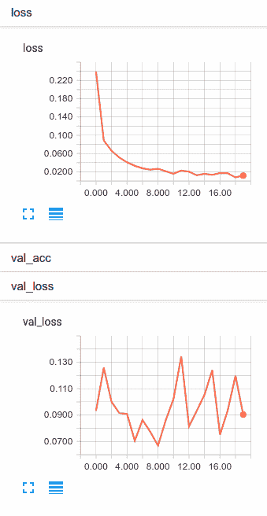

# 使用深度学习解决二进制分类问题

在本章中，我们将使用 Keras 和 TensorFlow 解决棘手的二进制分类问题。 我们将首先讨论深度学习对此类问题的利弊，然后我们将继续使用与[第 2 章](../Text/02.html)和*中使用的相同框架建立解决方案。 学习解决回归问题*。 最后，我们将更深入地介绍 Keras 回调，甚至使用自定义回调来实现曲线下[ETG5] / **区域的每个时期**接收器操作特征** / **区域（ **ROC AUC** ）指标。****

我们将在本章介绍以下主题：

*   二进制分类和深度神经网络
*   案例研究–癫痫发作识别
*   在 Keras 中建立二元分类器
*   在 Keras 中使用检查点回调
*   在自定义回调中测量 ROC AUC
*   测量精度，召回率和 f1 得分

# 二进制分类和深度神经网络

二进制分类问题（例如回归问题）是非常常见的机器学习任务。 如此之多，以至于任何一本有关深度学习的书都无法完整覆盖。 可以肯定的是，我们还没有真正达到深度神经网络的甜蜜点，但是我们进展顺利。 在开始编写代码之前，让我们谈谈在选择深度神经网络来解决此类问题时应考虑的权衡。

# 深度神经网络的好处

与更传统的分类器（例如逻辑回归模型）或什至基于树的模型（例如**随机森林**或**梯度提升机**）相比，深度神经网络有一些不错的选择 优点。

与回归一样，我们在[第 2 章](../Text/02.html)和*中使用深度学习解决了回归问题*，我们不需要选择或筛选特征。 在本章选择的问题中，有 178 个输入变量。 每个输入变量都是来自标记为 **x1..x178** 的 E **脑电图**（ **EEG** ）的特定输入。 即使您是医生，也很难理解这么多功能与目标变量之间的关系。 这些功能中的某些功能很可能是不相关的，而这些变量和目标之间可能存在一些更高级别的交互，这是一个更好的机会。 如果使用传统模型，则经过功能选择步骤后，我们将获得最佳模型性能。 使用深度神经网络时不需要这样做。

# 深度神经网络的缺点

正如我们在[第 2 章](../Text/02.html)和*中使用深度学习解决回归问题*所述，深度神经网络不容易解释。 虽然深度神经网络是出色的预测器，但要理解它们为何得出自己的预测并不容易。 需要重复的是，当任务是要了解哪些功能与目标的变化最相关时，深度神经网络并不是工作的工具。 但是，如果目标是原始预测能力，则应考虑使用深度神经网络。

我们还应该考虑复杂性。 深度神经网络是具有许多参数的复杂模型。 找到最佳的神经网络可能需要花费时间和实验。 并非所有问题都能确保达到如此复杂的水平。

在现实生活中，我很少使用深度学习作为结构化数据问题的第一个解决方案。 我将从可能可行的最简单模型开始，然后根据问题的需要迭代进行深度学习。 当问题域包含图像，音频或文本时，我更有可能从深度学习开始。

# 案例研究–癫痫发作识别

您可能已经猜到了，我们将要解决二进制分类问题。 我们将使用与在[第 2 章](../Text/02.html)和*中使用深度学习解决回归问题*建立的框架相同的框架来计划问题，并根据需要对其进行修改。 您可以在本书的 GitHub 存储库中的[第 4 章](../Text/02.html)和*下使用深度学习解决回归问题*，找到本章的完整代码。

# 定义我们的数据集

我们将在本章中使用的数据集称为 ***癫痫发作识别*** 数据集。 数据最初来自论文*，指示脑电活动的时间序列中的非线性确定性和有限维结构：Andrzejak RG 等人在 Phys 上发表的对记录区域和大脑状态的依赖性*。 修订版 E，64，061907。您可以在 [http://archive.ics.uci.edu/ml/datasets/Epileptic+Seizure+Recognition](http://archive.ics.uci.edu/ml/datasets/Epileptic+Seizure+Recognition) 的 UCI 机器学习存储库中找到数据。

我们的目标是创建一个深度神经网络，根据输入特征，该网络可以预测患者是否有癫痫发作。

# 加载数据中

我们可以使用以下功能加载本章中使用的数据。 它与我们在第 2 章中使用的功能非常相似，但是适用于此数据集。

```py
from sklearn.preprocessing import StandardScaler

def load_data():
 """Loads train, val, and test datasets from disk"""
 train = pd.read_csv(TRAIN_DATA)
 val = pd.read_csv(VAL_DATA)
 test = pd.read_csv(TEST_DATA)

 # we will use a dict to keep all this data tidy.
 data = dict()
 data["train_y"] = train.pop('y')
 data["val_y"] = val.pop('y')
 data["test_y"] = test.pop('y')

 # we will use sklearn's StandardScaler to scale our data to 0 mean, unit variance.
 scaler = StandardScaler()
 train = scaler.fit_transform(train)
 val = scaler.transform(val)
 test = scaler.transform(test)

 data["train_X"] = train
 data["val_X"] = val
 data["test_X"] = test
 # it's a good idea to keep the scaler (or at least the mean/variance) so we can unscale predictions
 data["scaler"] = scaler
 return data
```

# 模型输入和输出

该数据集中有 11,500 行。 数据集的每一行包含 178 个数据点，每个数据点代表 1 秒钟的 EEG 记录样本和相应的患者状态，跨 100 个不同患者生成。

数据集中有五个患者状态。 但是，状态 2 至状态 5 的患者未发生癫痫发作。 状态 1 的患者正在发作。

我已经修改了原始数据集，通过将状态 2-5 更改为 0 级（表示无癫痫发作）和将 1 级（表示有癫痫发作）将状态重新定义为二元分类问题。

与[第 2 章](../Text/02.html)和*中的回归问题一样，使用深度学习解决回归问题*，我们将使用 80％的训练，10％的 val，10％的测试分割。

# 成本函数

我们需要分类器来预测癫痫发作的可能性，即类别 1。这意味着我们的输出将被限制为 *[0,1]* ，就像在传统的逻辑回归模型中一样。 在这种情况下，我们的成本函数将是二进制交叉熵，也称为**对数损失**。 如果您以前使用过分类器，那么您可能很熟悉此数学运算； 但是，作为复习，我将在这里包括。

日志丢失的完整公式如下所示：


这可能更简单地看作是两个函数的集合，对于情况和，一个函数：


当和


当

对数函数在这里用于产生单调函数（一个一直在增加或减少的函数），我们可以轻松区分它。 与所有成本函数一样，我们将调整网络参数以最小化网络成本。

# 使用指标评估绩效

除了`loss`功能之外，Keras 还使我们可以使用度量标准来帮助判断模型的性能。 虽然最大程度地降低损失是有好处的，但在给定`loss`功能的情况下，我们如何期望模型执行效果并不是特别明显。 度量标准并不用于训练模型，它们只是用来帮助我们了解当前状态。

尽管损失对我们而言并不重要，但准确性却对我们而言意义重大。 我们人类非常了解准确性。

Keras 定义二进制精度如下：

```py
def binary_accuracy(y_true, y_pred):
    return K.mean(K.equal(y_true, K.round(y_pred)), axis=-1)

```

这实际上只是将正确答案的数量除以总答案的一种聪明方法，这是我们自从上学初期就可能一直在做的一项工作，目的是计算出考试的成绩。

您可能想知道我们的数据集是否平衡，因为准确性对于不平衡的数据集而言效果很差。 实际上这是不平衡的。 只有五分之一的数据集是类 1。我们将 ROC AUC 分数作为自定义回调来计算，以解决此问题。 在 Keras 中未将 ROC 用作度量标准，因为度量标准是针对每个小型批次计算的，并且 ROC AUC 分数并非真正由小型批次定义。

# 在 Keras 中建立二元分类器

既然我们已经定义了问题，输入，期望的输出和成本函数，我们就可以在 Keras 中快速编写其余代码。 我们唯一缺少的是网络体系结构。 我们将很快讨论更多。 关于 Keras 的我最喜欢的事情之一是调整网络架构有多么容易。 如您所见，在找到最佳架构之前，可能需要进行大量实验。 如果是这样，那么易于更改的框架会使您的工作变得更加轻松！

# 输入层

和以前一样，我们的输入层需要知道数据集的维度。 我喜欢在一个函数中构建整个 Keras 模型，并允许该函数传递回已编译的模型。 现在，此函数仅接受一个参数，即功能数。 以下代码用于定义输入层：

```py
def build_network(input_features=None):
    # first we specify an input layer, with a shape == features
    inputs = Input(shape=(input_features,), name="input")
```

# 隐藏的图层

我们已经定义了输入，这很容易。 现在我们需要确定网络体系结构。 我们如何知道应该包括多少层以及应该包含多少个神经元？ 我想给你一个公式。 我真的会的 不幸的是，它不存在。 实际上，有些人正在尝试构建可以学习其他神经网络的最佳架构的神经网络。 对于我们其余的人，我们将不得不尝试，寻找自己或借用别人的体系结构。

# 如果我们使用过多的神经元会发生什么？

如果我们使网络架构过于复杂，则会发生两件事：

*   我们可能会开发一个高方差模型
*   该模型将比不太复杂的模型训练得慢

如果我们增加许多层，我们的梯度将变得越来越小，直到前几层几乎没有训练为止，这就是**消失梯度问题**。 我们离那还很遥远，但是我们稍后会讨论。

用说唱传奇克里斯托弗·华莱士（又名臭名昭著的 B.I.G.）的话来说，我们遇到的神经元越多，看到的问题就越多。 话虽如此，方差可以通过辍学，正则化和提早停止进行管理，GPU 计算的进步使更深层次的网络成为可能。

如果我必须在神经元太多或太少的网络之间进行选择，而我只能尝试一个实验，那么我宁愿选择稍微过多的神经元。

# 如果我们使用的神经元太少会怎样？

想象一下，我们没有隐藏层，只有输入和输出的情况。 我们在[第 1 章](../Text/01.html)和*深度学习的基础知识*中讨论了该架构，在此我们展示了如何无法为`XOR`函数建模。 这样的网络架构无法对数据中的任何非线性进行建模，因此无法通过网络进行建模。 每个隐藏层都为功能工程越来越复杂的交互提供了机会。

如果选择的神经元太少，则结果可能如下：

*   真正快速的神经网络
*   那有很高的偏见，而且预测不是很好

# 选择隐藏层架构

因此，既然我们了解选择太多参数而不是选择太多参数的价格和行为，那么从哪里开始呢？ 据我所知，剩下的只是实验。

测量这些实验可能很棘手。 如果像我们的早期网络一样，您的网络训练很快，那么可以在多种架构中实施诸如交叉验证之类的东西，以评估每种架构的多次运行。 如果您的网络需要很长时间进行训练，则可能会留下一些统计上不太复杂的信息。 我们将在[第 6 章](../Text/06.html)和*超参数优化*中介绍网络优化。

一些书籍提供了选择神经网络体系结构的经验法则。 我对此表示怀疑和怀疑，您当然不会在这里找到一个。

# 为我们的示例编码隐藏层

对于我们的示例问题，我将使用五个隐藏层，因为我认为要素之间存在许多交互。 我的直觉主要基于领域知识。 阅读数据描述后，我知道这是时间序列的横截面切片，并且可能是自动相关的。

我将从第一层的 128 个神经元开始（略小于我的输入大小），然后在接近输出时减半到 16 个神经元。 这完全不是凭经验，它仅基于我自己的经验。 我们将使用以下代码定义隐藏层：

```py
x = Dense(128, activation='relu', name="hidden1")(inputs)
x = Dense(64, activation='relu', name="hidden2")(x)
x = Dense(64, activation='relu', name="hidden3")(x)
x = Dense(32, activation='relu', name="hidden4")(x)
x = Dense(16, activation='relu', name="hidden5")(x)
```

在每一层中，我都使用`relu`激活，因为它通常是最好和最安全的选择，但是要确保这也是可以试验的超参数。

# 输出层

最后，我们需要网络的输出层。 我们将使用以下代码定义输出层：

```py
prediction = Dense(1, activation='sigmoid', name="final")(x)
```

在此示例中，我们正在构建一个二进制分类器，因此我们希望我们的网络输出观察结果属于类 1 的概率。幸运的是，`sigmoid`激活将精确地做到这一点，将网络输出限制在 0 到 1 之间。

# 放在一起

将所有代码放在一起，剩下的就是编译我们的 Keras 模型，将`binary_crossentrophy`指定为我们的`loss`函数，将`accuracy`指定为我们希望在培训过程中监控的指标。 我们将使用以下代码来编译我们的 Keras 模型：

```py
def build_network(input_features=None):
    inputs = Input(shape=(input_features,), name="input")
    x = Dense(128, activation='relu', name="hidden1")(inputs)
    x = Dense(64, activation='relu', name="hidden2")(x)
    x = Dense(64, activation='relu', name="hidden3")(x)
    x = Dense(32, activation='relu', name="hidden4")(x)
    x = Dense(16, activation='relu', name="hidden5")(x)
    prediction = Dense(1, activation='sigmoid', name="final")(x)
    model = Model(inputs=inputs, outputs=prediction)
    model.compile(optimizer='adam', loss='binary_crossentropy', 
    metrics=["accuracy"])
    return model
```

# 训练我们的模型

现在我们已经定义了模型，我们都准备对其进行训练。 我们的操作方法如下：

```py
input_features = data["train_X"].shape[1]
model = build_network(input_features=input_features)
model.fit(x=data["train_X"], y=data["train_y"], batch_size=32, epochs=20, verbose=1, validation_data=(data["val_X"], data["val_y"]), callbacks=callbacks)
```

如果您已经阅读[第 2 章](../Text/02.html)，*使用深度学习解决回归问题*，则应该看起来很熟悉。 在大多数情况下，实际上是相同的。 回调列表包含 TensorBoard 回调，因此让我们观看我们的网络训练 20 个纪元，看看会发生什么：

> 

尽管我们的火车损失继续下降，但我们可以看到 val_loss 到处都在跳跃。 大约在第八个时代之后，我们就过度拟合了。

有几种方法可以减少网络差异并管理这种过度拟合，下一章将介绍大多数方法。 但是，在开始之前，我想向您展示一些有用的东西，称为**检查点回调**。

# 在 Keras 中使用检查点回调

在[第 2 章](../Text/02.html)和*中，使用深度学习解决回归问题*时，我们看到了`.save()`方法，该方法使我们可以在完成训练后保存 Keras 模型。 但是，如果我们可以不时地将权重写入磁盘，以便在上一个示例中及时返回 *g* o 并在模型开始之前保存其版本，那会不好吗 过拟合？ 然后，我们可以就此停止，并使用网络的最低​​方差版本。

这正是`ModelCheckpoint`回调为我们所做的。 让我们来看看：

```py
checkpoint_callback = ModelCheckpoint(filepath="./model-weights.{epoch:02d}-{val_acc:.6f}.hdf5", monitor='val_acc', verbose=1, save_best_only=True)
```

`ModelCheckpoint`将为我们执行的工作是按计划的时间间隔保存模型。 在这里，我们告诉`ModelCheckpoint`每当我们达到新的最佳验证精度（`val_acc`）时都要保存模型的副本。 我们也可以监视验证损失或我们指定的任何其他指标。

文件名字符串将包含纪元编号和运行的验证准确性。

当我们再次训练模型时，我们可以看到正在创建以下文件：

```py
model-weights.00-0.971304.hdf5
model-weights.02-0.977391.hdf5
model-weights.05-0.985217.hdf5
```

因此，我们可以看到在第 5 个阶段之后，我们无法达到`val_acc`的最佳水平，并且没有编写检查点。 然后，我们可以返回并从检查点 5 加载权重，并使用最佳模型。

这里有一些大的假设，将第 5 期称为最佳。 您可能需要多次运行网络，尤其是在您的数据集相对较小的情况下，就像本书中的早期示例一样。 我们可以肯定地说，这个结果将是不稳定的。

顺便说一下，这是防止过度拟合的非常简单的方法。 我们可以选择使用方差太大之前发生的模型检查点。 这是做类似提前停止的一种方法，这意味着当我们看到模型没有改善时，我们会在指定的时期数之前停止训练。

# 在自定义回调中测量 ROC AUC

让我们再使用一个回调。 这次，我们将构建一个自定义的回调，以在每个纪元结束时在训练集和测试集上计算曲线下的接收器工作特征区域（ROC AUC）。

在 Keras 中创建自定义回调实际上非常简单。 我们需要做的就是创建一个固有的`Callback`类，并覆盖所需的方法。 由于我们想在每个时期结束时计算 ROC AUC 分数，因此我们将在`_epoch_end`上覆盖：

```py
from keras.callbacks import Callback

class RocAUCScore(Callback):
    def __init__(self, training_data, validation_data):
        self.x = training_data[0]
        self.y = training_data[1]
        self.x_val = validation_data[0]
        self.y_val = validation_data[1]
        super(RocAUCScore, self).__init__()

    def on_epoch_end(self, epoch, logs={}):
        y_pred = self.model.predict(self.x)
        roc = roc_auc_score(self.y, y_pred)
        y_pred_val = self.model.predict(self.x_val)
        roc_val = roc_auc_score(self.y_val, y_pred_val)
        print('\n  *** ROC AUC Score: %s - roc-auc_val: %s ***' % 
          (str(roc), str(roc_val)))
        return

```

现在，我们已经创建了新的自定义回调，我们可以将其添加到回调创建器函数中，如以下代码所示：

```py
def create_callbacks(data):
   tensorboard_callback = TensorBoard(log_dir=os.path.join(os.getcwd(),  
     "tb_log", "5h_adam_20epochs"), histogram_freq=1, batch_size=32, 
        write_graph=True, write_grads=False)
   roc_auc_callback = RocAUCScore(training_data=(data["train_X"], 
     data["train_y"]), validation_data=(data["val_X"], data["val_y"]))
  checkpoint_callback = ModelCheckpoint(filepath="./model-weights.
    {epoch:02d}-{val_acc:.6f}.hdf5", monitor='val_acc',verbose=1, 
    save_best_only=True)
    return [tensorboard_callback, roc_auc_callback, checkpoint_callback]
```

这里的所有都是它的！ 您可以用相同的方式实施其他任何指标。

# 测量精度，召回率和 f1 得分

正如您可能对其他二进制分类器有丰富的经验一样，我认为用几句话讨论如何创建与更传统的二进制分类器一起使用的一些常规指标是明智的。

Keras 功能 API 与 scikit-learn 中可能使用的 API 之间的区别是`.predict()`方法的行为。 当使用 Keras 时，对于每个 *n* 类，`.predict()`将返回 *k* 类概率的`nxk`矩阵。 对于二进制分类器，将只有一列，即类别 1 的类别概率。这使 Keras `.predict()`更像 scikit-learn 中的`.predict_proba()`。

在计算精度，召回率或其他基于类的指标时，您需要通过选择一些操作点来转换`.predict()`输出，如以下代码所示：

```py
def class_from_prob(x, operating_point=0.5):
    x[x >= operating_point] = 1
    x[x < operating_point] = 0
    return x
```

完成此操作后，您可以随意重用`sklearn.metric`中的典型指标，如以下代码所示：

```py
y_prob_val = model.predict(data["val_X"])
y_hat_val = class_from_prob(y_prob_val)
print(classification_report(data["val_y"], y_hat_val))
```

# 摘要

在本章中，我们讨论了使用深度神经网络作为二进制分类器。 我们花了很多时间讨论网络体系结构的设计选择，并提出了这样的想法，即搜索和试验是当前选择体系结构的最佳方法。

我们学习了如何在 Keras 中使用检查点回调来使我们能够及时返回并找到具有所需性能特征的模型版本。 然后，我们在训练的模型中创建并使用了自定义回调来衡量 ROC AUC 得分。 我们总结了如何将 Keras `.predict()`方法与`sklearn.metrics`中的传统指标结合使用。

在下一章中，我们将研究多类分类，我们将更多地讨论如何防止过拟合。