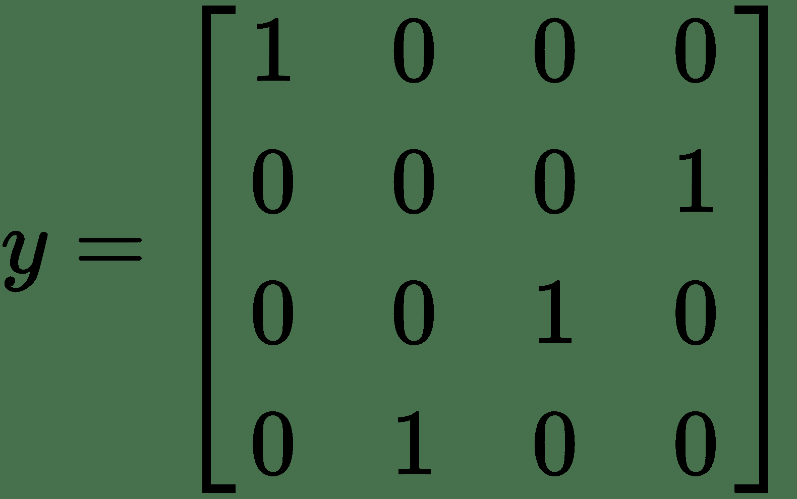
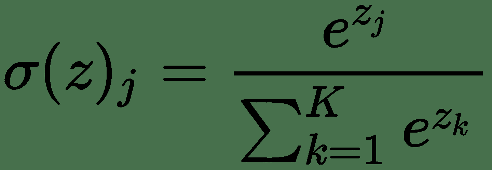
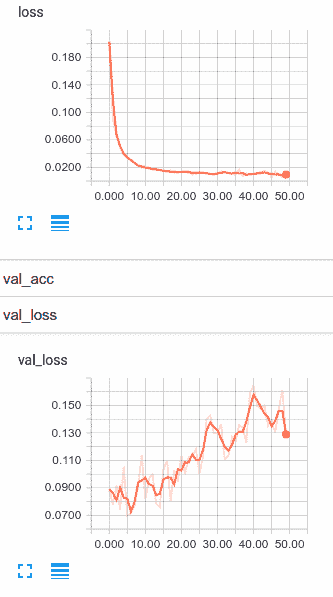
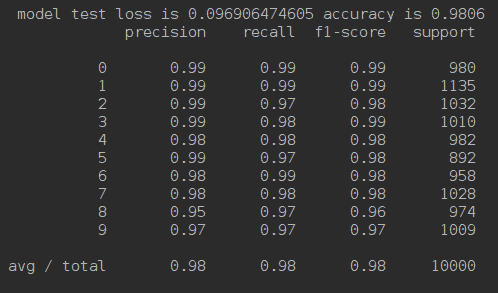
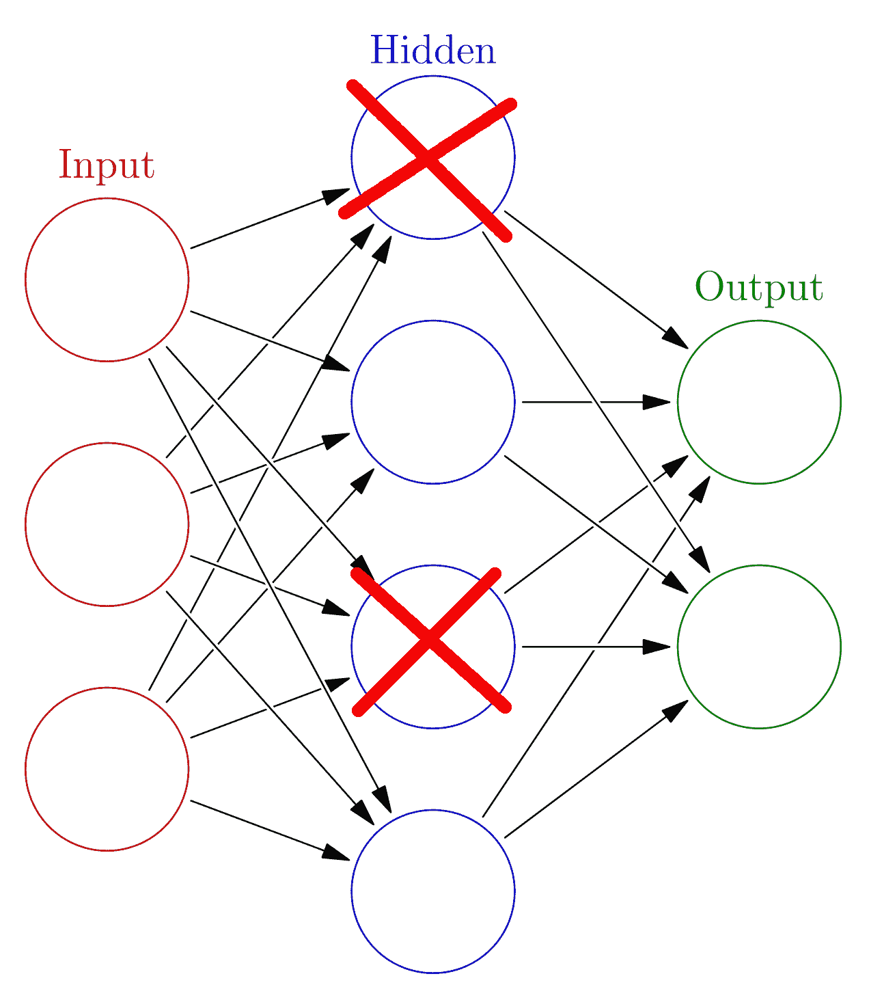
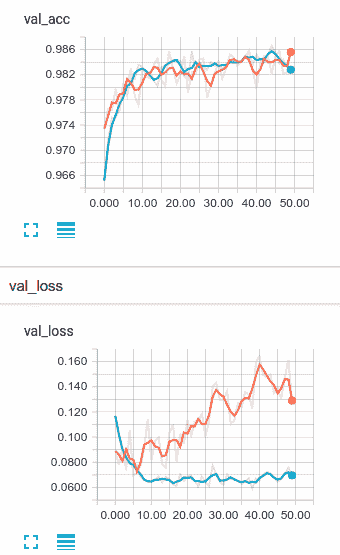
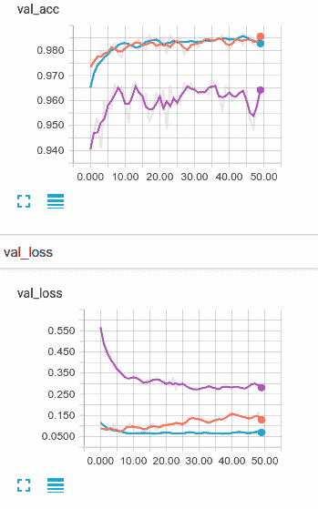

# 五、使用 Keras 解决多分类问题

在本章中，我们将使用 Keras 和 TensorFlow 来处理具有许多自变量的 10 类多分类问题。 和以前一样，我们将讨论使用深度学习解决此问题的利弊； 但是，您不会发现很多缺点。 最后，我们将花费大量时间讨论控制过拟合的方法。

我们将在本章介绍以下主题：

*   多分类和深度神经网络
*   案例研究 – 手写数字分类
*   在 Keras 中建立多分类器
*   通过丢弃控制方差
*   通过正则化控制方差

# 多分类和深度神经网络

这里是！ 我们终于找到了有趣的东西！ 在本章中，我们将创建一个深度神经网络，该网络可以将观察结果分类为多个类别，这是神经网络确实发挥出色的地方之一。 让我们再谈一些关于深度神经网络对此类问题的好处。

就像我们都在谈论同一件事一样，让我们​​在开始之前定义多分类。 想象我们有一个分类器，该分类器将各种水果的权重作为输入，并根据给定的权重来预测水果。 输出可能恰好是一组类（苹果，香蕉，芒果等）中的一个类。 这是多分类，不要与多标签混淆，在这种情况下，模型可能会预测一组标签是否将应用于互不排斥的观察结果。

# 优点

当我们需要预测大量类时，相对于其他模型，深度神经网络的确是出色的执行者。 当输入向量中的特征数量变大时，神经网络自然适合。 当这两种情况都集中在同一个问题上时，我可能就是从那里开始的。 这正是我们将在本章中要研究的案例研究中看到的问题的类型。

# 缺点

和以前一样，更简单的模型可能会比深度学习模型做的更好或更好。 在所有其他条件都相同的情况下，您可能应该支持更简单的模型。 但是，随着类数的增加，深度神经网络复杂性的弊端通常会减少。 为了容纳许多类，许多其他模型的实现必须变得非常复杂，有些模型甚至可能需要优化作为超参数用于模型的多类策略。

# 案例研究 - 手写数字分类

我们将使用多分类网络来识别手写数字的相应类。 与以前一样，如果您想继续阅读，可以在本书的 Git 存储库中的`Chapter05`下找到本章的完整代码。

# 问题定义

`MNIST`数据集已成为几乎规范的神经网络数据集。 该数据集由 60,000 个手写数字组成的图像，属于代表它们各自数字`(0, 1, 2 ... 9)`的 10 类。 由于此数据集变得如此普遍，因此许多深度学习框架都在 API 中内置了 MNIST 加载方法。 TensorFlow 和 Keras 都拥有一个，我们将使用 Keras MNIST 加载器使我们的生活更轻松。 但是，如果您想从原始数据中获取数据，或者想进一步了解 MNIST 的历史，可以在[这个页面](http://yann.lecun.com/exdb/mnist/)中找到更多信息。

# 模型输入和输出

我们的数据集已被划分为一个训练集，该训练集的大小为 50,000 个观察值，一个测试集为 10,000 个观察值。 我将从训练集中获取最后 5,000 个观察值，并将其用作验证集。

# 拼合输入

每个输入观察都是一个 28 像素乘 28 像素的黑白图像。 像这样的一幅图像在磁盘上表示为`28x28`的矩阵，其值介于 0 到 255 之间，其中每个值都是该像素中黑色的强度。 至此，我们只知道如何在二维向量上训练网络（稍后我们将学习一种更好的方法）； 因此我们将这个`28x28`矩阵展平为`1 x 784`输入向量。

一旦我们堆叠了所有这些`1x784`向量，就剩下`50,000 x 784`训练集。

如果您对卷积神经网络有丰富的经验，那么您可能现在正在翻白眼，如果您还没有，那么很快就会有更好的方法，但是不要太快地跳过本章。 我认为扁平化的`MNIST`是一个非常好的数据集，因为它的外观和行为与我们在许多投入领域（例如，物联网，制造业，生物，制药和医疗用例）中遇到的许多复杂的现实生活问题非常相似）。

# 类别输出

我们的输出层将为每个类包含一个神经元。 每个类别的关联神经元将经过训练，以将该类别的概率预测为介于 0 和 1 之间的值。我们将使用一种称为 **softmax** 的特殊激活，以确保所有这些输出总和为 1，我们将介绍 softmax 的详细信息。

这意味着我们将需要为我们的类创建一个二进制/分类编码。 例如，如果我们使`y = [0, 3, 2, 1]`并对其进行分类编码，则将具有如下矩阵`y`：



幸运的是，Keras 为我们提供了方便的功能来进行这种转换。

# 成本函数

我们将使用的成本函数称为**多项式交叉熵**。 多项式交叉熵实际上只是在第 4 章“使用 Keras 进行二分类”中看到的二进制交叉熵函数的概括。

让我们一起看看它们，而不只是显示分类交叉熵。 我要断言它们是平等的，然后解释原因：


前面的等式是正确的（`m = 2`时）

好吧，别害怕。 我知道，这是一堆数学。 绝对交叉熵方程是一直存在于右边的方程。 二进制交叉熵紧随其后。 现在，设想`m = 2`的情况。 在这种情况下，您可能会发现，`j = 0`和`j = 1`的`y[ij]log(p[ij])`的和，对于`i`中的每个值，等于来自二元交叉熵的结果。 希望这种减少足以使分类交叉熵有意义。 如果没有，我建议选择一些值并进行编码。 只需一秒钟，稍后您将感谢我！

# 指标

分类交叉熵是一个很好的成本函数，但实际上并不能告诉我们很多我们可以从网络中获得的预测质量。 不幸的是，像 ROC AUC 这样的二分类指标也对我们没有太大帮助，因为我们超越了二分类 AUC 的定义并没有。

鉴于缺少更好的指标，我将使用准确性作为人类可以理解的训练指标。 幸运的是，在这种情况下，我的数据集是平衡的。 正如您所期望的那样，准确性是指真实值与预测值的匹配次数除以数据集的总大小。

训练结束后，我将使用 scikit-learn 的分类报告向我们显示每个班级的精确度和召回率。 如果您愿意，也可以为此使用混淆矩阵。

# 在 Keras 中建立多分类器

由于我们现在有一个定义明确的问题，因此可以开始对其进行编码。 如前所述，这次我们必须对输入和输出进行一些转换。 在我们建立网络的过程中，我将向您展示这些内容。

# 载入 MNIST

对我们来说幸运的是，在 Keras 中内置了一个 MNIST 加载函数，该函数可以检索 MNIST 数据并为我们加载。 我们需要做的就是导入`keras.datasets.mnist`并使用`load_data()`方法，如以下代码所示：

```py
(train_X, train_y), (test_X, test_y) = mnist.load_data()
```

`train_X`的形状为`50,000 x 28 x 28`。正如我们在“模型输入和输出”部分中所述，我们将需要将`28x28`矩阵展平为 784 个元素向量。 NumPy 使这变得非常容易。 以下代码说明了此技术：

```py
train_X = train_X.reshape(-1, 784)
```

有了这种方式，我们应该考虑扩展输入。 以前，我们使用 scikit-learn 的`StandardScaler`。 MNIST 不需要这样做。 由于我们知道每个像素都在 0 到 255 的相同范围内，因此我们可以通过除以`255`轻松地将值转换为 0 和 1 之间的值，然后在执行操作之前将数据类型显式转换为`float32`，如以下代码所示：

```py
train_X = train_X.astype('float32')
train_X /= 255

```

正如我们在“模型输入和输出”部分中所述，在加载数据时，我们可能应该将因变量向量转换为分类向量。 为此，我们将在以下代码的帮助下使用`keras.utils.to_categorical()`：

```py
train_y = to_categorical(train_y)
```

这样，我们的数据就可以进行训练了！

# 输入层

我们的输入层实际上与之前的示例保持不变，但我将在此处包括它以使其成为适当的快速参考：

```py
def build_network(input_features=None):
    inputs = Input(shape=(input_features,), name="input")
```

# 隐藏层

我将使用带有`512`神经元的第一个隐藏层。 这比输入向量的 784 个元素略小，但这完全不是规则。 同样，此架构只是一个开始，并不一定是最好的。 然后，我将在第二和第三隐藏层中浏览大小，如以下代码所示：

```py
x = Dense(512, activation='relu', name="hidden1")(inputs)
x = Dense(256, activation='relu', name="hidden2")(x)
x = Dense(128, activation='relu', name="hidden3")(x)
```

# 输出层

我们的输出层将包含 10 个神经元，一个观察值可能属于其中的每个可能的类。 这对应于我们在`y`向量上使用`to_categorical()`时施加的编码：

```py
prediction = Dense(10, activation='softmax', name="output")(x)
```

如您所见，我们正在使用的激活称为 **softmax**。 让我们讨论一下`softmax`是什么，以及为什么有用。

# Softmax 激活

想象一下，如果不是使用深层神经网络，而是使用`k`个逻辑回归，其中每个回归都预测单个类中的成员。 逻辑回归的集合（每个类一个）如下所示：


使用这组逻辑回归的问题是每个逻辑回归的输出都是独立的。 想象一下，在我们的集合中，这些逻辑回归中的一些不确定其所属类别的成员资格，从而导致多个答案在`P(Y = k) = 0.5`附近。 这使我们无法将这些输出用作`k`类中类成员资格的总体概率，因为它们不一定总和为 1。

Softmax 压缩所有这些逻辑回归的输出，使它们的总和为 1，从而将其用作整体类成员的概率，从而为我们提供了帮助。

`softmax`函数如下所示：



（对于`j = 1`至`k`类，其中`zj / zk`是属于`k`的逻辑回归）

因此，如果将`softmax`函数放在我们先前的回归集的前面，我们将得到一组类别概率，它们合计为 1，可以用作 k 个类别中成员资格的概率。 这改变了我们的整体函数，如下所示：


先前的函数通常称为多项式逻辑回归。 它有点像一层，仅输出和神经网络。 我们不再频繁使用多项式逻辑回归。 但是，我们当然可以一直使用`softmax`函数。 对于本书中的大多数多分类问题，我们将使用`softmax`，因此值得理解。

如果您像我一样，并且发现所有数学知识都难以阅读，那么在代码中查看`softmax`可能会更容易。 因此，在继续操作之前，请使用以下代码段进行操作：

```py
def softmax(z):
 z_exp = [math.exp(x) for x in z]
 sum_z_exp = sum(z_exp)
 softmax = [round(i / sum_z_exp, 3) for i in z_exp]
 return softmax
```

让我们快速尝试一个例子。 想象一下，我们有一组逻辑输出，如下所示：

```py
z = np.array([0.9, 0.8, 0.2, 0.1, 0.5])
```

如果应用`softmax`，我们可以轻松地将这些输出转换为相对的类概率，如下所示：

```py
print(softmax(z))
[0.284, 0.257, 0.141, 0.128, 0.19]
```

# 放在一起

现在我们已经涵盖了各个部分，让我们看一下我们的整个网络。 这看起来与我们之前在本书中介绍的模型相似。 但是，我们使用的损失函数`categorical_crossentropy`在本章的“成本函数”部分中介绍了。

我们将使用以下代码定义网络：

```py
def build_network(input_features=None):
    # first we specify an input layer, with a shape == features
    inputs = Input(shape=(input_features,), name="input")
    x = Dense(512, activation='relu', name="hidden1")(inputs)
    x = Dense(256, activation='relu', name="hidden2")(x)
    x = Dense(128, activation='relu', name="hidden3")(x)
    prediction = Dense(10, activation='softmax', name="output")(x)
    model = Model(inputs=inputs, outputs=prediction)
    model.compile(optimizer='adam', loss='categorical_crossentropy', metrics=["accuracy"])
    return model
```

# 训练

现在我们已经定义了神经网络并加载了数据，剩下的就是训练它了。

在本书中以及本书的其他几个示例中，我使用的是称为数据的字典，以绕过`train_X`，`val_X`和`test_X`等各种数据集。 我使用这种表示法来保持代码的可读性，并且因为传递整个字典的必要性经常高于没有。

这是我将如何训练我们刚刚建立的模型的方法。

```py
model = build_network(data["train_X"].shape[1])
model.fit(x=data["train_X"], y=data["train_y"],
          batch_size=30,
          epochs=50,
          validation_data=(data["val_X"], data["val_y"]),
          verbose=1,
          callbacks=callbacks)
```

我正在使用与以前相同的回调。 我没有使用我们在第 4 章“使用 Keras 进行二分类”中构建的 ROC AUC 回调，因为 ROC AUC 没有为多分类器明确定义。

存在一些针对该问题的创造性解决方案。 例如，[**通过成对分析近似多类 ROC**](http://citeseerx.ist.psu.edu/viewdoc/download?doi=10.1.1.108.3250&rep=rep1&type=pdf) 和 [**ROC 表面下体积**](http://citeseerx.ist.psu.edu/viewdoc/download?doi=10.1.1.14.2427&rep=rep1&type=pdf)都是出色的论文，都可以解决这个问题。 但是，实际上，这些方法及其度量标准很少在 R 中使用，最常在 R 中实现。因此，到目前为止，让我们坚持使用多类准确性，并且远离 R。

让我们观看 TensorBoard 在我们的模型训练中：



在阅读下一段之前，请花点时间思考一下这些图形在告诉我们什么。 得到它了？ 好的，让我们继续。

因此，这是一个熟悉的情况。 我们的训练损失正在继续下降，而我们的验证损失正在上升。 我们过拟合。 虽然当然可以选择提前停止，但让我向您展示一些处理过拟合的新技巧。 让我们在下一部分中查看辍学和 l2 正则化。 但是，在进行此操作之前，我们应该研究如何使用多类网络来测量准确性和进行预测。

# 在多类模型中使用 scikit-learn 指标

和以前一样，我们可以借鉴 scikit-learn 的指标来衡量我们的模型。 但是，为此，我们需要从模型的`y`的分类输出中进行一些简单的转换，因为 scikit-learn 需要使用类标签，而不是二进制类指示器。

为了取得飞跃，我们将使用以下代码开始进行预测：

```py
y_softmax = model.predict(data["test_X"])
```

然后，我们将选择概率最大的类的索引，使用以下代码将其方便地作为该类：

```py
y_hat = y_softmax.argmax(axis=-1)
```

然后，我们可以像以前一样使用 scikit-learn 的分类报告。 相同的代码如下：

```py
from sklearn.metrics import classification_report
print(classification_report(test_y, y_hat))
```

现在，我们实际上可以查看所有 10 个类的精度，召回率和 f1 得分。 下图说明了`sklearn.metrics.classification_report()`的输出：



# 通过丢弃控制方差

减少深度神经网络过拟合的一种非常好的方法是采用一种称为**丢弃法**的技术。 丢弃法完全按照其说的去做，它使神经元脱离隐藏层。 运作方式如下。

通过每个小批量，我们将随机选择关闭每个隐藏层中的节点。 想象一下，我们在某个隐藏层中实施了丢弃，并且我们选择了丢弃率为 0.5。 这意味着，对于每个小批量，对于每个神经元，我们都掷硬币以查看是否使用该神经元。 这样，您可能会随机关闭该隐藏层中大约一半的神经元：



如果我们一遍又一遍地执行此操作，就好像我们正在训练许多较小的网络。 模型权重保持相对较小，每个较小的网络不太可能过拟合数据。 这也迫使每个神经元减少对其他神经元的依赖。

辍学效果惊人，可以很好地解决您可能遇到的许多（如果不是大多数）深度学习问题的过拟合问题。 如果您具有高方差模型，则辍学是减少过拟合的好选择。

Keras 包含一个内置的`Dropout`层，我们可以轻松地在网络中使用它来实现`Dropout`。 `Dropout`层将简单地随机关闭前一层神经元的输出，以使我们轻松地改造网络以使用`Dropout`。 要使用它，除了我们正在使用的其他层类型之外，我们还需要首先导入新层，如以下代码所示：

```py
from keras.layers import Input, Dense, Dropout
```

然后，我们只需将`Dropout`图层插入模型，如以下代码所示：

```py
def build_network(input_features=None):
    # first we specify an input layer, with a shape == features
    inputs = Input(shape=(input_features,), name="input")
    x = Dense(512, activation='relu', name="hidden1")(inputs)
    x = Dropout(0.5)(x)
    x = Dense(256, activation='relu', name="hidden2")(x)
    x = Dropout(0.5)(x)
    x = Dense(128, activation='relu', name="hidden3")(x)
    x = Dropout(0.5)(x)
    prediction = Dense(10, activation='softmax', name="output")(x)
    model = Model(inputs=inputs, outputs=prediction)
    model.compile(optimizer='adam', loss='categorical_crossentropy', 
                  metrics=["accuracy"])
    return model
```

这是我们先前使用的确切模型； 但是，我们在每个`Dense`层之后都插入了`Dropout`层，这是我通常在实现辍学时开始的方式。 像其他模型架构决策一样，您可以选择仅在某些层，所有层或没有层中实施辍学。 您还可以选择更改退出/保留概率； 但是，我确实建议从 0.5 开始，因为它通常效果很好。

一个安全的选择是在每一层都退出，保持概率为 0.5。 不错的第二种尝试是仅在第一层使用辍学。

让我们用辍学训练我们的新模型，看看它与我们的第一次尝试相比如何：



首先让我们看一下验证准确性。 使用辍学模型的训练速度与未规范模型的训练速度一样快，但是在这种情况下，它的确似乎很快就开始加速。 看看在第 44 个时期的验证准确性。它比非正规模型略好。

现在，让我们看看验证损失。 您可以看到辍学对模型过拟合的影响，而且确实非常明显。 虽然仅转换为最终产品的少量改进，但辍学表现相当不错，可以防止我们的验证丢失。

# 通过正则化控制方差

**正则化**是控制过拟合的另一种方法，当模型中的各个权重增大时会对其进行惩罚。 如果您熟悉线性模型（例如线性和逻辑回归），那么它与在神经元级别应用的技术完全相同。 可以使用两种形式的正则化，称为 L1 和 L2，来对神经网络进行正则化。 但是，由于 L2 正则化计算效率更高，因此几乎总是在神经网络中使用它。

快速地，我们需要首先规范化成本函数。 如果我们将`C[0]`，分类交叉熵作为原始成本函数，则正规化的`cost`函数将如下所示：


这里，`λ`是可以增加或减少以更改应用的正则化量的正则化参数。 此正则化参数会惩罚较大的权重值，从而使网络总体上希望具有较小的权重。

要更深入地了解神经网络中的正则化，请查看 Michael Nielsen 的[《神经网络和深度学习》的第 3 章](http://neuralnetworksanddeeplearning.com/chap3.html)。

可以将正则化应用于 Keras 层中的权重，偏差和激活。 我将使用带有默认参数的 L2 演示此技术。 在以下示例中，我将正则化应用于每个隐藏层：

```py
def build_network(input_features=None):
    # first we specify an input layer, with a shape == features
    inputs = Input(shape=(input_features,), name="input")
    x = Dense(512, activation='relu', name="hidden1", kernel_regularizer='l2') \  
      (inputs)
    x = Dense(256, activation='relu', name="hidden2", kernel_regularizer='l2')(x)
    x = Dense(128, activation='relu', name="hidden3", kernel_regularizer='l2')(x)
    prediction = Dense(10, activation='softmax', name="output")(x)
    model = Model(inputs=inputs, outputs=prediction)
    model.compile(optimizer='adam', loss='categorical_crossentropy',
                  metrics=["accuracy"])
    return model
```

因此，让我们将默认的 L2 正则化与其他两个模型进行比较。 下图显示了比较：



不幸的是，我们的新 L2 正则化网络很容易找到。 在这种情况下，似乎 L2 正则化效果很好。 我们的网络现在偏见严重，对其他两个方面的了解还不够。

如果我真的确定要使用正则化来解决此问题，那么我将首先更改正则化率并尝试找到更合适的值，但我们相距甚远，我对此表示怀疑，我们会做得比我们更好 `dropout`模型。

# 总结

在本章中，我们实际上已经开始了解深度神经网络在进行多分类时的威力。 我们详细介绍了`softmax`函数，然后我们构建并训练了一个网络来将手写数字分为 10 个各自的类别。

最后，当我们注意到模型过拟合时，我们尝试同时使用丢弃和 L2 正则化来减少模型的方差。

到目前为止，您已经看到深度神经网络需要很多选择，关于架构的选择，学习率，甚至是正则化率。 我们将在下一章中学习如何优化这些选择。