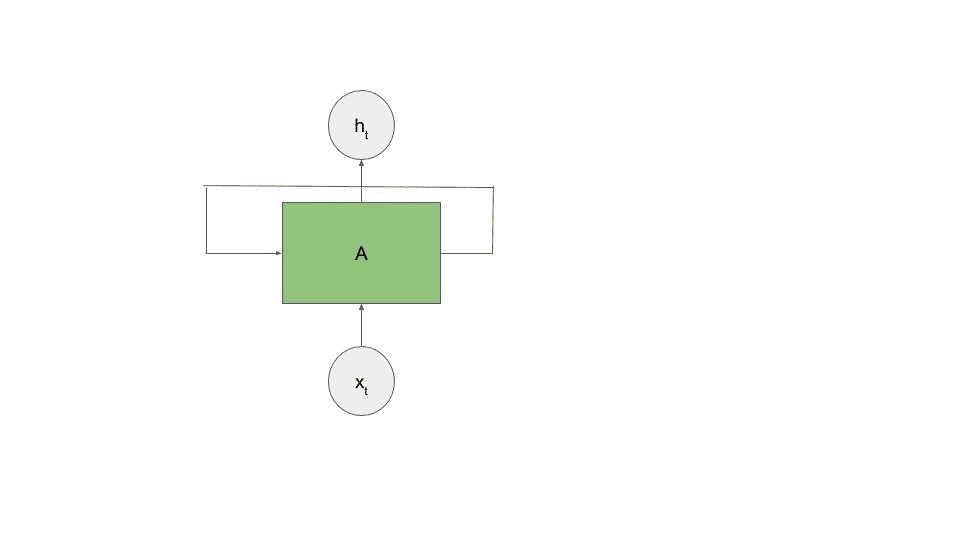
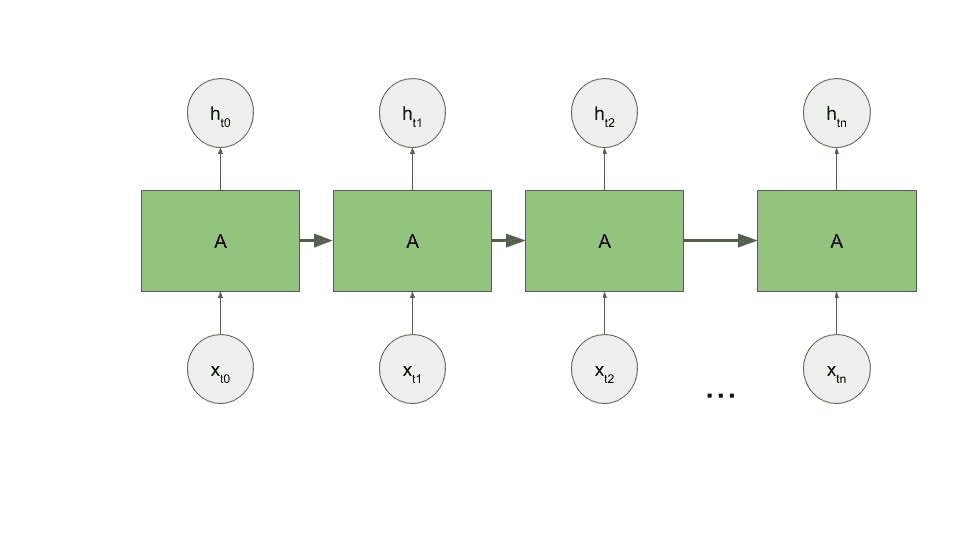
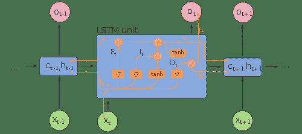
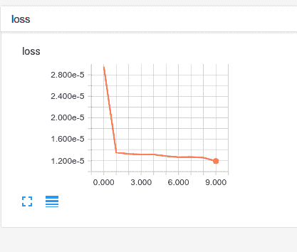
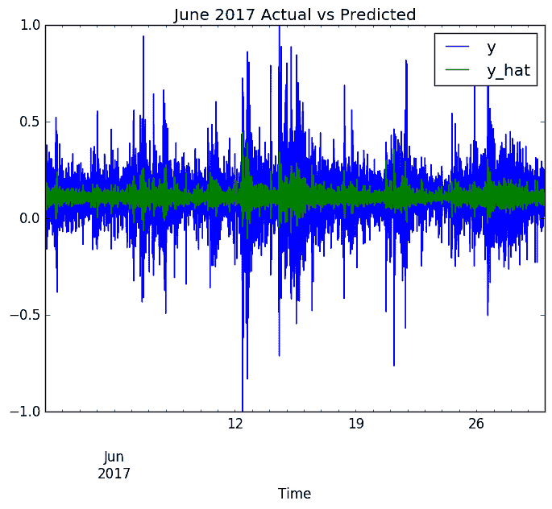
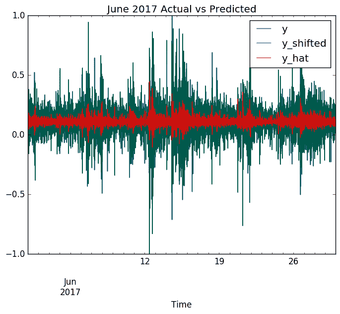

# 从头开始训练 RNN

**递归神经网络**（**RNN**）是为建模顺序数据而构建的一组神经网络。 在最后几章中，我们研究了使用卷积层从图像中学习特征。 当我们想从所有相关的值中学习特征时，递归层同样有用： *x <sub>t</sub>* ， *x <sub>t-1</sub>* ， *x <sub>t-2</sub>* ， *x* <sub>*t-3*</sub> 。

在本章中，我们将讨论如何将 RNN 用于时间序列问题，这无疑是涉及按时间或时间顺序排列的一系列数据点的问题。

我们将在本章介绍以下主题：

*   引入递归神经网络
*   时间序列问题
*   使用 LSTM 进行时间序列预测

# 引入递归神经网络

如果定义不清楚，我们来看一个例子：一个股票行情指示器，我们可以在其中观察股票价格随时间的变化，例如以下屏幕快照中的 Alphabet Inc.，这是时间序列的一个示例：


在下一章中，我们将讨论使用递归神经网络为语言建模，这是另一种类型的序列，即单词序列。 由于您正在阅读本书，因此无疑已经对语言顺序有了一些直觉。

如果您不熟悉时间序列，您可能想知道是否可以使用普通的多层感知器来解决时间序列问题。 您当然可以做到； 但是，实际上，使用递归网络几乎总是可以得到更好的结果。 也就是说，递归神经网络在序列建模方面还有其他两个优点：

*   他们可以比普通的 MLP 更轻松地学习很长的序列
*   他们可以处理不同长度的序列

当然，这给我们提出了一个重要的问题...

# 是什么使神经元复发？

循环神经网络具有循环，可以使信息从一个预测持续到下一个预测。 这意味着每个神经元的输出取决于网络的当前输入和先前的输出，如下图所示：



如果我们将这个图跨时间展平，它将看起来更像下图。 网络通知本身的想法是“递归”一词的来源，尽管作为 CS 专业，我始终将其视为递归神经网络。



在上图中，我们可以看到神经元 **A** 接受输入 **x <sub>t0</sub>** 并输出 **h <sub>t0</sub>** 在时间步 0 处。然后在时间步 1，神经元使用输入 **x <sub>t1</sub>** 以及来自其上一个时间步的信号来输出 **h <sub>t1 [</sub>** 。 现在在时间步骤 2，它认为它是输入 **x <sub>t2</sub>** 以及上一个时间步骤的信号，该信号可能仍包含时间步骤 0 的信息。我们继续这种方式，直到到达 序列中的最后一个时间步，网络逐步增加其内存。

标准 RNN 使用权重矩阵将前一个时间步的信号与当前时间步的输入和隐藏权重矩阵的乘积混合。 在通过非线性函数（通常是双曲正切函数）进行馈送之前，将所有这些函数组合在一起。 对于每个时间步骤，它看起来像：


此处 <sub>t</sub> 是前一个时间步输出和当前时间步输入的线性组合，均由权重矩阵 *W* 和 *U* 进行参数化。 一旦计算出*和 <sub>t</sub>* ，它就具有非线性函数，最常见的是双曲正切 *h [ <sub>t</sub>* 。 最后，神经元的输出 *o* <sub>*t*</sub> 将 *h* <sub>*t*</sub> 与权重矩阵结合在一起 ， *V* 和 *a* 偏置， *c* 偏置。

当您查看此结构时，请尝试想象一下一种情况，在该情况下，您很早就需要一些非常重要的信息。 随着序列的延长，重要的早期信息被遗忘的可能性就更高，因为新信号会轻易地压倒旧信息。 从数学上讲，单位的梯度将消失或爆炸。

这是标准 RNN 的主要缺点。 在实践中，传统的 RNN 难以按顺序学习真正的长期交互作用。 他们很健忘！

接下来，让我们看一下可以克服此限制的长短期内存网络。

# 长期短期记忆网络

每当需要循环网络时，**长期短期记忆网络**（**LSTM**）都能很好地工作。 您可能已经猜到了，LSTM 在学习长期交互方面很出色。 实际上，这就是他们的设计意图。

LSTM 既可以积累先前时间步骤中的信息，又可以选择何时忘记一些不相关的信息，而选择一些新的更相关的信息。

例如，考虑序列*，在高中时我选择了西班牙语*。 *去法国时，我讲法语*。 如果我们正在训练一个网络来预测“法语”一词，那么记住法国并有选择地忘记西班牙语是非常重要的，因为上下文已经发生了变化。 当序列的上下文发生变化时，LSTM 可以有选择地忘记某些事情。

为了完成这种选择性的长期记忆，LSTM 实现了一个“忘记门”，该门使 LSTM 成为了称为门控神经网络的神经网络家族的成员。 该遗忘门允许 LSTM 有选择地学习何时应从其长期存储器中丢弃信息。

LSTM 的另一个关键特性是内部自循环，使设备可以长期积累信息。 除了我们在 RNN 中看到的循环之外，还使用了该循环，可以将其视为时间步之间的外部循环。

相对于我们已经看到的其他神经元，LSTM 非常复杂，如下图所示：



每个 LSTM 单元展开时，都有一个时间段 *t* 的输入，称为 *x <sub>t</sub>* ，一个输出，称为 *o <sub>t</sub>* 以及从上一个时间步 *C <sub>t-1</sub>* 到下一个 *C <sub>t 进行存储的存储器总线 *C*</sub>* 。

除这些输入外，该单元还包含多个门。 我们已经提到的第一个是忘记门，在图中标记为 *F <sub>t</sub>* ：


该门的输出（将在 0 和 1 之间）逐点乘以 *C <sub>t-1</sub>* 。 这允许门调节从 *C <sub>t-1</sub>* 到 *C <sub>t</sub>* 的信息流。

下一个门，即输入门 *i <sub>t</sub>* 与功能候选 *C <sub>t</sub>* 结合使用。 候选 *C <sub>t</sub>* 学习可以添加到内存状态的向量。 输入门了解总线 *C* 中的哪些值得到更新。 下式说明 *i <sub>t</sub>* 和候选 *C <sub>t</sub>* ：


我们取 *i <sub>t</sub>* 和候选 *C <sub>t</sub>* 的点积，决定添加到总线 *C* 的对象， 使用 *F <sub>t</sub>* 决定要忘记什么之后，如以下公式所示：


最后，我们将决定获取输出的内容。 输出主要来自内存总线 *C* ； 但是，它被另一个称为输出门的门过滤。 以下公式说明了输出：


尽管很复杂，但 LSTM 在各种问题上都非常有效。 尽管存在 LSTM 的多个变体，但在大多数任务上仍基本认为该基本实现是最新技术。

这些任务之一是预测时间序列中的下一个值，这就是我们将在本章中使用的 LSTM。 但是，在我们开始将 LSTM 应用于时间序列之前，必须对时间序列分析和更传统的方法进行简短的复习。

# 通过时间反向传播

训练 RNN 要求**反向传播**的实现略有不同，即在整个时间（ **BPTT**）中称为**反向传播。**

与正常反向传播一样，BPTT 的目标是使用整体网络误差，通过梯度来调整每个神经元/单元对它们对整体误差的贡献的权重。 总体目标是相同的。

但是，当使用 BPTT 时，我们对错误的定义会稍有变化。 正如我们刚刚看到的，可以通过几个时间步长展开神经元复发。 我们关心所有这些时间步长的预测质量，而不仅仅是终端时间步长，因为 RNN 的目标是正确预测序列，因为逻辑单元错误定义为所有展开的错误之和 时间步长。

使用 BPTT 时，我们需要总结所有时间步骤中的错误。 然后，在计算完该总体误差后，我们将通过每个时间步的梯度来调整单位的权重。

这迫使我们明确定义将展开 LSTM 的程度。 在下面的示例中，您将看到这一点，当我们创建一组特定的时间步长时，将为每个观察值进行训练。

您选择反向传播的步骤数当然是超参数。 如果您需要从序列中很远的地方学习一些东西，显然您必须在序列中包括很多滞后。 您需要能够捕获相关期间。 另一方面，捕获太多的时间步长也不可取。 该网络将变得非常难以训练，因为随着时间的流逝，梯度会变得非常小。 这是前面几章中描述的梯度消失问题的另一个实例。

如您想象的那样，您可能想知道是否选择太大的时间步会使程序崩溃。 如果渐变驱动得太小以至于变为 NaN，那么我们将无法完成更新操作。 解决此问题的一种常见且简便的方法是在某些上下阈值之间固定梯度，我们将其称为梯度裁剪。 默认情况下，所有 **Keras** 优化器均已启用渐变剪切。 如果您的梯度被剪裁，则在该时间范围内网络可能不会学到很多东西，但是至少您的程序不会崩溃。

如果 BPTT 看起来确实令人困惑，请想象一下 LSTM 处于展开状态，其中每个时间步都有一个单位。 对于该网络结构，该算法实际上与标准反向传播几乎相同，不同之处在于所有展开的层均共享权重。

# 时间序列问题复习

时间序列问题是涉及按时间顺序放置的一系列数据点的问题。 我们通常将这些数据点表示为一组：


通常，我们在时间序列分析中的目标是预测。 但是，使用时间序列当然还可以执行许多其他有趣的事情，而这不在本书的讨论范围之内。 预测实际上只是回归的一种特殊形式，我们的目标是根据给定的先前点来预测某个点 *x <sub> t </sub>* 或点。 当时间序列自动关联时，我们可以执行此操作，这意味着数据点与其自身关联一个或多个时间上的点（称为滞后）。 自相关性越强，预测就越容易。

在许多书中，时间序列问题用 *y* 表示，而不是用 *x* 表示，以暗示我们通常关心预测给定自身的变量 y 的想法。

# 库存和流量

在计量经济学时间序列中，数量通常被定义为**库存**或**流量**。 库存度量是指特定时间点的数量。 例如，2008 年 12 月 31 日的 *S* 和 *P* 500 的值是库存测量值。 流量测量是一段时间间隔内的速率。 美国股票市场从 2009 年到 2010 年的增长率是一种流量度量。

最经常进行预测时，我们会关注预测流量。 如果我们将预测想象为一种特定的回归，那么我们偏爱流量的第一个也是最明显的原因是，流量估算更有可能是插值而不是外推，而且插值几乎总是更安全。 此外，大多数时间序列模型都具有平稳性的假设。 固定时间序列是其统计属性（均值，方差和自相关）随时间恒定的序列。 如果我们使用一定数量的库存测量，则会发现大多数现实世界中的问题远非静止不动。

使用 LSTM 进行时间序列分析时，虽然没有假设（读取规则）需要平稳性，但根据实际经验，我发现对相对固定的数据进行训练的 LSTM 更加健壮。 使用 LSTM 进行时间序列预测时，几乎在所有情况下，一阶差分就足够了。

将库存数量转换为流量数量非常简单。 如果您具有 *n* 点，则可以创建具有一阶差分的 *n-1* 流量测量值，其中，对于每个值 *t' <sub>n</sub> [* ，我们通过从 *t <sub>n</sub>* 中减去 *t <sub>n-1</sub>* 来进行计算，从而得出跨两次测量的变化率 时间间隔，如以下公式所示：


例如，如果我们在三月份拥有价值 80 美元的股票，而在四月份突然价值 100 美元，则该股票的流率将为 20 美元。

一阶微分不能保证平稳的时间序列。 我们可能还需要删除季节或趋势。 趋势消除是专业预测员日常生活的重要组成部分。 如果我们使用传统的统计模型进行预测，则需要做更多的工作。 虽然我们没有涵盖这些内容的页面，但我们可能还需要执行二阶差分，季节性趋势下降或更多操作。 **增强 Dickey-Fuller** （ **ADF**）测试是一种统计测试，通常用于确定我们的时间序列是否实际上是静止的。 如果您想知道时间序列是否稳定，[可以使用增强的 Dickey-Fuller 检验来检查](https://en.wikipedia.org/wiki/Augmented_Dickey%E2%80%93Fuller_test)。 但是，对于 LSTM，一阶微分通常可能就足够了。 只需了解网络最肯定会学习您数据集中剩余的季节和时期。

# ARIMA 和 ARIMAX 预测

值得一提的是**自回归综合移动平均值**（**ARIMA**）模型，因为它们传统上用于时间序列预测。 虽然我显然是深度神经网络的忠实拥护者（事实上，我写过关于它们的书），但我建议从 ARIMA 开始并逐步进行深度学习。 在许多情况下，ARIMA 的性能将优于 LSTM。 当数据稀疏时尤其如此。

从可能可行的最简单模型开始。 有时这将是一个深层的神经网络，但通常情况会更简单一些，例如线性回归或 ARIMA 模型。 该模型的复杂性应通过其提供的提升来证明，通常越简单越好。 尽管整本书中多次重申，但在时间序列预测中，这一说法比其他任何话题都更为真实。

ARIMA 模型是三个部分的组合。 AR，即自回归部分，是根据自身的自相关性对序列进行建模的部分。 MA 部分尝试对时间序列中的本地突发事件或冲击建模。 I 部分涵盖了差异，我们刚刚介绍了差异。 ARIMA 模型通常采用三个超参数 p，d 和 q，分别对应于建模的自回归滞后的数量，微分度和模型的移动平均部分的顺序。

ARIMA 模型在 R 的`auto.arima()`和预测包中实现得很好，这可能是使用 R 语言的唯一很好的理由之一。

ARIMAX 模型允许在时间序列模型中包含一个或多个协变量。 您问这种情况下的协变量是多少？ 这是一个附加时间序列，也与因变量相关，可用于进一步改善预测性能。

交易员的常见做法是尝试通过使用另一种商品的一个或多个滞后以及我们预测的商品的自回归部分来预测某些商品的价值。 在这种情况下，ARIMAX 模型将很有用。

如果您有许多具有复杂的高阶交互作用的协变量，那么您已进入 LSTM 的最佳预测时间序列。 在本书的开头，我们讨论了多层感知器如何对输入变量之间的复杂相互作用进行建模，从而为我们提供了自动特征工程，该工程提供了线性或逻辑回归的提升。 此属性可以继续使用 LSTM 进行具有许多输入变量的时间序列预测。

如果您想全面了解 ARIMA，ARIMAX 和时间序列预测，建议从 [Rob J. Hyndman 的博客 Hyndsight](https://robjhyndman.com/hyndsight/) 开始。

# 使用 LSTM 进行时间序列预测

在本章中，我们将通过使用 2017 年 1 月至 5 月的比特币分钟价格来预测 2017 年 6 月美元的比特币分钟价格。我知道这听起来 确实很赚钱，但是在您购买那条船之前，我建议您通读本章的最后； 说起来容易做起来难，甚至建模起来也容易。

即使我们能够使用这种模型在美元和比特币之间创造套利潜力（由于效率低下而导致两个市场之间的价格差异），但由于存在延迟，围绕比特币制定交易策略可能极其复杂。 在完成比特币交易中。 在撰写本文时，比特币交易的平均交易时间超过一个小时！ 任何交易策略都应考虑这种“非流动性”。

和以前一样，本书的 Git 存储库中的`Chapter09`下提供了本章的代码。 文件`data/bitcoin.csv`包含数年的比特币价格。 基于以下假设，即前几年的市场行为与 2017 年加密货币流行后的行为无关，我们将仅使用几个月的价格信息作为模型。

# 资料准备

对于此示例，我们将不使用验证集，而是将测试集用作验证集。 在处理此类预测问题时，验证成为一项具有挑战性的工作，因为训练数据从测试数据中获取的越多，执行效果越差的可能性就越大。 另一方面，这并不能为过度安装提供太多保护。

为了使事情简单，在这里我们将只使用一个测试集，并希望最好。

在继续之前，让我们看一下将要进行的数据准备的总体流程。 为了使用此数据集训练 LSTM，我们需要：

1.  加载数据集并将纪元时间转换为熊猫日期时间。
2.  通过对日期范围进行切片来创建火车和测试集。
3.  区别我们的数据集。
4.  将差异缩放到更接近我们的激活功能的程度。 我们将使用-1 到 1，因为我们将使用`tanh`作为激活
5.  创建一个训练集，其中每个目标 *x <sub>t</sub>* 都有一系列滞后 *x <sub>t-1</sub> ... x <sub>tn</sub> 与之相关的*。 在此训练集中，您可以将 *x <sub>t</sub>* 视为我们的典型因变量 *y* 。 滞后序列 *x <sub>t-1</sub> ... x <sub>t-n</sub>* 可以看作是典型的 *X* 训练矩阵。

我将在接下来的主题中介绍每个步骤，并在进行过程中显示相关的代码。

# 加载数据集

从磁盘加载数据集是一项相当简单的工作。 如前所述，我们将按日期对数据进行切片。 为此，我们需要将数据集中的 Unix 纪元时间转换为可分割的日期。 可以通过`pandas to_datetime()`方法轻松实现，如以下代码所示：

```py
def read_data():
    df = pd.read_csv("./data/bitcoin.csv")
    df["Time"] = pd.to_datetime(df.Timestamp, unit='s')
    df.index = df.Time
    df = df.drop(["Time", "Timestamp"], axis=1)
    return df
```

# 按日期切片和测试

现在，我们的数据帧已通过 datetime 时间戳编制索引，因此我们可以构造基于日期的切片函数。 为此，我们将定义一个布尔掩码，并使用该掩码选择现有的数据框。 虽然我们可以肯定地将其构造成一行，但我认为以这种方式阅读起来要容易一些，如以下代码所示：

```py
def select_dates(df, start, end):
    mask = (df.index > start) & (df.index <= end)
    return df[mask]
```

现在我们可以使用日期来获取数据框的某些部分，我们可以使用以下代码通过几次调用这些函数轻松地创建训练和测试数据框：

```py
df = read_data()
df_train = select_dates(df, start="2017-01-01", end="2017-05-31")
df_test = select_dates(df, start="2017-06-01", end="2017-06-30")
```

在使用这些数据集之前，我们需要对它们进行区别，如下所示。

# 区分时间序列

Pandas 数据框最初是为对时间序列数据进行操作而创建的，幸运的是，由于对数据集进行区分是时间序列中的一种常见操作，因此很容易内置。但是，根据良好的编码习惯，我们将包装一个函数 围绕我们的一阶微分运算。 请注意，我们将用 0 填充无法进行一阶微分的所有空间。以下代码说明了此技术：

```py
def diff_data(df):
    df_diffed = df.diff()
    df_diffed.fillna(0, inplace=True)
    return df_diffed
```

通过区分数据集，我们将这个问题（库存问题）转移到了流量问题。 在比特币投放中，流量可能会很大，因为比特币的价值会在数分钟之间发生很大变化。 我们将通过缩放数据集来解决此问题。

# 缩放时间序列

在此示例中，我们将使用`MinMaxScaler`将每个差异数据点缩放为最小值为-1 且最大值为 1 的比例。这将使我们的数据与双曲线正切函数（`tanh` ），这是我们针对该问题的激活功能。 我们将使用以下代码缩放系列：

```py

def scale_data(df, scaler=None):
    scaled_df = pd.DataFrame(index=df.index)
    if not scaler:
        scaler = MinMaxScaler(feature_range=(-1,1))
    scaled_df["Price"] = scaler.fit_transform(df.Close.values.reshape(-1,1))
    return scaler, scaled_df
```

请注意，此功能可以选择使用已经适合的缩放器。 这使我们能够将火车定标器应用到我们的测试仪上。

# 创建滞后的训练集

对于每个训练示例，给定一系列延迟，我们希望训练网络以预测值 x <sub>t</sub> 。 理想的延迟数是一个超参数，因此需要进行一些实验。

如前所述，以这种方式构造输入是 BPTT 算法的要求。 我们将使用以下代码来训练数据集：

```py
def lag_dataframe(data, lags=1):
    df = pd.DataFrame(data)
    columns = [df.shift(i) for i in range(lags, 0, -1)]
    columns.append(df)
    df = pd.concat(columns, axis=1)
    df.fillna(0, inplace=True)

    cols = df.columns.tolist()
    for i, col in enumerate(cols):
        if i == 0:
            cols[i] = "x"
        else:
            cols[i] = "x-" + str(i)

    cols[-1] = "y"
    df.columns = cols
    return df
```

例如，如果我们用`lags = 3`调用`lag_dataframe`，我们期望数据集返回 *x <sub>t-1</sub>* ， *x <sub>t- 2</sub>* 和 *x <sub>t-3</sub>* 。 我发现很难理解这样的滞后代码，因此，如果您也这样做，您并不孤单。 我建议运行它并建立一些熟悉的操作。

在选择数量滞后时，在将模型部署到生产环境时，您可能还需要考虑要等待多少个滞后才能做出预测。

# 输入形状

Keras 期望 LSTM 的输入是一个三维张量，看起来像：


第一个维度显然是我们拥有的观测值的数量，并且我们可以预期。

第二维对应于使用`lag_dataframe`函数时我们选择的滞后次数。 这是我们要给 Keras 做出预测的时间步数。

第三维是该时间步中存在的特征数。 在我们的示例中，我们将使用一个，因为每个时间步只有一个功能，即该时间步的比特币价格。

在继续阅读之前，请仔细考虑此处定义三维矩阵给您的功能。 我们绝对可以将数百个其他时间序列作为预测该时间序列的功能。 通过这样做以及使用 LSTM，我们可以免费获得这些功能之间的功能工程。 正是这种功能使 LSTM 在金融领域变得如此令人兴奋。

对于当前的问题，我们将需要将二维矩阵转换为三维矩阵。 为此，我们将使用 NumPy 的便捷`reshape`函数，如以下代码所示：

```py
X_train = np.reshape(X_train.values, (X_train.shape[0], X_train.shape[1], 1))
X_test = np.reshape(X_test.values, (X_test.shape[0], X_test.shape[1], 1))
```

# 数据准备胶

在此示例中，我们做了很多转换。 在继续进行培训之前，我认为最好将两者结合起来。 如此处所示，我们将使用另一个功能将所有这些步骤联系在一起：

```py
def prep_data(df_train, df_test, lags):
    df_train = diff_data(df_train)
    scaler, df_train = scale_data(df_train)
    df_test = diff_data(df_test)
    scaler, df_test = scale_data(df_test, scaler)
    df_train = lag_dataframe(df_train, lags=lags)
    df_test = lag_dataframe(df_test, lags=lags)

    X_train = df_train.drop("y", axis=1)
    y_train = df_train.y
    X_test = df_test.drop("y", axis=1)
    y_test = df_test.y

    X_train = np.reshape(X_train.values, (X_train.shape[0], X_train.shape[1], 1))
    X_test = np.reshape(X_test.values, (X_test.shape[0], X_test.shape[1], 1))

    return X_train, X_test, y_train, y_test
```

此功能采用训练和测试数据帧，并应用差分，缩放和滞后代码。 然后，将这些数据帧重新调整为我们熟悉的 *X* 和 *y* 张量，以进行训练和测试。

现在，我们可以使用几行代码将这些转换粘合在一起，从而从加载数据到准备进行训练和测试，它们可以：

```py
LAGS=10
df = read_data()
df_train = select_dates(df, start="2017-01-01", end="2017-05-31")
df_test = select_dates(df, start="2017-06-01", end="2017-06-30")
X_train, X_test, y_train, y_test = prep_data(df_train, df_test, lags=LAGS)
```

这样，我们就可以开始训练了。

# 网络输出

我们的网络将输出一个单一值，该值是在前一分钟内给定分钟内比特流价格的缩放流量或预期变化。

我们可以使用单个神经元获得此输出。 该神经元可以在 Keras 密集层中实现。 它将多个 LSTM 神经元的输出作为输入，我们将在下一部分中介绍。 最后，此神经元的激活可以是`tanh`，因为我们已将数据缩放到与双曲正切函数相同的比例，如下所示：

```py
output = Dense(1, activation='tanh', name='output')(lstm2)
```

# 网络架构

我们的网络将使用两个 Keras LSTM 层，每个层具有 100 个 LSTM 单位：

```py
inputs = Input(batch_shape=(batch_shape, sequence_length, 
               input_dim), name="input")
lstm1 = LSTM(100, activation='tanh', return_sequences=True, 
             stateful=True, name='lstm1')(inputs)
lstm2 = LSTM(100, activation='tanh', return_sequences=False, 
             stateful=True, name='lstm2')(lstm1)
output = Dense(1, activation='tanh', name='output')(lstm2)
```

要特别注意`return_sequences`参数。 连接两个 LSTM 层时，您需要前一个 LSTM 层来输出序列中每个时间步的预测，以便下一个 LSTM 层的输入是三维的。 但是，我们的 Dense 层仅需要二维输出即可预测其执行预测的确切时间步长。

# 有状态与无状态 LSTM

在本章的前面，我们讨论了 RNN 跨时间步长维护状态或内存的能力。

使用 Keras 时，可以用两种方式配置 LSTM，即**有状态**和**无状态**。

默认为无状态配置。 使用无状态 LSTM 配置时，每批 LSTM 单元存储器都会重置。 这使得批量大小成为非常重要的考虑因素。 当您正在学习的序列彼此不依赖时，无状态效果最佳。 下一个单词的句子级预测可能是何时使用无状态的一个很好的例子。

有状态配置会在每个时期重置 LSTM 单元存储器。 当训练集中的每个序列取决于其之前的序列时，最常使用此配置。 如果句子级别的预测对于无状态配置可能是一项好任务，那么文档级别的预测对于有状态模型可能是一项好任务。

最终，这种选择取决于问题，并且可能需要在测试每个选项时进行一些试验。

对于此示例，我已经测试了每个选项，并选择使用有状态模型。 当我们考虑问题的背景时，这可能不足为奇。

# 训练

尽管此时的情况似乎有很大不同，但是训练 LSTM 实际上与训练典型横截面问题的深度神经网络没有什么不同：

```py
LAGS=10
df = read_data()
df_train = select_dates(df, start="2017-01-01", end="2017-05-31")
df_test = select_dates(df, start="2017-06-01", end="2017-06-30")
X_train, X_test, y_train, y_test = prep_data(df_train, df_test, lags=LAGS)
model = build_network(sequence_length=LAGS)
callbacks = create_callbacks("lstm_100_100")
model.fit(x=X_train, y=y_train,
          batch_size=100,
          epochs=10,
          callbacks=callbacks)
model.save("lstm_model.h5")
```

在准备好数据之后，我们使用我们已经遍历的架构实例化一个网络，然后按预期对其进行拟合。

在这里，我使用的是有状态的 LSTM。 有状态 LSTM 的一个实际好处是，与无状态 LSTM 相比，它们倾向于在更少的时间进行训练。 如果要将其重构为无状态 LSTM，则在网络完成学习之前可能需要 100 个纪元，而此处我们仅使用 10 个纪元。

# 衡量绩效

在有状态的配置中经过 10 个星期之后，我们的损失已经停止改善，并且我们的网络也受到了良好的训练，如下图所示：



我们拥有一个合适的网络，似乎已经学到了一些东西。 现在，我们可以对比特币的价格流做出某种预测。 如果我们能做好，我们所有人都会非常富有。 在去买那栋豪宅之前，我们可能应该测量一下模型的性能。

财务模型的最终检验是这个问题：*您愿意在上面花钱吗？* 很难回答这个问题，因为在时间序列问题中衡量性能可能具有挑战性。

一种衡量性能的非常简单的方法是使用均方根误差来评估`y_test`与`X_test`预测之间的差异。 我们最肯定可以做到这一点，如以下代码所示：

```py
RMSE = 0.0801932157201
```

0.08 是一个好分数吗？ 让我们通过比较我们的预测与 6 月份比特币流量的实际值，开始对商品的调查。 这样做可能会使我们对模型的性能有直观的了解，这是我始终建议的一种做法：



我们用绿色表示的预测有很多不足之处。 我们的模型已经学会了预测平均流量，但是在匹配完整信号方面确实做得很差。 甚至有可能我们只是在学习一种趋势，因为我们所做的努力不那么激烈。 我认为我们可能不得不把那栋豪宅推迟更长的时间，但是我们走了正确的道路。

考虑到我们的预测，即仅给出比特币的先前价值，该模型就可以解释尽可能多的比特币价格。 我们可能在建模时间序列的自回归部分方面做得相当不错。 但是，可能有许多不同的外部因素影响比特币的价格。 美元的价值，其他市场的动向，也许最重要的是，围绕比特币的嗡嗡声或信息流通，都可能在美元的价格中发挥重要作用。

这就是 LSTM 用于时间序列预测的功能真正发挥作用的地方。 通过添加附加的输入功能，所有这些信息都可以在某种程度上轻松地添加到模型中，希望可以解释越来越多的整个图片。

但是，让我再破一次您的希望。 对性能进行更彻底的调查还将包括考虑模型相对于某些幼稚模型所提供的提升。 此简单模型的典型选择可能包括称为**随机游走**模型，指数平滑模型的模型，或者可能使用天真的方法，例如使用上一个时间步长作为当前时间步长的预测。 如下图所示：



在此图中，我们将红色的预测与一个模型进行比较，在模型中，我们仅将前一分钟用作绿色的下一分钟的预测。 以蓝色表示的实际价格几乎完美地覆盖了这个朴素的模型。 我们的 LSTM 预测不如幼稚模型好。 仅使用最后一分钟的价格来预测当前分钟的价格会更好。 尽管我坚持认为我们走在正确的道路上，但在那艘船成为我们的船之前，我们还有很长的路要走。

对任何商品建模非常困难。 对于这种类型的问题，使用深度神经网络是可以肯定的，但是这个问题并不容易。 我加入了这个也许详尽的解释，以便如果您决定走这条路，便会明白自己的目标。

就是说，当您使用 LSTM 套利金融市场时，请记住给小费。

# 摘要

在本章中，我们讨论了使用递归神经网络来预测序列中的下一个元素。 我们既涵盖了一般的 RNN，也涵盖了特定的 LSTM，我们专注于使用 LSTM 预测时间序列。 为了确保我们了解将 LSTM 用于时间序列的好处和挑战，我们简要回顾了时间序列分析的一些基础知识。 我们还花了几分钟讨论传统的时间序列模型，包括 ARIMA 和 ARIMAX。

最后，我们介绍了一个具有挑战性的用例，其中我们使用 LSTM 来预测比特币的价格。

在下一章中，我们将继续使用 RNN，现在将重点放在自然语言处理任务上，并介绍嵌入层的概念。