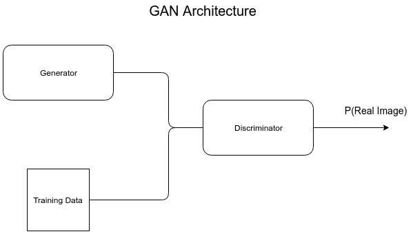
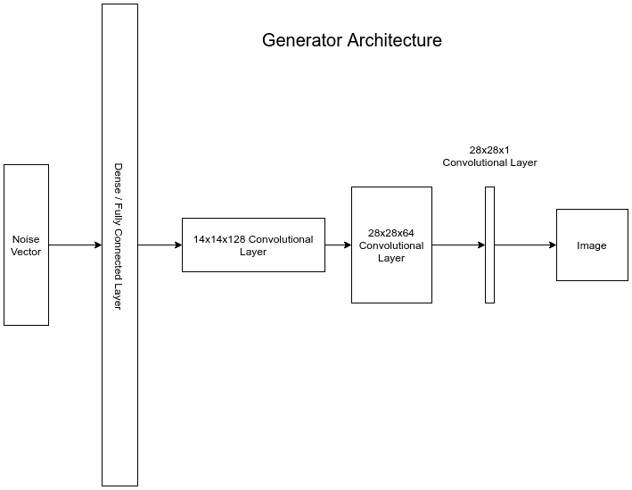
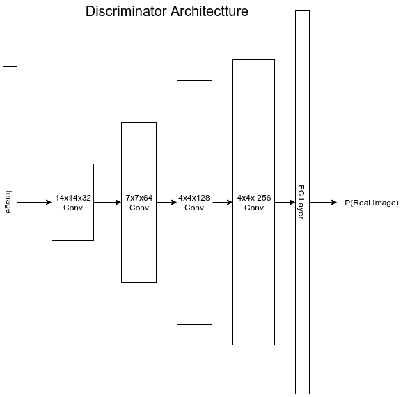
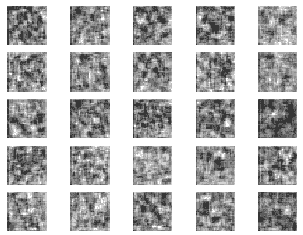
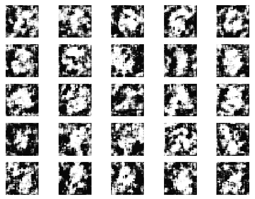
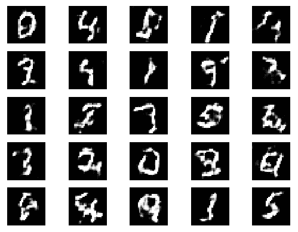
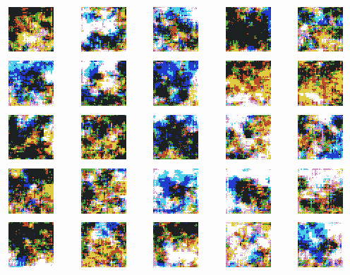
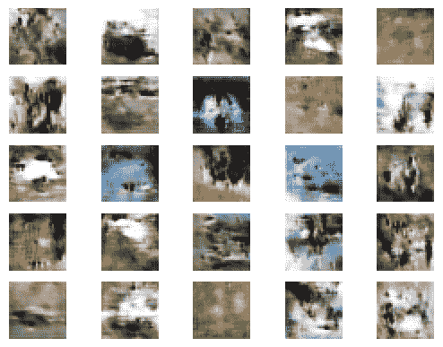
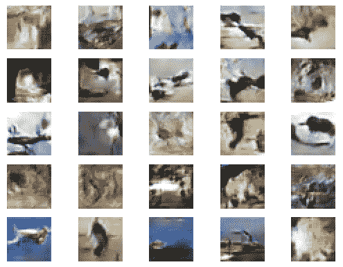

# 十三、生成对抗网络

尽管我在本书中花了很多时间谈论分类或估计的网络，但在本章中，我将向您展示一些具有创建能力的深度神经网络。 **生成对抗网络**（**GAN**）通过两个内部深层网络之间的内部竞争来学习如何做到这一点，我们将在下面讨论。 在**深度卷积生成对抗网络**（**DCGAN**）的情况下，这是我将在本章中重点介绍的 GAN 类型，该网络将学习创建类似于训练数据集的图像。

我们将在本章介绍以下主题：

*   GAN 概述
*   深度卷积 GAN 架构
*   GAN 如何失败
*   GAN 的安全选择
*   使用 Keras GAN 生成 MNIST 图像
*   使用 Keras GAN 生成 CIFAR-10 图像

# GAN 概述

生成对抗网络都是关于生成新内容的。 GAN 能够学习一些分布并从该分布创建新样本。 该样本可能只是我们训练数据中未出现的直线上的新点，但也可能是非常复杂的数据集中的新点。 GAN 已用于生成新的音乐，声音和图像。 根据 Yann LeCun 所说，[《对抗训练是切片以来最酷的事情》](https://www.quora.com/session/Yann-LeCun/1)。 我不确定切片面包是否特别酷，但是 Yann LeCun 是​​一个非常酷的家伙，所以我会信守诺言。 无论如何，GAN 都非常受欢迎，虽然它可能不如我们在业务环境中涵盖的其他一些主题那么实用，但在我们对深度学习技术的调查中值得考虑。

2014 年，伊恩·古德费洛（Ian Goodfellow）等人。 撰写了一篇名为[**生成对抗网络**](https://arxiv.org/pdf/1406.2661.pdf)的论文，提出了使用两个深度网络进行对抗训练的框架，每个都尝试打败对方。 该框架由两个独立的网络组成：判别器和生成器。

判别器正在查看来自训练集的真实数据和来自生成器的假数据。 它的工作是将每一个作为传入数据实例分类为真实还是伪造。

生成器试图使判别器误以为所生成的数据是真实的。

生成器和判别器被锁定在一个游戏中，它们各自试图超越彼此。 这种竞争驱使每个网络不断改进，直到最终判别器将生成器的输出与训练集中的数据区分开。 当生成器和判别器都正确配置时，它们将达到纳什均衡，在纳什均衡中，两者都无法找到优势。

# 深度卷积 GAN 架构

关于 GAN 的论文很多，每篇都提出了新的新颖架构和调整。 但是，它们中的大多数至少在某种程度上基于**深度卷积 GAN**（**DCGAN**）。 在本章的其余部分中，我们将重点介绍这种模型，因为当您采用此处未介绍的新的令人兴奋的 GAN 架构（例如**条件 GAN**（**CGAN**），Stack GAN，InfoGAN 或 Wasserstein GAN），或者可能还有一些其他的新变种，您可能会选择接下来看看。

DCGAN 由 Alex Radford，Luke Metz 和 Soumith Chintala 在论文[《深度卷积生成对抗网络》](https://arxiv.org/pdf/1511.06434.pdf)中提出。

接下来让我们看一下 DCGAN 的总体架构。

# 对抗训练架构

GAN 的整体架构如下图所示。 生成器和判别器分别是单独的深度神经网络，为了易于使用，将它们简化为黑匣子。 我们将很快介绍它们的各个架构，但首先，我想着重介绍它们的交互方式：



给生成器一个随机噪声矢量（`z`），并创建一个输出`G(z)`（对于 DCGAN，这是一个图像），希望它能欺骗判别器。

判别器既得到实际训练数据（`X`），又得到生成器输出`G(z)`。 要做的是确定其输入实际上是真实的概率`P(X)`。

判别器和生成器都在栈中一起训练。 随着一个方面的改进，另一个方面也有所改进，直到希望生成器产生如此好的输出，从而使判别器不再能够识别该输出与训练数据之间的差异。

当然，在您准备好构建自己的 GAN 之前，我们还要介绍更多细节。 接下来，让我们更深入地研究生成器。

# 生成器架构

在此示例中，我们使用适合于生成`28 x 28`灰度图像的图层大小，这正是我们稍后在 MNIST 示例中将要执行的操作。 如果您以前没有使用过生成器，那么生成器的算法可能会有些棘手，因此我们将在遍历每一层时进行介绍。 下图显示了架构：



生成器的输入只是`100 x 1`的随机向量，我们将其称为噪声向量。 当此噪声矢量是从正态分布生成时，GAN 往往工作得最好。

网络的第一层是密集的并且完全连接。 它为我们提供了一种建立线性代数的方法，以便最终得到正确的输出形状。 对于每个卷积块，我们最终将第一轴和第二轴（最终将成为图像的高度和宽度的行和列）加倍，而通道数逐渐缩小到 1。我们最终需要输出的高度和宽度为 28。因此，我们将需要从`7 x 7 x 128`张量开始，以便它可以移动到`14 x 14`，然后最终是`28 x 28`。 为此，我们将密集层的大小设置为`128 x 7 x 7`神经元或 6,272 单位。 这使我们可以将密集层的输出重塑为`7 x 7 x 128`。 如果现在看来这还不算什么，请不用担心，在编写代码后，这才有意义。

在完全连接的层之后，事情变得更加简单。 就像我们一直一样，我们正在使用卷积层。 但是，这次我们反向使用它们。 我们不再使用最大池来缩减样本量。 取而代之的是，我们进行上采样，在学习视觉特征时使用卷积来构建我们的网络，并最终输出适当形状的张量。

通常，生成器中最后一层的激活是双曲正切，并且训练图像矩阵中的元素被归一化为 -1 和 1 之间。这是我将在整章中提到的众多 GAN 黑魔法之一。 研究人员已经发现了一些经验证明可以帮助构建稳定的 GAN 的黑魔法，Soumith Chintala 可以在此 Git 上找到大多数黑客，[而 Soumith Chintala 也是 DCGAN 原始论文的作者之一](https://github.com/soumith/ganhacks)。 深度学习研究的世界无疑是一个很小的领域。

# 判别器架构

判别器的架构更像我们在前几章中已经看到的。 它实际上只是一个典型的图像分类器，如下图所示。 输出是 Sigmoid 的，因为判别器将预测输入图像是真实图像集的成员的概率。 判别器正在解决二分类问题：



现在，我们已经介绍了 DCGAN 的架构以及它的各个层次，下面让我们看一下如何训练框架。

# DCGAN

DCGAN 框架是使用迷你批量来进行训练的，这与我之前在本书中对网络进行训练的方式相同。 但是，稍后在构建代码时，您会注意到我们正在构建一个训练循环，该循环明确控制每个更新批量的情况，而不仅仅是调用`models.fit()`方法并依靠 Keras 为我们处理它。 我这样做是因为 GAN 训练需要多个模型来更新同一批次中的权重，所以它比我们以前所做的单个参数更新要稍微复杂一些。

对 DCGAN 进行训练的过程分为两步，每批次进行一次。

# 步骤 1 – 训练判别器

批量训练 DCGAN 的第一步是在实际数据和生成的数据上训练判别器。 赋予真实数据的标签显然是`1`，而用于假数据的标签则是`0`。

# 步骤 2 – 训练栈

判别器更新权重后，我们将判别器和生成器一起训练为一个模型。 这样做时，我们将使判别器的权重不可训练，将其冻结在适当的位置，但仍允许判别器将梯度反向传播到生成器，以便生成器可以更新其权重。

对于训练过程中的这一步，我们将使用噪声矢量作为输入，这将导致生成器生成图像。 判别器将显示该图像，并要求预测该图像是否真实。 下图说明了此过程：


判别器将提出一些预测，我们可以称之为`y_hat`。 此栈的`loss`函数将是二进制交叉熵，并且我们将`loss`函数的标签传递为 1，我们可以考虑`y`。 如您在本书前面所提到的， `y`和`y_hat`之间的`loss`转换为梯度，然后通过判别器传给生成器。 这将更新生成器权重，使它可以从判别者对问题空间的了解中受益，以便它可以学习创建更逼真的生成图像。

然后重复这两个步骤，直到生成器能够创建与训练集中的数据相似的数据，使得判别器无法再将两个数据集区分开，这成为了一个猜谜游戏。 判别器。 此时，生成器将不再能够改进。 当我们找到纳什均衡时，就对网络进行了训练。

# GAN 如何失败

至少可以说，训练 GAN 是一件棘手的事情。 训练 GAN 失败的方法有很多种。 实际上，在撰写本章时，我发现自己大大扩展了亵渎向量的词汇量，同时还花了一点时间在云 GPU 上！ 在本章稍后向您展示两个可用的 GAN 之前，让我们考虑可能发生的故障以及如何修复这些问题。

# 稳定性

训练 GAN 需要在判别器和生成器之间进行仔细的平衡。 判别器和生成器都在争夺深度网络优势。 另一方面，他们也需要彼此学习和成长。 为了使它起作用，任何一个都不能压倒另一个。

在不稳定的 GAN 中，判别器可能会使生成器过载，并绝对确定生成器是假的。 损失为零，并且没有可用于发送到生成器的梯度，因此它不再可以改善。 网络游戏结束。 解决此问题的最佳方法是降低判别器的学习率。 您也可以尝试减少整个判别器架构中神经元的数量。 但是，您可能会在训练过程的后期错过这些神经元。 最终，调整网络架构和超参数是避免这种情况的最佳方法。

当然，这可能是相反的方式，如模式崩溃的情况。

# 模式崩溃

**模式崩溃**是 GAN 失败的类似且相关的方式。 在模式崩溃中，生成器在多模式分布中学习一种模式，并选择始终使用该方法来利用判别器。 如果您的训练集中有鱼和小猫，并且您的生成器仅生成奇怪的小猫而没有鱼，则您经历了模式崩溃。 在这种情况下，增加判别器的功能可能会有所帮助。

# GAN 的安全选择

我之前已经提到过 Soumith Chintala 的 [GAN 黑魔法 Git](https://github.com/soumith/ganhacks)，当您试图使 GAN 稳定时，这是一个很好的起点。 既然我们已经讨论了训练稳定的 GAN 会有多么困难，让我们来谈谈一些安全的选择，这些选择可能会帮助您成功找到自己的地方。 尽管有很多技巧，但以下是本章中尚未涵盖的我的主要建议：

*   **批量规范**：使用批量规范化时，请为真实数据和伪数据构造不同的微型批量，并分别进行更新。
*   **泄漏的 ReLU**：泄漏的 ReLU 是 ReLU 激活函数的变异。 回想一下 ReLU 函数是`f(x) = max(0, x)`。

但是，泄漏的 ReLU 可以表示为：


当设备不工作时，泄漏的 ReLU 允许非常小的非零梯度。 这可以消除消失的梯度，当我们像在判别器和生成器的组合中那样将多个层堆叠在一起时，这总是一个问题。

*   **在生成器中使用丢弃**：这将产生噪声并防止模式崩溃。
*   **使用软标签**：对于真实示例，请使用介于 0.7 和 1 之间的标签，对于伪示例，请使用介于 0 和 0.3 之间的标签。 这种噪声有助于保持信息从判别器流向生成器。

在本章的其他地方，我们还将介绍许多其他的 GAN 黑魔法。 但是，我认为在成功实施 GAN 时，这几项技巧是最重要的。

# 使用 Keras GAN 生成 MNIST 图像

我们之前曾与 MNIST 合作，但是这次我们将使用 GAN 生成新的 MNIST 图像。 训练 GAN 可能需要很长时间。 但是，此问题很小，可以在几个小时内在大多数笔记本电脑上运行，这是一个很好的例子。 稍后，我们将把这个例子扩展到 CIFAR-10 图像。

我在这里使用的网络架构已被许多人发现并进行了优化，包括 DCGAN 论文的作者以及像 ErikLinder-Norén 这样的人，他是 GAN 实现的优秀集合，称为 [**Keras GAN**](https://github.com/eriklindernoren/Keras-GAN) 作为我在此处使用的代码的基础。 如果您想知道我是如何在这里使用的架构选择的，这些就是我试图站在肩膀上的巨人。

# 加载数据集

`MNIST`数据集由 60,000 个手绘数字（从 0 到 9）组成。Keras 为我们提供了一个内置加载程序，可将其分为 50,000 个训练图像和 10,000 个测试图像。 我们将使用以下代码加载数据集：

```py
from keras.datasets import mnist

def load_data():
    (X_train, _), (_, _) = mnist.load_data()
    X_train = (X_train.astype(np.float32) - 127.5) / 127.5
    X_train = np.expand_dims(X_train, axis=3)
    return X_train
```

您可能已经注意到，我没有返回任何标签或测试数据集。 我将只使用训练数据集。 不需要标签，因为我要使用的唯一标签是`0`代表假货，`1`代表真货。 这些是真实的图像，因此将在判别器上将它们全部分配为标签 1。

# 创建生成器

生成器使用了一些新的层，我们将在本节中讨论这些层。 首先，有机会略读以下代码：

```py
def build_generator(noise_shape=(100,)):
    input = Input(noise_shape)
    x = Dense(128 * 7 * 7, activation="relu")(input)
    x = Reshape((7, 7, 128))(x)
    x = BatchNormalization(momentum=0.8)(x)
    x = UpSampling2D()(x)
    x = Conv2D(128, kernel_size=3, padding="same")(x)
    x = Activation("relu")(x)
    x = BatchNormalization(momentum=0.8)(x)
    x = UpSampling2D()(x)
    x = Conv2D(64, kernel_size=3, padding="same")(x)
    x = Activation("relu")(x)
    x = BatchNormalization(momentum=0.8)(x)
    x = Conv2D(1, kernel_size=3, padding="same")(x)
    out = Activation("tanh")(x)
    model = Model(input, out)
    print("-- Generator -- ")
    model.summary()
    return model
```

我们以前没有使用过`UpSampling2D`层。 该层将增加输入张量的行和列，从而使通道保持不变。 它通过重复输入张量中的值来实现。 默认情况下，它将使输入加倍。 如果给`UpSampling2D`层一个`7 x 7 x 128`输入，它将给我们一个`14 x 14 x 128`输出。

通常，当我们构建一个 CNN 时，我们从一个非常高和宽的图像开始，并使用卷积层来获得一个非常深但又不高又不宽的张量。 在这里，我将相反。 我将使用一个密集层并进行重塑，以`7 x 7 x 128`张量开始，然后将其加倍两次后，剩下`28 x 28`张量。 由于我需要灰度图像，因此可以使用具有单个单元的卷积层来获得`28 x 28 x 1`输出。

这种生成器运算法则有点令人反感，乍一看似乎很尴尬，但是经过几个小时的痛苦之后，您就会掌握它了！

# 创建判别器

判别符实际上在很大程度上与我之前谈到的任何其他 CNN 相同。 当然，我们应该谈论一些新事物。 我们将使用以下代码来构建判别器：

```py
def build_discriminator(img_shape):
    input = Input(img_shape)
    x =Conv2D(32, kernel_size=3, strides=2, padding="same")(input)
    x = LeakyReLU(alpha=0.2)(x)
    x = Dropout(0.25)(x)
    x = Conv2D(64, kernel_size=3, strides=2, padding="same")(x)
    x = ZeroPadding2D(padding=((0, 1), (0, 1)))(x)
    x = (LeakyReLU(alpha=0.2))(x)
    x = Dropout(0.25)(x)
    x = BatchNormalization(momentum=0.8)(x)
    x = Conv2D(128, kernel_size=3, strides=2, padding="same")(x)
    x = LeakyReLU(alpha=0.2)(x)
    x = Dropout(0.25)(x)
    x = BatchNormalization(momentum=0.8)(x)
    x = Conv2D(256, kernel_size=3, strides=1, padding="same")(x)
    x = LeakyReLU(alpha=0.2)(x)
    x = Dropout(0.25)(x)
    x = Flatten()(x)
    out = Dense(1, activation='sigmoid')(x)

    model = Model(input, out)
    print("-- Discriminator -- ")
    model.summary()
    return model
```

首先，您可能会注意到形状奇怪的`zeroPadding2D()`层。 第二次卷积后，我们的张量从`28 x 28 x 3`变为`7 x 7 x 64`。 这一层使我们回到偶数，在行和列的一侧都加零，这样我们的张量现在为`8 x 8 x 64`。

更不寻常的是同时使用批量规范化和辍学。 通常，这两层不能一起使用。 但是，就 GAN 而言，它们似乎确实使网络受益。

# 创建栈式模型

现在我们已经组装了`generator`和`discriminator`，我们需要组装第三个模型，这是两个模型的栈，在`discriminator`损失的情况下，我们可以用来训练生成器。

为此，我们可以创建一个新模型，这次使用以前的模型作为新模型中的图层，如以下代码所示：

```py
discriminator = build_discriminator(img_shape=(28, 28, 1))
generator = build_generator()

z = Input(shape=(100,))
img = generator(z)
discriminator.trainable = False
real = discriminator(img)
combined = Model(z, real)
```

注意，在建立模型之前，我们将判别器的训练属性设置为`False`。 这意味着对于该模型，在反向传播期间，我们将不会更新判别器的权重。 正如我们在“栈式训练”部分中提到的，我们将冻结这些权重，仅将生成器的权重与栈一起移动。 判别器将单独训练。

现在，所有模型都已构建，需要对其进行编译，如以下代码所示：

```py
gen_optimizer = Adam(lr=0.0002, beta_1=0.5)
disc_optimizer = Adam(lr=0.0002, beta_1=0.5)

discriminator.compile(loss='binary_crossentropy',
                           optimizer=disc_optimizer,
                           metrics=['accuracy'])

generator.compile(loss='binary_crossentropy', optimizer=gen_optimizer)

combined.compile(loss='binary_crossentropy', optimizer=gen_optimizer)

```

如果您会注意到，我们将创建两个自定义 **Adam 优化器**。 这是因为很多时候，我们只想更改判别器或生成器的学习率，从而减慢一个或另一个的学习速度，以至于我们得到一个稳定的 GAN，而后者却无法胜任另一个。 您还会注意到我正在使用`beta_1 = 0.5`。 这是我发扬光大并取得成功的 DCGAN 原始论文的推荐。 从原始 DCGAN 论文中可以发现，0.0002 的学习率也是一个很好的起点。

# 训练循环

以前，我们曾很奢侈地在模型上调用`.fit()`，让 Keras 处理将数据分成小批和为我们训练的痛苦过程。

不幸的是，因为我们需要为一个批量器对判别器和堆叠模型一起执行单独的更新，所以我们将不得不用老式的方式来做一些循环。 这就是过去一直做的事情，因此虽然可能需要做更多的工作，但它的确使我感到怀旧。 以下代码说明了训练技术：

```py
num_examples = X_train.shape[0]
num_batches = int(num_examples / float(batch_size))
half_batch = int(batch_size / 2)

for epoch in range(epochs + 1):
  for batch in range(num_batches):
      # noise images for the batch
      noise = np.random.normal(0, 1, (half_batch, 100))
      fake_images = generator.predict(noise)
      fake_labels = np.zeros((half_batch, 1))
      # real images for batch
      idx = np.random.randint(0, X_train.shape[0], half_batch)
      real_images = X_train[idx]
      real_labels = np.ones((half_batch, 1))
      # Train the discriminator (real classified as ones and 
      generated as zeros)
      d_loss_real = discriminator.train_on_batch(real_images, 
        real_labels)
      d_loss_fake = discriminator.train_on_batch(fake_images, 
        fake_labels)
      d_loss = 0.5 * np.add(d_loss_real, d_loss_fake)
      noise = np.random.normal(0, 1, (batch_size, 100))
      # Train the generator
      g_loss = combined.train_on_batch(noise, np.ones((batch_size, 1)))
        # Plot the progress
      print("Epoch %d Batch %d/%d [D loss: %f, acc.: %.2f%%] [G loss: 
        %f]" %
      (epoch,batch, num_batches, d_loss[0], 100 * d_loss[1], g_loss))
        if batch % 50 == 0:
            save_imgs(generator, epoch, batch)
```

可以肯定，这里发生了很多事情。 和以前一样，让我们​​逐个细分。 首先，让我们看一下生成噪声矢量的代码：

```py
        noise = np.random.normal(0, 1, (half_batch, 100))
        fake_images = generator.predict(noise)
        fake_labels = np.zeros((half_batch, 1))
```

这段代码生成了一个噪声向量矩阵（我们之前将其称为`z`）并将其发送到生成器。 它返回了一组生成的图像，我称之为伪图像。 我们将使用它们来训练判别器，因此我们要使用的标签为 0，表示这些实际上是生成的图像。

注意，这里的形状是`half_batch x 28 x 28 x 1`。 `half_batch`正是您所想的。 我们将创建一半的生成图像，因为另一半将是真实数据，我们将在下一步进行组装。 要获取真实图像，我们将在`X_train`上生成一组随机索引，并将`X_train`的切片用作真实图像，如以下代码所示：

```py
idx = np.random.randint(0, X_train.shape[0], half_batch)
real_images = X_train[idx]
real_labels = np.ones((half_batch, 1))
```

是的，在这种情况下，我们正在抽样更换。 它确实可以解决，但可能不是实施小批量训练的最佳方法。 但是，它可能是最简单，最常见的。

由于我们正在使用这些图像来训练判别器，并且由于它们是真实图像，因此我们将它们分配为`1`作为标签，而不是`0`。 现在我们已经组装了判别器训练集，我们将更新判别器。 还要注意，我们没有使用我们之前讨论的软标签。 那是因为我想让事情尽可能地容易理解。 幸运的是，在这种情况下，网络不需要它们。 我们将使用以下代码来训练判别器：

```py
# Train the discriminator (real classified as ones and generated as zeros)
d_loss_real = discriminator.train_on_batch(real_images, real_labels)
d_loss_fake = discriminator.train_on_batch(fake_images, fake_labels)
d_loss = 0.5 * np.add(d_loss_real, d_loss_fake)
```

请注意，这里我使用的是判别符的`train_on_batch()`方法。 这是我第一次在本书中使用此方法。 `train_on_batch()`方法正好执行一轮正向和反向传播。 每次我们调用它时，它都会从模型的先前状态更新一次模型。

另请注意，我正在分别对真实图像和伪图像进行更新。 这是我先前在“生成器架构”部分中引用的 GAN 黑魔法 Git 上给出的建议。 尤其是在训练的早期阶段，当真实图像和伪图像来自完全不同的分布时，如果我们将两组数据放在同一更新中，则批量归一化将导致训练问题。

现在，判别器已经更新，是时候更新生成器了。 这是通过更新组合栈间接完成的，如以下代码所示：

```py
noise = np.random.normal(0, 1, (batch_size, 100))
g_loss = combined.train_on_batch(noise, np.ones((batch_size, 1)))
```

为了更新组合模型，我们创建了一个新的噪声矩阵，这次它将与整个批次一样大。 我们将其用作栈的输入，这将使生成器生成图像，并使用判别器评估该图像。 最后，我们将使用`1`标签，因为我们想在实际图像和生成的图像之间反向传播错误。

最后，训练循环报告`epoch`/`batch`处的判别器和生成器损失，然后每`epoch`中的每 50 批，我们将使用`save_imgs`生成示例图像并将其保存到磁盘，如以下代码所示：

```py
print("Epoch %d Batch %d/%d [D loss: %f, acc.: %.2f%%] [G loss: %f]" %
      (epoch,batch, num_batches, d_loss[0], 100 * d_loss[1], g_loss))

if batch % 50 == 0:
    save_imgs(generator, epoch, batch)
```

`save_imgs`函数使用生成器在运行时创建图像，因此我们可以看到工作的成果。 我们将使用以下代码来定义`save_imgs`：

```py
def save_imgs(generator, epoch, batch):
    r, c = 5, 5
    noise = np.random.normal(0, 1, (r * c, 100))
    gen_imgs = generator.predict(noise)
    gen_imgs = 0.5 * gen_imgs + 0.5

    fig, axs = plt.subplots(r, c)
    cnt = 0
    for i in range(r):
for j in range(c):
            axs[i, j].imshow(gen_imgs[cnt, :, :, 0], cmap='gray')
            axs[i, j].axis('off')
            cnt += 1
    fig.savefig("images/mnist_%d_%d.png" % (epoch, batch))
    plt.close()
```

它通过创建噪声矩阵并检索图像矩阵来仅使用生成器。 然后，使用`matplotlib.pyplot`将这些图像保存到`5 x 5`网格中的磁盘上。

# 模型评估

当您构建深层神经网络来创建图像时，好坏有点主观。 让我们看一下训练过程的一些示例，以便您可以亲自了解 GAN 如何开始学习如何生成 MNIST。

这是第一个时代的第一批网络。 显然，此时生成器对生成 MNIST 并不了解。 只是噪音，如下图所示：



但是只有 50 个批次，正在发生一些事情，如下面的图像所示：


在 200 个批次的时期 0 之后，我们几乎可以看到数字，如下图所示：



一个完整的时期后，这是我们的生成器。 我认为这些生成的数字看起来不错，而且我可以看到判别符可能会被它们欺骗。 在这一点上，我们可能会继续改善一点，但是随着计算机生成一些令人信服的 MNIST 数字，我们的 GAN 似乎已经发挥了作用，如下图所示：



尽管大多数代码是相同的，但在结束本章之前，让我们再看一个使用彩色图像的示例。

# 使用 Keras GAN 生成 CIFAR-10 图像

虽然网络架构在很大程度上保持不变，但我认为有必要向您展示一个使用彩色图像的示例，并在 Git 中提供示例，以便在想要将 GAN 应用于您的 GAN 时有一些起点。 自己的数据。

`CIFAR-10`是一个著名的数据集，包含 60,000 张`32 x 32 x 3` RGB 彩色图像，分布在 10 个类别中。 这些类别是飞机，汽车，鸟类，猫，鹿，狗，青蛙，马，船和卡车。 希望以后看到生成的图像时，您可能会看到一些可以想象的东西，就像那些对象。

# 加载 CIFAR-10

加载数据集几乎完全相同，因为 Keras 还使用以下代码为`CIFAR-10`提供了一个加载器：

```py
from keras.datasets import cifar10
def load_data():
 (X_train, y_train), (X_test, y_test) = cifar10.load_data()
 X_train = (X_train.astype(np.float32) - 127.5) / 127.5
 return X_train
```

# 创建生成器

生成器需要产生`32 x 32 x 3`图像。 这需要对我们的网络架构进行两项细微更改，您可以在此处看到它们：

```py
input = Input(noise_shape)
x = Dense(128 * 8 * 8, activation="relu")(input)
x = Reshape((8, 8, 128))(x)
x = BatchNormalization(momentum=0.8)(x)
x = UpSampling2D()(x)
x = Conv2D(128, kernel_size=3, padding="same")(x)
x = Activation("relu")(x)
x = BatchNormalization(momentum=0.8)(x)
x = UpSampling2D()(x)
x = Conv2D(64, kernel_size=3, padding="same")(x)
x = Activation("relu")(x)
x = BatchNormalization(momentum=0.8)(x)
x = Conv2D(3, kernel_size=3, padding="same")(x)
out = Activation("tanh")(x)
model = Model(input, out)
```

由于我们需要在 32 处结束，并且我们将两次上采样，因此我们应该从 8 开始。这可以通过将密集层及其相应的重塑层从`128 * 7 * 7`更改为`128 * 8 * 8`来轻松实现。

由于我们的图像现在包含三个通道，因此最后的卷积层也需要包含三个通道，而不是一个。 这里的所有都是它的; 我们现在可以生成彩色图像！

# 创建判别器

判别符几乎完全不变。 输入层需要从`28 x 28 x 1`更改为`32 x 32 x 3`。 另外`ZeroPadding2D`可以毫无问题地删除，因为没有它的图层算术就可以工作。

# 训练循环

训练循环保持不变，区别器构建调用除外，该调用需要与 CIFAR-10 图像大小相对应的新尺寸，如以下代码所示：

```py
discriminator = build_discriminator(img_shape=(32, 32, 3))
```

当从一个数据集移动到另一个数据集时，通常会需要调整我们的学习率或网络架构。 幸运的是，在此示例中并非如此。

# 模型评估

`CIFAR-10`数据集当然更加复杂，并且网络具有更多的参数。 因此，事情将需要更长的时间。 这是在时期 0（批次 300）中我们的图像的样子：



我可能开始看到一些边缘，但是看起来并不像什么。 但是，如果我们等待几个纪元，我们显然处在松鼠和怪异的鱼类地区。 我们可以看到一些东西正在成形，只是有些模糊，如下图所示：



下图显示了 12 个纪元后的生成器：



我看到分辨率很低的鸟，鱼，甚至还有飞机和卡车。 当然，我们还有很长的路要走，但是我们的网络已经学会了创建图像，这非常令人兴奋。

# 总结

在本章中，我们研究了 GAN 以及如何将其用于生成新图像。 我们学习了一些很好地构建 GAN 的规则，甚至学习了模拟 MNIST 和 CIFAR-10 图像。 毫无疑问，您可能已经在媒体上看到了一些由 GANs 制作的惊人图像。 在阅读了本章并完成了这些示例之后，您将拥有执行相同操作的工具。 我希望您可以采纳这些想法并加以调整。 剩下的唯一限制是您自己的想象力，数据和 GPU 预算。

在这本书中，我们涵盖了深度学习的许多应用，从简单的回归到生成对抗网络。 我对这本书的最大希望是，它可以帮助您实际使用深度学习技术，而其中的许多技术已经存在于学术界和研究领域，而这超出了实践数据科学家或机器学习工程师的能力。 在此过程中，我希望我能就如何构建更好的深度神经网络以及何时使用深度网络（而不是更传统的模型）提供一些建议。 如果您在这 13 章中一直跟着我，请多多关照。

“我们都是手工艺品的学徒，没人能成为大师。”

——欧内斯特·海明威