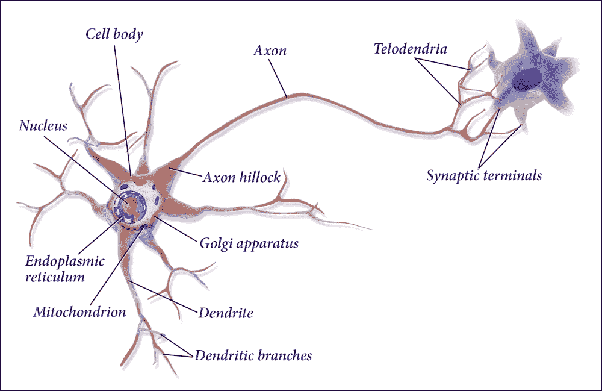
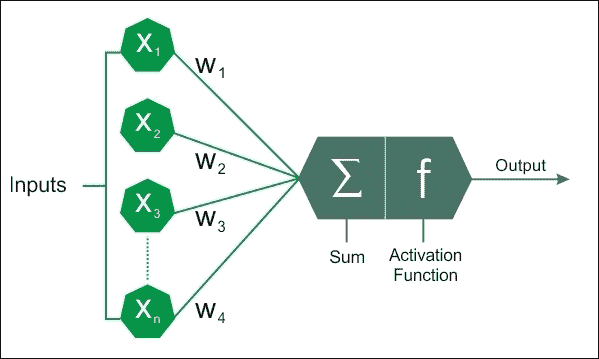
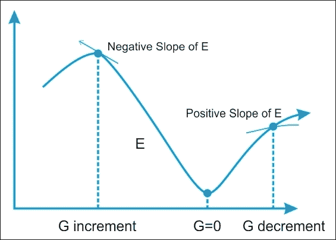
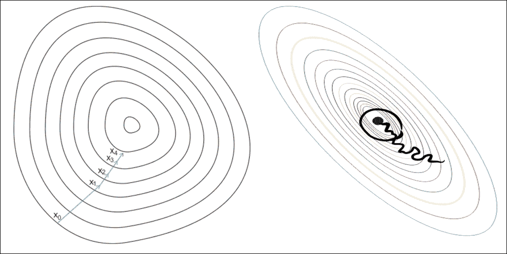
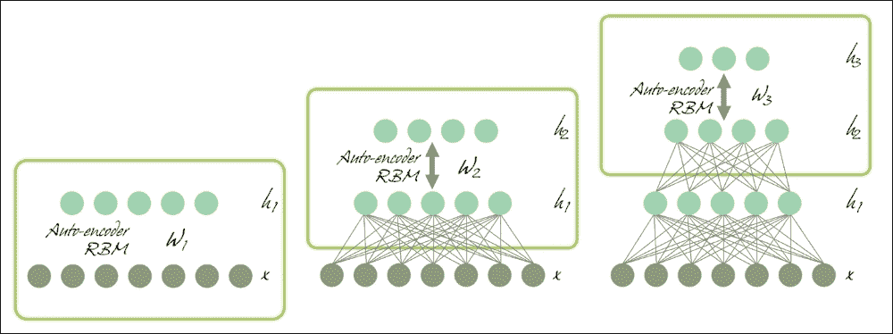
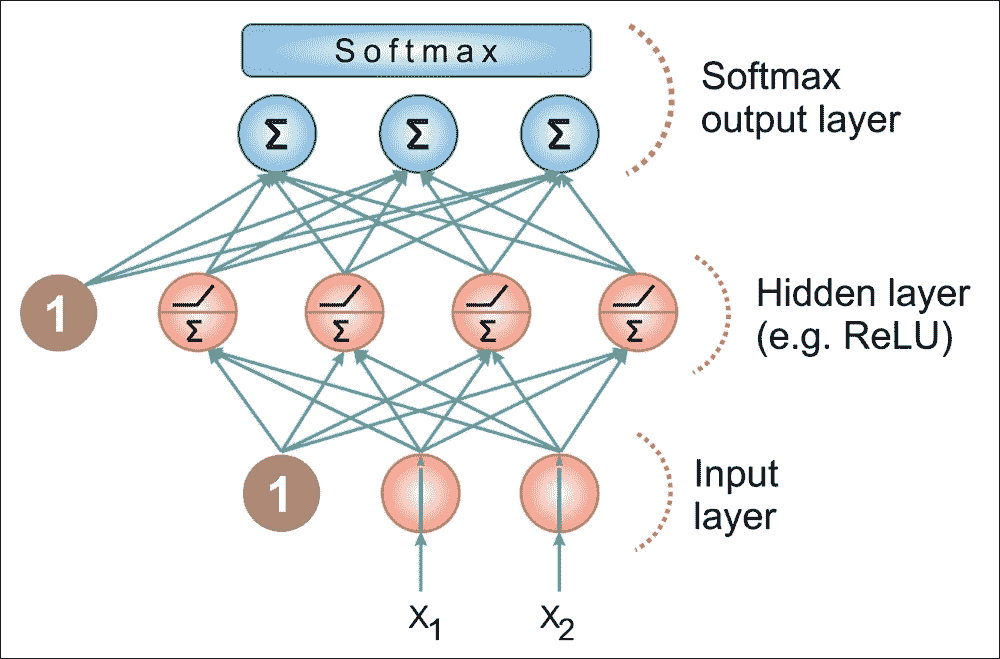
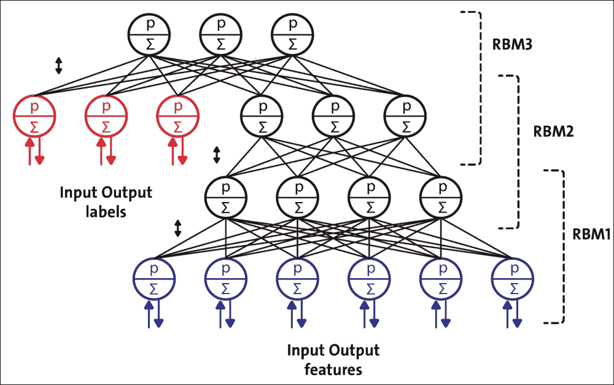
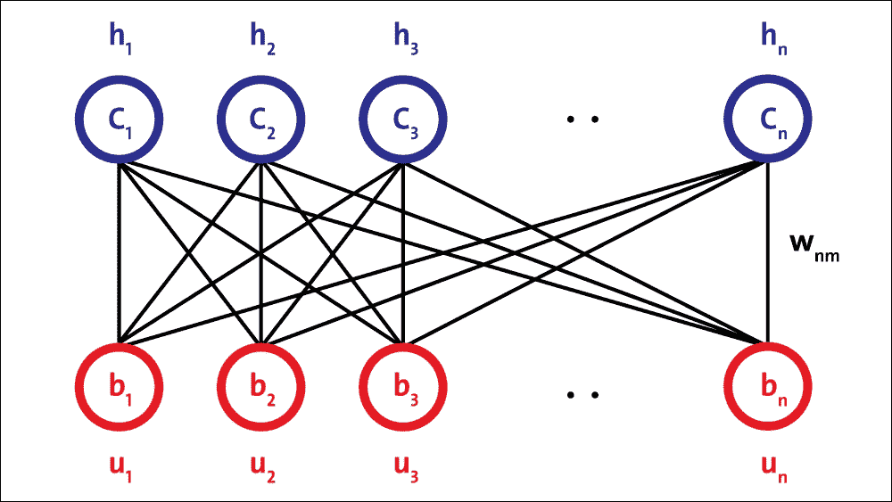
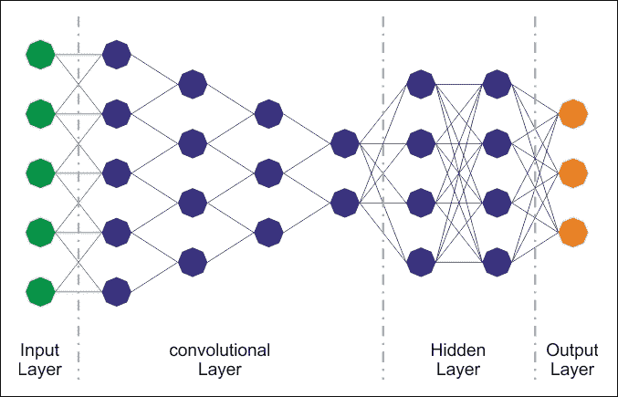
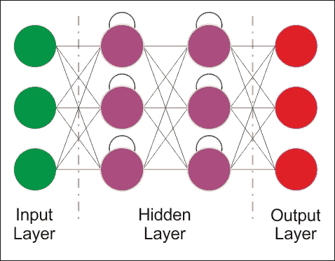

# 一、人工神经网络

人工神经网络利用了 DL 的概念  。它们是人类神经系统的抽象表示，其中包含一组神经元，这些神经元通过称为轴突的连接相互通信。

Warren McCulloch 和 Walter Pitts 在 1943 年根据神经活动的计算模型提出了第一个人工神经元模型。这个模型之后是 John von Neumann，Marvin Minsky，Frank Rosenblatt（所谓的感知器）和其他许多人提出的另一个模型。

## 生物神经元

看一下大脑的建筑灵感。大脑中的神经元称为生物神经元。它们是看起来不寻常的细胞，主要存在于动物大脑中，由皮质组成。皮质本身由细胞体组成，细胞体包含细胞核和细胞的大部分复杂成分。有许多称为树突的分支延伸，加上一个称为轴突的非常长的延伸。

在它的极端附近，轴突分裂成许多分支称为终树突，并且在这些分支的顶部是称为突触末端（或简单的突触）的微小结构，连接到其他神经元的树突。生物神经元接收称为来自其他神经元的信号的短电脉冲，作为回应，它们发出自己的信号：

图 7：生物神经元的工作原理。

在生物学中，神经元由以下组成：

*   细胞体或体细胞
*   一个或多个树突，其职责是接收来自其他神经元的信号
*   轴突，反过来将同一神经元产生的信号传递给其他连接的神经元

神经元的活动在发送/接收来自其他神经元的信号（活动状态）和休息（非活动状态）之间交替。从一个相到另一个相的转变是由外部刺激引起的，由树枝状晶体拾取的信号表示。每个信号具有兴奋或抑制作用，在概念上由与刺激相关的权重表示。

处于空闲状态的神经元累积它收到的所有信号，直到达到某个激活阈值。

## 人工神经元

基于生物神经元的概念，出现了人工神经元的术语和思想，它们已被用于构建基于 DL 的预测分析的智能机器。这是启发人工神经网络的关键理念。与生物神经元类似，人工神经元由以下部分组成：

*   一个或多个传入连接，其任务是从其他神经元收集数字信号：为每个连接分配一个权重，用于考虑发送的每个信号
*   一个或多个输出连接，将信号传递给其他神经元
*   激活函数，基于一些信号确定输出信号的数值，信号从和其他神经元的输入连接接受，并从权重和神经元本身的激活阈值中适当地收集，权重与每个接收信号相关：

    

    图 8：人工神经元模型。

通过将激活函数（也称为传递函数）应用于输入的加权和来计算输出，即神经元传输的信号。这些函数的动态范围介于 -1 和 1 之间，或介于 0 和 1 之间。许多激活函数在复杂性和输出方面有所不同。在这里，我们简要介绍三种最简单的形式：

*   阶跃函数：一旦我们确定阈值`x`（例如，`x = 10`），如果输入之和高于阈值，该函数将返回 1，否则则返回 0。
*   线性组合：不管理阈值，而是从默认值中减去输入值的加权和。我们将得到二元结果，该结果将由减法的正（+b）或负（-b）输出表示。
*   Sigmoid：这会产生 Sigmoid 曲线，这是一条具有 S 趋势的曲线。通常，sigmoid 函数指的是逻辑函数的特殊情况。

从第一个人工神经元原型制作中使用的最简单的形式，我们转向更复杂的形式，可以更好地表征神经元的功能：

*   双曲正切函数
*   径向基函数
*   圆锥截面函数
*   Softmax 函数

    

    图 9：最常用的人工神经元模型传递函数。（a）阶梯函数（b）线性函数（c）sigmoid 函数，计算值介于 0 和 1 之间（d）sigmoid 函数，计算值介于 -1 和 1 之间。

选择适当的激活函数（也是权重初始化）是使网络发挥最佳表现并获得良好训练的关键。这些主题正在进行大量研究，如果训练阶段正确进行，研究表明在产出质量方面存在微小差异。

### 注意

在神经网络领域没有经验法则。这一切都取决于您的数据以及在通过激活函数后希望数据转换的形式。如果要选择特定的激活函数，则需要研究函数的图形，以查看结果如何根据给定的值进行更改。

# ANN 如何学习？

神经网络的学习过程被配置为权重优化的迭代过程，因此是监督类型。由于网络在属于训练集的一组示例上的表现（即，您知道示例所属的类的集合），因此修改权重。

目的是最小化损失函数，其表示网络行为偏离期望行为的程度。然后在由除了训练集中的对象之外的对象（例如，图像分类问题中的图像）组成的测试集上验证网络的表现。

## 人工神经网络和反向传播算法

常用的监督学习算法是反向传播算法。训练程序的基本步骤如下：

1.  用随机权重初始化网络
2.  对于所有训练案例，请按照下列步骤操作：
    *   正向传播：计算网络的误差，即所需输出与实际输出之间的差值
    *   向后传递：对于所有层，从输出层回到输入层：

        i：使用正确的输入显示网络层的输出（误差函数）。

        ii：调整当前层中的权重以最小化误差函数。这是反向传播的优化步骤。

当验证集上的错误开始增加时，训练过程结束，因为这可能标志着阶段过拟合的开始，即网络倾向于以牺牲训练数据为代价来内插训练数据的阶段。普遍性。

## 权重优化

因此，  优化权重的有效算法的可用性构成了构建神经网络的必要工具。该问题可以通过称为梯度下降（GD）的迭代数值技术来解决。该技术根据以下算法工作：

1.  随机选择模型参数的初始值
2.  根据模型的每个参数计算误差函数的梯度 G.
3.  更改模型的参数，使它们朝着减小误差的方向移动，即沿 -G 方向移动
4.  重复步骤 2 和 3，直到 G 的值接近零

误差函数 E 的梯度（G）提供了误差函数与当前值具有更陡斜率的方向；所以为了减少 E，我们必须在相反的方向上做一些小步骤，-G。

通过以迭代方式多次重复此操作，我们向下移动到 E 的最小值，以达到`G = 0`的点，从而无法进一步进展：

图 10：搜索误差函数 E 的最小值。我们沿着函数 E 的梯度 G 最小的方向移动。

## 随机梯度下降

在 GD 优化中，我们基于完整的训练集计算成本梯度，因此我们有时也将其称为批量 GD。在非常大的数据集的情况下，使用 GD 可能非常昂贵，因为我们在训练集上只进行一次传递。训练集越大，我们的算法更新权重的速度就越慢，并且在收敛到全局成本最小值之前可能需要的时间越长。

最快的梯度下降方法是随机梯度下降（SGD），因此，它被广泛应用于深度神经网络。在 SGD 中，我们仅使用来自训练集的一个训练样本来对特定迭代中的参数进行更新。

这里，术语随机来自这样的事实：基于单个训练样本的梯度是真实成本梯度的随机近似。由于其随机性，通向全球成本最小化的路径并不像 GD 那样直接，但如果我们可视化 2D 空间中的成本表面，则可能会出现锯齿形：

图 11：GD 与 SGD：梯度下降（左图）确保权重中的每次更新都在正确的方向上完成：最小化成本函数的方向。随着数据集大小的增长以及每个步骤中更复杂的计算，SGD（右图）在这些情况下是首选。这里，在处理每个样本时完成权重的更新，因此，后续计算已经使用了改进的权重。尽管如此，这个原因导致了在最小化误差函数方面的一些误导。

# 神经网络架构

我们连接节点的方式和存在的层数（即输入和输出之间的节点级别以及每层神经元的数量）定义了神经网络的架构。

神经网络中存在各种类型的架构。我们可以将 DL 架构，分为四组：深度神经网络（DNN），卷积神经网络（CNN），循环神经网络（RNN）和紧急架构（EA）。本章的以下部分将简要介绍这些架构。更多详细分析，以及应用实例，将成为本书后续章节的主题。

## 深度神经网络（DNN）

DNN 是人工神经网络，它们强烈地面向 DL。在正常分析程序不适用的情况下，由于要处理的数据的复杂性，因此这种网络是一种极好的建模工具。 DNN 是与我们讨论过的神经网络非常相似的神经网络，但它们必须实现更复杂的模型（更多的神经元，隐藏层和连接），尽管它们遵循适用于所有 ML 问题的学习原则（例如作为监督学习）。每层中的计算将下面层中的表示转换为稍微更抽象的表示。

我们将使用术语 DNN 将具体指代多层感知器（MLP），堆叠自编码器（SAE）和深度信任网络（DBN）。 SAE 和 DBN 使用自编码器（AEs）和 RBM 作为架构的块。它们与 MLP 之间的主要区别在于，训练分两个阶段执行：无监督的预训练和监督微调：

图 12：分别使用 AE 和 RBM 的 SAE 和 DBN。

在无监督预训练中，如上图所示，这些层按顺序堆叠并以分层方式进行训练，如使用未标记数据的 AE 或 RBM。然后，在有监督的微调中，堆叠输出分类器层，并通过用标记数据重新训练来优化完整的神经网络。

在本章中，我们不讨论 SAE（详见第 5 章，优化 TensorFlow 自编码器），但将坚持使用 MLP 和 DBN 并使用这两种 DNN 架构。我们将看到如何开发预测模型来处理高维数据集。

### 多层感知器

在多层网络中，可以识别层的人工神经元，以便每个神经元连接到下一层中的所有神经元，确保：

*   属于同一层的神经元之间没有连接
*   属于非相邻层的神经元之间没有连接
*   每层的层数和神经元数取决于要解决的问题

输入和输出层定义输入和输出，并且存在隐藏层，其复杂性实现网络的不同行为。最后，神经元之间的连接由与相邻层对相同的矩阵表示。

每个数组包含两个相邻层的节点对之间的连接的权重。前馈网络是层内没有环路的网络。

我们将在第 3 章，使用 TensorFlow 的前馈神经网络中更详细地描述前馈网络：

图 13：MLP 架构

### 深度信念网络（DBNs）

为了克服 MLP 中的过拟合问题，我们建立了一个 DBN，做了无监督预训练，为输入获得了一组不错的特征表示，然后微调训练集从网络获得实际预测。虽然 MLP 的权重是随机初始化的，但 DBN 使用贪婪的逐层预训练算法通过概率生成模型初始化网络权重。模型由可见层和多层随机和潜在变量组成，称为隐藏单元或特征检测器。

DBN 是深度生成模型，它们是神经网络模型，可以复制您提供的数据分布。这允许您从实际数据点生成“虚假但逼真”的数据点。

DBN 由可见层和多层随机潜在变量组成，这些变量称为隐藏单元或特征检测器。前两层在它们之间具有无向的对称连接并形成关联存储器，而较低层从前一层接收自上而下的有向连接。 DBN 的构建块是受限玻尔兹曼机（RBM）。如下图所示，几个 RBM 一个接一个地堆叠形成 DBN：

图 14：配置用于半监督学习的 DBN

单个 RBM 由两层组成。第一层由可见神经元组成，第二层由隐藏神经元组成。下图显示了简单 RBM 的结构。可见单元接受输入，隐藏单元是非线性特征检测器。每个可见神经元都连接到所有隐藏的神经元，但同一层中的神经元之间没有内部连接。

RBM 由可见层节点和隐藏层节点组成，但没有可见 - 隐藏和隐藏 - 隐藏连接，因此术语受限制。它们允许更有效的网络训练，可以监督或监督。这种类型的神经网络能够表示输入的大量特征，然后隐藏的节点可以表示多达 2n 个特征。可以训练网络回答单个问题（例如，问题是或否：它是猫吗？），直到它能够（再次以二元的方式）响应总共 2n 个问题（它是猫吗？ ，这是暹罗人？，它是白色的吗？）。

RBM 的架构如下，神经元根据对称的二分图排列：

图 15：RBM 架构。

由于无法对变量之间的关系进行建模，因此单个隐藏层 RBM 无法从输入数据中提取所有特征。因此，一层接一层地使用多层 RBM 来提取非线性特征。在 DBN 中，首先使用输入数据训练 RBM，并且隐藏层表示使用贪婪学习方法学习的特征。这些第一 RBM 的学习特征，即第一 RBM 的隐藏层，被用作第二 RBM 的输入，作为 DBN 中的另一层。

类似地，第二层的学习特征用作另一层的输入。这样，DBN 可以从输入数据中提取深度和非线性特征。最后一个 RBM 的隐藏层代表整个网络的学习特征。

## 卷积神经网络（CNNs）

CNN 已经专门用于图像识别。学习中使用的每个图像被分成紧凑的拓扑部分，每个部分将由过滤器处理以搜索特定模式。形式上，每个图像被表示为像素的三维矩阵（宽度，高度和颜色），并且每个子部分可以与滤波器组卷积在一起。换句话说，沿着图像滚动每个滤镜计算相同滤镜和输入的内积。

此过程为各种过滤器生成一组特征图（激活图）。将各种特征图叠加到图像的相同部分上，我们得到输出量。这种类型的层称为卷积层。下图是 CNN 架构的示意图：

图 16：CNN 架构。

虽然常规 DNN 适用于小图像（例如，MNIST 和 CIFAR-10），但由于需要大量参数，它们会因较大的图像而崩溃。例如，`100×100`图像具有 10,000 个像素，并且如果第一层仅具有 1,000 个神经元（其已经严格限制传输到下一层的信息量），则这意味着 1000 万个连接。另外，这仅适用于第一层。

CNN 使用部分连接的层解决了这个问题。由于相邻层仅部分连接，并且因为它重复使用其权重，因此 CNN 的参数远远少于完全连接的 DNN，这使得训练速度更快。这降低了过拟合的风险，并且需要更少的训练数据。此外，当 CNN 已经学习了可以检测特定特征的内核时，它可以在图像上的任何地方检测到该特征。相反，当 DNN 在一个位置学习一个特征时，它只能在该特定位置检测到它。由于图像通常具有非常重复的特征，因此 CNN 在图像处理任务（例如分类）和使用较少的训练示例方面能够比 DNN 更好地推广。

重要的是，DNN 没有关于如何组织像素的先验知识；它不知道附近的像素是否接近。 CNN 的架构嵌入了这一先验知识。较低层通常识别图像的单元域中的特征，而较高层将较低层特征组合成较大特征。这适用于大多数自然图像，使 CNN 在 DNN 上具有决定性的先机：

图 17：常规 DNN 与 CNN。

例如，在上图中，在左侧，您可以看到常规的三层神经网络。在右侧，CNN 以三维（宽度，高度和深度）排列其神经元，如在其中一个层中可视化。 CNN 的每一层都将 3D 输入音量转换为神经元激活的 3D 输出音量。红色输入层保持图像，因此其宽度和高度将是图像的尺寸，深度将是三个（红色，绿色和蓝色通道）。

因此，我们所看到的所有多层神经网络都有由长线神经元组成的层，我们不得不将输入图像或数据平铺到 1D，然后再将它们馈送到神经网络。但是，当您尝试直接为它们提供 2D 图像时会发生什么？答案是在 CNN 中，每个层都用 2D 表示，这样可以更容易地将神经元与其相应的输入进行匹配。我们将在接下来的部分中看到这方面的示例。

## 自编码器

AE 是具有三层或更多层的网络  ，其中输入层和输出具有相同数量的神经元，并且那些中间（隐藏层）具有较少数量的神经元。对网络进行训练，以便在输出中简单地为每条输入数据再现输入中相同的活动模式。

AE 是能够在没有任何监督的情况下学习输入数据的有效表示的 ANN（即，训练集是未标记的）。它们通常具有比输入数据低得多的维度，使得 AE 可用于降低维数。更重要的是，AE 作为强大的特征检测器，它们可用于 DNN 的无监督预训练。

该问题的显着方面在于，由于隐藏层中神经元的数量较少，如果网络可以从示例中学习并推广到可接受的程度，则它执行数据压缩；对于每个示例，隐藏神经元的状态为输入和输出公共状态的压缩版本提供。 AEs 的有用应用是数据可视化的数据去噪和降维。

下图显示了 AE 通常如何工作；它通过两个阶段重建接收的输入：编码阶段，其对应于原始输入的尺寸减小；以及解码阶段，其能够从编码（压缩）表示重建原始输入：

图 18：自编码器的编码和解码阶段。

作为无监督神经网络，自编码器的主要特征是其对称结构。 自编码器有两个组件：将输入转换为内部表示的编码器，然后是将内部表示转换为输出的解码器。

换句话说，  自编码器可以看作是编码器的组合，其中我们将一些输入编码为代码，以及解码器，其中我们将代码解码/重建为其原始输入作为输出。因此，MLP 通常具有与自编码器相同的架构，除了输出层中的神经元的数量必须等于输入的数量。

如前所述，训练自编码器的方法不止一种。第一种方法是一次训练整个层，类似于 MLP。但是，在计算成本函数时，不像在监督学习中使用某些标记输出，我们使用输入本身。因此，成本函数显示实际输入和重建输入之间的差异。

## 循环神经网络（RNNs）

RNN 的基本特征是网络包含至少一个反馈连接，因此激活可以在循环中流动。它使网络能够进行时间处理和学习序列，例如执行序列识别/再现或时间关联/预测。

RNN 架构可以有许多不同的形式。一种常见类型包括标准 MLP 加上添加的循环。这些可以利用 MLP 强大的非线性映射功能，并具有某种形式的内存。其他人具有更均匀的结构，可能与每个神经元连接到所有其他神经元，并且可能具有随机激活函数：

图 19：RNN 架构。

对于简单的架构和确定性激活函数，可以使用类似的 GD 过程来实现学习，这些过程导致用于前馈网络的反向传播算法。

上图查看了 RNN 的一些最重要的类型和功能。 RNN 被设计成利用输入数据的顺序信息，与诸如感知器，长短期存储器单元（LSTM）或门控循环单元（GRU）之类的构件块之间的循环连接。后两者用于消除常规 RNN 的缺点，例如梯度消失/爆炸问题和长短期依赖性。我们将在后面的章节中讨论这些架构。

## 前沿架构

已经提出了许多其他前沿 DL 架构  ，例如深度时空神经网络（DST-NN），多维循环神经网络（MD-RNN），和卷积自编码器（CAE）。

然而，人们正在谈论和使用其他新兴网络，例如 CapsNets（CNN 的改进版本，旨在消除常规 CNN 的缺点），用于个性化的分解机和深度强化学习。

# 深度学习框架

在本节中，我们介绍了一些最流行的 DL 框架。简而言之，几乎所有的库都提供了使用图形处理器加速学习过程的可能性，在开放许可下发布，并且是大学研究小组的结果。

TensorFlow 是数学软件，是一个开源软件库，用 Python 和 C++ 编写，用于机器智能。 Google Brain 团队在 2011 年开发了它，它可以用来帮助我们分析数据，预测有效的业务成果。构建神经网络模型后，在必要的特征工程之后，您可以使用绘图或 TensorBoard 以交互方式执行训练。

最新版 TensorFlow 提供的主要功能包括更快的计算，灵活性，可移植性，易于调试，统一的 API，GPU 计算的透明使用，易用性和可扩展性。其他好处包括它被广泛使用，支持，并且可以大规模生产。

Keras 是一个深度学习库，位于 TensorFlow 和 Theano 之上，提供了一个直观的 API，受到了 Torch（可能是现有的最佳 Python API）的启发。 Deeplearning4j 依赖于 Keras 作为其 Python API，并从 Keras 和 Keras，Theano 和 TensorFlow 导入模型。

Google 的软件工程师 FrançoisChollet 创建了 Keras。它可以在 CPU 和 GPU 上无缝运行。这样可以通过用户友好性，模块化和可扩展性轻松快速地进行原型设计。 Keras 可能是增长最快的框架之一，因为构建 NN 层太容易了。因此，Keras 很可能成为 NN 的标准 Python API。

Theano 可能是最常见的库。 Theano 是用 Python 编写的，它是 ML 领域中使用最广泛的语言之一（Python 也用于 TensorFlow）。此外，Theano 允许使用 GPU，比单 CPU 快 24 倍。 Theano 允许您有效地定义，优化和评估复杂的数学表达式，例如多维数组。不幸的是，Yoshua Bengio 于 2017 年 9 月 28 日宣布，Theano 的发展将停止。这意味着 Theano 实际上已经死了。

Neon 是由 Nirvana 开发的基于 Python 的深度学习框架。 Neon 的语法类似于 Theano 的高级框架（例如，Keras）。目前，Neon 被认为是基于 GPU 的最快工具，特别是对于 CNN。虽然它的基于 CPU 的实现比大多数其他库相对更差。

Torch 是 ML 的巨大生态系统，提供大量算法和函数，包括 DL 和处理各种类型的多媒体数据，特别关注并行计算。它为 C 语言提供了出色的接口，  拥有庞大的用户社区。 Torch 是一个扩展脚本语言 Lua 的库，旨在为设计和训练 ML 系统提供灵活的环境。 Torch 是各种平台（Windows，Mac，Linux 和 Android）上的独立且高度可移植的框架，脚本可以在这些平台上运行而无需修改。 Torch 为不同的应用提供了许多用途。

Caffe，主要由伯克利远景和学习中心（BVLC）开发  ，是一个框架  ，因其表达，速度和模块性而脱颖而出。其独特的架构鼓励应用和创新，使计算更容易从 CPU 转换到 GPU。庞大的用户群意味着最近发生了相当大的发展。它是用 Python 编写的，但由于需要编译的众多支持库，安装过程可能很长。

MXNet 是一个支持多种语言的 DL 框架，例如 R，Python，C++ 和 Julia。这很有帮助，因为如果你知道这些语言中的任何一种，你根本不需要走出自己的舒适区来训练你的 DL 模型。它的后端用 C++ 和 CUDA 编写，它能够以与 Theano 类似的方式管理自己的内存。

MXNet 也很受欢迎，因为它可以很好地扩展，并且可以与多个 GPU 和计算机一起使用，这使它对企业非常有用。这就是为什么亚马逊将 MXNet 作为 DL 的参考库。 2017 年 11 月，AWS 宣布推出 ONNX-MXNet，这是一个开源 Python 包，用于将开放式神经网络交换（ONNX）  DL 模型导入 Apache MXNet。

Microsoft Cognitive Toolkit（CNTK）是 Microsoft Research 的统一 DL 工具包，可以轻松训练，  将多种 GPU 和服务器中的流行模型类型组合在一起。 CNTK 为语音，图像和文本数据实现高效的 CNN 和 RNN 训练。它支持 cuDNN v5.1 进行 GPU 加速。 CNTK 还支持 Python，C++ ，C＃和命令行接口。

这是一个总结这些框架的表：

| 框架  | 支持的编程语言 | 训练教材和社区 | CNN 建模能力 | RNN 建模能力 | 可用性 | 多 GPU 支持 |
| --- | --- | --- | --- | --- | --- | --- |
| Theano | Python，C++ | ++ | 丰富的 CNN 教程和预建模型 | 丰富的 RNN 教程和预建模型 | 模块化架构 | 否 |
| Neon | Python， | + | CNN 最快的工具 | 资源最少 | 模块化架构 | 否 |
| Torch | Lua，Python | + | 资源最少 | 丰富的 RNN 教程和预建模型 | 模块化架构 | 是 |
| Caffe | C++ | ++ | 丰富的 CNN 教程和预建模型 | 资源最少 | 创建层需要时间 | 是 |
| MXNet | R，Python，Julia，Scala | ++ | 丰富的 CNN 教程和预建模型 | 资源最少 | 模块化架构 | 是 |
| CNTK | C++ | + | 丰富的 CNN 教程和预建模型 | 丰富的 RNN 教程和预建模型 | 模块化架构 | 是 |
| TensorFlow | Python，C++  | +++ | 丰富的 RNN 教程和预建模型 | 丰富的 RNN 教程和预建模型 | 模块化架构 | 是 |
| DeepLearning4j | Java，Scala | +++ | 丰富的 RNN 教程和预建模型 | 丰富的 RNN 教程和预建模型 | 模块化架构 | 是 |
| Keras | Python | +++ | 丰富的 RNN 教程和预建模型 | 丰富的 RNN 教程和预建模型 | 模块化架构 | 是 |

除了前面的库之外，最近还有一些关于云计算的 DL 项目。这个想法是将 DL 功能带到大数据，拥有数十亿个数据点和高维数据。例如，Amazon Web Services（AWS），Microsoft Azure，Google Cloud Platform 和 NVIDIA GPU Cloud（NGC）[都提供机器和深度学习服务](http://searchbusinessanalytics.techtarget.com/feature/Machine-learning-platforms-comparison-Amazon-Azure-Google-IBM)，它们是公共云的原生。

2017 年 10 月，AWS 针对 Amazon Elastic Compute Cloud（EC2）P3 实例发布了深度学习 AMI（亚马逊机器映像）  。这些 AMI 预装了深度学习框架，如 TensorFlow，Gluon 和 Apache MXNet，这些框架针对 Amazon EC2 P3 实例中的 NVIDIA Volta V100 GPU 进行了优化。深度学习服务目前提供三种类型的 AMI：Conda AMI，Base AMI 和带源代码的 AMI。

Microsoft Cognitive Toolkit 是 Azure 的开源深度学习服务。与 AWS 的产品类似，它侧重于可以帮助开发人员构建和部署深度学习应用的工具。该工具包安装在 Python 2.7 的根环境中。 Azure 还提供了一个[模型库](https://www.microsoft.com/en-us/cognitive-toolkit/features/model-gallery/)，其中包含代码示例等资源，以帮助企业开始使用该服务。

另一方面，[NGC 为 AI 科学家和研究人员提供 GPU 加速容器](https://www.nvidia.com/en-us/data-center/gpu-cloud-computing/)。 NGC 采用容器化的深度学习框架，如 TensorFlow，PyTorch 和 MXNet，经过 NVIDIA 的调整，测试和认证，可在参与的云服务提供商的最新 NVIDIA GPU 上运行。尽管如此，还有通过各自市场提供的第三方服务。

# 总结

在本章中，我们介绍了 DL 的一些基本主题。 DL 由一组方法组成，这些方法允许 ML 系统获得多个级别上的数据的分层表示。这是通过组合简单单元来实现的，每个简单单元从输入级别开始，以更高和抽象级别的表示，在其自己的级别上转换表示。

最近，这些技术提供了许多应用中从未见过的结果，例如图像识别和语音识别。这些技术普及的主要原因之一是 GPU 架构的发展，这大大减少了 DNN 的训练时间。

有不同的 DNN 架构，每个架构都是针对特定问题而开发的。我们将在后面的章节中更多地讨论这些架构，并展示使用 TensorFlow 框架创建的应用示例。本章最后简要介绍了最重要的 DL 框架。

在下一章中，我们将开始我们的 DL 之旅，介绍 TensorFlow 软件库。我们将介绍 TensorFlow 的主要功能，并了解如何安装它并设置我们的第一个工作再营销数据集。

