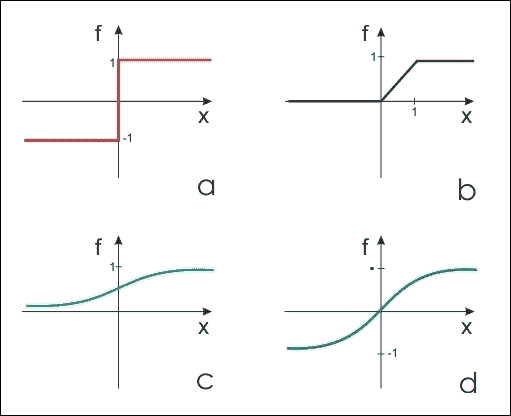

# 人工神经网络

人工神经网络利用了 DL 的概念  。它们是人类神经系统的抽象表示，其中包含一组神经元，这些神经元通过称为轴突的连接相互通信。

Warren McCulloch 和 Walter Pitts 在 1943 年根据神经活动的计算模型提出了第一个人工神经元模型。这个模型之后是 John von Neumann，Marvin Minsky，Frank Rosenblatt（所谓的感知器）和其他许多人提出的另一个模型。

## 生物神经元

看一下大脑的建筑灵感。大脑中的神经元称为生物神经元。它们是看起来不寻常的细胞，主要存在于动物大脑中，由皮质组成。皮质本身由细胞体组成，细胞体包含细胞核和细胞的大部分复杂成分。有许多称为树突的分支延伸，加上一个称为轴突的非常长的延伸。

在它的极端附近，轴突分裂成许多分支称为终树突，并且在这些分支的顶部是称为突触末端（或简单的突触）的微小结构，连接到其他神经元的树突。生物神经元接收称为来自其他神经元的信号的短电脉冲，作为回应，它们发出自己的信号：

图 7：生物神经元的工作原理。

在生物学中，神经元由以下组成：

*   细胞体或体细胞
*   一个或多个树突，其职责是接收来自其他神经元的信号
*   轴突，反过来将同一神经元产生的信号传递给其他连接的神经元

神经元的活动在发送/接收来自其他神经元的信号（活动状态）和休息（非活动状态）之间交替。从一个相到另一个相的转变是由外部刺激引起的，由树枝状晶体拾取的信号表示。每个信号具有兴奋或抑制作用，在概念上由与刺激相关的权重表示。

处于空闲状态的神经元累积它收到的所有信号，直到达到某个激活阈值。

## 人工神经元

基于生物神经元的概念，出现了人工神经元的术语和思想，它们已被用于构建基于 DL 的预测分析的智能机器。这是启发人工神经网络的关键理念。与生物神经元类似，人工神经元由以下部分组成：

*   一个或多个传入连接，其任务是从其他神经元收集数字信号：为每个连接分配一个权重，用于考虑发送的每个信号
*   一个或多个输出连接，将信号传递给其他神经元
*   激活函数，基于一些信号确定输出信号的数值，信号从和其他神经元的输入连接接受，并从权重和神经元本身的激活阈值中适当地收集，权重与每个接收信号相关：

    

    图 8：人工神经元模型。

通过将激活函数（也称为传递函数）应用于输入的加权和来计算输出，即神经元传输的信号。这些函数的动态范围介于-1 和 1 之间，或介于 0 和 1 之间。许多激活函数在复杂性和输出方面有所不同。在这里，我们简要介绍三种最简单的形式：

*   阶跃函数：一旦我们确定阈值`x`（例如，`x = 10`），如果输入之和高于阈值，该函数将返回 1，否则则返回 0。
*   线性组合：不管理阈值，而是从默认值中减去输入值的加权和。我们将得到二元结果，该结果将由减法的正（+ b）或负（-b）输出表示。
*   Sigmoid：这会产生 S 形曲线，这是一条具有 S 趋势的曲线。通常，sigmoid 函数指的是逻辑函数的特殊情况。

从第一个人工神经元原型制作中使用的最简单的形式，我们转向更复杂的形式，可以更好地表征神经元的功能：

*   双曲正切函数
*   径向基函数
*   圆锥截面函数
*   Softmax 函数

    

    图 9：最常用的人工神经元模型传递函数。（a）阶梯函数（b）线性函数（c）sigmoid 函数，计算值介于 0 和 1 之间（d）sigmoid 函数，计算值介于 -1 和 1 之间。

选择适当的激活函数（也是权重初始化）是使网络发挥最佳表现并获得良好训练的关键。这些主题正在进行大量研究，如果训练阶段正确进行，研究表明在产出质量方面存在微小差异。

### 注意

在神经网络领域没有经验法则。这一切都取决于您的数据以及在通过激活函数后希望数据转换的形式。如果要选择特定的激活函数，则需要研究函数的图形，以查看结果如何根据给定的值进行更改。