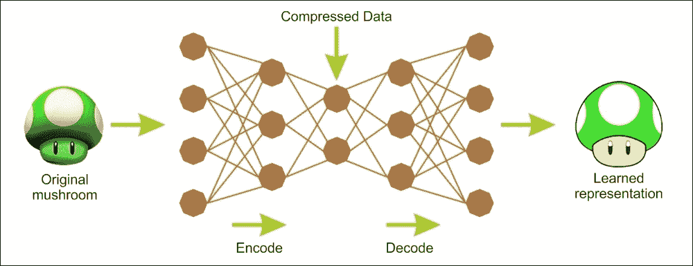

# 神经网络架构

我们连接节点的方式和存在的层数（即输入和输出之间的节点级别以及每层神经元的数量）定义了神经网络的架构。

神经网络中存在各种类型的架构。我们可以将 DL 架构，分为四组：深度神经网络（DNN），卷积神经网络（CNN），循环神经网络（RNN）和紧急架构（EA）。本章的以下部分将简要介绍这些架构。更多详细分析，以及应用实例，将成为本书后续章节的主题。

## 深度神经网络（DNN）

DNN 是人工神经网络，它们强烈地面向 DL。在正常分析程序不适用的情况下，由于要处理的数据的复杂性，因此这种网络是一种极好的建模工具。 DNN 是与我们讨论过的神经网络非常相似的神经网络，但它们必须实现更复杂的模型（更多的神经元，隐藏层和连接），尽管它们遵循适用于所有 ML 问题的学习原则（例如作为监督学习）。每层中的计算将下面层中的表示转换为稍微更抽象的表示。

我们将使用术语 DNN 将具体指代多层感知器（MLP），堆叠自编码器（SAE）和深度信任网络（DBN）。 SAE 和 DBN 使用 AutoEncoders（AEs）和 RBM 作为架构的块。它们与 MLP 之间的主要区别在于，训练分两个阶段执行：无监督的预训练和监督微调：

图 12：分别使用 AE 和 RBM 的 SAE 和 DBN。

在无监督预训练中，如上图所示，这些层按顺序堆叠并以分层方式进行训练，如使用未标记数据的 AE 或 RBM。然后，在有监督的微调中，堆叠输出分类器层，并通过用标记数据重新训练来优化完整的神经网络。

在本章中，我们不讨论 SAE（详见第 5 章，优化 TensorFlow 自编码器），但将坚持使用 MLP 和 DBN 并使用这两种 DNN 架构。我们将看到如何开发预测模型来处理高维数据集。

### 多层感知器

在多层网络中，可以识别层的人工神经元，以便每个神经元连接到下一层中的所有神经元，确保：

*   属于同一层的神经元之间没有连接
*   属于非相邻层的神经元之间没有连接
*   每层的层数和神经元数取决于要解决的问题

输入和输出层定义输入和输出，并且存在隐藏层，其复杂性实现网络的不同行为。最后，神经元之间的连接由与相邻层对相同的矩阵表示。

每个数组包含两个相邻层的节点对之间的连接的权重。前馈网络是层内没有环路的网络。

我们将在第 3 章，使用 TensorFlow 的前馈神经网络中更详细地描述前馈网络：

图 13：MLP 架构

### 深度信念网络（DBNs）

为了克服 MLP 中的过拟合问题，我们建立了一个 DBN，做了无监督预训练，为输入获得了一组不错的特征表示，然后微调训练集从网络获得实际预测。虽然 MLP 的权重是随机初始化的，但 DBN 使用贪婪的逐层预训练算法通过概率生成模型初始化网络权重。模型由可见层和多层随机和潜在变量组成，称为隐藏单元或特征检测器。

DBN 是深度生成模型，它们是神经网络模型，可以复制您提供的数据分布。这允许您从实际数据点生成“虚假但逼真”的数据点。

DBN 由可见层和多层随机潜在变量组成，这些变量称为隐藏单元或特征检测器。前两层在它们之间具有无向的对称连接并形成关联存储器，而较低层从前一层接收自上而下的有向连接。 DBN 的构建块是受限玻尔兹曼机器（RBM）。如下图所示，几个 RBM 一个接一个地堆叠形成 DBN：

图 14：配置用于半监督学习的 DBN

单个 RBM 由两层组成。第一层由可见神经元组成，第二层由隐藏神经元组成。下图显示了简单 RBM 的结构。可见单元接受输入，隐藏单元是非线性特征检测器。每个可见神经元都连接到所有隐藏的神经元，但同一层中的神经元之间没有内部连接。

RBM 由可见层节点和隐藏层节点组成，但没有可见 - 隐藏和隐藏 - 隐藏连接，因此术语受限制。它们允许更有效的网络训练，可以监督或监督。这种类型的神经网络能够表示输入的大量特征，然后隐藏的节点可以表示多达 2n 个特征。可以训练网络回答单个问题（例如，问题是或否：它是猫吗？），直到它能够（再次以二元的方式）响应总共 2n 个问题（它是猫吗？ ，这是暹罗人？，它是白色的吗？）。

RBM 的架构如下，神经元根据对称的二分图排列：

图 15：RBM 架构。

由于无法对变量之间的关系进行建模，因此单个隐藏层 RBM 无法从输入数据中提取所有特征。因此，一层接一层地使用多层 RBM 来提取非线性特征。在 DBN 中，首先使用输入数据训练 RBM，并且隐藏层表示使用贪婪学习方法学习的特征。这些第一 RBM 的学习特征，即第一 RBM 的隐藏层，被用作第二 RBM 的输入，作为 DBN 中的另一层。

类似地，第二层的学习特征用作另一层的输入。这样，DBN 可以从输入数据中提取深度和非线性特征。最后一个 RBM 的隐藏层代表整个网络的学习特征。

## 卷积神经网络（CNNs）

CNN 已经专门用于图像识别。学习中使用的每个图像被分成紧凑的拓扑部分，每个部分将由过滤器处理以搜索特定模式。形式上，每个图像被表示为像素的三维矩阵（宽度，高度和颜色），并且每个子部分可以与滤波器组卷积在一起。换句话说，沿着图像滚动每个滤镜计算相同滤镜和输入的内积。

此过程为各种过滤器生成一组特征图（激活图）。将各种特征图叠加到图像的相同部分上，我们得到输出量。这种类型的层称为卷积层。下图是 CNN 架构的示意图：

图 16：CNN 架构。

虽然常规 DNN 适用于小图像（例如，MNIST 和 CIFAR-10），但由于需要大量参数，它们会因较大的图像而崩溃。例如，100×100 图像具有 10,000 个像素，并且如果第一层仅具有 1,000 个神经元（其已经严格限制传输到下一层的信息量），则这意味着 1000 万个连接。另外，这仅适用于第一层。

CNN 使用部分连接的层解决了这个问题。由于相邻层仅部分连接，并且因为它重复使用其权重，因此 CNN 的参数远远少于完全连接的 DNN，这使得训练速度更快。这降低了过拟合的风险，并且需要更少的训练数据。此外，当 CNN 已经学习了可以检测特定特征的内核时，它可以在图像上的任何地方检测到该特征。相反，当 DNN 在一个位置学习一个特征时，它只能在该特定位置检测到它。由于图像通常具有非常重复的特征，因此 CNN 在图像处理任务（例如分类）和使用较少的训练示例方面能够比 DNN 更好地推广。

重要的是，DNN 没有关于如何组织像素的先验知识;它不知道附近的像素是否接近。 CNN 的架构嵌入了这一先验知识。较低层通常识别图像的单元域中的特征，而较高层将较低层特征组合成较大特征。这适用于大多数自然图像，使 CNN 在 DNN 上具有决定性的先机：

图 17：常规 DNN 与 CNN。

例如，在上图中，在左侧，您可以看到常规的三层神经网络。在右侧，CNN 以三维（宽度，高度和深度）排列其神经元，如在其中一个层中可视化。 CNN 的每一层都将 3D 输入音量转换为神经元激活的 3D 输出音量。红色输入层保持图像，因此其宽度和高度将是图像的尺寸，深度将是三个（红色，绿色和蓝色通道）。

因此，我们所看到的所有多层神经网络都有由长线神经元组成的层，我们不得不将输入图像或数据平铺到 1D，然后再将它们馈送到神经网络。但是，当您尝试直接为它们提供 2D 图像时会发生什么？答案是在 CNN 中，每个层都用 2D 表示，这样可以更容易地将神经元与其相应的输入进行匹配。我们将在接下来的部分中看到这方面的示例。

## 自编码器

AE 是具有三层或更多层的网络  ，其中输入层和输出具有相同数量的神经元，并且那些中间（隐藏层）具有较少数量的神经元。对网络进行训练，以便在输出中简单地为每条输入数据再现输入中相同的活动模式。

AE 是能够在没有任何监督的情况下学习输入数据的有效表示的 ANN（即，训练集是未标记的）。它们通常具有比输入数据低得多的维度，使得 AE 可用于降低维数。更重要的是，AE 作为强大的特征检测器，它们可用于 DNN 的无监督预训练。

该问题的显着方面在于，由于隐藏层中神经元的数量较少，如果网络可以从示例中学习并推广到可接受的程度，则它执行数据压缩;对于每个示例，隐藏神经元的状态为输入和输出公共状态的压缩版本提供。 AEs 的有用应用是数据可视化的数据去噪和降维。

下图显示了 AE 通常如何工作;它通过两个阶段重建接收的输入：编码阶段，其对应于原始输入的尺寸减小;以及解码阶段，其能够从编码（压缩）表示重建原始输入：

图 18：自编码器的编码和解码阶段。

作为无监督神经网络，自编码器的主要特征是其对称结构。 自编码器有两个组件：将输入转换为内部表示的编码器，然后是将内部表示转换为输出的解码器。

换句话说，  自编码器可以看作是编码器的组合，其中我们将一些输入编码为代码，以及解码器，其中我们将代码解码/重建为其原始输入作为输出。因此，MLP 通常具有与自编码器相同的架构，除了输出层中的神经元的数量必须等于输入的数量。

如前所述，训练自编码器的方法不止一种。第一种方法是一次训练整个层，类似于 MLP。但是，在计算成本函数时，不像在监督学习中使用某些标记输出，我们使用输入本身。因此，成本函数显示实际输入和重建输入之间的差异。

## 循环神经网络（RNNs）

RNN 的基本特征是网络包含至少一个反馈连接，因此激活可以在循环中流动。它使网络能够进行时间处理和学习序列，例如执行序列识别/再现或时间关联/预测。

RNN 架构可以有许多不同的形式。一种常见类型包括标准 MLP 加上添加的循环。这些可以利用 MLP 强大的非线性映射功能，并具有某种形式的内存。其他人具有更均匀的结构，可能与每个神经元连接到所有其他神经元，并且可能具有随机激活函数：

图 19：RNN 架构。

对于简单的架构和确定性激活函数，可以使用类似的 GD 过程来实现学习，这些过程导致用于前馈网络的反向传播算法。

上图查看了 RNN 的一些最重要的类型和功能。 RNN 被设计成利用输入数据的顺序信息，与诸如感知器，长短期存储器单元（LSTM）或门控循环单元（GRU）之类的构件块之间的循环连接。后两者用于消除常规 RNN 的缺点，例如梯度消失/爆炸问题和长短期依赖性。我们将在后面的章节中讨论这些架构。

## Emergent 架构

已经提出了许多其他前沿 DL 架构  ，例如深度时空神经网络（DST-NN），多维循环神经网络（MD-RNN），  ]和卷积自编码器（CAE）。

然而，人们正在谈论和使用其他新兴网络，例如 CapsNets（CNN 的改进版本，旨在消除常规 CNN 的缺点），用于个性化的分解机和深度强化学习。