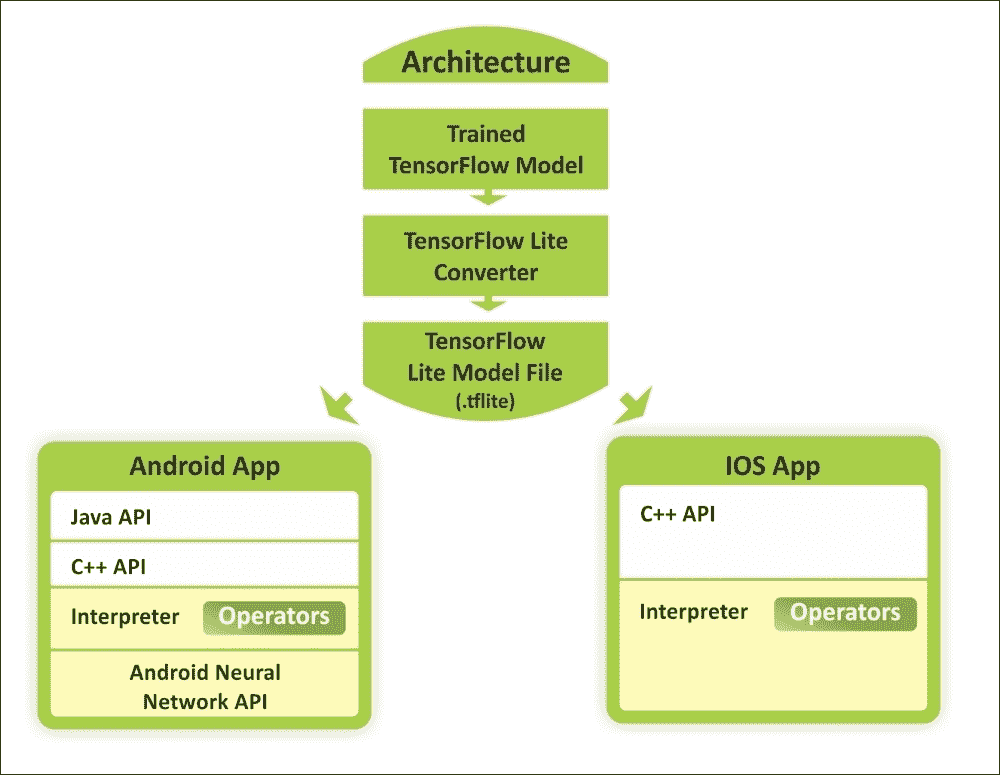

# TensorFlow v1.6 的新功能是什么？

2015 年，Google 制作了  TensorFlow 开源，包括其所有参考实现。所有源代码都是在 Apache 2.0 许可下在 GitHub 上提供的。从那以后，TensorFlow 已经在学术界和工业研究中被广泛采用，最稳定的版本 1.6 最近已经发布了统一的 API。

值得注意的是，TensorFlow 1.6（及更高版本）中的 API 并非都与 v1.5 之前的代码完全向后兼容。这意味着一些在 v1.5 之前工作的程序不一定适用于 TensorFlow 1.6。

现在让我们看看 TensorFlow v1.6 具有的新功能和令人兴奋的功能。

## Nvidia GPU 支持优化

从 TensorFlow v1.5 开始，预构建的二进制文件现在针对 CUDA 9.0 和 cuDNN 7 构建。但是，从 v1.6 版本开始，TensorFlow 预构建的二进制文件使用 AVX 指令，这可能会破坏旧 CPU 上的 TensorFlow。尽管如此，自 v1.5 以来，已经可以在 NVIDIA Tegra 设备上增加对 CUDA 的支持。

## 介绍 TensorFlow Lite

TensorFlow Lite 是  TensorFlow 针对移动和嵌入式设备的轻量级解决方案。它支持具有小二进制大小和支持硬件加速的快速表现的设备上机器学习模型的低延迟推理。

TensorFlow Lite 使用许多技术来实现低延迟，例如优化特定移动应用的内核，预融合激活，允许更小和更快（定点数学）模型的量化内核，以及将来利用杠杆专用机器学习硬件在特定设备上获得特定模型的最佳表现。

图 1：使用 TensorFlow Lite 在 Android 和 iOS 设备上使用训练模型的概念视图

机器学习正在改变计算范式，我们看到了移动和嵌入式设备上新用例的新趋势。在相机和语音交互模型的推动下，消费者的期望也趋向于与其设备进行自然的，类似人的交互。

因此，用户的期望不再局限于计算机，并且移动设备的计算能力也因硬件加速以及诸如 Android 神经​​网络 API 和 iOS 的 C ++ API 之类的框架而呈指数级增长。如上图所示，预训练模型可以转换为较轻的版本，以便作为 Android 或 iOS 应用运行。

因此，广泛使用的智能设备为设备智能创造了新的可能性。这些允许我们使用我们的智能手机来执行实时计算机视觉和自然语言处理（NLP）。

## 急切执行

急切执行是 TensorFlow 的一个接口，它提供了一种命令式编程风格。启用预先执行时，TensorFlow 操作（在程序中定义）立即执行。

需要注意的是，从 TensorFlow v1.7 开始，急切执行将被移出 contrib。这意味着建议使用`tf.enable_eager_execution()`。我们将在后面的部分中看到一个例子。

## 优化加速线性代数（XLA）

v1.5 之前的 XLA 不稳定并且具有非常有限的特性。但是，v1.6 对 XLA 的支持更多。这包括以下内容：

*   添加了对 XLA 编译器的 Complex64 支持
*   现在为 CPU 和 GPU 添加了快速傅里叶变换（FFT）支持
*   bfloat 支持现已添加到 XLA 基础结构中
*   已启用 ClusterSpec 传播与 XLA 设备的工作
*   Android TF 现在可以在兼容的 Tegra 设备上使用 CUDA 加速构建
*   已启用对添加确定性执行程序以生成 XLA 图的支持

开源社区报告的大量错误已得到修复，并且此版本已集成了大量 API 级别的更改。

但是，由于我们尚未使用 TensorFlow 进行任何研究，我们将在后面看到如何利用这些功能开发真实的深度学习应用。在此之前，让我们看看如何准备您的编程环境。