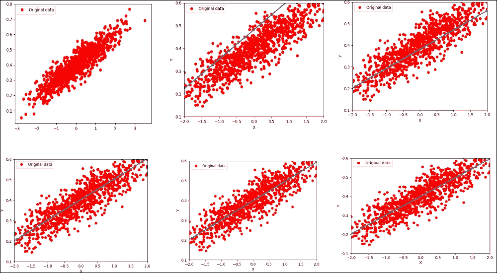
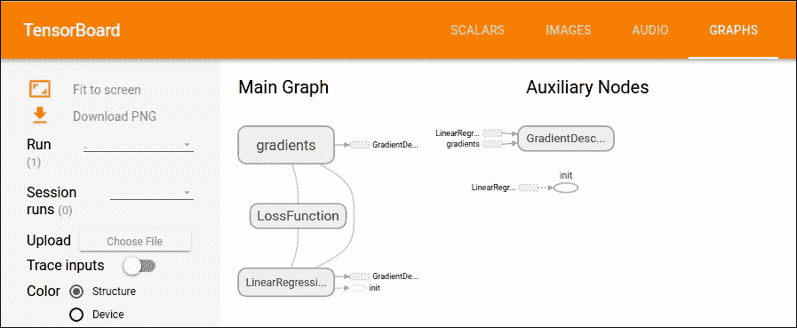
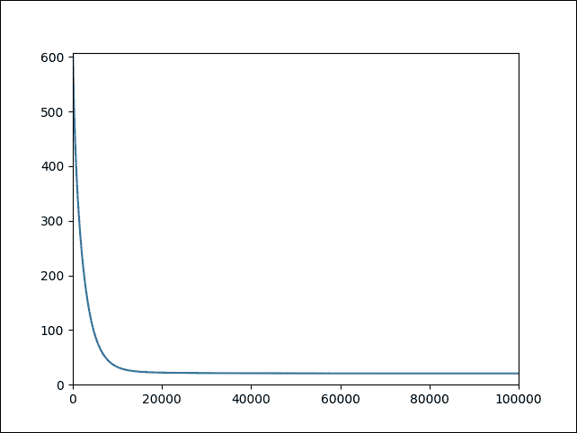
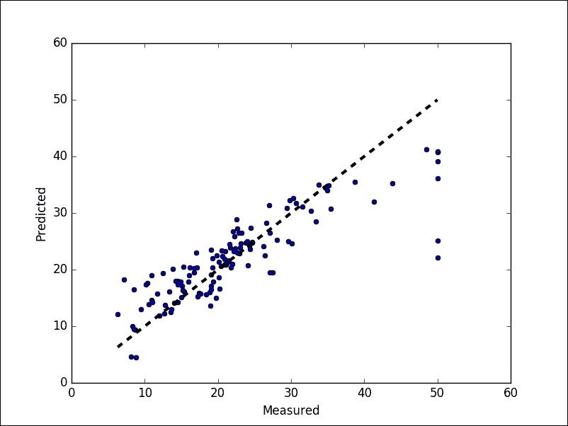

# 线性回归及更多

在本节中，我们将仔细研究 TensorFlow 和 TensorBoard 的主要概念，并尝试做一些基本操作来帮助您入门。我们想要实现的模型模拟线性回归。

在统计和 ML 中，线性回归是一种经常用于衡量变量之间关系的技术。这是一种非常简单但有效的算法，也可用于预测建模。

线性回归模拟因变量`y[i]`，自变量`x[i]`，和随机项`b`。这可以看作如下：


使用 TensorFlow 的典型线性回归问题具有以下工作流程，该工作流程更新参数以最小化给定成本函数（参见下图）：


图 9：在 TensorFlow 中使用线性回归的学习算法

现在，让我们尝试按照前面的图，通过概念化前面的等式将其重现为线性回归。为此，我们将编写一个简单的 Python 程序，用于在 2D 空间中创建数据。然后我们将使用 TensorFlow 来寻找最适合数据点的线（如下图所示）：

```py
# Import libraries (Numpy, matplotlib)

import numpy as np
import matplotlib.pyplot as plot

# Create 1000 points following a function y=0.1 * x + 0.4z
(i.e. # y = W * x + b) with some normal random distribution:

num_points = 1000
vectors_set = []

# Create a few random data points 
for i in range(num_points):
    W = 0.1 # W
   b = 0.4 # b
    x1 = np.random.normal(0.0, 1.0)#in: mean, standard deviation
    nd = np.random.normal(0.0, 0.05)#in:mean,standard deviation
    y1 = W * x1 + b

 # Add some impurity with normal distribution -i.e. nd 
    y1 = y1 + nd

 # Append them and create a combined vector set:
    vectors_set.append([x1, y1])

# Separate the data point across axises:
x_data = [v[0] for v in vectors_set]
y_data = [v[1] for v in vectors_set]

# Plot and show the data points in a 2D space
plot.plot(x_data, y_data, 'ro', label='Original data')
plot.legend()
plot.show()
```

如果您的编译器没有报错，您应该得到以下图表：


图 10：随机生成（但原始）数据

好吧，到目前为止，我们刚刚创建了一些数据点而没有可以通过  TensorFlow 执行的相关模型。因此，下一步是创建一个线性回归模型，该模型可以获得从输入数据点估计的输出值 y，即`x_data`。在这种情况下，我们只有两个相关参数，W 和 b。

现在的目标是创建一个图，允许我们根据输入数据`x_data`，通过将它们调整为`y_data`来找到这两个参数的值。因此，我们的目标函数如下：


如果你还记得，我们在 2D 空间中创建数据点时定义了 W = 0.1 和 b = 0.4。 TensorFlow 必须优化这两个值，使 W 趋于 0.1 和 b 为 0.4。

解决此类优化问题的标准方法是迭代数据点的每个值并调整 W 和 b 的值，以便为每次迭代获得更精确的答案。要查看值是否确实在改善，我们需要定义一个成本函数来衡量某条线的优质程度。

在我们的例子中，成本函数是均方误差，这有助于我们根据实际数据点与每次迭代的估计距离函数之间的距离函数找出误差的平均值。我们首先导入 TensorFlow 库：

```py
import tensorflow as tf
W = tf.Variable(tf.zeros([1]))
b = tf.Variable(tf.zeros([1]))
y = W * x_data + b
```

在前面的代码段中，我们使用不同的策略生成一个随机点并将其存储在变量 W 中。现在，让我们定义一个损失函数`loss = mean[(y - y_data)^2]`，这将返回一个标量值，其中包含我们之间所有距离的均值。数据和模型预测。就 TensorFlow 约定而言，损失函数可表示如下：

```py
loss = tf.reduce_mean(tf.square(y - y_data))
```

前一行实际上计算均方误差（MSE）。在不进一步详述的情况下，我们可以使用一些广泛使用的优化算法，例如 GD。在最低级别，GD 是一种算法，它对我们已经拥有的一组给定参数起作用。

它以一组初始参数值开始，并迭代地移向一组值，这些值通过采用另一个称为学习率的参数来最小化函数。通过在梯度函数的负方向上采取步骤来实现这种迭代最小化：

```py
optimizer = tf.train.GradientDescentOptimizer(0.6)
train = optimizer.minimize(loss)
```

在运行此优化函数之前，我们需要初始化到目前为止所有的变量。让我们使用传统的 TensorFlow 技术，如下所示：

```py
init = tf.global_variables_initializer()
sess = tf.Session()
sess.run(init)
```

由于我们已经创建了 TensorFlow 会话，我们已准备好进行迭代过程，帮助我们找到`W`和`b`的最佳值：

```py
for i in range(6):
  sess.run(train)
  print(i, sess.run(W), sess.run(b), sess.run(loss))
```

您应该观察以下输出：

```py
>>>
0 [ 0.18418592] [ 0.47198644] 0.0152888
1 [ 0.08373772] [ 0.38146532] 0.00311204
2 [ 0.10470386] [ 0.39876288] 0.00262051
3 [ 0.10031486] [ 0.39547175] 0.00260051
4 [ 0.10123629] [ 0.39609471] 0.00259969
5 [ 0.1010423] [ 0.39597753] 0.00259966
6 [ 0.10108326] [ 0.3959994] 0.00259966
7 [ 0.10107458] [ 0.39599535] 0.00259966

```

你可以看到算法从`W = 0.18418592`和`b = 0.47198644`的初始值开始，损失非常高。然后，算法通过最小化成本函数来迭代地调整值。在第八次迭代中，所有值都倾向于我们期望的值。

现在，如果我们可以绘制它们怎么办？让我们通过在`for`循环下添加绘图线来实现  ，如下所示：

```py
for i in range(6):
       sess.run(train)
       print(i, sess.run(W), sess.run(b), sess.run(loss))
       plot.plot(x_data, y_data, 'ro', label='Original data')
       plot.plot(x_data, sess.run(W)*x_data + sess.run(b))
       plot.xlabel('X')
       plot.xlim(-2, 2)
       plot.ylim(0.1, 0.6)
       plot.ylabel('Y')
       plot.legend()
       plot.show()
```

前面的代码块应该生成下图（虽然合并在一起）：



图 11：在第六次迭代后优化损失函数的线性回归

现在让我们进入第 16 次迭代：

```py
>>>
0 [ 0.23306453] [ 0.47967502] 0.0259004
1 [ 0.08183448] [ 0.38200468] 0.00311023
2 [ 0.10253634] [ 0.40177572] 0.00254209
3 [ 0.09969243] [ 0.39778906] 0.0025257
4 [ 0.10008509] [ 0.39859086] 0.00252516
5 [ 0.10003048] [ 0.39842987] 0.00252514
6 [ 0.10003816] [ 0.39846218] 0.00252514
7 [ 0.10003706] [ 0.39845571] 0.00252514
8 [ 0.10003722] [ 0.39845699] 0.00252514
9 [ 0.10003719] [ 0.39845672] 0.00252514
10 [ 0.1000372] [ 0.39845678] 0.00252514
11 [ 0.1000372] [ 0.39845678] 0.00252514
12 [ 0.1000372] [ 0.39845678] 0.00252514
13 [ 0.1000372] [ 0.39845678] 0.00252514
14 [ 0.1000372] [ 0.39845678] 0.00252514
15 [ 0.1000372] [ 0.39845678] 0.00252514

```

好多了，我们更接近优化的价值，对吧？现在，如果我们通过 TensorFlow 进一步改进我们的可视化分析，以帮助可视化这些图中发生的事情，该怎么办？ TensorBoard 提供了一个网页，用于调试图并检查变量，节点，边缘及其相应的连接。

此外，我们需要使用变量注释前面的图，例如损失函数，`W`，`b`，`y_data`，`x_data`等。然后，您需要通过调用`tf.summary.merge_all()`函数生成所有摘要。

现在，我们需要对前面的代码进行如下更改。但是，最好使用`tf.name_scope()`函数对图上的相关节点进行分组。因此，我们可以使用`tf.name_scope()`来组织 TensorBoard 图表视图中的内容，但让我们给它一个更好的名称：

```py
with tf.name_scope("LinearRegression") as scope:
   W = tf.Variable(tf.zeros([1]))
   b = tf.Variable(tf.zeros([1]))
   y = W * x_data + b
```

然后，让我们以类似的方式注释损失函数，但使用合适的名称，例如`LossFunction`：

```py
with tf.name_scope("LossFunction") as scope:
  loss = tf.reduce_mean(tf.square(y - y_data))
```

让我们注释 TensorBoard 所需的损失，权重和偏差：

```py
loss_summary = tf.summary.scalar("loss", loss)
w_ = tf.summary.histogram("W", W)
b_ = tf.summary.histogram("b", b)
```

一旦您注释了图，就可以通过合并来配置摘要了：

```py
merged_op = tf.summary.merge_all()
```

在运行训练之前（初始化之后），使用`tf.summary.FileWriter()` API 编写摘要，如下所示：

```py
writer_tensorboard = tf.summary.FileWriter('logs/', tf.get_default_graph())
```

然后按如下方式启动 TensorBoard：

```py
$ tensorboard –logdir=<trace_dir_name>
```

在我们的例子中，它可能类似于以下内容：

```py
$ tensorboard --logdir=/home/root/LR/
```

现在让我们转到`http://localhost:6006`并单击 GRAPH 选项卡。您应该看到以下图表：



图 12：TensorBoard 上的主图和辅助节点

### 提示

请注意，Ubuntu 可能会要求您安装`python-tk`软件包。您可以通过在 Ubuntu 上执行以下命令来执行此操作：

```py
$ sudo apt-get install python-tk
# For Python 3.x, use the following
$ sudo apt-get install python3-tk

```

## 真实数据集的线性回归回顾

在上一节中，我们看到线性回归的一个例子。我们看到了如何将 TensorFlow 与随机生成的数据集一起使用，即假数据。我们已经看到回归是一种用于预测连续（而非离散）输出的监督机器学习。

然而，对假数据进行线性回归就像买一辆新车但从不开车。这个令人敬畏的机器需要在现实世界中使用！幸运的是，许多数据集可在线获取，以测试您新发现的回归知识。

其中一个是波士顿住房数据集，可以从[ UCI 机器学习库](https://archive.ics.uci.edu/ml/datasets/Housing)下载。它也可以作为 scikit-learn 的预处理数据集使用。

所以，让我们开始导入所有必需的库，包括 TensorFlow，NumPy，Matplotlib 和 scikit-learn：

```py
import matplotlib.pyplot as plt
import tensorflow as tf
import numpy as np
from numpy import genfromtxt
from sklearn.datasets import load_boston
from sklearn.model_selection import train_test_split
```

接下来，我们需要准备由波士顿住房数据集中的特征和标签组成的训练集。 `read_boston_data ()`方法从 scikit-learn 读取并分别返回特征和标签：

```py
def read_boston_data():
    boston = load_boston()
    features = np.array(boston.data)
    labels = np.array(boston.target)
    return features, labels
```

现在我们已经拥有特征和标签，我们还需要使用`normalizer()`方法对特征进行标准化。这是方法的签名：

```py
def normalizer(dataset):
    mu = np.mean(dataset,axis=0)
    sigma = np.std(dataset,axis=0)
    return(dataset - mu)/sigma
```

`bias_vector()`用于将偏差项（即全 1）附加到我们在前一步骤中准备的标准化特征。它对应于前一个例子中直线方程中的 b 项：

```py
def bias_vector(features,labels):
    n_training_samples = features.shape[0]
    n_dim = features.shape[1]
    f = np.reshape(np.c_[np.ones(n_training_samples),features],[n_training_samples,n_dim + 1])
    l = np.reshape(labels,[n_training_samples,1])
    return f, l
```

我们现在将调用这些方法并将数据集拆分为训练和测试，75％用于训练和休息用于测试：

```py
features,labels = read_boston_data()
normalized_features = normalizer(features)
data, label = bias_vector(normalized_features,labels)
n_dim = data.shape[1]
# Train-test split
train_x, test_x, train_y, test_y = train_test_split(data,label,test_size = 0.25,random_state = 100)
```

现在让我们使用 TensorFlow 的数据结构（例如占位符，标签和权重）：

```py
learning_rate = 0.01
training_epochs = 100000
log_loss = np.empty(shape=[1],dtype=float)
X = tf.placeholder(tf.float32,[None,n_dim]) #takes any number of rows but n_dim columns
Y = tf.placeholder(tf.float32,[None,1]) # #takes any number of rows but only 1 continuous column
W = tf.Variable(tf.ones([n_dim,1])) # W weight vector
```

做得好！我们已经准备好构建 TensorFlow 图所需的数据结构。现在是构建线性回归的时候了，这非常简单：

```py
y_ = tf.matmul(X, W)
cost_op = tf.reduce_mean(tf.square(y_ - Y))
training_step = tf.train.GradientDescentOptimizer(learning_rate).minimize(cost_op)
```

在前面的代码段中，第一行将特征矩阵乘以可用于预测的权重矩阵。第二行计算损失，即回归线的平方误差。最后，第三行执行 GD 优化的一步以最小化平方误差。

### 提示

使用哪种优化器：使用优化器的主要目的是最小化评估成本;因此，我们必须定义一个优化器。使用最常见的优化器（如 SGD），学习率必须以 1 / T 进行缩放才能获得收敛，其中 T 是迭代次数。

Adam 或 RMSProp 尝试通过调整步长来自动克服此限制，以使步长与梯度具有相同的比例。此外，在前面的示例中，我们使用了 Adam 优化器，它在大多数情况下都表现良好。

然而，如果您正在训练神经网络计算梯度是必须的，使用实现 RMSProp 算法的`RMSPropOptimizer`函数是一个更好的主意，因为它是在小批量设置中学习的更快的方式。研究人员还建议在训练深度 CNN 或 DNN 时使用 Momentum 优化器。

从技术上讲，RMSPropOptimizer 是一种先进的梯度下降形式，它将学习率除以指数衰减的平方梯度平均值。衰减参数的建议设置值为 0.9，而学习率的良好默认值为 0.001。

例如在 TensorFlow 中，`tf.train.RMSPropOptimizer()`帮助我们轻松使用它：

```py
optimizer = tf.train.RMSPropOptimizer(0.001, 0.9).minimize(cost_op)
```

现在，在我们开始训练模型之前，我们需要使用`initialize_all_variables()`方法初始化所有变量，如下所示：

```py
init = tf.initialize_all_variables()
```

太棒了！现在我们已经设法准备好所有组件，我们已经准备好训练实际的训练了。我们首先创建 TensorFlow 会话，如下所示：

```py
sess = tf.Session()
sess.run(init_op)
for epoch in range(training_epochs):
    sess.run(training_step,feed_dict={X:train_x,Y:train_y})
    log_loss = np.append(log_loss,sess.run(cost_op,feed_dict={X: train_x,Y: train_y}))
```

训练完成后，我们就可以对看不见的数据进行预测。然而，看到完成训练的直观表示会更令人兴奋。因此，让我们使用 Matplotlib 将成本绘制为迭代次数的函数：

```py
plt.plot(range(len(log_loss)),log_loss)
plt.axis([0,training_epochs,0,np.max(log_loss)])
plt.show()
```

以下是上述代码的输出：

```py
>>>

```



图 13：作为迭代次数函数的成本

对测试数据集做一些预测并计算均方误差：

```py
pred_y = sess.run(y_, feed_dict={X: test_x})
mse = tf.reduce_mean(tf.square(pred_y - test_y))
print("MSE: %.4f" % sess.run(mse))
```

以下是上述代码的输出：

```py
>>>
MSE: 27.3749

```

最后，让我们展示最佳拟合线：

```py
fig, ax = plt.subplots()
ax.scatter(test_y, pred_y)
ax.plot([test_y.min(), test_y.max()], [test_y.min(), test_y.max()], 'k--', lw=3)
ax.set_xlabel('Measured')
ax.set_ylabel('Predicted')
plt.show()
```

以下是上述代码的输出：

```py
>>>

```



图 14：预测值与实际值