# 三、实现前馈神经网络

自动识别手写数字是一个重要的问题，可以在许多实际应用中找到。在本节中，我们将实现一个前馈网络来解决这个问题。

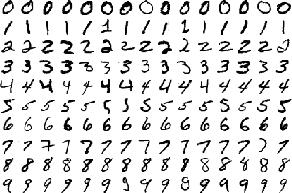

图 3：从 MNIST 数据库中提取的数据示例

为了训练和测试已实现的模型，我们将使用一个名为 MNIST 的手写数字最着名的数据集。 MNIST 数据集是一个包含 60,000 个示例的训练集和一个包含 10,000 个示例的测试集。存储在示例文件中的数据示例如上图所示。

源图像最初是黑白的。之后，为了将它们标准化为 20×20 像素的大小，由于抗混叠滤波器用于调整大小的效果，引入了中间亮度级别。随后，在 28×28 像素的区域中将图像聚焦在像素的质心中，以便改善学习过程。整个数据库存储在四个文件中：

*   `train-images-idx3-ubyte.gz`：训练集图像（9912422 字节）
*   `train-labels-idx1-ubyte.gz`：训练集标签（28881 字节）
*   `t10k-images-idx3-ubyte.gz`：测试集图像（1648877 字节）
*   `t10k-labels-idx1-ubyte.gz`：测试集标签（4542 字节）

每个数据库包含两个文件的  ;第一个包含图像，而第二个包含相应的标签。

## 探索 MNIST 数据集

让我们看一下如何访问 MNIST 数据的简短示例，以及如何显示所选图像。为此，只需执行`Explore_MNIST.py`脚本。首先，我们必须导入 numpy，因为我们必须进行一些图像处理：

```py
import numpy as np
```

Matplotlib 中的`pyplot`函数用于绘制图像：

```py
import matplotlib.pyplot as plt
```

我们将使用`tensorflow.examples.tutorials.mnist`中的`input_data`类，它允许我们下载 MNIST 数据库并构建数据集：

```py
import tensorflow as tf
from tensorflow.examples.tutorials.mnist import input_data
```

然后我们使用`read_data_sets`方法加载数据集：

```py
import os
dataPath = "temp/"
if not os.path.exists(dataPath):
    os.makedirs(dataPath)
input = input_data.read_data_sets(dataPath, one_hot=True)
```

图像将保存在`temp/`目录中。现在让我们看看图像和标签的形状：

```py
print(input.train.images.shape)
print(input.train.labels.shape)
print(input.test.images.shape)
print(input.test.labels.shape)
```

以下是上述代码的输出：

```py
>>>
(55000, 784)
(55000, 10)
(10000, 784)
(10000, 10)

```

使用 Python 库`matplotlib`，我们想要可视化一个数字：

```py
image_0 =  input.train.images[0]
image_0 = np.resize(image_0,(28,28))
label_0 =  input.train.labels[0]
print(label_0)
```

以下是上述代码的输出：

```py
>>>
[ 0\.  0\.  0\.  0\.  0\.  0\.  0\.  1\.  0\.  0.]

```

数字`1`是数组的第八个位置。这意味着我们图像的数字是数字 7.最后，我们必须验证数字是否真的是 7.我们可以使用导入的`plt`函数来绘制`image_0`张量：

```py
plt.imshow(image_0, cmap='Greys_r')
plt.show()
```

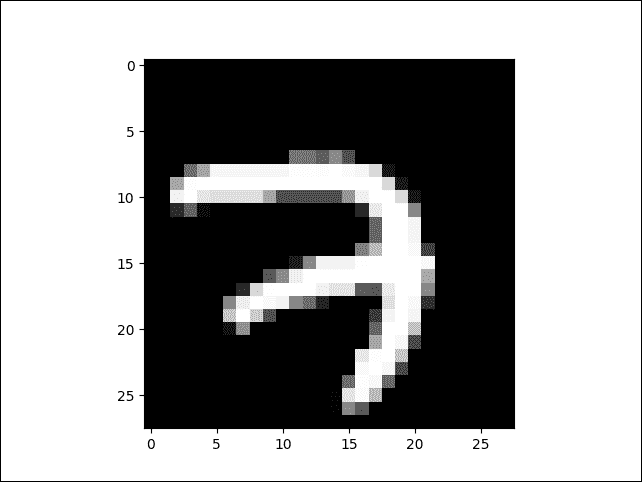

图 4：从 MNIST 数据集中提取的图像

### Softmax 分类器

在上一节中，我们展示了如何访问和操作 MNIST 数据集。在本节中，我们将看到如何使用前面的数据集来解决 TensorFlow 手写数字的分类问题。我们将应用所学的概念来构建更多神经网络模型，以便评估和比较所采用的不同方法的结果。

将要实现的第一个前馈网络架构如下图所示：

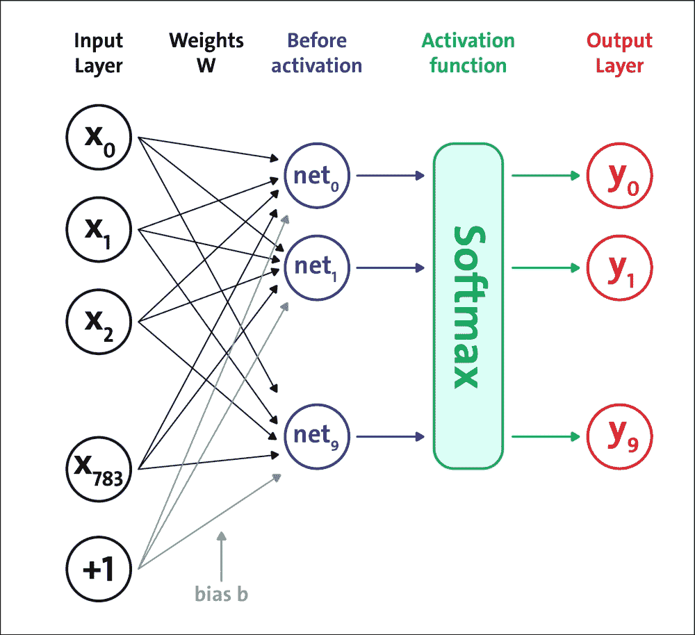

图 5：softmax 神经网络架构

我们将构建一个五层网络：第一层到第四层是 S 形结构，第五层是 softmax 激活函数。请记住，定义此网络是为了激活它是一组正值，总和等于 1.这意味着输出的第`j`个值是 j 是与网络输入对应的类的概率。让我们看看如何实现我们的神经网络模型。

为了确定网络的适当大小（即，层中的神经元或单元的数量），即隐藏层的数量和每层神经元的数量，通常我们依赖于一般的经验标准，个人经验或适当的测试。这些是需要调整的一些超参数。在本章的后面，我们将看到一些超参数优化的例子。

下表总结了已实现的网络架构。它显示了每层神经元的数量，以及相应的激活函数：

| 层 | 神经元数量 | 激活函数 |
| --- | --- | --- |
| 1 | `L = 200` | Sigmoid |
| 2 | `M = 100` | Sigmoid |
| 3 | `N = 60` | Sigmoid |
| 4 | `O = 30` | Sigmoid |
| 5 | `10` | Softmax |

前四层的激活函数是 S 形函数。激活函数的最后一层始终是 softmax，因为网络的输出必须表示输入数字的概率。通常，中间层的数量和大小会极大地影响的网络表现：

*   以积极的方式，因为在这些层上是基于网络推广的能力，并检测输入的特殊特征
*   以负面的方式，因为如果网络是冗余的，那么它会不必要地减轻学习阶段的负担

为此，只需执行`five_layers_sigmoid.py`脚本。首先，我们将通过导入以下库来开始实现网络：

```py
import tensorflow as tf
from tensorflow.examples.tutorials.mnist import input_data
import math
from tensorflow.python.framework import ops
import random
import os
```

接下来，我们将设置以下配置参数：

```py
logs_path = 'log_sigmoid/' # logging path
batch_size = 100 # batch size while performing training 
learning_rate = 0.003 # Learning rate 
training_epochs = 10 # training epoch
display_epoch = 1
```

然后，我们将下载图像和标签，并准备数据集：

```py
dataPath = "temp/"
if not os.path.exists(dataPath):
    os.makedirs(dataPath)
mnist = input_data.read_data_sets(dataPath, one_hot=True) # MNIST to be downloaded
```

从输入层开始，我们现在将看看如何构建网络架构。输入层现在是形状`[1×784]`的张量 - 即`[1,28 * 28]`，它代表要分类的图像：

```py
X = tf.placeholder(tf.float32, [None, 784], name='InputData') # image shape 28*28=784
XX = tf.reshape(X, [-1, 784]) # reshape input
Y_ = tf.placeholder(tf.float32, [None, 10], name='LabelData') # 0-9 digits => 10 classes
```

第一层接收要分类的输入图像的像素，与`W1`权重连接组合，并添加到`B1`偏差张量的相应值：

```py
W1 = tf.Variable(tf.truncated_normal([784, L], stddev=0.1)) # Initialize random weights for the hidden layer 1
B1 = tf.Variable(tf.zeros([L])) # Bias vector for layer 1
```

第一层通过 sigmoid 激活函数将其输出发送到第二层：

```py
Y1 = tf.nn.sigmoid(tf.matmul(XX, W1) + B1) # Output from layer 1
```

第二层从第一层接收`Y1`输出，将其与`W2`权重连接组合，并将其添加到`B2`偏差张量的相应值：

```py
W2 = tf.Variable(tf.truncated_normal([L, M], stddev=0.1)) # Initialize random weights for the hidden layer 2
B2 = tf.Variable(tf.ones([M])) # Bias vector for layer 2
```

第二层通过 sigmoid 激活函数将其输出发送到第三层：

```py
Y2 = tf.nn.sigmoid(tf.matmul(Y1, W2) + B2) # Output from layer 2
```

第三层接收来自第二层的`Y2`输出，将其与`W3`权重连接组合，并将其添加到`B3`偏差张量的相应值：

```py
W3 = tf.Variable(tf.truncated_normal([M, N], stddev=0.1)) # Initialize random weights for the hidden layer 3 
B3 = tf.Variable(tf.ones([N])) # Bias vector for layer 3
```

第三层通过 sigmoid 激活函数将其输出发送到第四层：

```py
Y3 = tf.nn.sigmoid(tf.matmul(Y2, W3) + B3) # Output from layer 3
```

第四层接收来自第三层的`Y3`输出，将其与`W4`权重连接组合，并将其添加到`B4`偏差张量的相应值：

```py
W4 = tf.Variable(tf.truncated_normal([N, O], stddev=0.1)) # Initialize random weights for the hidden layer 4
B4 = tf.Variable(tf.ones([O])) # Bias vector for layer 4
```

然后通过 S 形激活函数将第四层的输出传播到第五层：

```py
Y4 = tf.nn.sigmoid(tf.matmul(Y3, W4) + B4) # Output from layer 4
```

第五层将在输入中接收来自第四层的激活`O = 30`，该激活将通过`softmax`激活函数，转换为每个数字的相应概率类别：

```py
W5 = tf.Variable(tf.truncated_normal([O, 10], stddev=0.1)) # Initialize random weights for the hidden layer 5 
B5 = tf.Variable(tf.ones([10])) # Bias vector for layer 5
Ylogits = tf.matmul(Y4, W5) + B5 # computing the logits
Y = tf.nn.softmax(Ylogits)# output from layer 5
```

这里，我们的损失函数是目标和`softmax`激活函数之间的交叉熵，应用于模型的预测：

```py
cross_entropy = tf.nn.softmax_cross_entropy_with_logits_v2(logits=Ylogits, labels=Y) # final outcome using softmax cross entropy
cost_op = tf.reduce_mean(cross_entropy)*100
```

另外，我们定义`correct_prediction`和模型的准确率：

```py
correct_prediction = tf.equal(tf.argmax(Y, 1), tf.argmax(Y_, 1))
accuracy = tf.reduce_mean(tf.cast(correct_prediction, tf.float32))
```

现在我们需要使用优化器来减少训练错误。与简单的`GradientDescentOptimizer`相比，`AdamOptimizer`具有几个优点。实际上，它使用更大的有效步长，算法将收敛到此步长而不进行微调：

```py
# Optimization op (backprop)
train_op = tf.train.AdamOptimizer(learning_rate).minimize(cost_op)
```

`Optimizer`基类提供了计算损失梯度的方法，并将梯度应用于变量。子类集合实现了经典的优化算法，例如`GradientDescent`和`Adagrad`。在 TensorFlow 中训练 NN 模型时，我们从不实例化`Optimizer`类本身，而是实例化以下子类之一

*   [`tf.train.Optimizer`](https://www.tensorflow.org/api_docs/python/tf/train/Optimizer)
*   [`tf.train.GradientDescentOptimizer`](https://www.tensorflow.org/api_docs/python/tf/train/GradientDescentOptimizer)
*   [`tf.train.AdadeltaOptimizer`](https://www.tensorflow.org/api_docs/python/tf/train/AdadeltaOptimizer)
*   [`tf.train.AdagradOptimizer`](https://www.tensorflow.org/api_docs/python/tf/train/AdagradOptimizer) 
*   [`tf.train.AdagradDAOptimizer`](https://www.tensorflow.org/api_docs/python/tf/train/AdagradDAOptimizer)
*   [`tf.train.MomentumOptimizer`](https://www.tensorflow.org/api_docs/python/tf/train/MomentumOptimizer)
*   [`tf.train.AdamOptimizer`](https://www.tensorflow.org/api_docs/python/tf/train/AdamOptimizer)
*   [`tf.train.FtrlOptimizer`](https://www.tensorflow.org/api_docs/python/tf/train/FtrlOptimizer)
*   [`tf.train.ProximalGradientDescentOptimizer`](https://www.tensorflow.org/api_docs/python/tf/train/ProximalGradientDescentOptimizer)
*   [`tf.train.ProximalAdagradOptimizer`](https://www.tensorflow.org/api_docs/python/tf/train/ProximalAdagradOptimize)
*   [`tf.train.RMSPropOptimizer`](https://www.tensorflow.org/api_docs/python/tf/train/RMSPropOptimizer)

见[此链接](https://www.tensorflow.org/api_guides/python/train)和[`tf.contrib.opt`](https://www.tensorflow.org/api_docs/python/tf/contrib/opt)用于更多优化器。

然后让我们构建一个将所有操作封装到范围中的模型，使 TensorBoard 的图可视化更加方便：

```py
# Create a summary to monitor cost tensor
tf.summary.scalar("cost", cost_op)
# Create a summary to monitor accuracy tensor
tf.summary.scalar("accuracy", accuracy)
# Merge all summaries into a single op
summary_op = tf.summary.merge_all()
```

最后，我们将开始训练：

```py
with tf.Session() as sess:
        # Run the initializer
    sess.run(init_op)

    # op to write logs to TensorBoard
    writer = tf.summary.FileWriter(logs_path, graph=tf.get_default_graph())

    for epoch in range(training_epochs):
        batch_count = int(mnist.train.num_examples/batch_size)
        for i in range(batch_count):
            batch_x, batch_y = mnist.train.next_batch(batch_size)
            _,summary = sess.run([train_op, summary_op], feed_dict={X: batch_x, Y_: batch_y})
            writer.add_summary(summary, epoch * batch_count + i)

        print("Epoch: ", epoch)
    print("Optimization Finished!")

    print("Accuracy: ", accuracy.eval(feed_dict={X: mnist.test.images, Y_: mnist.test.labels}))
```

定义摘要和会话运行的源代码几乎与前一个相同。我们可以直接转向评估实现的模型。运行模型时，我们有以下输出：

运行此代码后的最终测试设置准确率应约为 97％：

```py
Extracting temp/train-images-idx3-ubyte.gz
Extracting temp/train-labels-idx1-ubyte.gz
Extracting temp/t10k-images-idx3-ubyte.gz
Extracting temp/t10k-labels-idx1-ubyte.gz
Epoch:  0
Epoch:  1
Epoch:  2
Epoch:  3
Epoch:  4
Epoch:  5
Epoch:  6
Epoch:  7
Epoch:  8
Epoch:  9
Optimization Finished!
Accuracy:  0.9
715

```

现在我们可以通过在运行文件夹中打开终端然后执行以下命令来移动到  TensorBoard：

```py
$> tensorboard --logdir='log_sigmoid/' # if required, provide absolute path

```

然后我们在 localhost 上打开浏览器。在下图中，我们显示了成本函数的趋势，作为示例数量的函数，在训练集上，以及测试集的准确率：


图 6：测试集上的准确率函数，以及训练集上的成本函数

成本函数随着迭代次数的增加而减少。如果没有发生这种情况，则意味着出现了问题。在最好的情况下，这可能只是因为某些参数未正确设置。在最坏的情况下，构建的数据集中可能存在问题，例如，信息太少或图像质量差。如果发生这种情况，我们必须直接修复数据集。

到目前为止，我们已经看到了 FFNN 的实现。但是，使用真实数据集探索更有用的 FFNN 实现会很棒。我们将从 MLP 开始。

# 实现多层感知器（MLP）

感知器单层 LTU 组成，每个神经元连接到所有输入。这些连接通常使用称为输入神经元的特殊传递神经元来表示：它们只输出它们被输入的任何输入。此外，通常添加额外的偏置特征（`x0 = 1`）。

这种偏置特征通常使用称为偏置神经元的特殊类型的神经元来表示，  一直输出 1。具有两个输入和三个输出的感知器在图 7 中表示。该感知器可以同时将实例分类为三个不同的二元类，这使其成为多输出分类器：

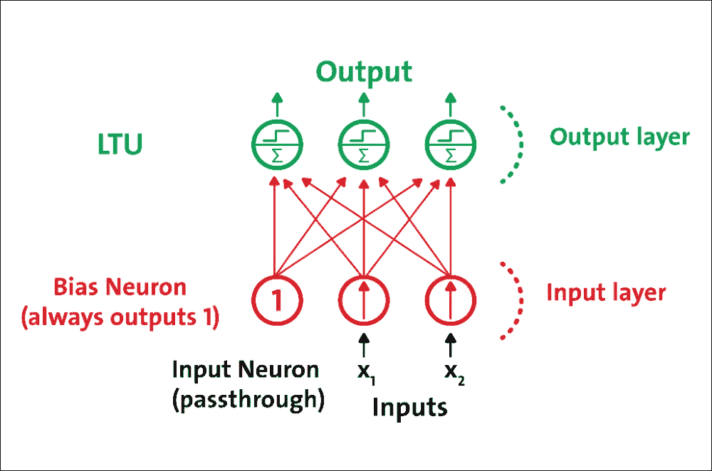

图 7：具有两个输入和三个输出的感知器

由于每个输出神经元的决策边界是线性的，因此感知器无法学习复杂模式。然而，如果训练实例是线性可分的，研究表明该算法将收敛于称为“感知器收敛定理”的解决方案。

MLP 是 FFNN，这意味着它是来自不同层的神经元之间的唯一连接。更具体地，MLP 由一个（通过）输入层，一个或多个 LTU 层（称为隐藏层）和一个称为输出层的 LTU 的最后一层组成。除输出层外，每一层都包含一个偏置神经元，并作为完全连接的二分图连接到下一层：

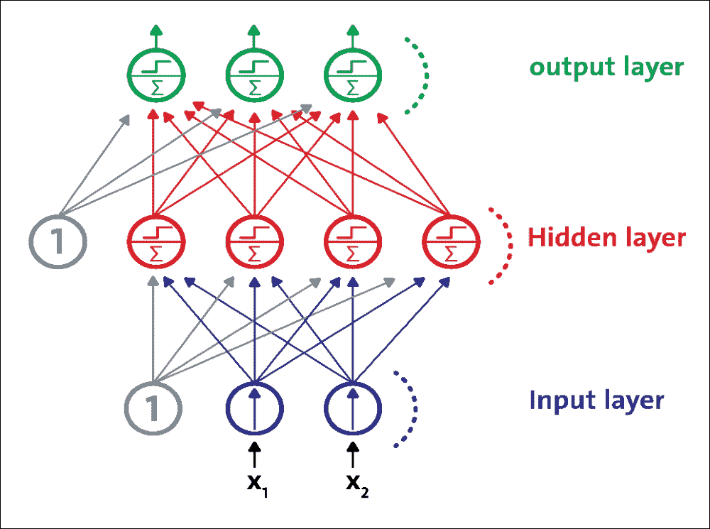

图 8：MLP 由一个输入层，一个隐藏层和一个输出层组成

## 训练 MLP

MLP 在 1986 年首次使用反向传播训练算法成功训练。然而，现在这种算法的优化版本被称为梯度下降。在训练阶段期间，对于每个训练实例，算法将其馈送到网络并计算每个连续层中的每个神经元的输出。

训练算法测量网络的输出误差（即，期望输出和网络的实际输出之间的差异），并计算最后隐藏层中每个神经元对每个输出神经元误差的贡献程度。然后，它继续测量这些误差贡献中有多少来自先前隐藏层中的每个神经元，依此类推，直到算法到达输入层。通过在网络中向后传播误差梯度，该反向传递有效地测量网络中所有连接权重的误差梯度。

在技​​术上，通过反向传播方法计算每层的成本函数的梯度。梯度下降的想法是有一个成本函数，显示某些神经网络的预测输出与实际输出之间的差异：

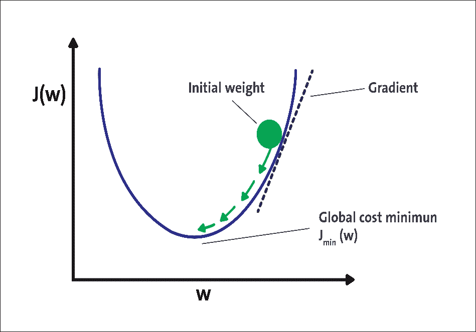

图 9：用于无监督学习的 ANN 的示例实现

有几种已知类型的代价函数，例如平方误差函数和对数似然函数。该成本函数的选择可以基于许多因素。梯度下降法通过最小化此成本函数来优化网络的权重。步骤如下：

1.  权重初始化
2.  计算神经网络的预测输出，通常称为转发传播步骤
3.  计算成本/损失函数。一些常见的成本/损失函数包括对数似然函数和平方误差函数
4.  计算成本/损失函数的梯度。对于大多数 DNN 架构，最常见的方法是反向传播
5.  基于当前权重的权重更新，以及成本/损失函数的梯度
6.  步骤 2 到 5 的迭代，直到成本函数，达到某个阈值或经过一定量的迭代

图 9 中可以看到梯度下降的图示。该图显示了基于网络权重的神经网络的成本函数。在梯度下降的第一次迭代中，我们将成本函数应用于一些随机初始权重。对于每次迭代，我们在梯度方向上更新权重，这对应于图 9 中的箭头。重复更新直到一定次数的迭代或直到成本函数达到某个阈值。

## 使用 MLP

多层感知器通常用于以监督方式解决分类和回归问题。尽管 CNN 逐渐取代了它们在图像和视频数据中的实现，但仍然可以有效地使用低维和数字特征 MLP：可以解决二元和多类分类问题。

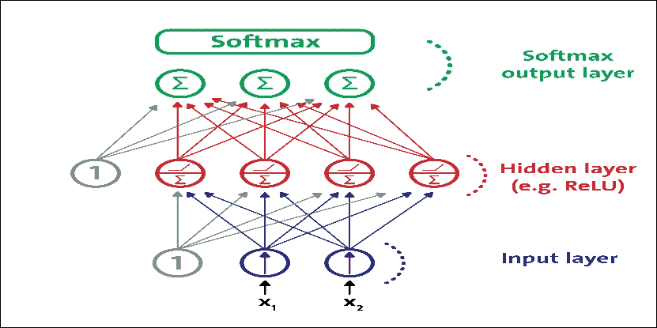

图 10：用于分类的现代 MLP（包括 ReLU 和 softmax）

然而，对于多类分类任务和训练，通常通过用共享 softmax 函数替换各个激活函数来修改输出层。每个神经元的输出对应于相应类的估计概率。请注意，信号仅在一个方向上从输入流向输出，因此该架构是 FFNN 的示例。

作为案例研究，我们将使用银行营销数据集。这些数据与葡萄牙银行机构的直接营销活动有关。营销活动基于电话。通常，不止一次联系同一个客户，以评估产品（银行定期存款）是（是）还是不（不）订阅。 目标是使用 MLP 来预测客户是否会订阅定期存款（变量 y），即二元分类问题。

### 数据集描述

我想在此承认有两个来源。这个数据集被用于 Moro 和其他人发表的一篇研究论文中：一种数据驱动的方法来预测银行电话营销的成功，决策支持系统，Elsevier，2014 年 6 月。后来，它被捐赠给了 UCI 机器学习库，可以从[此链接](https://archive.ics.uci.edu/ml/datasets/bank+marketing)下载。

根据数据集描述，有四个数据集：

*   `bank-additional-full.csv`：这包括所有示例（41,188）和 20 个输入，按日期排序（从 2008 年 5 月到 2010 年 11 月）。这些数据非常接近 Moro 和其他人分析的数据
*   `bank-additional.csv`：这包括 10％的例子（4119），从 1 和 20 个输入中随机选择
*   `bank-full.csv`：这包括按日期排序的所有示例和 17 个输入（此数据集的较旧版本，输入较少）
*   `bank.csv`：这包括 10％的示例和 17 个输入，从 3 中随机选择（此数据集的较旧版本，输入较少）

数据集中有 21 个属性。独立变量可以进一步分类为与客户相关的数据（属性 1 到 7），与当前活动的最后一次联系（属性 8 到 11）相关。其他属性（属性 12 至 15）以及社会和经济背景属性（属性 16 至 20）被分类。因变量由 y 指定，最后一个属性（21）：

| ID | 属性 | 说明 |
| --- | --- | --- |
| 1 | `age` | 年龄数字。 |
| 2 | `job` | 这是具有可能值的分类格式的职业类型：`admin`，`blue-collar`，`entrepreneur`，`housemaid`，`management`，`retired`，`self-employed`，`services`，`student`， `technician`，`unemployed`和`unknown`。 |
| 3 | `marital` | 这是具有可能值的分类格式的婚姻状态：`divorced`（或`widowed`），`married`，`single`和`unknown`。 |
| 4 | `education` | 这是具有如下可能值的分类格式的教育背景：`basic.4y`，`basic.6y`，`basic.9y`，`high.school`，`illiterate`，`professional.course`，`university.degree`和`unknown`。 |
| 五 | `default` | 这是一种分类格式，默认情况下可能包含信用值：`no`，`yes`和`unknown`。 |
| 6 | `housing` | 客户是否有住房贷款？ |
| 7 | `loan` | 具有可能值的分类格式的个人贷款：`no`，`yes`和`unknown`。 |
| 8 | `contact` | 这是具有可能值的分类格式的通信类型：`cellular`或`telephone`。 |
| 9 | `month` | 这是具有可能值的分类格式的一年中最后一个通话月份：`jan`，`feb`，`mar`，... `nov`和`dec`。 |
| 10 | `day_of_week` | 这是一周中的最后一个通话日，其分类格式为可能的值：`mon`，`tue`，`wed`，`thu`和`fri`。 |
| 11 | `duration` | 这是以秒为单位的最后一次通话持续时间（数值）。此属性高度影响输出目标（例如，如果`duration = 0`，则`y = no`）。然而，在执行呼叫之前不知道持续时间。另外，在通话结束后，`y`显然是已知的。因此，此输入仅应包括在基准目的中，如果打算采用现实的预测模型，则应将其丢弃。 |
| 12 | `campaign` | 这是活动期间此客户的通话数量。 |
| 13 | `pdays` | 这是上一个广告系列和客户的上次通话之后经过的天数（数字 -999 表示之前未联系过客户）。 |
| 14 | `previous` | 这是之前此广告系列和此客户的通话数量（数字）。 |
| 15 | `poutcome` | 上一次营销活动的结果（分类：`failure`，`nonexistent`和`success`）。 |
| 16 | `emp.var.rate` | 这是就业变化率和季度指标（数字）。 |
| 17 | `cons.price.idx` | 这是消费者价格指数和月度指标（数字）。 |
| 18 | `cons.conf.idx` | 这是消费者信心指数和月度指标（数字）。 |
| 19 | `euribor3m` | 这是 3 个月的 euribor 费率和每日指标（数字）。 |
| 20 | `nr.employed` | 这是员工数和季度指标（数字）。 |
| 21 | `y` | 表示客户是否拥有定期存款，可能值是二元：`yes`和`no`。 |

### 预处理

您可以看到数据集尚未准备好直接输入 MLP 或 DBN 分类器，因为该特征与数值和分类值混合在一起。此外，结果变量具有分类值。因此，我们需要将分类值转换为数值，以便特征和结果变量以数字形式。下一步显示了此过程。有关此预处理，请参阅`preprocessing_b.py`文件。

首先，我们必须加载预处理所需的所需包和库：

```py
import pandas as pd
import numpy as np
from sklearn import preprocessing
```

然后从上述 URL 下载数据文件并将其放在方便的位置 - 比如说`input`：

然后，我们加载并解析数据集：

```py
data = pd.read_csv('input/bank-additional-full.csv', sep = ";")
```

接下来，我们将提取变量名称：

```py
var_names = data.columns.tolist()
```

现在，基于表 1 中的数据集描述，我们将提取分类变量：

```py
categs = ['job','marital','education','default','housing','loan','contact','month','day_of_week','duration','poutcome','y']
```

然后，我们将提取定量变量：

```py
# Quantitative vars
quantit = [i for i in var_names if i not in categs]
```

然后让我们得到分类变量的虚拟变量：

```py
job = pd.get_dummies(data['job'])
marital = pd.get_dummies(data['marital'])
education = pd.get_dummies(data['education'])
default = pd.get_dummies(data['default'])
housing = pd.get_dummies(data['housing'])
loan = pd.get_dummies(data['loan'])
contact = pd.get_dummies(data['contact'])
month = pd.get_dummies(data['month'])
day = pd.get_dummies(data['day_of_week'])
duration = pd.get_dummies(data['duration'])
poutcome = pd.get_dummies(data['poutcome'])
```

现在，是时候映射变量来预测：

```py
dict_map = dict()
y_map = {'yes':1,'no':0}
dict_map['y'] = y_map
data = data.replace(dict_map)
label = data['y']
df_numerical = data[quantit]
df_names = df_numerical .keys().tolist()
```

一旦我们将分类变量转换为数值变量，下一个任务就是正则化数值变量。因此，使用归一化，我们将单个样本缩放为具有单元规范。如果您计划使用二次形式（如点积或任何其他内核）来量化任何样本对的相似性，则此过程非常有用。该假设是在文本分类和聚类上下文中经常使用的[向量空间模型](https://en.wikipedia.org/wiki/Vector_space_model)的基础。

那么，让我们来衡量量化变量：

```py
min_max_scaler = preprocessing.MinMaxScaler()
x_scaled = min_max_scaler.fit_transform(df_numerical)
df_temp = pd.DataFrame(x_scaled)
df_temp.columns = df_names
```

现在我们有（原始）数值变量的临时数据帧，下一个任务是将所有数据帧组合在一起并生成正则化数据帧。我们将使用熊猫：

```py
normalized_df = pd.concat([df_temp,
                      job,
                      marital,
                      education,
                      default,
                      housing,
                      loan,
                      contact,
                      month,
                      day,
                      poutcome,
                      duration,
                      label], axis=1)
```

最后，我们需要将结果数据帧保存在 CSV 文件中，如下所示：

```py
normalized_df.to_csv('bank_normalized.csv', index = False)
```

### 用于客户订阅评估的 MLP 的 TensorFlow 实现

对于这个例子，我们将使用我们在前面的例子中正则化的银行营销数据集。有几个步骤可以遵循。首先，我们需要导入 TensorFlow，以及其他必要的包和模块：

```py
import tensorflow as tf
import pandas as pd
import numpy as np
import os
from sklearn.cross_validation import train_test_split # for random split of train/test
```

现在，我们需要加载正则化的银行营销数据集，其中所有特征和标签都是数字。为此，我们使用 pandas 库中的`read_csv()`方法：

```py
FILE_PATH = 'bank_normalized.csv'         # Path to .csv dataset 
raw_data = pd.read_csv(FILE_PATH)        # Open raw .csv
print("Raw data loaded successfully...\n")
```

以下是上述代码的输出：

```py
>>>
Raw data loaded successfully...

```

如前一节所述，调整 DNN 的超参数并不简单。但是，它通常取决于您正在处理的数据集。对于某些数据集，可能的解决方法是根据与数据集相关的统计信息设置这些值，例如，训练实例的数量，输入大小和类的数量。

DNN 不适用于小型和低维数据集。在这些情况下，更好的选择是使用线性模型。首先，让我们放置一个指向标签列本身的指针，计算实例数和类数，并定义训练/测试分流比，如下所示：

```py
Y_LABEL = 'y'    # Name of the variable to be predicted
KEYS = [i for i in raw_data.keys().tolist() if i != Y_LABEL]# Name of predictors
N_INSTANCES = raw_data.shape[0]       # Number of instances
N_INPUT = raw_data.shape[1] - 1            # Input size
N_CLASSES = raw_data[Y_LABEL].unique().shape[0] # Number of classes
TEST_SIZE = 0.25         # Test set size (% of dataset)
TRAIN_SIZE = int(N_INSTANCES * (1 - TEST_SIZE))  # Train size
```

现在，让我们看一下我们将用于训练 MLP 模型的数据集的统计数据：

```py
print("Variables loaded successfully...\n")
print("Number of predictors \t%s" %(N_INPUT))
print("Number of classes \t%s" %(N_CLASSES))
print("Number of instances \t%s" %(N_INSTANCES))
print("\n")
```

以下是上述代码的输出：

```py
>>>
Variables loaded successfully...
Number of predictors     1606
Number of classes          2
Number of instances      41188

```

下一个任务是定义其他参数，例如学习率，训练周期，批量大小和权重的标准偏差。通常，较低的训练率会帮助您的 DNN 学习更慢，但需要集中精力。请注意，我们需要定义更多参数，例如隐藏层数和激活函数。

```py
LEARNING_RATE = 0.001     # learning rate
TRAINING_EPOCHS = 1000     # number of training epoch for the forward pass
BATCH_SIZE = 100     # batch size to be used during training
DISPLAY_STEP = 20   # print the error etc. at each 20 step
HIDDEN_SIZE = 256   # number of neurons in each hidden layer
# We use tanh as the activation function, but you can try using ReLU as well
ACTIVATION_FUNCTION_OUT = tf.nn.tanh
STDDEV = 0.1        # Standard Deviations
RANDOM_STATE = 100
```

前面的初始化是基于反复试验设置的  。因此，根据您的用例和数据类型，明智地设置它们，但我们将在本章后面提供一些指导。此外，对于前面的代码，`RANDOM_STATE`用于表示训练的随机状态和测试分割。首先，我们将原始特征和标签分开：

```py
data = raw_data[KEYS].get_values()       # X data
labels = raw_data[Y_LABEL].get_values()  # y data
```

现在我们有标签，他们必须编码：

```py
labels_ = np.zeros((N_INSTANCES, N_CLASSES))
labels_[np.arange(N_INSTANCES), labels] = 1
```

最后，我们必须拆分训练和测试集。如前所述，我们将保留 75％的训练输入，剩下的 25％用于测试集：

```py
data_train, data_test, labels_train, labels_test = train_test_split(data,labels_,test_size = TEST_SIZE,random_state = RANDOM_STATE)
print("Data loaded and splitted successfully...\n")
```

以下是上述代码的输出：

```py
>>>
Data loaded and splitted successfully

```

由于这是一个监督分类问题，我们应该有特征和标签的占位符：

如前所述，MLP 由一个输入层，几个隐藏层和一个称为输出层的最终 LTU 层组成。对于这个例子，我将把训练与四个隐藏层结合起来。因此，我们将分类器称为深度前馈 MLP。请注意，我们还需要在每个层中使用权重（输入层除外），以及每个层中的偏差（输出层除外）。通常，每个隐藏层包括偏置神经元，并且作为从一个隐藏层到另一个隐藏层的完全连接的二分图（前馈）完全连接到下一层。那么，让我们定义隐藏层的大小：

```py
n_input = N_INPUT                   # input n labels 
n_hidden_1 = HIDDEN_SIZE            # 1st layer 
n_hidden_2 = HIDDEN_SIZE            # 2nd layer
n_hidden_3 = HIDDEN_SIZE            # 3rd layer 
n_hidden_4 = HIDDEN_SIZE            # 4th layer 
n_classes = N_CLASSES               # output m classes 
```

由于这是一个监督分类问题，我们应该有特征和标签的占位符：

```py
# input shape is None * number of input
X = tf.placeholder(tf.float32, [None, n_input])
```

占位符的第一个维度是`None`，这意味着我们可以有任意数量的行。第二个维度固定在多个特征上，这意味着每行需要具有该列数量的特征。

```py
# label shape is None * number of classes
y = tf.placeholder(tf.float32, [None, n_classes])
```

另外，我们需要另一个占位符用于 dropout ，这是通过仅以某种可能性保持神经元活动（例如`p < 1.0`，或者将其设置为零来实现）来实现的。请注意，这也是要调整的超参数和训练时间，而不是测试时间：

```py
dropout_keep_prob = tf.placeholder(tf.float32)
```

使用此处给出的缩放，可以将相同的网络用于训练（使用`dropout_keep_prob < 1.0`）和评估（使用`dropout_keep_prob == 1.0`）。现在，我们可以定义一个实现 MLP 分类器的方法。为此，我们将提供四个参数，如输入，权重，偏差和 dropout 概率，如下所示：

```py
def DeepMLPClassifier(_X, _weights, _biases, dropout_keep_prob):
    layer1 = tf.nn.dropout(tf.nn.tanh(tf.add(tf.matmul(_X, _weights['h1']), _biases['b1'])), dropout_keep_prob)
    layer2 = tf.nn.dropout(tf.nn.tanh(tf.add(tf.matmul(layer1, _weights['h2']), _biases['b2'])), dropout_keep_prob)
    layer3 = tf.nn.dropout(tf.nn.tanh(tf.add(tf.matmul(layer2, _weights['h3']), _biases['b3'])), dropout_keep_prob)
    layer4 = tf.nn.dropout(tf.nn.tanh(tf.add(tf.matmul(layer3, _weights['h4']), _biases['b4'])), dropout_keep_prob)
    out = ACTIVATION_FUNCTION_OUT(tf.add(tf.matmul(layer4, _weights['out']), _biases['out']))
return out
```

上述方法的返回值是激活函数的输出。前面的方法是一个存根实现，它没有告诉任何关于权重和偏差的具体内容，所以在我们开始训练之前，我们应该定义它们：

```py
weights = {
    'w1': tf.Variable(tf.random_normal([n_input, n_hidden_1],stddev=STDDEV)),
    'w2': tf.Variable(tf.random_normal([n_hidden_1, n_hidden_2],stddev=STDDEV)),
    'w3': tf.Variable(tf.random_normal([n_hidden_2, n_hidden_3],stddev=STDDEV)),
    'w4': tf.Variable(tf.random_normal([n_hidden_3, n_hidden_4],stddev=STDDEV)),
    'out': tf.Variable(tf.random_normal([n_hidden_4, n_classes],stddev=STDDEV)),   
}
biases = { 
    'b1': tf.Variable(tf.random_normal([n_hidden_1])), 
    'b2': tf.Variable(tf.random_normal([n_hidden_2])), 
    'b3': tf.Variable(tf.random_normal([n_hidden_3])), 
    'b4': tf.Variable(tf.random_normal([n_hidden_4])), 
    'out': tf.Variable(tf.random_normal([n_classes])) 
}
```

现在我们可以使用真实参数（输入层，权重，偏差和退出）调用前面的 MLP 实现，保持概率如下：

```py
pred = DeepMLPClassifier(X, weights, biases, dropout_keep_prob)
```

我们建立了 MLP 模型，是时候训练网络了。首先，我们需要定义成本操作，然后我们将使用 Adam 优化器，它将慢慢学习并尝试尽可能减少训练损失：

```py
cost = tf.reduce_mean(tf.nn.softmax_cross_entropy_with_logits_v2(logits=pred, labels=y))

# Optimization op (backprop)
optimizer = tf.train.AdamOptimizer(learning_rate = LEARNING_RATE).minimize(cost_op)
```

接下来，我们需要定义用于计算分类准确率的其他参数：

```py
correct_prediction = tf.equal(tf.argmax(pred, 1), tf.argmax(y, 1))
accuracy = tf.reduce_mean(tf.cast(correct_prediction, tf.float32))
print("Deep MLP networks has been built successfully...")
print("Starting training...")
```

之后，我们需要在启动 TensorFlow 会话之前初始化所有变量和占位符：

```py
init_op = tf.global_variables_initializer() 
```

现在，我们非常接近开始训练，但在此之前，最后一步是创建 TensorFlow 会话并按如下方式启动它：

```py
sess = tf.Session()
sess.run(init_op)
```

最后，我们准备开始在训练集上训练我们的 MLP。我们遍历所有批次并使用批量数据拟合以计算平均训练成本。然而，显示每个周期的训练成本和准确率会很棒：

```py
for epoch in range(TRAINING_EPOCHS):
    avg_cost = 0.0
    total_batch = int(data_train.shape[0] / BATCH_SIZE)
    # Loop over all batches
    for i in range(total_batch):
        randidx = np.random.randint(int(TRAIN_SIZE), size = BATCH_SIZE)
        batch_xs = data_train[randidx, :]
        batch_ys = labels_train[randidx, :]
        # Fit using batched data
        sess.run(optimizer, feed_dict={X: batch_xs, y: batch_ys, dropout_keep_prob: 0.9})
        # Calculate average cost
        avg_cost += sess.run(cost, feed_dict={X: batch_xs, y: batch_ys, dropout_keep_prob:1.})/total_batch
    # Display progress
    if epoch % DISPLAY_STEP == 0:
        print("Epoch: %3d/%3d cost: %.9f" % (epoch, TRAINING_EPOCHS, avg_cost))
        train_acc = sess.run(accuracy, feed_dict={X: batch_xs, y: batch_ys, dropout_keep_prob:1.})
        print("Training accuracy: %.3f" % (train_acc))
print("Your MLP model has been trained successfully.")
```

以下是上述代码的输出：

```py
>>>
Starting training...
Epoch:   0/1000 cost: 0.356494816
Training accuracy: 0.920
…
Epoch: 180/1000 cost: 0.350044933
Training accuracy: 0.860
….
Epoch: 980/1000 cost: 0.358226758
Training accuracy: 0.910

```

干得好，我们的 MLP 模型已经成功训练！现在，如果我们以图形方式看到成本和准确率怎么办？我们来试试吧：

```py
# Plot loss over time
plt.subplot(221)
plt.plot(i_data, cost_list, 'k--', label='Training loss', linewidth=1.0)
plt.title('Cross entropy loss per iteration')
plt.xlabel('Iteration')
plt.ylabel('Cross entropy loss')
plt.legend(loc='upper right')
                   plt.grid(True)
```

以下是上述代码的输出  ：

```py
>>>

```

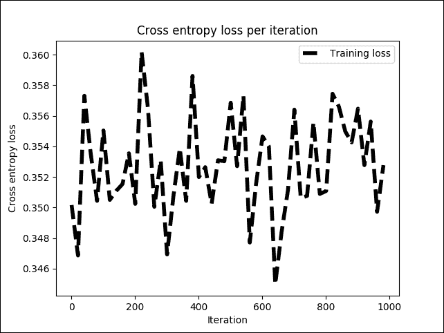

图 11：训练阶段每次迭代的交叉熵损失

上图显示交叉熵损失在 0.34 和 0.36 之间或多或少稳定，但波动很小。现在，让我们看看这对整体训练准确率有何影响：

```py
# Plot train and test accuracy
plt.subplot(222)
plt.plot(i_data, acc_list, 'r--', label='Accuracy on the training set', linewidth=1.0)
plt.title('Accuracy on the training set')
plt.xlabel('Iteration')
plt.ylabel('Accuracy')
plt.legend(loc='upper right')
plt.grid(True)
plt.show()
```

以下是前面代码的输出：

```py
>>>

```

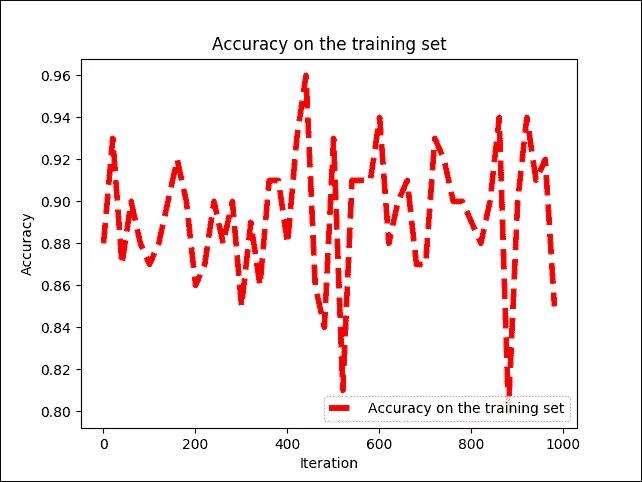

图 12：每次迭代时训练集的准确率

我们可以看到训练准确率在 79％和 96％之间波动，但不会均匀地增加或减少。解决此问题的一种可能方法是添加更多隐藏层并使用不同的优化器，例如本章前面讨论的梯度下降。我们将 dropout 概率提高到 100％，即 1.0。原因是也有相同的网络用于测试：

```py
print("Evaluating MLP on the test set...")
test_acc = sess.run(accuracy, feed_dict={X: data_test, y: labels_test, dropout_keep_prob:1.})
print ("Prediction/classification accuracy: %.3f" % (test_acc))
```

以下是上述代码的输出：

```py
>>>
Evaluating MLP on the test set...
Prediction/classification accuracy: 0.889
Session closed!

```

因此，分类准确率约为 89％。一点也不差！现在，如果需要更高的精度，我们可以使用称为深度信任网络（DBN）的另一种 DNN 架构，可以以有监督或无监督的方式进行训练。

这是在其应用中作为分类器观察 DBN 的最简单方法。如果我们有一个 DBN 分类器，那么预训练方法是以类似于自编码器的无监督方式完成的，这将在第 5 章中描述，优化 TensorFlow 自编码器，分类器以受监督的方式训练（微调），就像 MLP 中的那样。

## 深度信念网络（DBNs）

为了克服 MLP 中的过拟合问题，我们建立了一个 DBN，进行无监督的预训练，为输入获得一组不错的特征表示，然后对训练集进行微调以获得预测。网络。

虽然 MLP 的权重是随机初始化的，但 DBN 使用贪婪的逐层预训练算法通过概率生成模型初始化网络权重。这些模型由可见层和多层随机潜在变量组成，这些变量称为隐藏单元或特征检测器。

堆叠  DBN 中的 RBM，形成无向概率图模型，类似于马尔可夫随机场（MRF）：两层由可见神经元和隐藏神经元组成。

堆叠 RBM 中的顶部两层在它们之间具有无向的对称连接并形成关联存储器，而较低层从上面的层接收自上而下的定向连接：

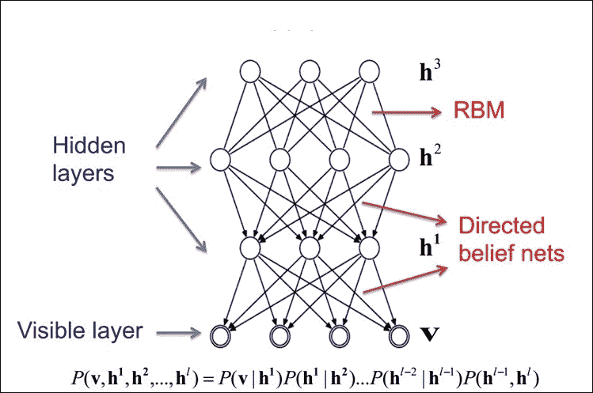

图 13：RBM 作为构建块的 DBN 的高级视图

顶部两层在它们之间具有无向的对称连接并形成关联存储器，而较低层从前面的层接收自上而下的定向连接。几个 RBM 一个接一个地堆叠以形成 DBN。

### 受限玻尔兹曼机器（RBMs）

RBM 是无向概率图模型，称为 Markov 随机场。它由两层组成。第一层由可见神经元组成，第二层由隐藏神经元组成。图 14 显示了简单 RBM 的结构。可见单元接受输入，隐藏单元是非线性特征检测器。每个可见神经元都连接到所有隐藏的神经元，但同一层中的神经元之间没有内部连接：

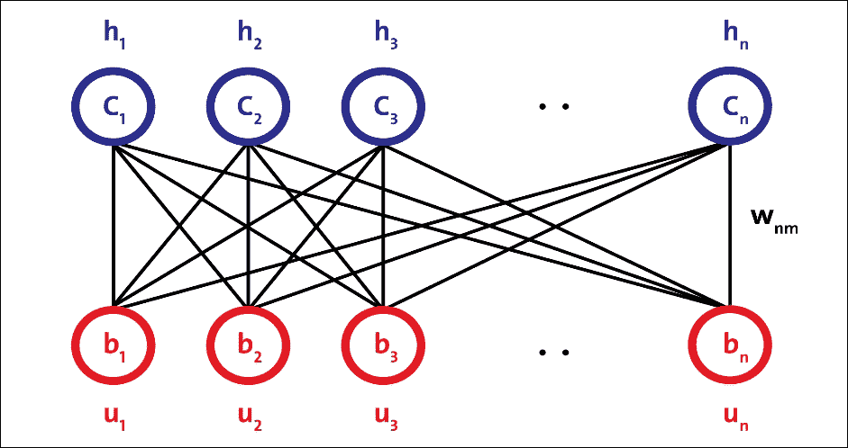

图 14：简单 RBM 的结构

图 14 中的 RBM 由 m 个可见单元组成，`V = (v[1] ... v[m])`和 n 个隐藏单元，`H = (h[1] ... h[n])`。可见单元接受 0 到 1 之间的值，隐藏单元的生成值介于 0 和 1 之间。模型的联合概率是由以下等式给出的能量函数：


在前面的等式中，i = 1 ... m，j = 1 ... n，bi 和 cj 分别是可见和隐藏单元的偏差，并且`w[ij]`是`v[i]`和`h[j]`之间的权重。模型分配给可见向量 v 的概率由下式给出：


在第二个等式中，Z 是分区函数，定义如下：


权重的学习可以通过以下等式获得  ：


在等式 4 中，学习率由`∈`定义。通常，较小的`∈`值可确保训练更加密集。但是，如果您希望网络快速学习，可以将此值设置得更高。

由于同一层中的单元之间没有连接，因此很容易计算第一项。 p（h | v）和 p（v | h）的条件分布是阶乘的，并且由以下等式中的逻辑函数给出：

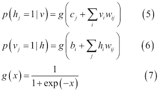

因此，样本`v[i] h[j]`是无偏的。然而，计算第二项的对数似然的计算成本是指数级的。虽然有可能得到第二项的无偏样本，但使用马尔可夫链蒙特卡罗（MCMC）的吉布斯采样，这个过程也不具有成本效益。相反，RBM 使用称为对比发散的有效近似方法。

通常，MCMC 需要许多采样步骤才能达到静止的收敛。运行吉布斯采样几步（通常是一步）足以训练一个模型，这称为对比分歧学习。对比分歧的第一步是用训练向量初始化可见单元。

下一步是使用等式 5 计算所有隐藏单元，同时使用可见单元，然后使用等式 4 从隐藏单元重建可见单元。最后，隐藏单元用重建的可见单元更新。因此，代替方程式 4，我们最终得到以下的权重学习模型：


简而言之，该过程试图减少输入数据和重建数据之间的重建误差。算法收敛需要多次参数更新迭代。迭代称为周期。输入数据被分成小批量，并且在每个小批量之后更新参数，具有参数的平均值。

最后，如前所述，RBM 最大化可见单元 p（v）的概率，其由模式和整体训练数据定义。它相当于最小化模型分布和经验数据分布之间的 [KL 散度](https://en.wikipedia.org/wiki/Kullback%E2%80%93Leibler_divergence)。

对比分歧只是这个目标函数的粗略近似，但它在实践中非常有效。虽然方便，但重建误差实际上是衡量学习进度的一个非常差的指标。考虑到这些方面，RBM 需要一些时间来收敛，但是如果你看到重建是不错的，那么你的算法效果很好。

### 构建一个简单的 DBN

单个隐藏层  RBM 无法从输入数据中提取所有特征，因为它无法对变量之间的关系进行建模。因此，一层接一个地使用多层 RBM 来提取非线性特征。在 DBN 中，首先使用输入数据训练 RBM，并且隐藏层以贪婪学习方法表示学习的特征。

第一 RBM 的这些学习特征用作第二 RBM 的输入，作为 DBN 中的另一层，如图 15 所示。类似地，第二层的学习特征用作另一层的输入。

这样，DBN 可以从输入数据中提取深度和非线性特征。最后一个 RBM 的隐藏层代表整个网络的学习特征。前面针对所有 RBM 层描述的学习特征的过程称为预训练。

### 无监督的预训练

假设您要处理复杂任务，您没有多少标记的训练数据。很难找到合适的 DNN 实现或架构来进行训练并用于预测分析。然而，如果您有大量未标记的训练数据，您可以尝试逐层训练层，从最低层开始，然后使用无监督的特征检测器算法向上移动。这就是 RBM（图 15）或自编码器（图 16）的工作原理。

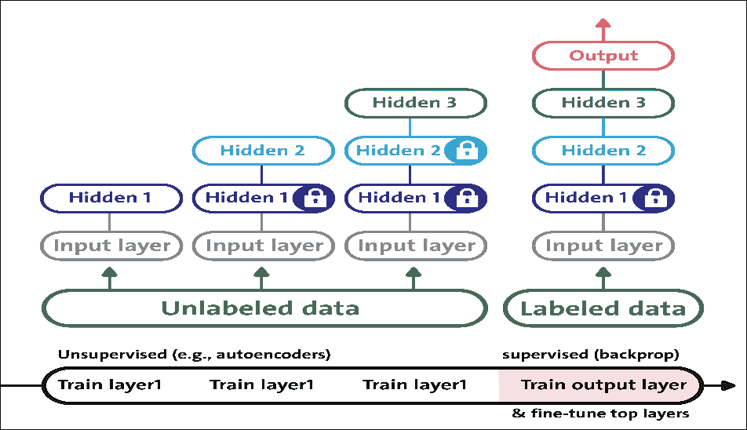

图 15：使用自编码器在 DBN 中进行无监督的预训练

当您有一个复杂的任务需要解决时，无监督的预训练仍然是一个不错的选择，没有类似的模型可以重复使用，并且标记很少的训练数据，但是大量未标记的训练数据。目前的趋势是使用自编码器而不是 RBM;但是，对于下一节中的示例，RBM 将用于简化。读者也可以尝试使用自编码器而不是 RBM。

预训练是一种无监督的学习过程。在预训练之后，通过在最后一个 RBM 层的顶部添加标记层来执行网络的微调。此步骤是受监督的学习过程。无监督的预训练步骤尝试查找网络权重：

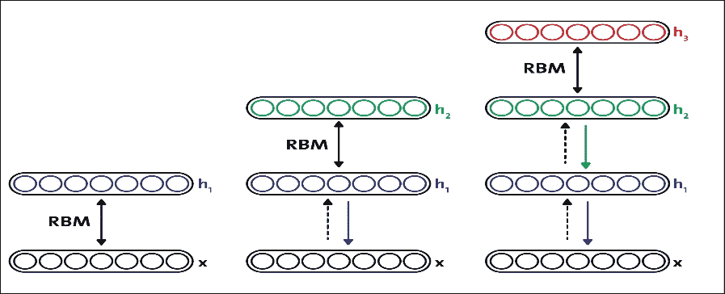

图 16：通过构建具有 RBM 堆栈的简单 DBN 在 DBN 中进行无监督预训练

### 监督微调

在监督学习阶段（也称为监督微调）中，不是随机初始化网络权重，而是使用在预训练步骤中计算的权重来初始化它们。这样，当使用监督梯度下降时，DBN 可以避免收敛到局部最小值。

如前所述，使用 RBM 堆栈，DBN 可以构造如下：

*   使用参数`W[1]`训练底部 RBM（第一个 RBM）
*   将第二层权重初始化为`W[2] = W[1]^T`，这可确保 DBN 至少与我们的基础 RBM 一样好

因此，将这些步骤放在一起，图 17 显示了由三个 RBM 组成的简单 DBN 的构造：

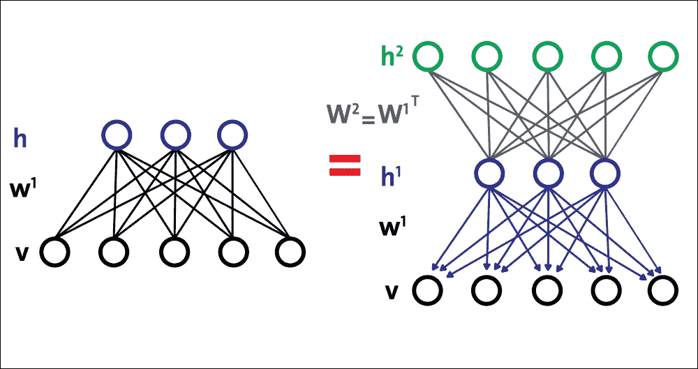

图 17：使用多个 RBM 构建简单的 DBN

现在，当调整 DBN 以获得更好的预测准确率时，我们应该调整几个超参数，以便 DBN 通过解开和改进`W[2]`来拟合训练数据。综上所述，我们有了创建基于 DBN 的分类器或回归器的概念工作流程。

现在我们已经有足够的理论背景来介绍如何使用几个 RBM 构建 DBN，现在是时候将我们的理论应用于实践中了。在下一节中，我们将了解如何开发用于预测分析的监督 DBN 分类器。

## 使用 TensorFlow 实现 DBN 以进行客户订阅评估

在银行营销数据集的前一个示例中，我们使用 MLP 观察到大约 89％的分类准确率。我们还将原始数据集标准化，然后将其提供给 MLP。在本节中，我们将了解如何为基于 DBN 的预测模型使用相同的数据集。

我们将使用 Md.Rezaul Karim 最近出版的书籍 Predictive Analytics with TensorFlow 的 DBN 实现，可以从 [GitHub](https://github.com/PacktPublishing/Predictive-Analytics-with-TensorFlow/tree/master/Chapter07/DBN) 下载。

前面提到的实现是基于 RBM 的简单，干净，快速的 DBN 实现，并且基于 NumPy 和 TensorFlow 库，以便利用 GPU 计算。该库基于以下两篇研究论文实现：

*   Geoffrey E. Hinton，Simon Osindero 和 Yee-Whye Teh 的深度信念网快速学习算法。 Neural Computation 18.7（2006）：1527-1554。
*   训练受限制的玻尔兹曼机器：简介，Asja Fischer 和 Christian Igel。模式识别 47.1（2014）：25-39。

我们将看到如何以无监督的方式训练 RBM，然后我们将以有监督的方式训练网络。简而言之，有几个步骤需要遵循。主分类器是`classification_demo.py`。

### 提示

虽然在以监督和无监督的方式训练 DBN 时数据集不是那么大或高维度，但是在训练时间中会有如此多的计算，这需要巨大的资源。然而，RBM 需要大量时间来收敛。因此，我建议读者在 GPU 上进行训练，至少拥有 32 GB 的 RAM 和一个 corei7 处理器。

我们将从加载所需的模块和库开始：

```py
import numpy as np
import pandas as pd
from sklearn.datasets import load_digits
from sklearn.model_selection import train_test_split
from sklearn.metrics.classification import accuracy_score
from sklearn.metrics import precision_recall_fscore_support
from sklearn.metrics import confusion_matrix
import itertools
from tf_models import SupervisedDBNClassification
import matplotlib.pyplot as plt
```

然后，我们加载前一个 MLP 示例中使​​用的已经正则化的数据集：

```py
FILE_PATH = '../input/bank_normalized.csv'
raw_data = pd.read_csv(FILE_PATH)
```

在前面的代码中，我们使用了 pandas `read_csv()`方法并创建了一个`DataFrame`。现在，下一个任务是按如下方式扩展特征和标签：

```py
Y_LABEL = 'y'
KEYS = [i for i in raw_data.keys().tolist() if i != Y_LABEL]
X = raw_data[KEYS].get_values()
Y = raw_data[Y_LABEL].get_values()
class_names = list(raw_data.columns.values)
print(class_names)
```

在前面的行中，我们已经分离了特征和标签。这些特征存储在`X`中，标签位于`Y`中。接下来的任务是将它们分成训练（75％）和测试集（25％），如下所示：

```py
X_train, X_test, Y_train, Y_test = train_test_split(X, Y, test_size=0.25, random_state=100)
```

现在我们已经有了训练和测试集，我们可以直接进入 DBN 训练步骤。但是，首先我们需要实例化 DBN。我们将以受监督的方式进行分类，但我们需要为此 DNN 架构提供超参数：

```py
classifier = SupervisedDBNClassification(hidden_layers_structure=[64, 64],learning_rate_rbm=0.05,learning_rate=0.01,n_epochs_rbm=10,n_iter_backprop=100,batch_size=32,activation_function='relu',dropout_p=0.2)
```

在前面的代码段中，`n_epochs_rbm`是预训练（无监督）和`n_iter_backprop`用于监督微调的周期数。尽管如此，我们已经为这两个阶段定义了两个单独的学习率，分别使用`learning_rate_rbm`和`learning_rate`。

不过，我们将在本节后面描述`SupervisedDBNClassification`的这个类实现。

该库具有支持 sigmoid，ReLU 和 tanh 激活函数的实现。此外，它利用 l2 正则化来避免过拟合。我们将按如下方式进行实际拟合：

```py
classifier.fit(X_train, Y_train)
```

如果一切顺利，你应该在控制台上观察到以下进展：

```py
[START] Pre-training step:
>> Epoch 1 finished     RBM Reconstruction error 1.681226
….
>> Epoch 3 finished     RBM Reconstruction error 4.926415
>> Epoch 5 finished     RBM Reconstruction error 7.185334
…
>> Epoch 7 finished     RBM Reconstruction error 37.734962
>> Epoch 8 finished      RBM Reconstruction error 467.182892
….
>> Epoch 10 finished      RBM Reconstruction error 938.583801
[END] Pre-training step
[START] Fine tuning step:
>> Epoch 0 finished     ANN training loss 0.316619
>> Epoch 1 finished     ANN training loss 0.311203
>> Epoch 2 finished     ANN training loss 0.308707
….
>> Epoch 98 finished     ANN training loss 0.288299
>>        Epoch        99         finished                   ANN         training         loss        0.288900

```

由于 RBM 的权重是随机初始化的，因此重建和原始输入之间的差异通常很大。

从技术上讲，我们可以将重建误差视为重建值与输入值之间的差异。然后，在迭代学习过程中，将该错误反向传播 RBM 的权重几次，直到达到最小误差。

然而，在我们的情况下，重建达到 938，这不是那么大（即，不是无限），所以我们仍然可以期望良好的准确率。无论如何，经过 100 次迭代后，显示每个周期训练光泽的微调图如下：

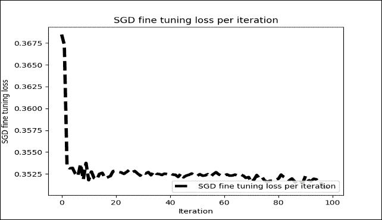

图 18：每次迭代的 SGD 微调损失（仅 100 次迭代）

然而，当我重复前面的训练并微调 1000 个周期时，我没有看到训练损失有任何显着改善：

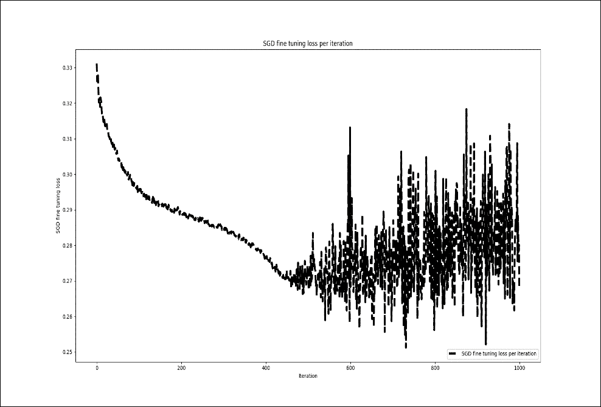

图 19：每次迭代的 SGD 微调损失（1000 次迭代）

这是监督的 DBN 分类器的实现。此类为分类问题实现 DBN。它将网络输出转换为原始标签。在对标签映射执行索引之后，它还需要网络参数并返回列表。

然后，该类预测给定数据中每个样本的类的概率分布，并返回字典列表（每个样本一个）。最后，它附加了 softmax 线性分类器作为输出层：

```py
class SupervisedDBNClassification(TensorFlowAbstractSupervisedDBN, ClassifierMixin):
    def _build_model(self, weights=None):
        super(SupervisedDBNClassification, self)._build_model(weights)
        self.output = tf.nn.softmax(self.y)
        self.cost_function = tf.reduce_mean(tf.nn.softmax_cross_entropy_with_logits_v2(logits=self.y, labels=self.y_))
        self.train_step = self.optimizer.minimize(self.cost_function)
    @classmethod

    def _get_param_names(cls):
        return super(SupervisedDBNClassification, cls)._get_param_names() + ['label_to_idx_map', 'idx_to_label_map']

    @classmethod
    def from_dict(cls, dct_to_load):
        label_to_idx_map = dct_to_load.pop('label_to_idx_map')
        idx_to_label_map = dct_to_load.pop('idx_to_label_map')
        instance = super(SupervisedDBNClassification, cls).from_dict(dct_to_load)
        setattr(instance, 'label_to_idx_map', label_to_idx_map)
        setattr(instance, 'idx_to_label_map', idx_to_label_map)
        return instance

    def _transform_labels_to_network_format(self, labels):
        """
        Converts network output to original labels.
        :param indexes: array-like, shape = (n_samples, )
        :return:
        """
        new_labels, label_to_idx_map, idx_to_label_map = to_categorical(labels, self.num_classes)
        self.label_to_idx_map = label_to_idx_map
        self.idx_to_label_map = idx_to_label_map
        return new_labels

    def _transform_network_format_to_labels(self, indexes):
        return list(map(lambda idx: self.idx_to_label_map[idx], indexes))

    def predict(self, X):
        probs = self.predict_proba(X)
        indexes = np.argmax(probs, axis=1)
        return self._transform_network_format_to_labels(indexes)

    def predict_proba(self, X):
        """
        Predicts probability distribution of classes for each sample in the given data.
        :param X: array-like, shape = (n_samples, n_features)
        :return:
        """
        return super(SupervisedDBNClassification, self)._compute_output_units_matrix(X)

    def predict_proba_dict(self, X):
        """
        Predicts probability distribution of classes for each sample in the given data.
        Returns a list of dictionaries, one per sample. Each dict contains {label_1: prob_1, ..., label_j: prob_j}
        :param X: array-like, shape = (n_samples, n_features)
        :return:
        """
        if len(X.shape) == 1:  # It is a single sample
            X = np.expand_dims(X, 0)
        predicted_probs = self.predict_proba(X)
        result = []
        num_of_data, num_of_labels = predicted_probs.shape
        for i in range(num_of_data):
            # key : label
            # value : predicted probability
            dict_prob = {}
            for j in range(num_of_labels):
                dict_prob[self.idx_to_label_map[j]] = predicted_probs[i][j]
            result.append(dict_prob)
        return result
    def _determine_num_output_neurons(self, labels):
        return len(np.unique(labels))
```

正如我们在前面的例子和运行部分中提到的那样，微调神经网络的参数是一个棘手的过程。有很多不同的方法，但我的知识并没有一刀切的方法。然而，通过前面的组合，我收到了更好的分类结果。另一个要选择的重要参数是学习率。根据您的模型调整学习率是一种可以采取的方法，以减少训练时间，同时避免局部最小化。在这里，我想讨论一些能够帮助我提高预测准确率的技巧，不仅适用于此应用，也适用于其他应用。

现在我们已经建立了模型，现在是评估其表现的时候了。为了评估分类准确率，我们将使用几个表现指标，如`precision`，`recall`和`f1 score`。此外，我们将绘制混淆矩阵，以观察与真实标签相对应的预测标签。首先，让我们计算预测精度如下：

```py
Y_pred = classifier.predict(X_test)
print('Accuracy: %f' % accuracy_score(Y_test, Y_pred))
```

接下来，我们需要计算分类的`precision`，`recall`和`f1 score`：

```py
p, r, f, s = precision_recall_fscore_support(Y_test, Y_pred, average='weighted')
print('Precision:', p)
print('Recall:', r)
print('F1-score:', f)
```

以下是上述代码的输出：

```py
>>>
Accuracy: 0.900554
Precision: 0.8824140209830381
Recall: 0.9005535592891133
F1-score: 0.8767190584424599

```

太棒了！使用我们的 DBN 实现，我们解决了与使用 MLP 相同的分类问题。尽管如此，与 MLP 相比，我们设法获得了稍微更好的准确率。

现在，如果要解决回归问题，要预测的标签是连续的，则必须使用`SupervisedDBNRegression()`函数进行此实现。 DBN 文件夹中的回归脚本（即`regression_demo.py`）也可用于执行回归操作。

但是，使用专门为回归 y 准备的另一个数据集将是更好的主意。您需要做的就是准备数据集，以便基于 TensorFlow 的 DBN 可以使用它。因此，为了最小化演示，我使用房价：高级回归技术数据集来预测房价。

# 调整超参数和高级 FFNN

神经网络的灵活性也是它们的主要缺点之一：有很多超参数可以调整。即使在简单的 MLP 中，您也可以更改层数，每层神经元的数量以及每层中使用的激活函数的类型。您还可以更改权重初始化逻辑，退出保持概率等。

另外，FFNN 中的一些常见问题，例如梯度消失问题，以及选择最合适的激活函数，学习率和优化器，是最重要的。

## 调整 FFNN 超参数

超参数是不在估计器中直接学习的参数。有可能并建议您在超参数空间中搜索[最佳交叉验证](http://scikit-learn.org/stable/modules/cross_validation.html#cross-validation)得分。在构造估计器时提供的任何参数可以以这种方式优化。现在，问题是：您如何知道超参数的哪种组合最适合您的任务？当然，您可以使用网格搜索和交叉验证来为线性机器学习模型找到正确的超参数。

但是，对于 DNN，有许多超参数可供调整。由于在大型数据集上训练神经网络需要花费大量时间，因此您只能在合理的时间内探索超参数空间的一小部分。以下是一些可以遵循的见解。

此外，当然，正如我所说，您可以使用网格搜索或随机搜索，通过交叉验证，为线性机器学习模型找到正确的超参数。我们将在本节后面看到一些可能的详尽和随机网格搜索和交叉验证方法。

### 隐藏层数

对于许多问题，你可以从一个或两个隐藏层开始，这个设置可以很好地使用两个隐藏层，具有相同的神经元总数（见下文以了解一些神经元），训练时间大致相同。现在让我们看一些关于设置隐藏层数的朴素估计：

*   0：仅能表示线性可分离函数或决策
*   1：可以近似包含从一个有限空间到另一个有限空间的连续映射的任何函数
*   2：可以用任意精度表示任意决策边界，具有合理的激活函数，并且可以近似任何平滑映射到任何精度

但是，对于更复杂的问题，您可以逐渐增加隐藏层的数量，直到您开始过拟合训练集。非常复杂的任务，例如大图像分类或语音识别，通常需要具有数十层的网络，并且它们需要大量的训练数据。

不过，您可以尝试逐渐增加神经元的数量，直到网络开始过拟合。这意味着不会导致过拟合的隐藏神经元数量的上限是：


在上面的等式中：

`N[i]`为输入神经元的数量

`N[o]`为输出神经元的数量

`N[s]`为训练数据集中的样本数


=任意比例因子通常为 2-10。

请注意，上述等式不是来自任何研究，而是来自我的个人工作经验。但是，对于自动程序，您将以 2 的 alpha 值开始，即训练数据的自由度是模型的两倍，如果训练数据的误差明显小于 10，则可以达到 10。用于交叉验证数据集。

### 每个隐藏层的神经元数量

显然，输入和输出层中神经元的数量取决于您的任务所需的输入和输出类型。例如，如果您的数据集的形状为 28x28，则它应该具有大小为 784 的输入神经元，并且输出神经元应该等于要预测的类的数量。

我们将在下一个例子中看到它如何在实践中工作，使用 MLP，其中将有四个具有 256 个神经元的隐藏层（只有一个超参数可以调整，而不是每层一个）。就像层数一样，您可以尝试逐渐增加神经元的数量，直到网络开始过拟合。

有一些经验导出的经验法则，其中最常用的是：“隐藏层的最佳大小通常在输入的大小和输出层的大小之间。”

总之，对于大多数问题，通过仅使用两个规则设置隐藏层配置，您可能可以获得不错的表现（即使没有第二个优化步骤）：

*   隐藏层的数量等于一
*   该层中的神经元数量是输入和输出层中神经元的平均值

然而，就像层数一样，你可以尝试逐渐增加神经元的数量，直到网络开始过拟合。

### 权重和偏差初始化

正如我们将在下一个示例中看到的那样，初始化权重和偏差，隐藏层是一个重要的超参数，需要注意：

*   不要做所有零初始化：一个听起来合理的想法可能是将所有初始权重设置为零，但它在实践中不起作用。这是因为如果网络中的每个神经元计算相同的输出，如果它们的权重被初始化为相同，则神经元之间将不存在不对称的来源。
*   小随机数：也可以将神经元的权重初始化为小数，但不能相同为零。或者，可以使用从均匀分布中抽取的小数字。
*   初始化偏差：通常将偏差初始化为零，因为权重中的小随机数提供不对称性破坏。将偏差设置为一个小的常量值，例如所有偏差的 0.01，确保所有 ReLU 单元都可以传播一些梯度。但是，它既没有表现良好，也没有表现出持续改进因此，建议坚持使用零。

### 选择最合适的优化器

因为在 FFNN 中，  目标函数之一是最小化评估成本，我们必须定义一个优化器。我们已经看到了如何使用[`tf.train.AdamOptimizer`](https://www.tensorflow.org/api_docs/python/tf/train/AdamOptimizer)。[`Tensorflow tf.train`](https://www.tensorflow.org/api_docs/python/tf/train)提供了一组有助于训练模型的类和函数。就个人而言，我发现 Adam 优化器在实践中对我很有效，而不必考虑学习率等等。

对于大多数情况，我们可以利用 Adam，但有时我们可以采用实现的`RMSPropOptimizer`函数，这是梯度下降的高级形式。 `RMSPropOptimizer`函数实现`RMSProp`算法。

`RMSPropOptimizer`函数还将学习率除以指数衰减的平方梯度平均值。衰减参数的建议设置值为`0.9`，而学习率的良好默认值为`0.001`：

```py
optimizer = tf.train.RMSPropOptimizer(0.001, 0.9).minimize(cost_op)
```

使用最常见的优化器 SGD，学习率必须随`1/T`缩放才能获得收敛，其中`T`是迭代次数。 `RMSProp`尝试通过调整步长来自动克服此限制，以使步长与梯度的比例相同。

因此，如果您正在训练神经网络，但计算梯度是必需的，使用`tf.train.RMSPropOptimizer()`将是在小批量设置中学习的更快方式。研究人员还建议在训练 CNN 等深层网络时使用 Momentum 优化器。

最后，如果您想通过设置这些优化器来玩游戏，您只需要更改一行。由于时间限制，我没有尝试过所有这些。然而，根据 Sebastian Ruder 最近的一篇研究论文（见[此链接](https://arxiv.org/abs/1609.04747)），自适应学习率方法的优化者，`Adagrad`，`Adadelta` ，`RMSprop`和`Adam`是最合适的，并为这些情况提供最佳收敛。

### GridSearch 和随机搜索超参数调整

采样搜索的两种通用候选方法在其他基于 Python 的机器学习库（如 Scikit-learn）中提供。对于给定值，[`GridSearchCV`](http://scikit-learn.org/stable/modules/generated/sklearn.model_selection.GridSearchCV.html#sklearn.model_selection.GridSearchCV)详尽考虑所有参数组合，而[`RandomizedSearchCV`](http://scikit-learn.org/stable/modules/generated/sklearn.model_selection.RandomizedSearchCV.html#sklearn.model_selection.RandomizedSearchCV)可以从具有指定分布的参数空间中对给定数量的候选进行采样。

`GridSearchCV`是自动测试和优化超参数的好方法。我经常在 Scikit-learn 中使用它。然而，`TensorFlowEstimator`优化`learning_rate`，`batch_size`等等还不是那么简单。而且，正如我所说，我们经常调整这么多超参数以获得最佳结果。不过，[我发现这篇文章对于学习如何调整上述超参数非常有用](https://machinelearningmastery.com/grid-search-hyperparameters-deep-learning-models-python-keras/)。

随机搜索和网格搜索探索完全相同的参数空间。参数设置的结果非常相似，而随机搜索的运行时间则大大降低。

一些基准测试（例如[此链接](http://scikit-learn.org/stable/auto_examples/model_selection/)）已经报告了随机搜索的表现略差，尽管这很可能是一种噪音效应并且不会延续到坚持不懈的测试集。

## 正则化

有几种方法可以控制 DNN 的训练，以防止在训练阶段过拟合，例如，L2 / L1 正则化，最大范数约束和退出：

*   L2 正则化：这可能是最常见的正则化形式。使用梯度下降参数更新，L2 正则化表示每个权重将线性地向零衰减。
*   L1 正则化：对于每个权重 w，我们将项`λ|w|`添加到目标。然而，  也可以组合 L1 和 L2 正则化以实现弹性网络正则化。
*   最大范数约束：这强制了每个隐藏层神经元的权重向量的大小的绝对上限。可以进一步使用投影的梯度下降来强制约束。

消失梯度问题出现在非常深的神经网络（通常是 RNN，它将有一个专门的章节），它使用激活函数，其梯度往往很小（在 0 到 1 的范围内）。

由于这些小梯度在反向传播期间进一步增加，因此它们倾向于在整个层中“消失”，从而阻止网络学习远程依赖性。解决这个问题的常用方法是使用激活函数，如线性单元（又名 ReLU），它不会受到小梯度的影响。我们将看到一种改进的 RNN 变体，称为长短期记忆  （又名 LSTM），它可以解决这个问题。我们将在第 5 章，优化 TensorFlow 自编码器中看到关于该主题的更详细讨论。

尽管如此，我们已经看到最后的架构更改提高了模型的准确率，但我们可以通过使用 ReLU 更改 sigmoid 激活函数来做得更好，如下所示：


图 20：ReLU 函数

ReLU 单元计算函数`f(x) = max(0, x)`。 ReLU 计算速度快，因为它不需要任何指数计算，例如 sigmoid 或 tanh 激活所需的计算。此外，与 sigmoid / tanh 函数相比，发现它大大加速了随机梯度下降的收敛。要使用 ReLU 函数，我们只需在先前实现的模型中更改前四个层的以下定义：

第一层输出：

```py
Y1 = tf.nn.relu(tf.matmul(XX, W1) + B1) # Output from layer 1
```

第二层输出：

```py
Y2 = tf.nn.relu(tf.matmul(Y1, W2) + B2) # Output from layer 2
```

第三层输出：

```py
Y3 = tf.nn.relu(tf.matmul(Y2, W3) + B3) # Output from layer 3
```

第四层输出：

```py
Y4 = tf.nn.relu(tf.matmul(Y3, W4) + B4) # Output from layer 4
```

输出层：

```py
Ylogits = tf.matmul(Y4, W5) + B5 # computing the logits
Y = tf.nn.softmax(Ylogits) # output from layer 5
```

当然，`tf.nn.relu`是 TensorFlow 的 ReLU 实现。模型的准确率几乎达到 98％，您可以看到运行网络：

```py
>>>
Loading data/train-images-idx3-ubyte.mnist 
Loading data/train-labels-idx1-ubyte.mnist Loading data/t10k-images-idx3-ubyte.mnist 
Loading data/t10k-labels-idx1-ubyte.mnist 
Epoch:	0
Epoch:	1
Epoch:	2
Epoch:	
3
Epoch:	4
Epoch:	5
Epoch:	6
Epoch:	7
Epoch:	8
Epoch:	9
Accuracy:0.9789 
done
>>>

```

关注 TensorBoard 分析，从源文件执行的文件夹中，您应该数字：

```py
$> Tensorboard --logdir = 'log_relu' # Don't put space before or after '='
```

然后在 localhost 上打开浏览器以显示 TensorBoard 的起始页面。在下图中，我们显示了趋势对训练集示例数量的准确率：


图 21：训练集上的准确率函数

在大约 1000 个示例之后，您可以很容易地看到在不良的初始趋势之后，准确率如何开始快速渐进式改进。

## Dropout 优化

在使用 DNN 时，我们需要另一个占位符用于 dropout ，这是一个需要调整的超参数。它仅通过以某种概率保持神经元活动（比如`p > 1.0`）或者将其设置为零来实现。这个想法是在测试时使用单个神经网络而不会 dropout。该网络的权重是训练权重的缩小版本。如果在训练期间使用`dropout_keep_prob < 1.0`保留单元，则在测试时将该单元的输出权重乘以 p。

在学习阶段，与下一层的连接可以限于神经元的子集，以减少要更新的权重。这种学习优化技术称为 dropout。因此，dropout 是一种用于减少具有许多层和/或神经元的网络中的过拟合的技术。通常，dropout 层位于具有大量可训练神经元的层之后。

该技术允许将前一层的一定百分比的神经元设置为 0，然后排除激活。神经元激活被设置为 0 的概率由层内的 dropout 率参数通过 0 和 1 之间的数字表示。实际上，神经元的激活保持等于 dropout 率的概率;否则，它被丢弃，即设置为 0。


图 22：Dropout 表示

通过这种方式，对于每个输入，网络拥有与前一个略有不同的架构。即使这些架构具有相同的权重，一些连接也是有效的，有些连接不是每次都以不同的方式。上图显示了 dropout 的工作原理：每个隐藏单元都是从网络中随机省略的，概率为 p。

但需要注意的是，每个训练实例的选定 dropout 单元不同;这就是为什么这更像是一个训练问题。dropout 可以被视为在大量不同的神经网络中执行模型平均的有效方式，其中可以以比建筑问题低得多的计算成本来避免过拟合。dropout 降低了神经元依赖于其他神经元存在的可能性。通过这种方式，它被迫更多地了解强大的功能，并且它们与其他不同神经元的联系非常有用。

允许构建 dropout 层的 TensorFlow 函数是`tf.nn.dropout`。此函数的输入是前一层的输出，并且 dropout 参数`tf.nn.dropout`返回与输入张量相同大小的输出张量。该模型的实现遵循与五层网络相同的规则。在这种情况下，我们必须在一层和另一层之间插入 dropout 函数：

```py
pkeep = tf.placeholder(tf.float32)

Y1 = tf.nn.relu(tf.matmul(XX, W1) + B1) # Output from layer 1
Y1d = tf.nn.dropout(Y1, pkeep)

Y2 = tf.nn.relu(tf.matmul(Y1, W2) + B2) # Output from layer 2
Y2d = tf.nn.dropout(Y2, pkeep)

Y3 = tf.nn.relu(tf.matmul(Y2, W3) + B3) # Output from layer 3
Y3d = tf.nn.dropout(Y3, pkeep)

Y4 = tf.nn.relu(tf.matmul(Y3, W4) + B4) # Output from layer 4
Y4d = tf.nn.dropout(Y4, pkeep)

Ylogits = tf.matmul(Y4d, W5) + B5 # computing the logits
Y = tf.nn.softmax(Ylogits) # output from layer 5
```

退出优化产生以下结果：

```py
>>>
Loading data/train-images-idx3-ubyte.mnist Loading data/train-labels-idx1-ubyte.mnist Loading data/t10k-images-idx3-ubyte.mnist Loading data/t10k-labels-idx1-ubyte.mnist Epoch:	0
Epoch:	1
Epoch:	2
Epoch:	3
Epoch:	4
Epoch:	5
Epoch:	6
Epoch:
	7
Epoch:	8
Epoch:	9
Accuracy:	0.9666 done
>>>

```

尽管有这种实现，  之前的 ReLU 网络仍然更好，但您可以尝试更改网络参数以提高模型的准确率。此外，由于这是一个很小的网络，我们处理的是小规模的数据集，当您处理具有更复杂网络的大规模高维数据集时，您会发现 dropout 可能非常重要。我们将在下一章中看到一些动手实例。

现在，要了解 dropout 优化的效果，让我们开始 TensorBoard 分析。只需键入以下内容：

```py
$> Tensorboard --logdir=' log_softmax_relu_dropout/'
```

下图显示了作为训练示例函数的精度成本函数：


图 23：a）dropout 优化的准确率，b）训练集的成本函数

在上图中，我们显示成本函数作为训练样例的函数。这两种趋势都是我们所期望的：随着训练样例的增加，准确率会提高，而成本函数会随着迭代次数的增加而减

# 总结

我们已经了解了如何实现 FFNN 架构，其特征在于一组输入单元，一组输出单元以及一个或多个连接该输出的输入级别的隐藏单元。我们已经看到如何组织网络层，以便级别之间的连接是完全的并且在单个方向上：每个单元从前一层的所有单元接收信号并发送其输出值，适当地权衡到所有单元的下一层。

我们还看到了如何为每个层定义激活函数（例如，sigmoid，ReLU，tanh 和 softmax），其中激活函数的选择取决于架构和要解决的问题。

然后，我们实现了四种不同的 FFNN 模型。第一个模型有一个隐藏层，具有 softmax 激活函数。其他三个更复杂的模型总共有五个隐藏层，但具有不同的激活函数。我们还看到了如何使用 TensorFlow 实现深度 MLP 和 DBN，以解决分类任务。使用这些实现，我们设法达到了 90％以上的准确率。最后，我们讨论了如何调整 DNN 的超参数以获得更好和更优化的表现。

虽然常规的 FFNN（例如 MLP）适用于小图像（例如，MNIST 或 CIFAR-10），但由于需要大量参数，它会因较大的图像而分解。例如，100×100 图像具有 10,000 个像素，并且如果第一层仅具有 1,000 个神经元（其已经严格限制传输到下一层的信息量），则这意味着 1000 万个连接。另外，这仅适用于第一层。

重要的是，DNN 不知道像素的组织方式，因此不知道附近的像素是否接近。 CNN 的架构嵌入了这种先验知识。较低层通常识别图像的单元域中的特征，而较高层将较低层特征组合成较大特征。这适用于大多数自然图像，与 DNN 相比，CNN 具有决定性的先机性。

在下一章中，我们将进一步探讨神经网络模型的复杂性，引入 CNN，这可能对深度学习技术产生重大影响。我们将研究主要功能并查看一些实现示例。

