# 四、CNN 实战

以前面提到的`5×5`输入矩阵为例，CNN 的输入层由 25 个神经元（`5×5`）组成，其任务是获取与每个像素对应的输入值并将其转移到下一层。

在多层网络中，输入层中所有神经元的输出将连接到隐藏层（完全连接层）中的每个神经元。然而，在 CNN 网络中，上面定义的连接方案和我们要描述的卷积层是显着不同的。正如您可能猜到的，这是层的主要类型：在 CNN 中使用这些层中的一个或多个是必不可少的。

在卷积层中，每个神经元连接到输入区域的某个区域，称为感受野。例如，使用`3×3`内核滤波器，每个神经元将具有偏置并且 9 个权重（`3×3`）连接到单个感受野。为了有效地识别图像，我们需要将各种不同的内核过滤器应用于相同的感受野，因为每个过滤器应该识别来自图像的不同特征。识别相同特征的神经元集定义了单个特征映射。

下图显示了运行中的 CNN 架构：`28×28`输入图像将由一个由`28x28x32`特征映射组成的卷积层进行分析。该图还显示了一个感受野和一个`3×3`内核过滤器：

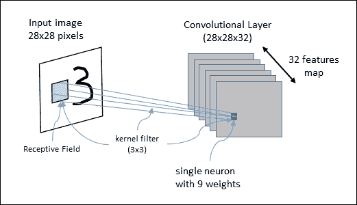

图 5：CNN 正在运行中

CNN 可以由级联连接的若干卷积层组成。每个卷积层的输出是一组特征映射（每个都由单个内核过滤器生成）。这些矩阵中的每一个都定义了将由下一层使用的新输入。

通常，在 CNN 中，每个神经元产生高达激活阈值的输出，该激活阈值与输入成比例并且不受限制。

CNN 还使用位于卷积层之后的池化层。池化层将卷积区域划分为子区域。然后，池化层选择单个代表值（最大池化或平均池化）以减少后续层的计算时间并增加特征相对于其空间位置的稳健性。卷积网络的最后一层通常是完全连接的网络，具有用于输出层的 softmax 激活函数。在接下来的几节中，将详细分析最重要的 CNN 的架构。

# LeNet5

LeNet5 CNN 架构由 Yann LeCun 于 1998 年发明，是第一个 CNN。它是一个多层前馈网络，专门用于对手写数字进行分类。它被用于 LeCun 的实验，由七层组成，包含可训练的权重。 LeNet5 架构如下所示：


图 6：LeNet5 网络

LeNet5 架构由三个卷积层和两个交替序列池化层组成。最后两层对应于传统的完全连接的神经网络，即完全连接的层，后面是输出层。输出层的主要功能是计算输入向量和参数向量之间的欧几里德距离。输出函数识别输入模式和我们模型的测量值之间的差异。输出保持最小，以实现最佳模型。因此，完全连接的层被配置为使得输入模式和我们的模型的测量之间的差异最小化。虽然它在 MNIST 数据集上表现良好，但是在具有更高分辨率和更多类别的更多图像的数据集上表现下降。

### 注意

有关 LeNet 系列模型的基本参考，请参见[此链接](http://yann.lecun.com/exdb/lenet/index.html)。

# 逐步实现 LeNet-5

在本节中，我们将学习如何构建 LeNet-5 架构来对 MNIST 数据集中的图像进行分类。下图显示了数据如何在前两个卷积层中流动：使用滤波器权重在第一个卷积层中处理输入图像。这导致 32 个新图像，一个用于卷积层中的每个滤波器。图像也通过合并操作进行下采样，因此图像分辨率从`28×28`降低到`14×14`。然后在第二卷积层中处理这 32 个较小的图像。我们需要为这 32 个图像中的每一个再次使用滤波器权重，并且我们需要该层的每个输出通道的滤波器权重。通过合并操作再次对图像进行下采样，使得图像分辨率从`14×14`减小到`7×7`。此卷积层的特征总数为 64。


图 7：前两个卷积层的数据流

通过（`3×3`）第三卷积层再次过滤 64 个结果图像。没有对该层应用池操作。第三卷积层的输出是`128×7×7`像素图像。然后将这些图像展平为单个向量，长度为`4×4×128 = 2048`，其用作完全连接层的输入。

LeNet-5 的输出层由 625 个神经元作为输入（即完全连接层的输出）和 10 个神经元作为输出，用于确定图像的类别，该数字在图片。

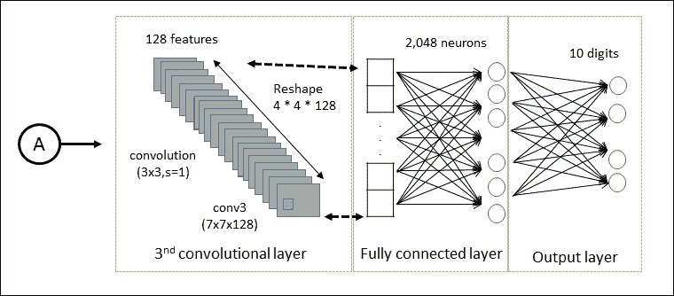

图 8：最后三个卷积层的数据流

卷积滤波器最初是随机选择的。输入图像的预测类和实际类之间的差异被称为成本函数，并且这使我们的网络超出训练数据。然后，优化器会自动通过 CNN 传播此成本函数，并更新过滤器权重以改善分类错误。这反复进行数千次，直到分类误差足够低。

现在让我们详细看看如何编写我们的第一个 CNN。让我们首先导入我们实现所需的 TensorFlow 库：

```py
import tensorflow as tf
import numpy as np
from tensorflow.examples.tutorials.mnist import input_data
```

设置以下参数。它们表示在训练阶段（`128`）和测试阶段（`256`）使用的样本数量：

```py
batch_size = 128
test_size = 256
```

当我们定义以下参数时，该值为`28`，因为 MNIST 图像的高度和宽度为`28`像素：

```py
img_size = 28
```

对于类的数量，值`10`意味着我们将为每个 0 到 9 位数设置一个类：

```py
num_classes = 10
```

为输入图像定义占位符变量`X`。该张量的数据类型设置为`float32`，形状设置为`[None, img_size, img_size, 1]`，其中`None`表示张量可以保存任意数量的图像：

```py
X = tf.placeholder("float", [None, img_size, img_size, 1])
```

然后我们为占位符变量`X`中的输入图像正确关联的标签设置另一个占位符变量`Y`。此占位符变量的形状为`[None, num_classes]`，这意味着它可以包含任意数量的标签。每个标签都是长度为`num_classes`的向量，在这种情况下为`10`：

```py
Y = tf.placeholder("float", [None, num_classes])
```

我们收集`MNIST`数据，这些数据将被复制到数据文件夹中：

```py
mnist = input_data.read_data_sets("MNIST-data", one_hot=True)
```

我们构建训练数据集（`trX`，`trY`）和测试网络（`teX`，`teY)`：

```py
trX, trY, teX, teY = mnist.train.images, \
                     mnist.train.labels, \
                     mnist.test.images,  \
                     mnist.test.labels
```

必须重新整形`trX`和`teX`图像集以匹配输入形状：

```py
trX = trX.reshape(-1, img_size, img_size, 1)
teX = teX.reshape(-1, img_size, img_size, 1)
```

我们现在开始定义网络的`weights`。

`init_weights`函数在提供的形状中构建新变量，并使用随机值初始化网络权重：

```py
def init_weights(shape):
    return tf.Variable(tf.random_normal(shape, stddev=0.01))
```

第一卷积层的每个神经元被卷积为输入张量的小子集，尺寸为`3×3×1`。值`32`只是我们为第一层考虑的特征图的数量。然后定义权重`w`：

```py
w = init_weights([3, 3, 1, 32])
```

然后输入的数量增加到`32`，这意味着第二卷积层中的每个神经元被卷积到第一卷积层的`3×3×32`个神经元。 `w2`权重如下：

```py
w2 = init_weights([3, 3, 32, 64])
```

值`64`表示获得的输出特征的数量。第三个卷积层被卷积为前一层的`3x3x64`个神经元，而`128`是结果特征。

```py
w3 = init_weights([3, 3, 64, 128])
```

第四层完全连接并接收`128x4x4`输入，而输出等于`625`：

```py
w4 = init_weights([128 * 4 * 4, 625])
```

输出层接收`625`输入，输出是类的数量：

```py
w_o = init_weights([625, num_classes])
```

请注意，这些初始化实际上并未在此时完成。它们仅在 TensorFlow 图中定义。

```py
p_keep_conv = tf.placeholder("float")
p_keep_hidden = tf.placeholder("float")
```

是时候定义网络模型了。就像网络的权重定义一样，它将是一个函数。它接收`X`张量，权重张量和丢弃参数作为卷积和完全连接层的输入：

```py
def model(X, w, w2, w3, w4, w_o, p_keep_conv, p_keep_hidden):

```

`tf.nn.conv2d()`执行 TensorFlow 操作进行卷积。请注意，所有尺寸的`strides`都设置为 1。实际上，第一步和最后一步必须始终为 1，因为第一步是图像编号，最后一步是输入通道。 `padding`参数设置为`'SAME'`，这意味着输入图像用零填充，因此输出的大小相同：

```py
conv1 = tf.nn.conv2d(X, w,strides=[1, 1, 1, 1],\
                         padding='SAME')
```

然后我们将`conv1`层传递给 ReLU 层。它为每个输入像素`x`计算`max(x, 0)`函数，为公式添加一些非线性，并允许我们学习更复杂的函数：

```py
    conv1_a = tf.nn.relu(conv1)
```

然后由`tf.nn.max_pool`运算符合并生成的层：

```py
    conv1 = tf.nn.max_pool(conv1_a, ksize=[1, 2, 2, 1]\
                           ,strides=[1, 2, 2, 1],\
                           padding='SAME')
```

这是一个`2×2`最大池，这意味着我们正在检查`2×2`窗口并在每个窗口中选择最大值。然后我们将 2 个像素移动到下一个窗口。我们尝试通过`tf.nn.dropout()`函数减少过拟合，我们传递`conv1`层和`p_keep_conv`概率值：

```py
    conv1 = tf.nn.dropout(conv1, p_keep_conv)
```

如您所见，接下来的两个卷积层`conv2`和`conv3`的定义方式与`conv1`相同：

```py
    conv2 = tf.nn.conv2d(conv1, w2,\
                         strides=[1, 1, 1, 1],\
                         padding='SAME')
    conv2_a = tf.nn.relu(conv2)
    conv2 = tf.nn.max_pool(conv2, ksize=[1, 2, 2, 1],\
                        strides=[1, 2, 2, 1],\
                        padding='SAME')
    conv2 = tf.nn.dropout(conv2, p_keep_conv)

    conv3=tf.nn.conv2d(conv2, w3,\
                       strides=[1, 1, 1, 1]\
                       ,padding='SAME')

    conv3 = tf.nn.relu(conv3)
```

完全连接的层将添加到网络中。第一个`FC_layer`的输入是前一个卷积的卷积层：

```py
    FC_layer = tf.nn.max_pool(conv3, ksize=[1, 2, 2, 1],\
                        strides=[1, 2, 2, 1],\
                        padding='SAME')

    FC_layer = tf.reshape(FC_layer,\
                          [-1, w4.get_shape().as_list()[0]])
```

`dropout`函数再次用于减少过拟合：

```py
    FC_layer = tf.nn.dropout(FC_layer, p_keep_conv)
```

输出层接收`FC_layer`和`w4`权重张量作为输入。应用 ReLU 和丢弃运算符：

```py
    output_layer = tf.nn.relu(tf.matmul(FC_layer, w4))
    output_layer = tf.nn.dropout(output_layer, p_keep_hidden)
```

结果是一个长度为 10 的向量。这用于确定图像所属的 10 个输入类中的哪一个：

```py
    result = tf.matmul(output_layer, w_o)
    return result
```

交叉熵是我们在此分类器中使用的表现指标。交叉熵是一个连续的函数，它总是正的，如果预测的输出与期望的输出完全匹配，则等于零。因此，这种优化的目标是通过改变网络层中的变量来最小化交叉熵，使其尽可能接近零。 TensorFlow 具有用于计算交叉熵的内置函数。请注意，该函数在内部计算 softmax，因此我们必须直接使用`py_x`的输出：

```py
py_x = model(X, w, w2, w3, w4, w_o, p_keep_conv, p_keep_hidden)
   Y_ = tf.nn.softmax_cross_entropy_with_logits_v2\
        (labels=Y,logits=py_x)
```

现在我们已经为每个分类图像定义了交叉熵，我们可以衡量模型在每个图像上的表现。我们需要一个标量值来使用交叉熵来优化网络变量，因此我们只需要对所有分类图像求平均交叉熵：

```py
cost = tf.reduce_mean(Y_)
```

为了最小化评估的`cost`，我们必须定义一个优化器。在这种情况下，我们将使用`RMSPropOptimizer`，它是 GD 的高级形式。 `RMSPropOptimizer`实现了 RMSProp 算法，这是一种未发表的自适应学习率方法，由 Geoff Hinton 在他的 [Coursera 课程的第 6 讲](http://www.cs.toronto.edu/~tijmen/csc321/slides/lecture_slides_lec6.pdf)中提出。

### 注意

您可以在[此链接](https://www.coursera.org/learn/neural-networks)找到 Geoff Hinton 的课程。

`RMSPropOptimizer`还将学习率除以梯度平方的指数衰减均值。 Hinton 建议将衰减参数设置为`0.9`，而学习率的良好默认值为`0.001`：

```py
optimizer = tf.train.RMSPropOptimizer(0.001, 0.9).minimize(cost)
```

基本上，通用 SGD 算法存在一个问题，即学习率必须以`1 / T`（其中`T`是迭代次数）进行缩放以实现收敛。 RMSProp 尝试通过自动调整步长来解决这个问题，以使步长与梯度相同。随着平均梯度变小，SGD 更新中的系数变得更大以进行补偿。

### 注意

[有关此算法的有趣参考可在此处找到](http://www.cs.toronto.edu/%7Etijmen/csc321/slides/lecture_slides_lec6.pdf)。

最后，我们定义`predict_op`，它是模式输出中尺寸最大值的索引：

```py
predict_op = tf.argmax(py_x, 1)
```

请注意，此时不执行优化。什么都没有计算，因为我们只是将优化器对象添加到 TensorFlow 图中以便以后执行。

我们现在来定义网络的运行会话。训练集中有 55,000 个图像，因此使用所有这些图像计算模型的梯度需要很长时间。因此，我们将在优化器的每次迭代中使用一小批图像。如果您的计算机崩溃或由于 RAM 耗尽而变得非常慢，那么您可以减少此数量，但您可能需要执行更多优化迭代。

现在我们可以继续实现 TensorFlow 会话：

```py
with tf.Session() as sess:
    tf.global_variables_initializer().run()
    for i in range(100):
```

我们得到了一批训练样例，`training_batch`张量现在包含图像的子集和相应的标签：

```py
        training_batch =  zip(range(0, len(trX), batch_size),\
                                    range(batch_size, \
                                    len(trX)+1, \
                                    batch_size))
```

将批量放入`feed_dict`中，并在图中为占位符变量指定相应的名称。我们现在可以使用这批训练数据运行优化器。 TensorFlow 将馈送中的变量分配给占位符变量，然后运行优化程序：

```py
        for start, end in training_batch:
            sess.run(optimizer, feed_dict={X: trX[start:end],\
                                          Y: trY[start:end],\
                                          p_keep_conv: 0.8,\
                                          p_keep_hidden: 0.5})
```

同时，我们得到了打乱的一批测试样本：

```py
        test_indices = np.arange(len(teX)) 
        np.random.shuffle(test_indices)
        test_indices = test_indices[0:test_size]
```

对于每次迭代，我们显示批次的评估`accuracy`：

```py
        print(i, np.mean(np.argmax(teY[test_indices], axis=1) ==\
                         sess.run\
                         (predict_op,\
                          feed_dict={X: teX[test_indices],\
                                     Y: teY[test_indices], \
                                     p_keep_conv: 1.0,\
                                     p_keep_hidden: 1.0})))
```

根据所使用的计算资源，训练网络可能需要几个小时。我机器上的结果如下：

```py
Successfully downloaded train-images-idx3-ubyte.gz 9912422 bytes.
Successfully extracted to train-images-idx3-ubyte.mnist 9912422 bytes.
Loading ata/train-images-idx3-ubyte.mnist
Successfully downloaded train-labels-idx1-ubyte.gz 28881 bytes.
Successfully extracted to train-labels-idx1-ubyte.mnist 28881 bytes.
Loading ata/train-labels-idx1-ubyte.mnist
Successfully downloaded t10k-images-idx3-ubyte.gz 1648877 bytes.
Successfully extracted to t10k-images-idx3-ubyte.mnist 1648877 bytes.
Loading ata/t10k-images-idx3-ubyte.mnist
Successfully downloaded t10k-labels-idx1-ubyte.gz 4542 bytes.
Successfully extracted to t10k-labels-idx1-ubyte.mnist 4542 bytes.
Loading ata/t10k-labels-idx1-ubyte.mnist
(0, 0.95703125)
(1, 0.98046875)
(2, 0.9921875)
(3, 0.99609375)
(4, 0.99609375)
(5, 0.98828125)
(6, 0.99609375)
(7, 0.99609375)
(8, 0.98828125)
(9, 0.98046875)
(10, 0.99609375)
.
.
.
..
.
(90, 1.0)
(91, 0.9921875)
(92, 0.9921875)
(93, 0.99609375)
(94, 1.0)
(95, 0.98828125)
(96, 0.98828125)
(97, 0.99609375)
(98, 1.0)
(99, 0.99609375)

```

经过 10,000 次迭代后，  模型的准确率为 99.60%，这还不错！

## AlexNet

AlexNet 神经网络是首批实现巨大成功的 CNN 之一。作为 2012 年 ILSVRC 的获胜者，这个神经网络是第一个使用 LeNet-5 网络之前定义的神经网络的标准结构在 ImageNet 等非常复杂的数据集上获得良好结果。

### 注意

ImageNet 项目是一个大型视觉数据库，设计用于视觉对象识别软件研究。截至 2016 年，ImageNet 手工注释了超过一千万个图像 URL，以指示图像中的对象。在至少一百万个图像中，还提供了边界框。第三方图像 URL 的注释数据库可直接从 ImageNet 免费获得。

AlexNet 的架构如下图所示：

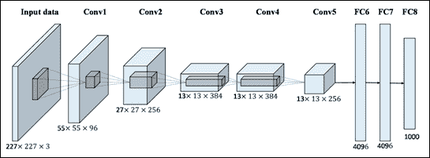

图 9：AlexNet 网络

在  AlexNet 架构中，有八层具有可训练参数：一系列五个连续卷积层，后面是三个完全连接的层。每个卷积层之后是 ReLU 层，并且可选地还有最大池层，尤其是在网络的开始处，以便减少网络占用的空间量。

所有池层都有`3x3`扩展区域，步长率为 2：这意味着您始终使用重叠池。这是因为与没有重叠的普通池相比，这种类型的池提供了稍好的网络表现。在网络的开始，在池化层和下一个卷积层之间，总是使用几个 LRN 标准化层：经过一些测试，可以看出它们倾向于减少网络错误。

前两个完全连接的层拥有 4,096 个神经元，而最后一个拥有 1,000 个单元，对应于 ImageNet 数据集中的类数。考虑到完全连接层中的大量连接，在每对完全连接的层之间添加了比率为 0.5 的丢弃层，即，每次忽略一半的神经元激活。在这种情况下已经注意到，使用丢弃技术不仅加速了单次迭代的处理，而且还很好地防止了过拟合。没有丢弃层，网络制造商声称原始网络过拟合。

## 迁移学习

迁移学习包括建立已经构建的网络，并对各个层的参数进行适当的更改，以便它可以适应另一个数据集。例如，您可以在大型数据集（如 ImageNet）上使用预先测试的网络，并在较小的数据集上再次训练它。如果我们的数据集在内容上与原始数据集没有明显不同，那么预先训练的模型已经具有与我们自己的分类问题相关的学习特征。

如果我们的数据集与预训练模型训练的数据集没有太大差异，我们可以使用微调技术。 已在大型不同数据集上进行预训练的模型可能会捕捉到早期层中的曲线和边缘等通用特征，这些特征在大多数分类问题中都是相关且有用的。但是，如果我们的数据集来自一个非常特定的域，并且找不到该域中预先训练好的网络，我们应该考虑从头开始训练网络。

## 预训练的 AlexNet

我们会对预先训练好的 AlexNet 进行微调，以区分狗和猫。 AlexNet 在 ImageNet 数据集上经过预先训练。

要执行这个例子，你还需要安装 scipy（参见[此链接](https://www.scipy.org/install.html)）和 PIL（Pillow），这是 scipy 使用的读取图像：`pip install Pillow`或`pip3 install Pillow`。

然后，您需要下载以下文件：

*   `myalexnet_forward.py`：2017 版 TensorFlow 的 AlexNet 实现和测试代码（Python 3.5）
*   `bvlc_alexnet.npy`：权重，需要在工作目录中
*   `caffe_classes.py`：类，与网络输出的顺序相同
*   `poodle.png`，`laska.png`，`dog.png`，`dog2.png`，`quail227.JPEG`：测试图像（图像应为`227×227×3`）

[从此链接下载这些文件](http://www.cs.toronto.edu/~guerzhoy/tf_alexnet/)，或从本书的代码库中下载。

首先，我们将在之前下载的图像上测试网络。为此，只需从 Python GUI 运行`myalexnet_forward.py`即可。

通过简单地检查源代码可以看到（参见下面的代码片段），将调用预先训练好的网络对以下两个图像进行分类，`laska.png`和`poodle.png`，这些图像之前已下载过：

```py
im1 = (imread("laska.png")[:,:,:3]).astype(float32)
im1 = im1 - mean(im1)
im1[:, :, 0], im1[:, :, 2] = im1[:, :, 2], im1[:, :, 0]

im2 = (imread("poodle.png")[:,:,:3]).astype(float32)
im2[:, :, 0], im2[:, :, 2] = im2[:, :, 2], im2[:, :, 0]
```

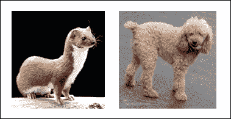

图 10：要分类的图像

的权重和偏差由以下语句加载：

```py
net_data = load(open("bvlc_alexnet.npy", "rb"), encoding="latin1").item()
```

网络是一组卷积和池化层，后面是三个完全连接的状态。该模型的输出是 softmax 函数：

```py
prob = tf.nn.softmax(fc8)
```

softmax 函数的输出是分类等级，因为它们表示网络认为输入图像属于`caffe_classes.py`文件中定义的类的强度。

如果我们运行代码，我们应该得到以下结果：

```py
Image 0
weasel 0.503177
black-footed ferret, ferret, Mustela nigripes 0.263265
polecat, fitch, foulmart, foumart, Mustela putorius 0.147746
mink 0.0649517
otter 0.00771955
Image 1
clumber, clumber spaniel 0.258953
komondor 0.165846
miniature poodle 0.149518
toy poodle 0.0984719
kuvasz 0.0848062
0.40007972717285156
>>>

```

在前面的例子中，AlexNet 给鼬鼠的分数约为 50%。这意味着该模型非常有信心图像显示黄鼠狼，其余分数可视为噪音。

# 数据集准备

我们的任务是建立一个区分狗和猫的图像分类器。我们从 Kaggle 那里得到一些帮助，[我们可以从中轻松下载数据集](https://www.kaggle.com/c/dogs-vs-cats/data)。

在此数据集中，训练集包含 20,000 个标记图像，测试和验证集包含 2,500 个图像。

要使用数据集，必须将每个图像重新整形为`227×227×3`。为此，您可以使用`prep_images.py`中的 Python 代码。否则，您可以使用本书仓库中的`trainDir.rar`和`testDir.rar`文件。它们包含 6,000 个用于训练的犬和猫的重塑图像，以及 100 个重新成形的图像用于测试。

以下部分中描述的以下微调实现在`alexnet_finetune.py`中实现，可以在本书的代码库中下载。

# 微调实现

我们的分类任务包含两个类别，因此网络的新 softmax 层将包含 2 个类别而不是 1,000 个类别。这是输入张量，它是一个`227×227×3`图像，以及等级 2 的输出张量：

```py
n_classes = 2
train_x = zeros((1, 227,227,3)).astype(float32)
train_y = zeros((1, n_classes))
```

微调实现包括截断预训练网络的最后一层（softmax 层），并将其替换为与我们的问题相关的新 softmax 层。

例如，ImageNet 上预先训练好的网络带有一个包含 1,000 个类别的 softmax 层。

以下代码片段定义了新的 softmax 层`fc8`：

```py
fc8W = tf.Variable(tf.random_normal\
                   ([4096, n_classes]),\
                   trainable=True, name="fc8w")
fc8b = tf.Variable(tf.random_normal\
                   ([n_classes]),\
                   trainable=True, name="fc8b")
fc8 = tf.nn.xw_plus_b(fc7, fc8W, fc8b)
prob = tf.nn.softmax(fc8)
```

损失是用于分类的表现指标。它是一个始终为正的连续函数，如果模型的预测输出与期望的输出完全匹配，则交叉熵等于零。因此，优化的目标是通过改变模型的权重和偏差来最小化交叉熵，因此它尽可能接近零。

TensorFlow 具有用于计算交叉熵的内置函数。为了使用交叉熵来优化模型的变量，我们需要一个标量值，因此我们只需要对所有图像分类采用交叉熵的平均值：

```py
loss = tf.reduce_mean\
       (tf.nn.softmax_cross_entropy_with_logits_v2\
        (logits =prob, labels=y))
opt_vars = [v for v in tf.trainable_variables()\
            if (v.name.startswith("fc8"))]
```

既然我们必须最小化成本度量，那么我们可以创建`optimizer`：

```py
optimizer = tf.train.AdamOptimizer\
            (learning_rate=learning_rate).minimize\
            (loss, var_list = opt_vars)
correct_pred = tf.equal(tf.argmax(prob, 1), tf.argmax(y, 1))
accuracy = tf.reduce_mean(tf.cast(correct_pred, tf.float32))
```

在这种情况下，我们使用步长为`0.5`的`AdamOptimizer`。请注意，此时不执行优化。事实上，根本没有计算任何东西，我们只需将优化器对象添加到 TensorFlow 图中以便以后执行。然后我们在网络上运行反向传播以微调预训练的权重：

```py
batch_size = 100
training_iters = 6000
display_step = 1
dropout = 0.85 # Dropout, probability to keep units

init = tf.global_variables_initializer()
with tf.Session() as sess:
    sess.run(init)
    step = 1
```

继续训练，直到达到最大迭代次数：

```py
    while step * batch_size < training_iters:
        batch_x, batch_y = \
                 next(next_batch(batch_size)) #.next()
```

运行优化操作（反向传播）：

```py
        sess.run(optimizer, \
                 feed_dict={x: batch_x, \
                            y: batch_y, \
                            keep_prob: dropout})

        if step % display_step == 0:
```

计算批次损失和准确率：

```py
            cost, acc = sess.run([loss, accuracy],\
                                 feed_dict={x: batch_x, \
                                            y: batch_y, \
                                            keep_prob: 1.})
            print ("Iter " + str(step*batch_size) \
                   + ", Minibatch Loss= " + \
                  "{:.6f}".format(cost) + \
                   ", Training Accuracy= " + \
                  "{:.5f}".format(acc))              

        step += 1
    print ("Optimization Finished!")
```

网络训练产生以下结果：

```py
Iter 100, Minibatch Loss= 0.555294, Training Accuracy= 0.76000
Iter 200, Minibatch Loss= 0.584999, Training Accuracy= 0.73000
Iter 300, Minibatch Loss= 0.582527, Training Accuracy= 0.73000
Iter 400, Minibatch Loss= 0.610702, Training Accuracy= 0.70000
Iter 500, Minibatch Loss= 0.583640, Training Accuracy= 0.73000
Iter 600, Minibatch Loss= 0.583523, Training Accuracy= 0.73000
…………………………………………………………………
…………………………………………………………………
Iter 5400, Minibatch Loss= 0.361158, Training Accuracy= 0.95000
Iter 5500, Minibatch Loss= 0.403371, Training Accuracy= 0.91000
Iter 5600, Minibatch Loss= 0.404287, Training Accuracy= 0.91000
Iter 5700, Minibatch Loss= 0.413305, Training Accuracy= 0.90000
Iter 5800, Minibatch Loss= 0.413816, Training Accuracy= 0.89000
Iter 5900, Minibatch Loss= 0.413476, Training Accuracy= 0.90000
Optimization Finished!

```

要测试我们的模型，我们将预测与标签集（`cat = 0`，`dog = 1`）进行比较：

```py
    output = sess.run(prob, feed_dict = {x:imlist, keep_prob: 1.})
    result = np.argmax(output,1)
    testResult = [1,1,1,1,0,0,0,0,0,0,\
                  0,1,0,0,0,0,1,1,0,0,\
                  1,0,1,1,0,1,1,0,0,1,\
                  1,1,1,0,0,0,0,0,1,0,\
                  1,1,1,1,0,1,0,1,1,0,\
                  1,0,0,1,0,0,1,1,1,0,\
                  1,1,1,1,1,0,0,0,0,0,\
                  0,1,1,1,0,1,1,1,1,0,\
                  0,0,1,0,1,1,1,1,0,0,\
                  0,0,0,1,1,0,1,1,0,0]
    count = 0
    for i in range(0,99):
        if result[i] == testResult[i]:
            count=count+1

    print("Testing Accuracy = " + str(count) +"%")
```

最后，我们有我们模型的准确率：

```py
Testing Accuracy = 82%
```

## VGG

VGG 是在 2014 年 ILSVRC 期间发明神经网络的人的名字。我们谈论的是复数网络，因为创建了同一网络的多个版本，每个拥有不同数量的层。根据层数`n`，这些网络中的一个具有的权重，它们中的每一个通常称为 VGG-n。所有这些网络都比 AlexNet 更深。这意味着它们由多个层组成，其参数比 AlexNet 更多，在这种情况下，总共有 11 到 19 个训练层。通常，只考虑可行的层，因为它们会影响模型的处理和大小，如前一段所示。然而，整体结构仍然非常相似：总是有一系列初始卷积层和最后一系列完全连接的层，后者与 AlexNet 完全相同。因此，使用的卷积层的数量，当然还有它们的参数有什么变化。下表显示了 VGG 团队构建的所有变体。

每一列，从左侧开始，向右侧，显示一个特定的 VGG 网络，从最深到最浅。粗体项表示与先前版本相比，每个版本中添加的内容。 ReLU 层未在表中显示，但在网络中它存在于每个卷积层之后。所有卷积层使用 1 的步幅：

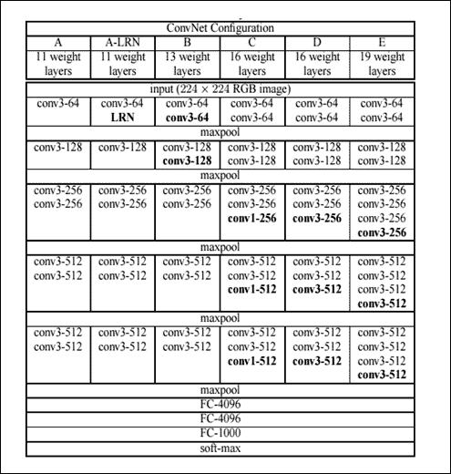

表：VGG 网络架构

请注意，  AlexNet 没有具有相当大的感受野的卷积层：这里，所有感受野都是`3×3`，除了 VGG-16 中有几个具有`1×1`感受野的卷积层。回想一下，具有 1 步梯度的凸层不会改变输入空间大小，同时修改深度值，该深度值与使用的内核数量相同。因此，VGG 卷积层不会影响输入体积的宽度和高度；只有池化层才能这样做。使用具有较小感受野的一系列卷积层的想法最终总体上模拟具有较大感受野的单个卷积层，这是由于这样的事实，即以这种方式使用多个 ReLU 层而不是单独使用一个，从而增加激活函数的非线性，从而使其更具区别性。它还用于减少使用的参数数量。这些网络被认为是 AlexNet 的演变，因为总体而言，使用相同的数据集，它们的表现优于 AlexNet。 VGG 网络演示的主要概念是拥塞神经网络越来越深刻，其表现也越来越高。但是，  必须拥有越来越强大的硬件，否则网络训练就会成为问题。

对于 VGG，使用了四个 NVIDIA Titan Blacks，每个都有 6 GB 的内存。因此，VGG 具有更好的表现，但需要大量的硬件用于训练，并且还使用大量参数：例如，VGG-19 模型大约为 550MB（是 AlexNet 的两倍）。较小的 VGG 网络仍然具有大约 507MB 的模型。

## 用 VGG-19 学习艺术风格

在这个项目中，我们使用预训练的 VGG-19 来学习艺术家创建的样式和模式，并将它们转移到图像中（项目文件是`style_transfer.py`，在本书的 GitHub 仓库中）。这种技术被称为`artistic style learning`（[参见 Gatys 等人的文章 A Art Algorithm of Artistic Style](https://arxiv.org/pdf/1508.06576.pdf)）。根据学术文献，艺术风格学习定义如下：给定两个图像作为输入，合成具有第一图像的语义内容和第二图像的纹理/风格的第三图像。

为了使其正常工作，我们需要训练一个深度卷积神经网络来构建以下内容：

*   用于确定图像 A 的内容的内容提取器
*   用于确定图像 B 样式的样式提取器
*   合并器将一些任意内容与另一个任意样式合并，以获得最终结果

    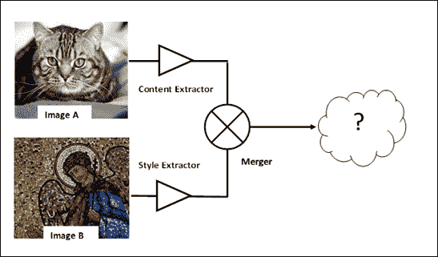

    图 11：艺术风格学习操作模式

## 输入图像

输入图像，每个都是`478×478`像素，是您在本书的代码库中也可以找到的以下图像（`cat.jpg`和`mosaic.jpg`）：


图 12：艺术风格学习中的输入图像

为了通过 VGG 模型分析  ，需要对这些图像进行预处理：

1.  添加额外的维度
2.  从输入图像中减去`MEAN_VALUES`：

    ```py
    MEAN_VALUES = np.array([123.68, 116.779, 103.939]).reshape((1,1,1,3))
    content_image = preprocess('cat.jpg')
    style_image = preprocess('mosaic.jpg') 

    def preprocess(path):
        image = plt.imread(path)
        image = image[np.newaxis]
        image = image - MEAN_VALUES
        return image
    ```

## 内容提取器和损失

为了隔离图像的语义内容，我们使用预先训练好的 VGG-19 神经网络，对权重进行了一些微调，以适应这个问题，然后使用其中一个隐藏层的输出作为内容提取器。下图显示了用于此问题的 CNN：

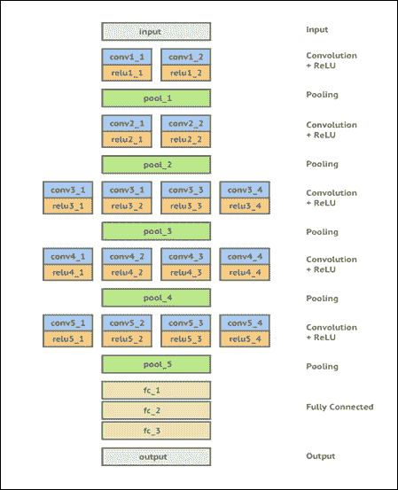

图 13：用于艺术风格学习的 VGG-19

使用以下代码加载预训练的  VGG：

```py
import scipy.io
vgg = scipy.io.loadmat('imagenet-vgg-verydeep-19.mat')
```

`imagenet-vgg-verydeep-19.mat`模型应从[此链接](http://www.vlfeat.org/matconvnet/models/imagenet-vgg-verydeep-19.mat)下载。

该模型有 43 层，其中 19 层是卷积层。其余的是最大池/激活/完全连接的层。

我们可以检查每个卷积层的形状：

```py
 [print (vgg_layers[0][i][0][0][2][0][0].shape,\
        vgg_layers[0][i][0][0][0][0]) for i in range(43) 
 if 'conv' in vgg_layers[0][i][0][0][0][0] \
 or 'fc' in vgg_layers[0][i][0][0][0][0]]
```

上述代码的结果如下：

```py
(3, 3, 3, 64) conv1_1
(3, 3, 64, 64) conv1_2
(3, 3, 64, 128) conv2_1
(3, 3, 128, 128) conv2_2
(3, 3, 128, 256) conv3_1
(3, 3, 256, 256) conv3_2
(3, 3, 256, 256) conv3_3
(3, 3, 256, 256) conv3_4
(3, 3, 256, 512) conv4_1
(3, 3, 512, 512) conv4_2
(3, 3, 512, 512) conv4_3
(3, 3, 512, 512) conv4_4
(3, 3, 512, 512) conv5_1
(3, 3, 512, 512) conv5_2
(3, 3, 512, 512) conv5_3
(3, 3, 512, 512) conv5_4
(7, 7, 512, 4096) fc6
(1, 1, 4096, 4096) fc7
(1, 1, 4096, 1000) fc8

```

每种形状以下列方式表示：`[kernel height, kernel width, number of input channels, number of output channels]`。

第一层有 3 个输入通道，因为输入是 RGB 图像，而卷积层的输出通道数从 64 到 512，所有内核都是`3x3`矩阵。

然后我们应用转移学习技术，以使 VGG-19 网络适应我们的问题：

1.  不需要完全连接的层，因为它们用于对象识别。
2.  最大池层代替平均池层，以获得更好的结果。平均池层的工作方式与卷积层中的内核相同。

    ```py
    IMAGE_WIDTH = 478
    IMAGE_HEIGHT = 478
    INPUT_CHANNELS = 3
    model = {}
    model['input'] = tf.Variable(np.zeros((1, IMAGE_HEIGHT,\
                                     IMAGE_WIDTH,\
                                     INPUT_CHANNELS)),\
                                   dtype = 'float32')

    model['conv1_1']  = conv2d_relu(model['input'], 0, 'conv1_1')
    model['conv1_2']  = conv2d_relu(model['conv1_1'], 2, 'conv1_2')
    model['avgpool1'] = avgpool(model['conv1_2'])

    model['conv2_1']  = conv2d_relu(model['avgpool1'], 5, 'conv2_1')
    model['conv2_2']  = conv2d_relu(model['conv2_1'], 7, 'conv2_2')
    model['avgpool2'] = avgpool(model['conv2_2'])

    model['conv3_1']  = conv2d_relu(model['avgpool2'], 10, 'conv3_1')
    model['conv3_2']  = conv2d_relu(model['conv3_1'], 12, 'conv3_2')
    model['conv3_3']  = conv2d_relu(model['conv3_2'], 14, 'conv3_3')
    model['conv3_4']  = conv2d_relu(model['conv3_3'], 16, 'conv3_4')
    model['avgpool3'] = avgpool(model['conv3_4'])

    model['conv4_1']  = conv2d_relu(model['avgpool3'], 19,'conv4_1')
    model['conv4_2']  = conv2d_relu(model['conv4_1'], 21, 'conv4_2')
    model['conv4_3']  = conv2d_relu(model['conv4_2'], 23, 'conv4_3')
    model['conv4_4']  = conv2d_relu(model['conv4_3'], 25,'conv4_4')
    model['avgpool4'] = avgpool(model['conv4_4'])

    model['conv5_1']  = conv2d_relu(model['avgpool4'], 28, 'conv5_1')
    model['conv5_2']  = conv2d_relu(model['conv5_1'], 30, 'conv5_2')
    model['conv5_3']  = conv2d_relu(model['conv5_2'], 32, 'conv5_3')
    model['conv5_4']  = conv2d_relu(model['conv5_3'], 34, 'conv5_4')
    model['avgpool5'] = avgpool(model['conv5_4'])
    ```

这里我们定义了`contentloss`函数来测量两个图像`p`和`x`之间的内容差异：

```py
def contentloss(p, x):
    size = np.prod(p.shape[1:])
    loss = (1./(2*size)) * tf.reduce_sum(tf.pow((x - p),2))
    return loss
```

当输入图像在内容方面彼此非常接近并且随着其内容偏离而增长时，该函数倾向于为 0。

我们将在`conv5_4`层上使用`contentloss`。这是输出层，其输出将是预测，因此我们需要使用`contentloss`函数将此预测与实际预测进行比较：

```py
content_loss = contentloss\
               (sess.run(model['conv5_4']), model['conv5_4'])
```

最小化`content_loss`意味着混合图像在给定层中具有与内容图像的激活非常相似的特征激活。

## 样式提取器和损失

样式提取器使用过滤器的 Gram 矩阵作为给定的隐藏层。简单来说，使用这个矩阵，我们可以破坏图像的语义，保留其基本组件并使其成为一个好的纹理提取器：

```py
def gram_matrix(F, N, M):
    Ft = tf.reshape(F, (M, N))
    return tf.matmul(tf.transpose(Ft), Ft)
```

`style_loss`测量两个图像彼此之间的接近程度。此函数是样式图像和输入 `noise_image`生成的 Gram 矩阵元素的平方差的总和：

```py
noise_image = np.random.uniform\
              (-20, 20,\
               (1, IMAGE_HEIGHT, \
                IMAGE_WIDTH,\
                INPUT_CHANNELS)).astype('float32')

def style_loss(a, x):
    N = a.shape[3]
    M = a.shape[1] * a.shape[2]
    A = gram_matrix(a, N, M)
    G = gram_matrix(x, N, M)
    result = (1/(4 * N**2 * M**2))* tf.reduce_sum(tf.pow(G-A,2))
    return result
```

`style_loss`生长  ，因为它的两个输入图像（`a`和`x`）倾向于偏离风格。

## 合并和总损失

我们可以合并内容和样式损失，以便训练输入`noise_image`来输出（在层中）与样式图像类似的样式，其特征相似于内容图像：

```py
alpha = 1
beta = 100
total_loss = alpha * content_loss + beta * styleloss
```

## 训练

最小化网络中的损失，以便样式损失（输出图像的样式和样式图像的样式之间的损失），内容损失（内容图像和输出图像之间的损失），以及总变异损失尽可能低：

```py
train_step = tf.train.AdamOptimizer(1.5).minimize(total_loss)
```

从这样的网络生成的输出图像应该类似于输入图像并且具有样式图像的造型师属性。

最后，我们可以准备网络进行训练：

```py
sess.run(tf.global_variables_initializer())
sess.run(model['input'].assign(input_noise))
for it in range(2001):
    sess.run(train_step)
    if it%100 == 0:
        mixed_image = sess.run(model['input'])
        print('iteration:',it,'cost: ', sess.run(total_loss))
        filename = 'out2/%d.png' % (it)
        deprocess(filename, mixed_image)
```

训练时间可能非常耗时，但结果可能非常有趣：

```py
iteration: 0 cost:  8.14037e+11
iteration: 100 cost:  1.65584e+10
iteration: 200 cost:  5.22747e+09
iteration: 300 cost:  2.72995e+09
iteration: 400 cost:  1.8309e+09
iteration: 500 cost:  1.36818e+09
iteration: 600 cost:  1.0804e+09
iteration: 700 cost:  8.83103e+08
iteration: 800 cost:  7.38783e+08
iteration: 900 cost:  6.28652e+08
iteration: 1000 cost:  5.41755e+08

```

经过 1000 次迭代后，我们创建了一个新的拼接：

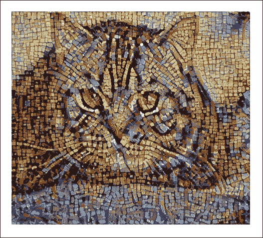

图 14：艺术风格学习中的输出图像

真是太棒了！你终于可以训练你的神经网络像毕加索一样画画......玩得开心！

# Inception-v3

Szegedy 和其他人在 2014 年的论文“Going Deeper with Convolutions”中首次介绍了 Inception 微架构：

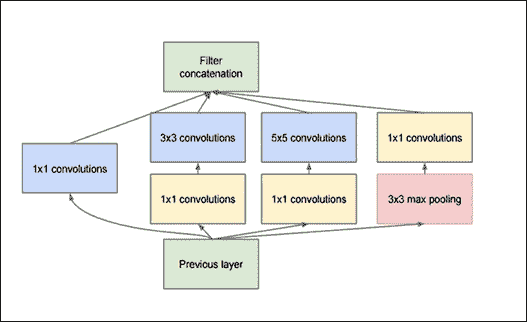

图 15：GoogLeNet 中使用的 Original Inception 模块

初始模块的目标是通过在网络的同一模块内计算`1×1`，`3×3`和`5×5`卷积来充当多级特征提取器 - 这些滤波器的输出然后，在被馈送到网络中的下一层之前，沿着信道维度堆叠。这种架构的原始版本称为 GoogLeNet，但后续形式简称为 InceptionVN，其中 N 表示 Google 推出的版本号。

您可能想知道为什么我们在同一输入上使用不同类型的卷积。答案是，只要仔细研究了它的参数，就不可能总是获得足够的有用特征来用单个卷积进行精确分类。事实上，使用一些输入它可以更好地使用卷积小内核，而其他输入可以使用其他类型的内核获得更好的结果。可能由于这个原因，GoogLeNet 团队想要在他们自己的网络中考虑一些替代方案。如前所述，为此目的，GoogLeNet 在同一网络级别（即它们并行）使用三种类型的卷积层：`1×1`层，`3×3`层和`5×5`层。

这个 3 层并行局部结构的结果是它们所有输出值的组合，链接到单个向量输出，它将是下一层的输入。这是通过使用连接层完成的。除了三个并行卷积层之外，在相同的本地结构中还添加了一个池化层，因为池化操作对于 CNN 的成功至关重要。

## 使用 TensorFlow 探索初始化

从[此链接](https://github.com/tensorflow/models)，你应该能够下载相应的模型库。

然后键入以下命令：

```py
cd models/tutorials/image/imagenet python classify_image.py

```

当程序第一次运行时，`classify_image.py`从 [tensorflow.org](http://tensorflow.org) 下载经过训练的模型。您的硬盘上需要大约 200MB 的可用空间。

上面的命令将对提供的熊猫图像进行分类。如果模型正确运行，脚本将生成以下输出：

```py
giant panda, panda, panda bear, coon bear, Ailuropoda melanoleuca (score = 0.88493)
indri, indris, Indri indri, Indri brevicaudatus (score = 0.00878)
lesser panda, red panda, panda, bear cat, cat bear, Ailurus fulgens (score = 0.00317)
custard apple (score = 0.00149)
earthstar (score = 0.00127)

```

如果您想提供其他 JPEG 图像，可以通过编辑来完成：

```py
image_file argument:
python classify_image.py --image=image.jpg
```

您可以通过从互联网下载图像并查看其产生的结果来测试初始阶段。

例如，您可以尝试从[此链接](https://pixabay.com/it/)获取以下图像（我们将其重命名为`inception_image.jpg`）：


图 16：使用 Inception-v3 进行分类的输入图像

结果如下：

```py
python classify_image.py --image=inception_example.jpg
strawberry (score = 0.91541)
crayfish, crawfish, crawdad, crawdaddy (score = 0.01208)
chocolate sauce, chocolate syrup (score = 0.00628)
cockroach, roach (score = 0.00572)
grocery store, grocery, food market, market (score = 0.00264)
```

听起来不错！

# 使用 CNN 进行情感识别

深度学习中难以解决的一个问题与神经网络无关：它是以正确格式获取正确数据。但是，[Kaggle 平台](https://www.kaggle.com/)提供了新的问题，并且需要研究新的数据集。

Kaggle 成立于 2010 年，作为预测建模和分析竞赛的平台，公司和研究人员发布他们的数据，来自世界各地的统计人员和数据挖掘者竞争生产最佳模型。在本节中，我们将展示如何使用面部图像制作 CNN 以进行情感检测。此示例的训练和测试集可以从[此链接](https://inclass.kaggle.com/c/facial-keypoints-detector/data)下载。


图 17：Kaggle 比赛页面

训练组由 3,761 个灰度图像组成，尺寸为`48×48`像素，3,761 个标签，每个图像有 7 个元素。

每个元素编码一个情感，0：愤怒，1：厌恶，2：恐惧，3：幸福，4：悲伤，5：惊讶，6：中立。

在经典 Kaggle 比赛中，必须由平台评估从测试集获得的标签集。在这个例子中，我们将训练一个来自训练组的神经网络，之后我们将在单个图像上评估模型。

在开始 CNN 实现之前，我们将通过实现一个简单的过程（文件`download_and_display_images.py`）来查看下载的数据。

导入库：

```py
import tensorflow as tf
import numpy as np
from matplotlib import pyplot as plt
import EmotionUtils
```

`read_data`函数允许构建所有数据集，从下载的数据开始，您可以在本书的代码库中的`EmotionUtils`库中找到它们：

```py
FLAGS = tf.flags.FLAGS
tf.flags.DEFINE_string("data_dir",\
                       "EmotionDetector/",\
                       "Path to data files")
images = []
images = EmotionUtils.read_data(FLAGS.data_dir)

train_images = images[0]
train_labels = images[1]
valid_images = images[2]
valid_labels = images[3]
test_images  = images[4]
```

然后打印训练的形状并测试图像：

```py
print ("train images shape = ",train_images.shape)
print ("test labels shape = ",test_images.shape)
```

显示训练组的第一个图像及其正确的标签：

```py
image_0 = train_images[0]
label_0 = train_labels[0]
print ("image_0 shape = ",image_0.shape)
print ("label set = ",label_0)
image_0 = np.resize(image_0,(48,48))

plt.imshow(image_0, cmap='Greys_r')
plt.show()
```

有 3,761 个`48×48`像素的灰度图像：

```py
train images shape =  (3761, 48, 48, 1)
```

有 3,761 个类标签，每个类包含七个元素：

```py
train labels shape =  (3761, 7)
```

测试集由 1,312 个`48x48`像素灰度图像组成：

```py
test labels shape =  (1312, 48, 48, 1)
```

单个图像具有以下形状：

```py
image_0 shape =  (48, 48, 1)
```

第一张图片的标签设置如下：

```py
label set =  [ 0\.  0\.  0\.  1\.  0\.  0\.  0.]
```

此标签对应于快乐，图像在以下 matplot 图中可视化：

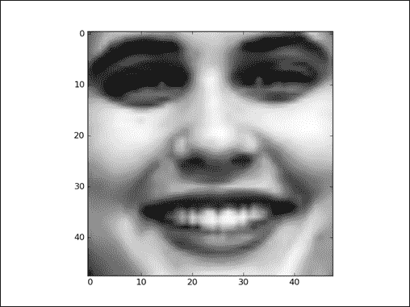

图 18：来自情感检测面部数据集的第一图像

我们现在转向 CNN 架构。

下图显示了数据将如何在 CNN 中流动：

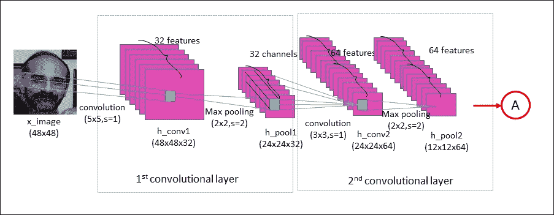

图 19：实现的 CNN 的前两个卷积层

该网络具有两个卷积层，两个完全连接的层，最后是 softmax 分类层。使用`5×5`卷积核在第一卷积层中处理输入图像（`48×48`像素）。这导致 32 个图像，每个使用的滤波器一个。通过最大合并操作对图像进行下采样，以将图像从`48×48`减小到`24×24`像素。然后，这些 32 个较小的图像由第二卷积层处理；这导致 64 个新图像（见上图）。通过第二次池化操作，将得到的图像再次下采样到`12×12`像素。

第二合并层的输出是`64×12×12`像素的图像。然后将它们展平为长度为`12×12×64 = 9,126`的单个向量，其用作具有 256 个神经元的完全连接层的输入。这将进入另一个具有 10 个神经元的完全连接的层，每个类对应一个类，用于确定图像的类别，即图像中描绘的情感。


图 20：实现的 CNN 的最后两层

让我们继续讨论权重和偏置定义。以下数据结构表示网络权重的定义，并总结了到目前为止我们所描述的内容：

```py
weights = {
    'wc1': weight_variable([5, 5, 1, 32], name="W_conv1"),
    'wc2': weight_variable([3, 3, 32, 64],name="W_conv2"),
    'wf1': weight_variable([(IMAGE_SIZE // 4) * (IMAGE_SIZE // 4)
                                         \* 64,256],name="W_fc1"),
    'wf2': weight_variable([256, NUM_LABELS], name="W_fc2")
}
```

注意卷积滤波器是随机初始化的，所以分类是随机完成的：

```py
def weight_variable(shape, stddev=0.02, name=None):
    initial = tf.truncated_normal(shape, stddev=stddev)
    if name is None:
        return tf.Variable(initial)
    else:
        return tf.get_variable(name, initializer=initial)
```

以相似方式，我们已经定义了偏差：

```py
biases = {
    'bc1': bias_variable([32], name="b_conv1"),
    'bc2': bias_variable([64], name="b_conv2"),
    'bf1': bias_variable([256], name="b_fc1"),
    'bf2': bias_variable([NUM_LABELS], name="b_fc2")
}

def bias_variable(shape, name=None):
    initial = tf.constant(0.0, shape=shape)
    if name is None:
        return tf.Variable(initial)
    else:
        return tf.get_variable(name, initializer=initial)
```

优化器必须使用区分链规则通过 CNN 传播错误，并更新过滤器权重以改善分类错误。输入图像的预测类和真实类之间的差异由`loss`函数测量。它将`pred`模型的预测输出和所需输出`label`作为输入：

```py
def loss(pred, label):
    cross_entropy_loss =\
    tf.reduce_mean(tf.nn.softmax_cross_entropy_with_logits_v2\
                   (logits=pred, labels=label))
    tf.summary.scalar('Entropy', cross_entropy_loss)
    reg_losses = tf.add_n(tf.get_collection("losses"))
    tf.summary.scalar('Reg_loss', reg_losses)
       return cross_entropy_loss + REGULARIZATION * reg_losses
```

`tf.nn.softmax_cross_entropy_with_logits_v2(pred, label)`函数在应用 softmax 函数后计算结果的`cross_entropy_loss`（但它以数学上仔细的方式一起完成）。这就像是以下结果：

```py
a = tf.nn.softmax(x)
b = cross_entropy(a)
```

我们计算每个分类图像的`cross_entropy_loss`，因此我们将测量模型在每个图像上的单独表现。

我们计算分类图像的交叉熵平均值：

```py
cross_entropy_loss =    tf.reduce_mean(tf.nn.softmax_cross_entropy_with_logits_v2 (logits=pred, labels=label))
```

为了防止过拟合，我们将使用 L2 正则化，其中包括向`cross_entropy_loss`插入一个附加项：

```py
reg_losses = tf.add_n(tf.get_collection("losses"))
return cross_entropy_loss + REGULARIZATION * reg_losses
```

哪里：

```py
def add_to_regularization_loss(W, b):
    tf.add_to_collection("losses", tf.nn.l2_loss(W))
    tf.add_to_collection("losses", tf.nn.l2_loss(b))
```

### 注意

有关详细信息，请参阅[此链接](http://www.kdnuggets.com/2015/04/preventing-overfitting-neural-networks.html/2)。

我们已经构建了网络的权重和偏差以及优化过程。但是，与所有已实现的网络一样，我们必须通过导入所有必需的库来启动实现：

```py
import tensorflow as tf
import numpy as np
from datetime import datetime
import EmotionUtils
import os, sys, inspect
from tensorflow.python.framework import ops
import warnings

warnings.filterwarnings("ignore")
os.environ['TF_CPP_MIN_LOG_LEVEL'] = '3'
ops.reset_default_graph()
```

然后，我们在您的计算机上设置存储数据集的路径，以及网络参数：

```py
FLAGS = tf.flags.FLAGS
tf.flags.DEFINE_string("data_dir",\
                       "EmotionDetector/",\
                       "Path to data files")
tf.flags.DEFINE_string("logs_dir",\
                       "logs/EmotionDetector_logs/",\
                       "Path to where log files are to be saved")
tf.flags.DEFINE_string("mode",\
                       "train",\
                       "mode: train (Default)/ test")
BATCH_SIZE = 128
LEARNING_RATE = 1e-3
MAX_ITERATIONS = 1001
REGULARIZATION = 1e-2
IMAGE_SIZE = 48
NUM_LABELS = 7
VALIDATION_PERCENT = 0.1
```

`emotion_cnn`函数实现我们的模型：

```py
def emotion_cnn(dataset):
    with tf.name_scope("conv1") as scope:
        tf.summary.histogram("W_conv1", weights['wc1'])
        tf.summary.histogram("b_conv1", biases['bc1'])
        conv_1 = tf.nn.conv2d(dataset, weights['wc1'],\
                              strides=[1, 1, 1, 1],\
                              padding="SAME")

        h_conv1 = tf.nn.bias_add(conv_1, biases['bc1'])
        h_1 = tf.nn.relu(h_conv1)
        h_pool1 = max_pool_2x2(h_1)
        add_to_regularization_loss(weights['wc1'], biases['bc1'])

    with tf.name_scope("conv2") as scope:
        tf.summary.histogram("W_conv2", weights['wc2'])
        tf.summary.histogram("b_conv2", biases['bc2'])
        conv_2 = tf.nn.conv2d(h_pool1, weights['wc2'],\
                              strides=[1, 1, 1, 1], \ 
                              padding="SAME")
        h_conv2 = tf.nn.bias_add(conv_2, biases['bc2'])
        h_2 = tf.nn.relu(h_conv2)
        h_pool2 = max_pool_2x2(h_2)
        add_to_regularization_loss(weights['wc2'], biases['bc2'])

    with tf.name_scope("fc_1") as scope:
        prob=0.5
        image_size = IMAGE_SIZE // 4
        h_flat = tf.reshape(h_pool2,[-1,image_size*image_size*64])
        tf.summary.histogram("W_fc1", weights['wf1'])
        tf.summary.histogram("b_fc1", biases['bf1'])
        h_fc1 = tf.nn.relu(tf.matmul\
                     (h_flat, weights['wf1']) + biases['bf1'])
        h_fc1_dropout = tf.nn.dropout(h_fc1, prob)

    with tf.name_scope("fc_2") as scope:
        tf.summary.histogram("W_fc2", weights['wf2'])
        tf.summary.histogram("b_fc2", biases['bf2'])
        pred = tf.matmul(h_fc1_dropout, weights['wf2']) +\
               biases['bf2']
    return pred
```

然后定义一个`main`函数，我们将在其中定义数据集，输入和输出占位符变量以及主会话，以便启动训练过程：

```py
def main(argv=None):
```

此函数中的第一个操作是加载数据集以进行训练和验证。我们将使用训练集来教授分类器识别待预测的标签，我们将使用验证集来评估分类器的表现：

```py
train_images,\
train_labels,\
valid_images,\
valid_labels,\ test_images=EmotionUtils.read_data(FLAGS.data_dir)
print("Train size: %s" % train_images.shape[0])
print('Validation size: %s' % valid_images.shape[0])
print("Test size: %s" % test_images.shape[0])
```

我们为输入图像定义占位符变量。这允许我们更改输入到 TensorFlow 图的图像。数据类型设置为`float32`，形状设置为`[None, img_size, img_size, 1]`（其中`None`表示张量可以保存任意数量的图像，每个图像为`img_size`像素高和`img_size`像素宽），和`1`是颜色通道的数量：

```py
    input_dataset = tf.placeholder(tf.float32, \
                                   [None, \
                                    IMAGE_SIZE, \
                                    IMAGE_SIZE, 1],name="input")
```

接下来，我们为与占位符变量`input_dataset`中输入的图像正确关联的标签提供占位符变量。这个占位符变量的形状是`[None, NUM_LABELS]`，这意味着它可以包含任意数量的标签，每个标签是长度为`NUM_LABELS`的向量，在这种情况下为 7：

```py
    input_labels = tf.placeholder(tf.float32,\
                                  [None, NUM_LABELS])
```

`global_step`保持跟踪到目前为止执行的优化迭代数量。我们希望在检查点中使用所有其他 TensorFlow 变量保存此变量。请注意`trainable=False`，这意味着 TensorFlow 不会尝试优化此变量：

```py
    global_step = tf.Variable(0, trainable=False)
```

跟随变量`dropout_prob`，用于丢弃优化：

```py
    dropout_prob = tf.placeholder(tf.float32)
```

现在为测试阶段创建神经网络。`emotion_cnn()`函数返回`input_dataset`的预测类标签`pred`：

```py
    pred = emotion_cnn(input_dataset)
```

`output_pred`是测试和验证的预测，我们将在运行会话中计算：

```py
    output_pred = tf.nn.softmax(pred,name="output")
```

`loss_val`包含输入图像的预测类（`pred`）与实际类别（`input_labels`）之间的差异：

```py
    loss_val = loss(pred, input_labels)
```

`train_op`定义用于最小化成本函数的优化器。在这种情况下，我们再次使用`AdamOptimizer`：

```py
    train_op = tf.train.AdamOptimizer\
                    (LEARNING_RATE).minimize\
                              (loss_val, global_step)
```

`summary_op`是用于 TensorBoard 可视化的  ：

```py
summary_op = tf.summary.merge_all()
```

创建图后，我们必须创建一个 TensorFlow 会话，用于执行图：

```py
    with tf.Session() as sess:
        sess.run(tf.global_variables_initializer())
        summary_writer = tf.summary.FileWriter(FLAGS.logs_dir, sess.graph)
```

我们定义`saver`来恢复模型：

```py
        saver = tf.train.Saver()
        ckpt = tf.train.get_checkpoint_state(FLAGS.logs_dir)
        if ckpt and ckpt.model_checkpoint_path:
            saver.restore(sess, ckpt.model_checkpoint_path)
            print ("Model Restored!")
```

接下来我们需要获得一批训练示例。 `batch_image`现在拥有一批图像，`batch_label`包含这些图像的正确标签：

```py
        for step in xrange(MAX_ITERATIONS):
            batch_image, batch_label = get_next_batch(train_images,\
                                    train_labels,\
                                    step)
```

我们将批次放入`dict`中，其中包含 TensorFlow 图中占位符变量的正确名称：

```py
            feed_dict = {input_dataset: batch_image, \
                         input_labels: batch_label}
```

我们使用这批训练数据运行优化器。 TensorFlow 将`feed_dict_train`中的变量分配给占位符变量，然后运行优化程序：

```py
            sess.run(train_op, feed_dict=feed_dict)
            if step % 10 == 0:
                train_loss,\
                             summary_str =\ 
                                 sess.run([loss_val,summary_op],\
                                              feed_dict=feed_dict)
                summary_writer.add_summary(summary_str,\
                                           global_step=step)
                print ("Training Loss: %f" % train_loss)
```

当运行步长是 100 的倍数时，我们在验证集上运行训练模型：

```py
            if step % 100 == 0:
                valid_loss = \
                           sess.run(loss_val, \
                                feed_dict={input_dataset: valid_images, input_labels: valid_labels})
```

然后我们打印掉损失值：

```py
                print ("%s Validation Loss: %f" \
                      % (datetime.now(), valid_loss))
```

在训练课程结束时，模型将被保存：

```py
                saver.save(sess, FLAGS.logs_dir\
                           + 'model.ckpt', \
                           global_step=step)

if __name__ == "__main__":
    tf.app.run()
```

这是输出。如您所见，在模拟过程中损失函数减少：

```py
Reading train.csv ...
(4178, 48, 48, 1)
(4178, 7)
Reading test.csv ...
Picking ...
Train size: 3761
Validation size: 417
Test size: 1312
2018-02-24 15:17:45.421344 Validation Loss: 1.962773
2018-02-24 15:19:09.568140 Validation Loss: 1.796418
2018-02-24 15:20:35.122450 Validation Loss: 1.328313
2018-02-24 15:21:58.200816 Validation Loss: 1.120482
2018-02-24 15:23:24.024985 Validation Loss: 1.066049
2018-02-24 15:24:38.838554 Validation Loss: 0.965881
2018-02-24 15:25:54.761599 Validation Loss: 0.953470
2018-02-24 15:27:15.592093 Validation Loss: 0.897236
2018-02-24 15:28:39.881676 Validation Loss: 0.838831
2018-02-24 15:29:53.012461 Validation Loss: 0.910777
2018-02-24 15:31:14.416664 Validation Loss: 0.888537
>>>

```

然而，模型可以通过改变超参数或架构来改进。

在下一节中，我们将了解如何在您自己的图像上有效地测试模型。

## 在您自己的图像上测试模型

我们使用的数据集是标准化的。所有面部都指向相机，表情在某些情况下被夸大甚至滑稽。现在让我们看看如果我们使用更自然的图像会发生什么。确保脸部没有文字覆盖，情感可识别，脸部主要指向相机。

我从这个 JPEG 图像开始（它是一个彩色图像，你可以从书的代码库下载）：


图 21：输入图像

使用 Matplotlib 和其他 NumPy Python 库，我们将输入颜色图像转换为网络的有效输入，即灰度图像：

```py
img = mpimg.imread('author_image.jpg')
gray = rgb2gray(img)
```

转换函数如下：

```py
def rgb2gray(rgb):
    return np.dot(rgb[...,:3], [0.299, 0.587, 0.114])
```

结果如下图所示：

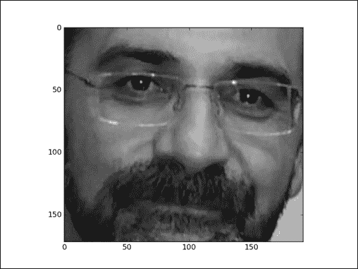

图 22：灰度输入图像

最后，我们可以使用此图像为网络提供信息，但首先我们必须定义一个正在运行的 TensorFlow 会话：

```py
sess = tf.InteractiveSession()
```

然后我们可以回想起之前保存的模型：

```py
new_saver = tf.train.\
import_meta_graph('logs/EmotionDetector_logs/model.ckpt-1000.meta')
new_saver.restore(sess,'logs/EmotionDetector_logs/model.ckpt-1000')
tf.get_default_graph().as_graph_def()
x = sess.graph.get_tensor_by_name("input:0")
y_conv = sess.graph.get_tensor_by_name("output:0")
```

要测试图像，我们必须将其重新整形为网络的有效`48×48×1`格式：

```py
image_test = np.resize(gray,(1,48,48,1))
```

我们多次评估相同的图片（`1000`），以便在输入图像中获得一系列可能的情感：

```py
tResult = testResult()
num_evaluations = 1000
for i in range(0,num_evaluations):
    result = sess.run(y_conv, feed_dict={x:image_test})
    label = sess.run(tf.argmax(result, 1))
    label = label[0]
    label = int(label)
    tResult.evaluate(label)

tResult.display_result(num_evaluations)
```

在几秒后，会出现如下结果：

```py
>>>
anger = 0.1%
disgust = 0.1%
fear = 29.1%
happy = 50.3%
sad = 0.1%
surprise = 20.0%
neutral = 0.3%
>>>

```

最高的百分比证实（`happy = 50.3%`）我们走在正确的轨道上。当然，这并不意味着我们的模型是准确的。可以通过更多和更多样化的训练集，更改网络参数或修改网络架构来实现可能的改进。

## 源代码

这里列出了实现的分类器的第二部分：

```py
from scipy import misc
import numpy as np
import matplotlib.cm as cm
import tensorflow as tf
from matplotlib import pyplot as plt
import matplotlib.image as mpimg
import EmotionUtils
from EmotionUtils import testResult

def rgb2gray(rgb):
    return np.dot(rgb[...,:3], [0.299, 0.587, 0.114])

img = mpimg.imread('author_image.jpg')     
gray = rgb2gray(img)
plt.imshow(gray, cmap = plt.get_cmap('gray'))
plt.show()

sess = tf.InteractiveSession()
new_saver = tf.train.import_meta_graph('logs/model.ckpt-1000.meta')
new_saver.restore(sess, 'logs/model.ckpt-1000')
tf.get_default_graph().as_graph_def()
x = sess.graph.get_tensor_by_name("input:0")
y_conv = sess.graph.get_tensor_by_name("output:0")

image_test = np.resize(gray,(1,48,48,1))
tResult = testResult()
num_evaluations = 1000
for i in range(0,num_evaluations):
    result = sess.run(y_conv, feed_dict={x:image_test})
    label = sess.run(tf.argmax(result, 1))
    label = label[0]
    label = int(label)
    tResult.evaluate(label)

tResult.display_result(num_evaluations)
```

我们实现`testResult` Python 类来显示结果百分比。它可以在`EmotionUtils`文件中找到。

以下是此类的实现：

```py
class testResult:

    def __init__(self):
        self.anger = 0
        self.disgust = 0
        self.fear = 0
        self.happy = 0
        self.sad = 0
        self.surprise = 0
        self.neutral = 0

    def evaluate(self,label):

        if (0 == label):
            self.anger = self.anger+1
        if (1 == label):
            self.disgust = self.disgust+1
        if (2 == label):
            self.fear = self.fear+1
        if (3 == label):
            self.happy = self.happy+1
        if (4 == label):
            self.sad = self.sad+1
        if (5 == label):
            self.surprise = self.surprise+1
        if (6 == label):
            self.neutral = self.neutral+1

    def display_result(self,evaluations):
        print("anger = "    +\
              str((self.anger/float(evaluations))*100)    + "%")
        print("disgust = "  +\
              str((self.disgust/float(evaluations))*100)  + "%")
        print("fear = "     +\
              str((self.fear/float(evaluations))*100)     + "%")
        print("happy = "    +\
              str((self.happy/float(evaluations))*100)    + "%")
        print("sad = "      +\
              str((self.sad/float(evaluations))*100)      + "%")
        print("surprise = " +\
              str((self.surprise/float(evaluations))*100) + "%")
        print("neutral = "  +\
              str((self.neutral/float(evaluations))*100)  + "%")
```

# 总结

在本章中，我们介绍了 CNN。我们已经看到 CNN 适用于图像分类问题，使训练阶段更快，测试阶段更准确。

最常见的 CNN 架构已经被描述：LeNet-5 模型，专为手写和机器打印字符识别而设计； AlexNet，2012 年参加 ILSVRC; VGG 模型在 ImageNet 中实现了 92.7% 的前 5 个测试精度（属于 1,000 个类别的超过 1400 万个图像的数据集）;最后是 Inception-v3 模型，该模型负责在 2014 年 ILSVRC 中设置分类和检测标准。

每个 CNN 架构的描述后面都是一个代码示例。此外，AlexNet 网络和 VGG 示例有助于解释传输和样式学习技术的概念。

最后，我们建立了一个 CNN 来对图像数据集中的情感进行分类；我们在单个图像上测试了网络，并评估了模型的限制和质量。

下一章将介绍自编码器：这些算法可用于降维，分类，回归，协同过滤，特征学习和主题建模。我们将使用自编码器进行进一步的数据分析，并使用图像数据集测量分类表现。

