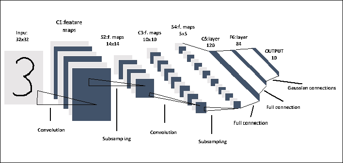

# LeNet5

LeNet5 CNN 架构由 Yann LeCun 于 1998 年发明，是第一个 CNN。它是一个多层前馈网络，专门用于对手写数字进行分类。它被用于 LeCun 的实验，由七层组成，包含可训练的权重。 LeNet5 架构如下所示：

图 6：LeNet5 网络

LeNet5 架构由三个卷积层和两个交替序列池化层组成。最后两层对应于传统的完全连接的神经网络，即完全连接的层，后面是输出层。输出层的主要功能是计算输入向量和参数向量之间的欧几里德距离。输出函数识别输入模式和我们模型的测量值之间的差异。输出保持最小，以实现最佳模型。因此，完全连接的层被配置为使得输入模式和我们的模型的测量之间的差异最小化。虽然它在 MNIST 数据集上表现良好，但是在具有更高分辨率和更多类别的更多图像的数据集上表现下降。

### 注意

有关 LeNet 系列模型的基本参考，请参见[此链接](http://yann.lecun.com/exdb/lenet/index.html)。