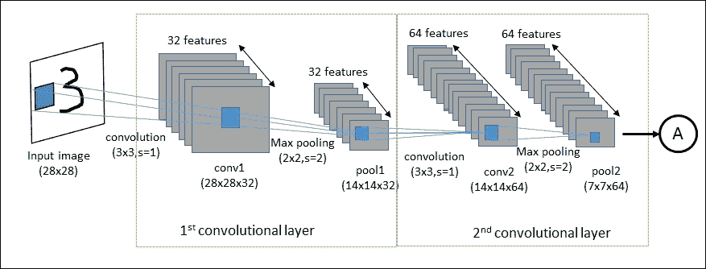

# 逐步实现 LeNet-5

在本节中，我们将学习如何构建 LeNet-5 架构来对 MNIST 数据集中的图像进行分类。下图显示了数据如何在前两个卷积层中流动：使用滤波器权重在第一个卷积层中处理输入图像。这导致 32 个新图像，一个用于卷积层中的每个滤波器。图像也通过合并操作进行下采样，因此图像分辨率从 28×28 降低到 14×14。然后在第二卷积层中处理这 32 个较小的图像。我们需要为这 32 个图像中的每一个再次使用滤波器权重，并且我们需要该层的每个输出通道的滤波器权重。通过合并操作再次对图像进行下采样，使得图像分辨率从 14×14 减小到 7×7。此卷积层的特征总数为 64。



图 7：前两个卷积层的数据流

通过（3×3）第三卷积层再次过滤 64 个结果图像。没有对该层应用池操作。第三卷积层的输出是 128×7×7 像素图像。然后将这些图像展平为单个向量，长度为 4×4×128 = 2048，其用作完全连接层的输入。

LeNet-5 的输出层由 625 个神经元作为输入（即完全连接层的输出）和 10 个神经元作为输出，用于确定图像的类别，该数字在图片。


图 8：最后三个卷积层的数据流

卷积滤波器最初是随机选择的。输入图像的预测类和实际类之间的差异被称为成本函数，并且这使我们的网络超出训练数据。然后，优化器会自动通过 CNN 传播此成本函数，并更新过滤器权重以改善分类错误。这反复进行数千次，直到分类误差足够低。

现在让我们详细看看如何编写我们的第一个 CNN。让我们首先导入我们实现所需的 TensorFlow 库：

```py
import tensorflow as tf
import numpy as np
from tensorflow.examples.tutorials.mnist import input_data
```

设置以下参数。它们表示在训练阶段（`128`）和测试阶段（`256`）使用的样本数量：

```py
batch_size = 128
test_size = 256
```

当我们定义以下参数时，该值为`28`，因为 MNIST 图像的高度和宽度为`28`像素：

```py
img_size = 28
```

对于类的数量，值`10`意味着我们将为每个 0 到 9 位数设置一个类：

```py
num_classes = 10
```

为输入图像定义占位符变量`X`。该张量的数据类型设置为`float32`，形状设置为`[None, img_size, img_size, 1]`，其中`None`表示张量可以保存任意数量的图像：

```py
X = tf.placeholder("float", [None, img_size, img_size, 1])
```

然后我们为占位符变量`X`中的输入图像正确关联的标签设置另一个占位符变量`Y`。此占位符变量的形状为`[None, num_classes]`，这意味着它可以包含任意数量的标签。每个标签都是长度为`num_classes`的向量，在这种情况下为`10`：

```py
Y = tf.placeholder("float", [None, num_classes])
```

我们收集`MNIST`数据，这些数据将被复制到数据文件夹中：

```py
mnist = input_data.read_data_sets("MNIST-data", one_hot=True)
```

我们构建训练数据集（`trX`，`trY`）和测试网络（`teX`，`teY)`：

```py
trX, trY, teX, teY = mnist.train.images, \
                     mnist.train.labels, \
                     mnist.test.images,  \
                     mnist.test.labels
```

必须重新整形`trX`和`teX`图像集以匹配输入形状：

```py
trX = trX.reshape(-1, img_size, img_size, 1)
teX = teX.reshape(-1, img_size, img_size, 1)
```

我们现在开始定义网络的`weights`。

`init_weights`函数在提供的形状中构建新变量，并使用随机值初始化网络权重：

```py
def init_weights(shape):
    return tf.Variable(tf.random_normal(shape, stddev=0.01))
```

第一卷积层的每个神经元被卷积为输入张量的小子集，尺寸为 3×3×1。值`32`只是我们为第一层考虑的特征图的数量。然后定义权重`w`：

```py
w = init_weights([3, 3, 1, 32])
```

然后输入的数量增加到`32`，这意味着第二卷积层中的每个神经元被卷积到第一卷积层的 3×3×32 个神经元。 `w2`权重如下：

```py
w2 = init_weights([3, 3, 32, 64])
```

值`64`表示获得的输出特征的数量。第三个卷积层被卷积为前一层的 3x3x64 个神经元，而`128`是结果特征。

```py
w3 = init_weights([3, 3, 64, 128])
```

第四层完全连接并接收 128x4x4 输入，而输出等于`625`：

```py
w4 = init_weights([128 * 4 * 4, 625])
```

输出层接收`625`输入，输出是类的数量：

```py
w_o = init_weights([625, num_classes])
```

请注意，这些初始化实际上并未在此时完成。它们仅在 TensorFlow 图中定义。

```py
p_keep_conv = tf.placeholder("float")
p_keep_hidden = tf.placeholder("float")
```

是时候定义网络模型了。就像网络的权重定义一样，它将是一个函数。它接收`X`张量，权重张量和 dropout 参数作为卷积和完全连接层的输入：

```py
def model(X, w, w2, w3, w4, w_o, p_keep_conv, p_keep_hidden):

```

`tf.nn.conv2d()`执行 TensorFlow 操作进行卷积。请注意，所有尺寸的`strides`都设置为 1.实际上，第一步和最后一步必须始终为 1，因为第一步是图像编号，最后一步是输入通道。 padding 参数设置为`'SAME'`，这意味着输入图像用零填充，因此输出的大小相同：

```py
conv1 = tf.nn.conv2d(X, w,strides=[1, 1, 1, 1],\
                         padding='SAME')
```

然后我们将`conv1`层传递给 ReLU 层。它为每个输入像素`x`计算`max(x, 0)`函数，为公式添加一些非线性，并允许我们学习更复杂的函数：

```py
    conv1_a = tf.nn.relu(conv1)
```

然后由`tf.nn.max_pool`运算符合并生成的层：

```py
    conv1 = tf.nn.max_pool(conv1_a, ksize=[1, 2, 2, 1]\
                           ,strides=[1, 2, 2, 1],\
                           padding='SAME')
```

这是一个 2×2 最大池，这意味着我们正在检查 2×2 窗口并在每个窗口中选择最大值。然后我们将 2 个像素移动到下一个窗口。我们尝试通过`tf.nn.dropout()`函数减少过拟合，我们传递`conv1`层和`p_keep_conv`概率值：

```py
    conv1 = tf.nn.dropout(conv1, p_keep_conv)
```

如您所见，接下来的两个卷积层`conv2`和`conv3`的定义方式与`conv1`相同：

```py
    conv2 = tf.nn.conv2d(conv1, w2,\
                         strides=[1, 1, 1, 1],\
                         padding='SAME')
    conv2_a = tf.nn.relu(conv2)
    conv2 = tf.nn.max_pool(conv2, ksize=[1, 2, 2, 1],\
                        strides=[1, 2, 2, 1],\
                        padding='SAME')
    conv2 = tf.nn.dropout(conv2, p_keep_conv)

    conv3=tf.nn.conv2d(conv2, w3,\
                       strides=[1, 1, 1, 1]\
                       ,padding='SAME')

    conv3 = tf.nn.relu(conv3)
```

完全连接的层将添加到网络中。第一个`FC_layer`的输入是前一个卷积的卷积层：

```py
    FC_layer = tf.nn.max_pool(conv3, ksize=[1, 2, 2, 1],\
                        strides=[1, 2, 2, 1],\
                        padding='SAME')

    FC_layer = tf.reshape(FC_layer,\
                          [-1, w4.get_shape().as_list()[0]])
```

dropout 函数再次用于减少过拟合：

```py
    FC_layer = tf.nn.dropout(FC_layer, p_keep_conv)
```

输出层接收`FC_layer`和`w4`权重张量作为输入。应用 ReLU 和 Dropout 运算符：

```py
    output_layer = tf.nn.relu(tf.matmul(FC_layer, w4))
    output_layer = tf.nn.dropout(output_layer, p_keep_hidden)
```

结果是一个长度为 10 的向量。这用于确定图像所属的 10 个输入类中的哪一个：

```py
    result = tf.matmul(output_layer, w_o)
    return result
```

交叉熵是我们在此分类器中使用的表现指标。交叉熵是一个连续的函数，它总是正的，如果预测的输出与期望的输出完全匹配，则等于零。因此，这种优化的目标是通过改变网络层中的变量来最小化交叉熵，使其尽可能接近零。 TensorFlow 具有用于计算交叉熵的内置函数。请注意，该函数在内部计算 softmax，因此我们必须直接使用`py_x`的输出：

```py
py_x = model(X, w, w2, w3, w4, w_o, p_keep_conv, p_keep_hidden)
   Y_ = tf.nn.softmax_cross_entropy_with_logits_v2\
        (labels=Y,logits=py_x)
```

现在我们已经为每个分类图像定义了交叉熵，我们可以衡量模型在每个图像上的表现。我们需要一个标量值来使用交叉熵来优化网络变量，因此我们只需要对所有分类图像求平均交叉熵：

```py
cost = tf.reduce_mean(Y_)
```

为了最小化评估的`cost`，我们必须定义一个优化器。在这种情况下，我们将使用`RMSPropOptimizer`，它是 GD 的高级形式。 `RMSPropOptimizer`实现了 RMSProp 算法，这是一种未发表的自适应学习率方法，由 Geoff Hinton 在他的[ Coursera 课程的第 6 讲](http://www.cs.toronto.edu/~tijmen/csc321/slides/lecture_slides_lec6.pdf)中提出。

### 注意

您可以在[此链接](https://www.coursera.org/learn/neural-networks)找到 Geoff Hinton 的课程。

`RMSPropOptimizer`还将学习率除以梯度平方的指数衰减均值。 Hinton 建议将衰减参数设置为`0.9`，而学习率的良好默认值为`0.001`：

```py
optimizer = tf.train.RMSPropOptimizer(0.001, 0.9).minimize(cost)
```

基本上，通用 SGD 算法存在一个问题，即学习率必须以 1 / T（其中 T 是迭代次数）进行缩放以实现收敛。 RMSProp 尝试通过自动调整步长来解决这个问题，以使步长与梯度相同。随着平均梯度变小，SGD 更新中的系数变得更大以进行补偿。

### 注意

[有关此算法的有趣参考可在此处找到](http://www.cs.toronto.edu/%7Etijmen/csc321/slides/lecture_slides_lec6.pdf)。

最后，我们定义`predict_op`，它是模式输出中尺寸最大值的索引：

```py
predict_op = tf.argmax(py_x, 1)
```

请注意，此时不执行优化。什么都没有计算，因为我们只是将优化器对象添加到 TensorFlow 图中以便以后执行。

我们现在来定义网络的运行会话。训练集中有 55,000 个图像，因此使用所有这些图像计算模型的梯度需要很长时间。因此，我们将在优化器的每次迭代中使用一小批图像。如果您的计算机崩溃或由于 RAM 耗尽而变得非常慢，那么您可以减少此数量，但您可能需要执行更多优化迭代。

现在我们可以继续实现 TensorFlow 会话：

```py
with tf.Session() as sess:
    tf.global_variables_initializer().run()
    for i in range(100):
```

我们得到了一批训练样例，`training_batch`张量现在包含图像的子集和相应的标签：

```py
        training_batch =  zip(range(0, len(trX), batch_size),\
                                    range(batch_size, \
                                    len(trX)+1, \
                                    batch_size))
```

将批量放入`feed_dict`中，并在图中为占位符变量指定相应的名称。我们现在可以使用这批训练数据运行优化器。 TensorFlow 将 feed 中的变量分配给占位符变量，然后运行优化程序：

```py
        for start, end in training_batch:
            sess.run(optimizer, feed_dict={X: trX[start:end],\
                                          Y: trY[start:end],\
                                          p_keep_conv: 0.8,\
                                          p_keep_hidden: 0.5})
```

同时，我们得到了打乱的一批测试样本：

```py
        test_indices = np.arange(len(teX)) 
        np.random.shuffle(test_indices)
        test_indices = test_indices[0:test_size]
```

对于每次迭代，我们显示批次的评估`accuracy`：

```py
        print(i, np.mean(np.argmax(teY[test_indices], axis=1) ==\
                         sess.run\
                         (predict_op,\
                          feed_dict={X: teX[test_indices],\
                                     Y: teY[test_indices], \
                                     p_keep_conv: 1.0,\
                                     p_keep_hidden: 1.0})))
```

根据所使用的计算资源，训练网络可能需要几个小时。我机器上的结果如下：

```py
Successfully downloaded train-images-idx3-ubyte.gz 9912422 bytes.
Successfully extracted to train-images-idx3-ubyte.mnist 9912422 bytes.
Loading ata/train-images-idx3-ubyte.mnist
Successfully downloaded train-labels-idx1-ubyte.gz 28881 bytes.
Successfully extracted to train-labels-idx1-ubyte.mnist 28881 bytes.
Loading ata/train-labels-idx1-ubyte.mnist
Successfully downloaded t10k-images-idx3-ubyte.gz 1648877 bytes.
Successfully extracted to t10k-images-idx3-ubyte.mnist 1648877 bytes.
Loading ata/t10k-images-idx3-ubyte.mnist
Successfully downloaded t10k-labels-idx1-ubyte.gz 4542 bytes.
Successfully extracted to t10k-labels-idx1-ubyte.mnist 4542 bytes.
Loading ata/t10k-labels-idx1-ubyte.mnist
(0, 0.95703125)
(1, 0.98046875)
(2, 0.9921875)
(3, 0.99609375)
(4, 0.99609375)
(5, 0.98828125)
(6, 0.99609375)
(7, 0.99609375)
(8, 0.98828125)
(9, 0.98046875)
(10, 0.99609375)
.
.
.
..
.
(90, 1.0)
(91, 0.9921875)
(92, 0.9921875)
(93, 0.99609375)
(94, 1.0)
(95, 0.98828125)
(96, 0.98828125)
(97, 0.99609375)
(98, 1.0)
(99, 0.99609375)

```

经过 10,000 次迭代后，  模型的准确率为 99.60％，这还不错！

## AlexNet

AlexNet 神经网络是首批实现巨大成功的 CNN 之一。作为 2012 年 ILSVRC 的获胜者，这个神经网络是第一个使用 LeNet-5 网络之前定义的神经网络的标准结构在 ImageNet 等非常复杂的数据集上获得良好结果。

### 注意

ImageNet 项目是一个大型视觉数据库，设计用于视觉对象识别软件研究。截至 2016 年，ImageNet 手工注释了超过一千万个图像 URL，以指示图像中的对象。在至少一百万个图像中，还提供了边界框。第三方图像 URL 的注释数据库可直接从 ImageNet 免费获得。

AlexNet 的架构如下图所示：


图 9：AlexNet 网络

在  AlexNet 架构中，有八层具有可训练参数：一系列五个连续卷积层，后面是三个完全连接的层。每个卷积层之后是 ReLU 层，并且可选地还有最大池层，尤其是在网络的开始处，以便减少网络占用的空间量。

所有池层都有 3x3 扩展区域，步长率为 2：这意味着您始终使用重叠池。这是因为与没有重叠的普通池相比，这种类型的池提供了稍好的网络表现。在网络的开始，在池化层和下一个卷积层之间，总是使用几个 LRN 标准化层：经过一些测试，可以看出它们倾向于减少网络错误。

前两个完全连接的层拥有 4,096 个神经元，而最后一个拥有 1,000 个单元，对应于 ImageNet 数据集中的类数。考虑到完全连接层中的大量连接，在每对完全连接的层之间添加了比率为 0.5 的 dropout 层，即，每次忽略一半的神经元激活。在这种情况下已经注意到，使用 dropout 技术不仅加速了单次迭代的处理，而且还很好地防止了过拟合。没有 dropout 层，网络制造商声称原始网络过拟合。

## 迁移学习

迁移学习包括建立已经构建的网络，并对各个层的参数进行适当的更改，以便它可以适应另一个数据集。例如，您可以在大型数据集（如 ImageNet）上使用预先测试的网络，并在较小的数据集上再次训练它。如果我们的数据集在内容上与原始数据集没有明显不同，那么预先训练的模型已经具有与我们自己的分类问题相关的学习特征。

如果我们的数据集与预训练模型训练的数据集没有太大差异，我们可以使用微调技术。 已在大型不同数据集上进行预训练的模型可能会捕捉到早期层中的曲线和边缘等通用特征，这些特征在大多数分类问题中都是相关且有用的。但是，如果我们的数据集来自一个非常特定的域，并且找不到该域中预先训练好的网络，我们应该考虑从头开始训练网络。

## 预训练的 AlexNet

我们会对预先训练好的 AlexNet 进行微调，以区分狗和猫。 AlexNet 在 ImageNet 数据集上经过预先训练。

要执行这个例子，你还需要安装 scipy（参见[此链接](https://www.scipy.org/install.html)）和 PIL（Pillow），这是 scipy 使用的读取图像：`pip install Pillow`或`pip3 install Pillow`。

然后，您需要下载以下文件：

*   `myalexnet_forward.py`：2017 版 TensorFlow 的 AlexNet 实现和测试代码（Python 3.5）
*   `bvlc_alexnet.npy`：权重，需要在工作目录中
*   `caffe_classes.py`：类，与网络输出的顺序相同
*   `poodle.png`，`laska.png`，`dog.png`，`dog2.png`，`quail227.JPEG`：测试图像（图像应为 227×227×3）

[从此链接下载这些文件](http://www.cs.toronto.edu/~guerzhoy/tf_alexnet/)，或从本书的代码库中下载。

首先，我们将在之前下载的图像上测试网络。为此，只需从 Python GUI 运行`myalexnet_forward.py`即可。

通过简单地检查源代码可以看到（参见下面的代码片段），将调用预先训练好的网络对以下两个图像进行分类，`laska.png`和`poodle.png`，这些图像之前已下载过：

```py
im1 = (imread("laska.png")[:,:,:3]).astype(float32)
im1 = im1 - mean(im1)
im1[:, :, 0], im1[:, :, 2] = im1[:, :, 2], im1[:, :, 0]

im2 = (imread("poodle.png")[:,:,:3]).astype(float32)
im2[:, :, 0], im2[:, :, 2] = im2[:, :, 2], im2[:, :, 0]
```


图 10：要分类的图像

的权重和偏差由以下语句加载：

```py
net_data = load(open("bvlc_alexnet.npy", "rb"), encoding="latin1").item()
```

网络是一组卷积和池化层，后面是三个完全连接的状态。该模型的输出是 softmax 函数：

```py
prob = tf.nn.softmax(fc8)
```

softmax 函数的输出是分类等级，因为它们表示网络认为输入图像属于`caffe_classes.py`文件中定义的类的强度。

如果我们运行代码，我们应该得到以下结果：

```py
Image 0
weasel 0.503177
black-footed ferret, ferret, Mustela nigripes 0.263265
polecat, fitch, foulmart, foumart, Mustela putorius 0.147746
mink 0.0649517
otter 0.00771955
Image 1
clumber, clumber spaniel 0.258953
komondor 0.165846
miniature poodle 0.149518
toy poodle 0.0984719
kuvasz 0.0848062
0.40007972717285156
>>>

```

在前面的例子中，AlexNet 给鼬鼠的分数约为 50％。这意味着该模型非常有信心图像显示黄鼠狼，其余分数可视为噪音。