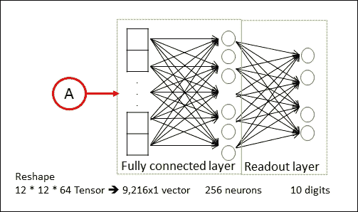

# 使用 CNN 进行情感识别

深度学习中难以解决的一个问题与神经网络无关：它是以正确格式获取正确数据。但是，[Kaggle 平台](https://www.kaggle.com/)提供了新的问题，并且需要研究新的数据集。

Kaggle 成立于 2010 年，作为预测建模和分析竞赛的平台，公司和研究人员发布他们的数据，来自世界各地的统计人员和数据挖掘者竞争生产最佳模型。在本节中，我们将展示如何使用面部图像制作 CNN 以进行情感检测。此示例的训练和测试集可以从[此链接](https://inclass.kaggle.com/c/facial-keypoints-detector/data)下载。


图 17：Kaggle 比赛页面

训练组由 3,761 个灰度图像组成，尺寸为 48×48 像素，3,761 个标签，每个图像有 7 个元素。

每个元素编码一个情感：0 =愤怒，1 =厌恶，2 =恐惧，3 =幸福，4 =悲伤，5 =惊讶，6 =中立。

在经典 Kaggle 比赛中，必须由平台评估从测试集获得的标签集。在这个例子中，我们将训练一个来自训练组的神经网络，之后我们将在单个图像上评估模型。

在开始 CNN 实现之前，我们将通过实现一个简单的过程（文件`download_and_display_images.py`）来查看下载的数据。

导入库：

```py
import tensorflow as tf
import numpy as np
from matplotlib import pyplot as plt
import EmotionUtils
```

`read_data`函数允许构建所有数据集，从下载的数据开始，您可以在本书的代码库中的`EmotionUtils`库中找到它们：

```py
FLAGS = tf.flags.FLAGS
tf.flags.DEFINE_string("data_dir",\
                       "EmotionDetector/",\
                       "Path to data files")
images = []
images = EmotionUtils.read_data(FLAGS.data_dir)

train_images = images[0]
train_labels = images[1]
valid_images = images[2]
valid_labels = images[3]
test_images  = images[4]
```

然后打印训练的形状并测试图像：

```py
print ("train images shape = ",train_images.shape)
print ("test labels shape = ",test_images.shape)
```

显示训练组的第一个图像及其正确的标签：

```py
image_0 = train_images[0]
label_0 = train_labels[0]
print ("image_0 shape = ",image_0.shape)
print ("label set = ",label_0)
image_0 = np.resize(image_0,(48,48))

plt.imshow(image_0, cmap='Greys_r')
plt.show()
```

有 3,761 个 48×48 像素的灰度图像：

```py
train images shape =  (3761, 48, 48, 1)
```

有 3,761 个类标签，每个类包含七个元素：

```py
train labels shape =  (3761, 7)
```

测试集由 1,312 个 48x48 像素灰度图像组成：

```py
test labels shape =  (1312, 48, 48, 1)
```

单个图像具有以下形状：

```py
image_0 shape =  (48, 48, 1)
```

第一张图片的标签设置如下：

```py
label set =  [ 0\.  0\.  0\.  1\.  0\.  0\.  0.]
```

此标签对应于 happy，图像在以下 matplot 图中可视化：


图 18：来自情感检测面部数据集的第一图像

我们现在转向 CNN 架构。

下图显示了数据将如何在 CNN 中流动：


图 19：实现的 CNN 的前两个卷积层

该网络具有两个卷积层，两个完全连接的层，最后是 softmax 分类层。使用 5×5 卷积核在第一卷积层中处理输入图像（48×48 像素）。这导致 32 个图像，每个使用的滤波器一个。通过最大合并操作对图像进行下采样，以将图像从 48×48 减小到 24×24 像素。然后，这些 32 个较小的图像由第二卷积层处理;这导致 64 个新图像（见上图）。通过第二次池化操作，将得到的图像再次下采样到 12×12 像素。

第二合并层的输出是 64×12×12 像素的图像。然后将它们展平为长度为 12×12×64 = 9,126 的单个向量，其用作具有 256 个神经元的完全连接层的输入。这将进入另一个具有 10 个神经元的完全连接的层，每个类对应一个类，用于确定图像的类别，即图像中描绘的情感。



图 20：实现的 CNN 的最后两层

让我们继续讨论权重和偏置定义。以下数据结构表示网络权重的定义，并总结了到目前为止我们所描述的内容：

```py
weights = {
    'wc1': weight_variable([5, 5, 1, 32], name="W_conv1"),
    'wc2': weight_variable([3, 3, 32, 64],name="W_conv2"),
    'wf1': weight_variable([(IMAGE_SIZE // 4) * (IMAGE_SIZE // 4)
                                         \* 64,256],name="W_fc1"),
    'wf2': weight_variable([256, NUM_LABELS], name="W_fc2")
}
```

注意卷积滤波器是随机初始化的，所以分类是随机完成的：

```py
def weight_variable(shape, stddev=0.02, name=None):
    initial = tf.truncated_normal(shape, stddev=stddev)
    if name is None:
        return tf.Variable(initial)
    else:
        return tf.get_variable(name, initializer=initial)
```

以相似方式，我们已经定义了偏差：

```py
biases = {
    'bc1': bias_variable([32], name="b_conv1"),
    'bc2': bias_variable([64], name="b_conv2"),
    'bf1': bias_variable([256], name="b_fc1"),
    'bf2': bias_variable([NUM_LABELS], name="b_fc2")
}

def bias_variable(shape, name=None):
    initial = tf.constant(0.0, shape=shape)
    if name is None:
        return tf.Variable(initial)
    else:
        return tf.get_variable(name, initializer=initial)
```

优化器必须使用区分链规则通过 CNN 传播错误，并更新过滤器权重以改善分类错误。输入图像的预测类和真实类之间的差异由`loss`函数测量。它将`pred`模型的预测输出和所需输出`label`作为输入：

```py
def loss(pred, label):
    cross_entropy_loss =\
    tf.reduce_mean(tf.nn.softmax_cross_entropy_with_logits_v2\
                   (logits=pred, labels=label))
    tf.summary.scalar('Entropy', cross_entropy_loss)
    reg_losses = tf.add_n(tf.get_collection("losses"))
    tf.summary.scalar('Reg_loss', reg_losses)
       return cross_entropy_loss + REGULARIZATION * reg_losses
```

`tf.nn.softmax_cross_entropy_with_logits_v2(pred, label)`函数在应用 softmax 函数后计算结果的`cross_entropy_loss`（但它以数学上仔细的方式一起完成）。这就像是以下结果：

```py
a = tf.nn.softmax(x)
b = cross_entropy(a)
```

我们计算每个分类图像的`cross_entropy_loss`，因此我们将测量模型在每个图像上的单独表现。

我们计算分类图像的交叉熵平均值：

```py
cross_entropy_loss =    tf.reduce_mean(tf.nn.softmax_cross_entropy_with_logits_v2 (logits=pred, labels=label))
```

为了防止过拟合，我们将使用 L2 正则化，其中包括向`cross_entropy_loss`插入一个附加项：

```py
reg_losses = tf.add_n(tf.get_collection("losses"))
return cross_entropy_loss + REGULARIZATION * reg_losses
```

哪里：

```py
def add_to_regularization_loss(W, b):
    tf.add_to_collection("losses", tf.nn.l2_loss(W))
    tf.add_to_collection("losses", tf.nn.l2_loss(b))
```

### 注意

有关详细信息，请参阅[此链接](http://www.kdnuggets.com/2015/04/preventing-overfitting-neural-networks.html/2)。

我们已经构建了网络的权重和偏差以及优化过程。但是，与所有已实现的网络一样，我们必须通过导入所有必需的库来启动实现：

```py
import tensorflow as tf
import numpy as np
from datetime import datetime
import EmotionUtils
import os, sys, inspect
from tensorflow.python.framework import ops
import warnings

warnings.filterwarnings("ignore")
os.environ['TF_CPP_MIN_LOG_LEVEL'] = '3'
ops.reset_default_graph()
```

然后，我们在您的计算机上设置存储数据集的路径，以及网络参数：

```py
FLAGS = tf.flags.FLAGS
tf.flags.DEFINE_string("data_dir",\
                       "EmotionDetector/",\
                       "Path to data files")
tf.flags.DEFINE_string("logs_dir",\
                       "logs/EmotionDetector_logs/",\
                       "Path to where log files are to be saved")
tf.flags.DEFINE_string("mode",\
                       "train",\
                       "mode: train (Default)/ test")
BATCH_SIZE = 128
LEARNING_RATE = 1e-3
MAX_ITERATIONS = 1001
REGULARIZATION = 1e-2
IMAGE_SIZE = 48
NUM_LABELS = 7
VALIDATION_PERCENT = 0.1
```

`emotion_cnn`函数实现我们的模型：

```py
def emotion_cnn(dataset):
    with tf.name_scope("conv1") as scope:
        tf.summary.histogram("W_conv1", weights['wc1'])
        tf.summary.histogram("b_conv1", biases['bc1'])
        conv_1 = tf.nn.conv2d(dataset, weights['wc1'],\
                              strides=[1, 1, 1, 1],\
                              padding="SAME")

        h_conv1 = tf.nn.bias_add(conv_1, biases['bc1'])
        h_1 = tf.nn.relu(h_conv1)
        h_pool1 = max_pool_2x2(h_1)
        add_to_regularization_loss(weights['wc1'], biases['bc1'])

    with tf.name_scope("conv2") as scope:
        tf.summary.histogram("W_conv2", weights['wc2'])
        tf.summary.histogram("b_conv2", biases['bc2'])
        conv_2 = tf.nn.conv2d(h_pool1, weights['wc2'],\
                              strides=[1, 1, 1, 1], \ 
                              padding="SAME")
        h_conv2 = tf.nn.bias_add(conv_2, biases['bc2'])
        h_2 = tf.nn.relu(h_conv2)
        h_pool2 = max_pool_2x2(h_2)
        add_to_regularization_loss(weights['wc2'], biases['bc2'])

    with tf.name_scope("fc_1") as scope:
        prob=0.5
        image_size = IMAGE_SIZE // 4
        h_flat = tf.reshape(h_pool2,[-1,image_size*image_size*64])
        tf.summary.histogram("W_fc1", weights['wf1'])
        tf.summary.histogram("b_fc1", biases['bf1'])
        h_fc1 = tf.nn.relu(tf.matmul\
                     (h_flat, weights['wf1']) + biases['bf1'])
        h_fc1_dropout = tf.nn.dropout(h_fc1, prob)

    with tf.name_scope("fc_2") as scope:
        tf.summary.histogram("W_fc2", weights['wf2'])
        tf.summary.histogram("b_fc2", biases['bf2'])
        pred = tf.matmul(h_fc1_dropout, weights['wf2']) +\
               biases['bf2']
    return pred
```

然后定义一个`main`函数，我们将在其中定义数据集，输入和输出占位符变量以及主会话，以便启动训练过程：

```py
def main(argv=None):
```

此函数中的第一个操作是加载数据集以进行训练和验证。我们将使用训练集来教授分类器识别待预测的标签，我们将使用验证集来评估分类器的表现：

```py
train_images,\
train_labels,\
valid_images,\
valid_labels,\ test_images=EmotionUtils.read_data(FLAGS.data_dir)
print("Train size: %s" % train_images.shape[0])
print('Validation size: %s' % valid_images.shape[0])
print("Test size: %s" % test_images.shape[0])
```

我们为输入图像定义占位符变量。这允许我们更改输入到 TensorFlow 图的图像。数据类型设置为`float32`，形状设置为`[None, img_size, img_size, 1]`（其中`None`表示张量可以保存任意数量的图像，每个图像为`img_size`像素高和`img_size`像素宽），和`1`是颜色通道的数量：

```py
    input_dataset = tf.placeholder(tf.float32, \
                                   [None, \
                                    IMAGE_SIZE, \
                                    IMAGE_SIZE, 1],name="input")
```

接下来，我们为与占位符变量`input_dataset`中输入的图像正确关联的标签提供占位符变量。这个占位符变量的形状是`[None, NUM_LABELS]`，这意味着它可以包含任意数量的标签，每个标签是长度为`NUM_LABELS`的向量，在这种情况下为 7：

```py
    input_labels = tf.placeholder(tf.float32,\
                                  [None, NUM_LABELS])
```

`global_step`保持跟踪到目前为止执行的优化迭代数量。我们希望在检查点中使用所有其他 TensorFlow 变量保存此变量。请注意`trainable=False`，这意味着 TensorFlow 不会尝试优化此变量：

```py
    global_step = tf.Variable(0, trainable=False)
```

跟随变量`dropout_prob`，用于 dropout 优化：

```py
    dropout_prob = tf.placeholder(tf.float32)
```

现在为测试阶段创建神经网络。`emotion_cnn()`函数返回`input_dataset`的预测类标签`pred`：

```py
    pred = emotion_cnn(input_dataset)
```

`output_pred`是测试和验证的预测，我们将在运行会话中计算：

```py
    output_pred = tf.nn.softmax(pred,name="output")
```

`loss_val`包含输入图像的预测类（`pred`）与实际类别（`input_labels`）之间的差异：

```py
    loss_val = loss(pred, input_labels)
```

`train_op`定义用于最小化成本函数的优化器。在这种情况下，我们再次使用`AdamOptimizer`：

```py
    train_op = tf.train.AdamOptimizer\
                    (LEARNING_RATE).minimize\
                              (loss_val, global_step)
```

`summary_op`是用于 TensorBoard 可视化的  ：

```py
summary_op = tf.summary.merge_all()
```

创建图后，我们必须创建一个 TensorFlow 会话，用于执行图：

```py
    with tf.Session() as sess:
        sess.run(tf.global_variables_initializer())
        summary_writer = tf.summary.FileWriter(FLAGS.logs_dir, sess.graph)
```

我们定义`saver`来恢复模型：

```py
        saver = tf.train.Saver()
        ckpt = tf.train.get_checkpoint_state(FLAGS.logs_dir)
        if ckpt and ckpt.model_checkpoint_path:
            saver.restore(sess, ckpt.model_checkpoint_path)
            print ("Model Restored!")
```

接下来我们需要获得一批训练示例。 `batch_image`现在拥有一批图像，`batch_label`包含这些图像的正确标签：

```py
        for step in xrange(MAX_ITERATIONS):
            batch_image, batch_label = get_next_batch(train_images,\
                                    train_labels,\
                                    step)
```

我们将批次放入`dict`中，其中包含 TensorFlow 图中占位符变量的正确名称：

```py
            feed_dict = {input_dataset: batch_image, \
                         input_labels: batch_label}
```

我们使用这批训练数据运行优化器。 TensorFlow 将`feed_dict_train`中的变量分配给占位符变量，然后运行优化程序：

```py
            sess.run(train_op, feed_dict=feed_dict)
            if step % 10 == 0:
                train_loss,\
                             summary_str =\ 
                                 sess.run([loss_val,summary_op],\
                                              feed_dict=feed_dict)
                summary_writer.add_summary(summary_str,\
                                           global_step=step)
                print ("Training Loss: %f" % train_loss)
```

当运行步长是 100 的倍数时，我们在验证集上运行训练模型：

```py
            if step % 100 == 0:
                valid_loss = \
                           sess.run(loss_val, \
                                feed_dict={input_dataset: valid_images, input_labels: valid_labels})
```

然后我们打印掉损失值：

```py
                print ("%s Validation Loss: %f" \
                      % (datetime.now(), valid_loss))
```

在训练课程结束时，模型将被保存：

```py
                saver.save(sess, FLAGS.logs_dir\
                           + 'model.ckpt', \
                           global_step=step)

if __name__ == "__main__":
    tf.app.run()
```

这是输出。如您所见，在模拟过程中损失函数减少：

```py
Reading train.csv ...
(4178, 48, 48, 1)
(4178, 7)
Reading test.csv ...
Picking ...
Train size: 3761
Validation size: 417
Test size: 1312
2018-02-24 15:17:45.421344 Validation Loss: 1.962773
2018-02-24 15:19:09.568140 Validation Loss: 1.796418
2018-02-24 15:20:35.122450 Validation Loss: 1.328313
2018-02-24 15:21:58.200816 Validation Loss: 1.120482
2018-02-24 15:23:24.024985 Validation Loss: 1.066049
2018-02-24 15:24:38.838554 Validation Loss: 0.965881
2018-02-24 15:25:54.761599 Validation Loss: 0.953470
2018-02-24 15:27:15.592093 Validation Loss: 0.897236
2018-02-24 15:28:39.881676 Validation Loss: 0.838831
2018-02-24 15:29:53.012461 Validation Loss: 0.910777
2018-02-24 15:31:14.416664 Validation Loss: 0.888537
>>>

```

然而，模型可以通过改变超参数或架构来改进。

在下一节中，我们将了解如何在您自己的图像上有效地测试模型。

## 在您自己的图像上测试模型

我们使用的数据集是标准化的。所有面部都指向相机，表情在某些情况下被夸大甚至滑稽。现在让我们看看如果我们使用更自然的图像会发生什么。确保脸部没有文字覆盖，情感可识别，脸部主要指向相机。

我从这个 JPEG 图像开始（它是一个彩色图像，你可以从书的代码库下载）：


图 21：输入图像

使用 Matplotlib 和其他 NumPy Python 库，我们将输入颜色图像转换为网络的有效输入，即灰度图像：

```py
img = mpimg.imread('author_image.jpg')
gray = rgb2gray(img)
```

转换函数如下：

```py
def rgb2gray(rgb):
    return np.dot(rgb[...,:3], [0.299, 0.587, 0.114])
```

结果如下图所示：


图 22：灰度输入图像

最后，我们可以使用此图像为网络提供信息，但首先我们必须定义一个正在运行的 TensorFlow 会话：

```py
sess = tf.InteractiveSession()
```

然后我们可以回想起之前保存的模型：

```py
new_saver = tf.train.\
import_meta_graph('logs/EmotionDetector_logs/model.ckpt-1000.meta')
new_saver.restore(sess,'logs/EmotionDetector_logs/model.ckpt-1000')
tf.get_default_graph().as_graph_def()
x = sess.graph.get_tensor_by_name("input:0")
y_conv = sess.graph.get_tensor_by_name("output:0")
```

要测试图像，我们必须将其重新整形为网络的有效 48×48×1 格式：

```py
image_test = np.resize(gray,(1,48,48,1))
```

我们多次评估相同的图片（`1000`），以便在输入图像中获得一系列可能的情感：

```py
tResult = testResult()
num_evaluations = 1000
for i in range(0,num_evaluations):
    result = sess.run(y_conv, feed_dict={x:image_test})
    label = sess.run(tf.argmax(result, 1))
    label = label[0]
    label = int(label)
    tResult.evaluate(label)

tResult.display_result(num_evaluations)
```

在几秒后，会出现如下结果：

```py
>>>
anger = 0.1%
disgust = 0.1%
fear = 29.1%
happy = 50.3%
sad = 0.1%
surprise = 20.0%
neutral = 0.3%
>>>

```

最高的百分比证实（`happy = 50.3%`）我们走在正确的轨道上。当然，这并不意味着我们的模型是准确的。可以通过更多和更多样化的训练集，更改网络参数或修改网络架构来实现可能的改进。

## 源代码

这里列出了实现的分类器的第二部分：

```py
from scipy import misc
import numpy as np
import matplotlib.cm as cm
import tensorflow as tf
from matplotlib import pyplot as plt
import matplotlib.image as mpimg
import EmotionUtils
from EmotionUtils import testResult

def rgb2gray(rgb):
    return np.dot(rgb[...,:3], [0.299, 0.587, 0.114])

img = mpimg.imread('author_image.jpg')     
gray = rgb2gray(img)
plt.imshow(gray, cmap = plt.get_cmap('gray'))
plt.show()

sess = tf.InteractiveSession()
new_saver = tf.train.import_meta_graph('logs/model.ckpt-1000.meta')
new_saver.restore(sess, 'logs/model.ckpt-1000')
tf.get_default_graph().as_graph_def()
x = sess.graph.get_tensor_by_name("input:0")
y_conv = sess.graph.get_tensor_by_name("output:0")

image_test = np.resize(gray,(1,48,48,1))
tResult = testResult()
num_evaluations = 1000
for i in range(0,num_evaluations):
    result = sess.run(y_conv, feed_dict={x:image_test})
    label = sess.run(tf.argmax(result, 1))
    label = label[0]
    label = int(label)
    tResult.evaluate(label)

tResult.display_result(num_evaluations)
```

我们实现`testResult` Python 类来显示结果百分比。它可以在`EmotionUtils`文件中找到。

以下是此类的实现：

```py
class testResult:

    def __init__(self):
        self.anger = 0
        self.disgust = 0
        self.fear = 0
        self.happy = 0
        self.sad = 0
        self.surprise = 0
        self.neutral = 0

    def evaluate(self,label):

        if (0 == label):
            self.anger = self.anger+1
        if (1 == label):
            self.disgust = self.disgust+1
        if (2 == label):
            self.fear = self.fear+1
        if (3 == label):
            self.happy = self.happy+1
        if (4 == label):
            self.sad = self.sad+1
        if (5 == label):
            self.surprise = self.surprise+1
        if (6 == label):
            self.neutral = self.neutral+1

    def display_result(self,evaluations):
        print("anger = "    +\
              str((self.anger/float(evaluations))*100)    + "%")
        print("disgust = "  +\
              str((self.disgust/float(evaluations))*100)  + "%")
        print("fear = "     +\
              str((self.fear/float(evaluations))*100)     + "%")
        print("happy = "    +\
              str((self.happy/float(evaluations))*100)    + "%")
        print("sad = "      +\
              str((self.sad/float(evaluations))*100)      + "%")
        print("surprise = " +\
              str((self.surprise/float(evaluations))*100) + "%")
        print("neutral = "  +\
              str((self.neutral/float(evaluations))*100)  + "%")
```