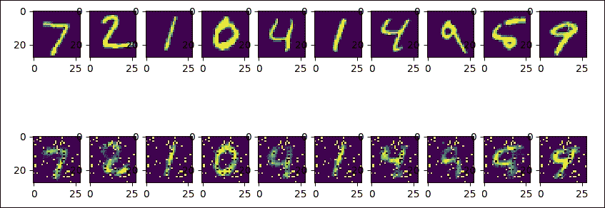

# 使用 TensorFlow 实现自编码器

训练自编码器是一个简单的过程。它是一个 NN，其输出与其输入相同。有一个输入层，后面是几个隐藏层，然后在一定深度之后，隐藏层遵循反向架构，直到我们到达最终层与输入层相同的点。我们将数据传递到我们希望学习嵌入的网络中。

在此示例中，我们使用来自 MNIST 数据集的图像作为输入。我们通过导入所有主库来开始实现：

```py
import tensorflow as tf
import numpy as np
import matplotlib.pyplot as plt
```

然后我们准备 MNIST 数据集。我们使用 TensorFlow 中的内置`input_data`类来加载和设置数据。此类确保下载和预处理数据以供自编码器使用。因此，基本上，我们根本不需要进行任何特征工程：

```py
from tensorflow.examples.tutorials.mnist import input_data
mnist = input_data.read_data_sets("MNIST_data/",one_hot=True)
```

在前面的代码块中，`one_hot=True`参数确保所有特征都是热编码的。一种热编码是一种技术，通过该技术将分类变量转换为可以馈入 ML 算法的形式。

接下来，我们配置网络参数：

```py
learning_rate = 0.01
training_epochs = 20
batch_size = 256
display_step = 1
examples_to_show = 20
```

输入图像的大小如下：

```py
n_input = 784
```

隐藏层的大小如下：

```py
n_hidden_1 = 256
n_hidden_2 = 128
```

最终尺寸对应于 28×28 = 784 像素。

我们需要为输入图像定义占位符变量。该张量的数据类型设置为`float`，因为`mnist`值的比例为[0,1]，形状设置为`[None, n_input]`。定义`None`参数意味着张量可以包含任意数量的图像：

```py
X = tf.placeholder("float", [None, n_input])
```

然后我们可以定义网络的权重和偏差。 `weights`数据结构包含编码器和解码器的权重定义。请注意，使用`tf.random_normal`选择权重，它返回具有正态分布的随机值：

```py
weights = {
    'encoder_h1': tf.Variable\
    (tf.random_normal([n_input, n_hidden_1])),
    'encoder_h2': tf.Variable\
    (tf.random_normal([n_hidden_1, n_hidden_2])),
    'decoder_h1': tf.Variable\
    (tf.random_normal([n_hidden_2, n_hidden_1])),
    'decoder_h2': tf.Variable\
    (tf.random_normal([n_hidden_1, n_input])),
}
```

同样，我们定义了网络的偏置：

```py
biases = {
    'encoder_b1': tf.Variable\
    (tf.random_normal([n_hidden_1])),
    'encoder_b2': tf.Variable\
    (tf.random_normal([n_hidden_2])),
    'decoder_b1': tf.Variable\
    (tf.random_normal([n_hidden_1])),
    'decoder_b2': tf.Variable\
    (tf.random_normal([n_input])),
}
```

我们将网络建模分为两个互补的完全连接的网络：编码器和解码器。编码器对数据进行编码;它从 MNIST 数据集中输入图像`X`，并执行数据编码：

```py
encoder_in = tf.nn.sigmoid(tf.add\
                           (tf.matmul(X, \
                                      weights['encoder_h1']),\
                            biases['encoder_b1']))
```

输入数据编码只是矩阵乘法运算。使用矩阵乘法将维度 784 的输入数据`X`减少到较低维度 256：


这里，W 是权重张量，`encoder_h1`，b 是偏置张量，`encoder_b1`。通过这个操作，我们将初始图像编码为自编码器的有用输入。编码过程的第二步包括数据压缩。输入`encoder_in`张量表示的数据通过第二个矩阵乘法运算减小到较小的大小：

```py
encoder_out = tf.nn.sigmoid(tf.add\
                            (tf.matmul(encoder_in,\
                                       weights['encoder_h2']),\
                            biases['encoder_b2']))
```

然后将尺寸 256 的输入数据`encoder_in`压缩到 128 的较小张量：


这里，W 代表权重张量`encoder_h2`，而 b 代表偏差张量，`encoder_b2`。请注意，我们使用 sigmoid 作为编码器阶段的激活函数。

解码器执行编码器的逆操作。它解压缩输入以获得相同大小的网络输入的输出。该过程的第一步是将大小为 128 的`encoder_out`张量转换为 256 大小的中间表示的张量：

```py
decoder_in = tf.nn.sigmoid(tf.add\
                           (tf.matmul(encoder_out,\
                                      weights['decoder_h1']),\
                            biases['decoder_b1']))
```

在公式中，它意味着：


这里，W 是权重张量，`decoder_h1`，大小 256×128，b 是偏置张量，`decoder_b1`，大小 256.最终解码操作是将数据从其中间表示（大小为 256）解压缩到最终表示（维度 784），这是原始数据的大小：

```py
decoder_out = tf.nn.sigmoid(tf.add\
                            (tf.matmul(decoder_in,\
                                       weights['decoder_h2']),\
                             biases['decoder_b2']))
```

`y_pred`参数设置为`decoder_out`：

```py
y_pred = decoder_out
```

网络将了解输入数据`X`是否等于解码数据，因此我们定义以下内容：

```py
y_true = X
```

自编码器的要点是创建一个擅长重建原始数据的缩减矩阵。因此，我们希望最小化`cost`函数。然后我们将`cost`函数定义为`y_true`和`y_pred`之间的均方误差：

```py
cost = tf.reduce_mean(tf.pow(y_true - y_pred, 2))
```

为了优化`cost`函数，我们使用以下`RMSPropOptimizer`类：

```py
optimizer = tf.train.RMSPropOptimizer(learning_rate).minimize(cost)
```

然后我们准备启动会话：

```py
init = tf.global_variables_initializer()
with tf.Session() as sess:
    sess.run(init)
```

我们需要设置批量图像的大小来训练网络：

```py
    total_batch = int(mnist.train.num_examples/batch_size)
```

从训练周期开始（`training_epochs`的数量设置为`10`）：

```py
    for epoch in range(training_epochs):
```

循环遍历所有批次：

```py
        for i in range(total_batch):
            batch_xs, batch_ys =\
                      mnist.train.next_batch(batch_size)
```

然后我们运行优化程序，用批量集`batch_xs`提供执行图：

```py
            _, c = sess.run([optimizer, cost],\
                            feed_dict={X: batch_xs})
```

接下来，我们显示每个`epoch`步骤的结果：

```py
        if epoch % display_step == 0:
            print(„Epoch:", ‚%04d' % (epoch+1),
                  „cost=", „{:.9f}".format(c))
    print("Optimization Finished!")
```

最后，我们使用编码或解码程序测试模型  。我们为模型提供图像子集，其中`example_to_show`的值设置为`4`：

```py
    encode_decode = sess.run(
        y_pred, feed_dict=\
        {X: mnist.test.images[:examples_to_show]})
```

我们使用 Matplotlib 比较原始图像和它们的重建：

```py
    f, a = plt.subplots(2, 10, figsize=(10, 2))
    for i in range(examples_to_show):
        a[0][i].imshow(np.reshape(mnist.test.images[i], (28, 28)))
        a[1][i].imshow(np.reshape(encode_decode[i], (28, 28)))
    f.show()
    plt.draw()
    plt.show()
```

当我们运行会话时，我们应该有这样的输出：

```py
Extracting MNIST_data/train-images-idx3-ubyte.gz
Extracting MNIST_data/train-labels-idx1-ubyte.gz
Extracting MNIST_data/t10k-images-idx3-ubyte.gz
Extracting MNIST_data/t10k-labels-idx1-ubyte.gz
Epoch: 0001 cost= 0.208461761
Epoch: 0002 cost= 0.172908291
Epoch: 0003 cost= 0.153524384
Epoch: 0004 cost= 0.144243762
Epoch: 0005 cost= 0.137013704
Epoch: 0006 cost= 0.127291277
Epoch: 0007 cost= 0.125370100
Epoch: 0008 cost= 0.121299766
Epoch: 0009 cost= 0.111687921
Epoch: 0010 cost= 0.108801551
Epoch: 0011 cost= 0.105516203
Epoch: 0012 cost= 0.104304880
Epoch: 0013 cost= 0.103362709
Epoch: 0014 cost= 0.101118311
Epoch: 0015 cost= 0.098779991
Epoch: 0016 cost= 0.095374011
Epoch: 0017 cost= 0.095469855
Epoch: 0018 cost= 0.094381645
Epoch: 0019 cost= 0.090281256
Epoch: 0020 cost= 0.092290156
Optimization Finished!
```

然后我们显示结果。第一行是原始图像，第二行是解码图像：



图 4：原始和解码的 MNIST 图像

如你所见，第二个与原来的不同（它似乎仍然是数字二，就像三个一样）。我们可以增加周期数或更改网络参数以改善结果。